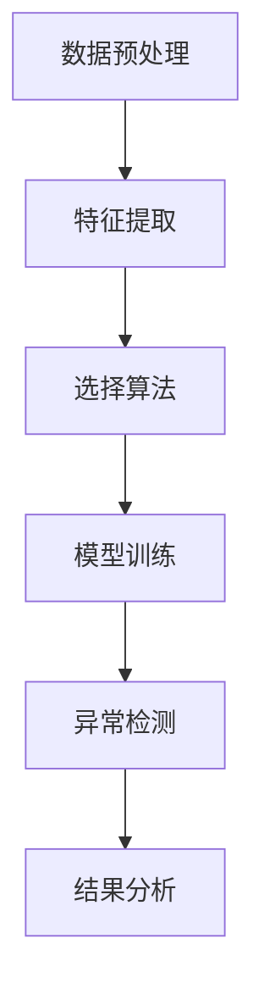
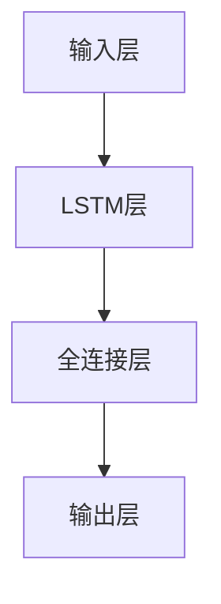
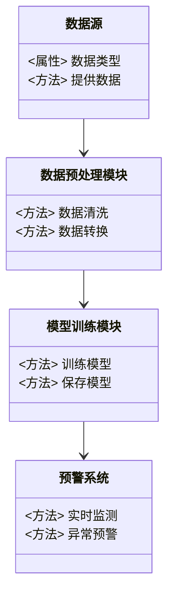
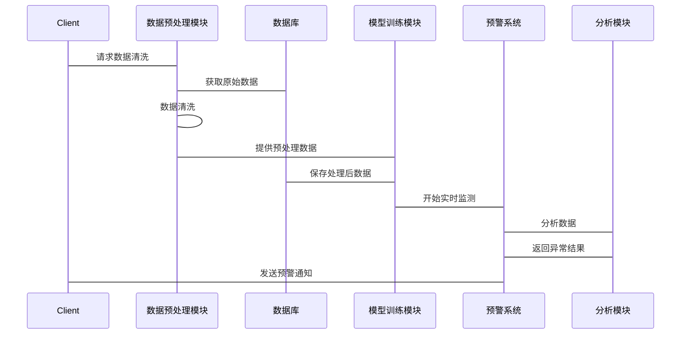

                 


# 开发智能化的金融市场微观结构变化预警模型

> 关键词：金融市场，微观结构，预警模型，时间序列分析，深度学习，异常检测，系统架构

> 摘要：金融市场微观结构变化预警模型旨在通过分析市场参与者的交易行为和市场指标，识别潜在的市场风险和异常行为，帮助投资者和监管机构提前采取措施。本文从金融市场的基本概念出发，详细探讨了模型的核心原理、算法实现和系统设计，结合实际案例，展示了如何利用时间序列分析和深度学习技术构建智能化的预警系统。

---

## 第一部分: 金融市场微观结构变化预警模型背景与核心概念

### 第1章: 金融市场微观结构概述

#### 1.1 金融市场微观结构的基本概念
##### 1.1.1 金融市场的定义与分类
金融市场是指资金的融通场所，分为一级市场和二级市场。一级市场涉及新证券的发行，二级市场涉及现有证券的交易。微观结构关注市场参与者的互动和交易机制。

##### 1.1.2 微观结构变化的定义与特征
微观结构变化指的是市场参与者行为、交易量、价格波动等的异常变化。这些变化可能预示着市场操纵、内幕交易或市场崩盘的风险。

##### 1.1.3 微观结构变化对金融市场的影响
微观结构变化可能导致市场波动加剧、流动性下降，甚至引发系统性风险。及时识别这些变化对维护市场稳定至关重要。

#### 1.2 微观结构变化的预警意义
##### 1.2.1 市场风险的早期识别
通过预警模型，可以提前发现潜在的市场风险，帮助投资者和监管机构采取应对措施。

##### 1.2.2 投资决策的辅助作用
预警模型为投资者提供了决策支持，帮助他们在市场波动前做出调整。

##### 1.2.3 市场操纵行为的监测
预警模型能够识别异常交易行为，帮助监管机构打击市场操纵。

### 第2章: 微观结构变化预警模型的背景与问题描述

#### 2.1 金融市场中的异常行为
##### 2.1.1 市场操纵
市场操纵是指通过虚假交易或散布谣言影响市场价格的行为。

##### 2.1.2 内幕交易
内幕交易是指利用未公开信息进行交易，违反了市场公平原则。

##### 2.1.3 市场波动异常
异常波动可能是由市场操纵、突发事件或投资者情绪变化引起的。

#### 2.2 微观结构变化预警的需求
##### 2.2.1 监管需求
监管机构需要实时监控市场，防止违法行为发生。

##### 2.2.2 投资者保护
投资者需要工具来保护自己免受市场操纵和异常波动的影响。

##### 2.2.3 市场稳定性的维护
预警模型有助于维持市场的稳定性，防止系统性风险的发生。

#### 2.3 问题解决的边界与外延
##### 2.3.1 模型的适用场景
适用于高频交易、股票市场、外汇市场等。

##### 2.3.2 模型的局限性
数据不足、模型解释性差、市场环境复杂等因素可能影响模型的准确性。

##### 2.3.3 模型的可扩展性
模型可以扩展到更多市场和资产类型。

#### 2.4 核心概念与组成要素
##### 2.4.1 数据特征
包括交易量、价格、订单簿深度、买卖价差等。

##### 2.4.2 模型属性
包括实时性、可解释性、鲁棒性等。

##### 2.4.3 评价指标
包括准确率、召回率、F1分数等。

---

## 第二部分: 微观结构变化预警模型的核心概念与联系

### 第3章: 微观结构变化预警模型的原理与核心概念

#### 3.1 数据特征分析
##### 3.1.1 时间序列特征
包括趋势、周期性、随机性等。

##### 3.1.2 市场参与者的交易行为特征
包括高频交易、大额交易、订单取消率等。

##### 3.1.3 市场微观结构指标
包括买卖价差、订单簿深度、市场深度等。

#### 3.2 模型核心概念的属性特征对比
##### 3.2.1 比较维度
从数据特征、模型算法、评价指标等方面进行比较。

##### 3.2.2 属性对比表格
| 比较维度 | 数据特征 | 模型算法 | 评价指标 |
|----------|----------|----------|----------|
| 输入数据 | 交易数据 | 时间序列数据 | 预测结果 |
| 输出结果 | 异常标记 | 预测概率 | 准确率 |
| 算法类型 | 监督学习 | 时间序列分析 | 分类模型 |

#### 3.3 ER实体关系图架构
```mermaid
erDiagram
    actor 市场参与者 {
        <属性> 交易时间 : datetime
        <属性> 交易量 : integer
        <属性> 价格 : float
        <属性> 订单号 : integer
    }
    entity 交易行为 {
        <属性> 买入量 : integer
        <属性> 卖出量 : integer
        <属性> 买卖价差 : float
    }
    entity 微观结构指标 {
        <属性> 订单簿深度 : integer
        <属性> 市场深度 : integer
        <属性> 市场波动率 : float
    }
    market 微观结构变化预警系统 {
        <关联> 市场参与者 -->> 交易行为
        <关联> 交易行为 -->> 微观结构指标
    }
```

---

## 第三部分: 微观结构变化预警模型的算法原理

### 第4章: 时间序列分析与异常检测算法

#### 4.1 时间序列分析的基本原理
##### 4.1.1 时间序列的分解
时间序列可以分解为趋势、周期性、随机性三部分。

##### 4.1.2 常见的时间序列模型
- **ARIMA模型**：自回归积分滑动平均模型。
- **Prophet模型**：Facebook开发的基于ARIMA和 Holt-Winters 的模型。

##### 4.1.3 异常检测的定义与方法
异常检测是指识别数据中的异常点，常用方法包括统计方法、基于聚类的方法和基于深度学习的方法。

#### 4.2 基于机器学习的异常检测
##### 4.2.1 监督学习方法
- **支持向量机 (SVM)**：用于分类任务。
- **随机森林**：用于回归和分类任务。

##### 4.2.2 非监督学习方法
- **K-Means聚类**：用于聚类任务。
- **DBSCAN聚类**：基于密度的聚类方法。

##### 4.2.3 半监督学习方法
- **Isolation Forest**：基于树结构的异常检测方法。

#### 4.3 算法流程图


### 第5章: 基于深度学习的预警模型

#### 5.1 深度学习在时间序列分析中的应用
##### 5.1.1 RNN与LSTM网络
- **RNN**：循环神经网络，适合处理序列数据。
- **LSTM**：长短期记忆网络，能够捕捉长期依赖关系。

##### 5.1.2 Transformer
- **自注意力机制**：在序列建模中表现出色。

#### 5.2 深度学习模型实现
##### 5.2.1 LSTM网络结构


##### 5.2.2 模型训练
```python
import tensorflow as tf
from tensorflow.keras.layers import LSTM, Dense
from tensorflow.keras.models import Sequential

model = Sequential()
model.add(LSTM(64, input_shape=(timesteps, features)))
model.add(Dense(1, activation='sigmoid'))
model.compile(optimizer='adam', loss='binary_crossentropy', metrics=['accuracy'])
```

#### 5.3 深度学习模型的优势
- 能够捕捉复杂的非线性关系。
- 对长序列数据建模能力强大。

---

## 第四部分: 系统分析与架构设计方案

### 第6章: 系统分析与架构设计

#### 6.1 问题场景介绍
- 数据来源：股票交易数据、订单簿数据等。
- 问题目标：实时监测市场微观结构变化，预警异常行为。

#### 6.2 系统功能设计
##### 6.2.1 领域模型类图


#### 6.3 系统架构设计
##### 6.3.1 系统架构图


#### 6.4 系统接口设计
- API接口：提供实时数据获取、模型训练、预警通知等功能。

#### 6.5 系统交互流程


---

## 第五部分: 项目实战

### 第7章: 项目实战

#### 7.1 环境安装
- 安装Python、TensorFlow、Keras、Mermaid等工具。

#### 7.2 系统核心实现源代码
##### 7.2.1 数据预处理
```python
import pandas as pd

def data_preprocessing(data):
    # 假设data是DataFrame格式
    # 删除缺失值
    data = data.dropna()
    # 标准化处理
    from sklearn.preprocessing import StandardScaler
    scaler = StandardScaler()
    data_scaled = scaler.fit_transform(data)
    return data_scaled
```

##### 7.2.2 模型训练
```python
import tensorflow as tf
from tensorflow.keras.layers import LSTM, Dense
from tensorflow.keras.models import Sequential

def build_model(input_shape):
    model = Sequential()
    model.add(LSTM(64, input_shape=input_shape))
    model.add(Dense(1, activation='sigmoid'))
    model.compile(optimizer='adam', loss='binary_crossentropy', metrics=['accuracy'])
    return model

model = build_model((timesteps, features))
model.fit(X_train, y_train, epochs=10, batch_size=32)
```

#### 7.3 代码应用解读与分析
- 数据预处理：清洗和标准化数据，确保模型输入格式一致。
- 模型训练：使用LSTM网络训练模型，捕捉时间序列中的异常变化。

#### 7.4 实际案例分析
- 数据来源：某股票的分钟级交易数据。
- 模型训练：训练模型识别异常交易行为。
- 案例分析：识别某段时间内的异常波动，发出预警信号。

#### 7.5 项目小结
- 通过项目实战，验证了模型的有效性。
- 提供了从数据到模型的完整实现流程。

---

## 第六部分: 总结与展望

### 第8章: 总结与展望

#### 8.1 总结
- 本文详细介绍了金融市场微观结构变化预警模型的开发过程。
- 包括背景、原理、算法实现和系统设计等方面。

#### 8.2 展望
- 结合大数据和人工智能技术，进一步提升模型的预警能力。
- 探索更多应用场景，如跨市场预警、多资产类别预警等。

---

## 第七部分: 最佳实践 tips、小结、注意事项、拓展阅读

### 第9章: 最佳实践与注意事项

#### 9.1 最佳实践
- 数据预处理：确保数据质量和完整性。
- 模型选择：根据具体问题选择合适的算法。
- 系统设计：注重模块化和可扩展性。

#### 9.2 注意事项
- 数据隐私：确保数据的安全性和合规性。
- 模型解释性：提高模型的可解释性，便于实际应用。
- 实时性：保证系统的实时响应能力。

#### 9.3 拓展阅读
- 推荐阅读《时间序列分析》、《深度学习》等相关书籍。

---

## 附录

### 附录A: 参考文献
1. Hamilton, J.D. (1994). Time Series Analysis. Princeton University Press.
2. Goodfellow, I., Bengio, Y., & Courville, A. (2016). Deep Learning. MIT Press.

### 附录B: 工具与库
- Python
- TensorFlow/Keras
- Pandas
- Mermaid

---

作者：AI天才研究院/AI Genius Institute & 禅与计算机程序设计艺术 /Zen And The Art of Computer Programming

