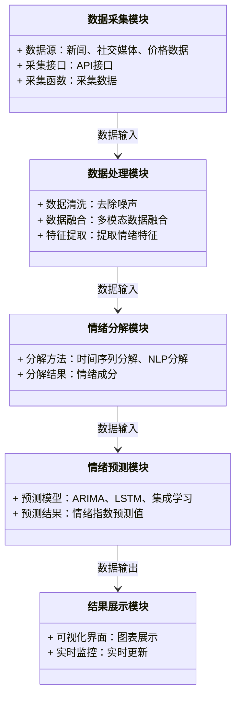

                 


# 开发智能化的金融市场情绪指数分解与预测模型

> 关键词：金融市场情绪指数，智能化，分解模型，预测模型，人工智能，时间序列分析

> 摘要：本文详细探讨了开发智能化的金融市场情绪指数分解与预测模型的方法。通过分析情绪指数的定义、分解方法和预测模型，结合实际应用场景，提出了基于多模态数据和深度学习的解决方案。文章从问题背景、核心概念、算法原理、系统架构到项目实战，全面解析了如何利用人工智能技术提升金融市场情绪指数的分析与预测能力。

---

# 第一部分: 金融市场情绪指数概述

## 第1章: 问题背景与需求分析

### 1.1 金融市场情绪指数的定义与作用

#### 1.1.1 情绪指数的定义
金融市场情绪指数是衡量市场参与者（如投资者、交易员等）情感状态的量化指标。它通常基于市场行为数据（如价格波动、交易量）或非结构化数据（如新闻、社交媒体评论）进行计算，反映了市场的乐观或悲观情绪。

#### 1.1.2 情绪指数在金融分析中的作用
情绪指数在金融分析中具有重要作用，主要体现在以下几个方面：
1. **市场趋势预测**：情绪指数可以作为辅助工具，帮助预测市场的短期波动和长期趋势。
2. **风险管理**：通过情绪指数，投资者可以更好地识别市场风险，制定风险管理策略。
3. **交易信号生成**：情绪指数可以作为交易信号的一部分，帮助交易员做出买卖决策。

#### 1.1.3 情绪指数的局限性
尽管情绪指数在金融分析中有重要作用，但它也存在一些局限性：
1. **数据噪声**：非结构化数据（如社交媒体评论）通常包含大量噪声，难以准确反映市场情绪。
2. **滞后性**：情绪指数通常是基于历史数据计算得出的，具有一定的滞后性，无法实时反映市场动态。
3. **模型局限**：传统的统计模型可能无法捕捉复杂的情绪变化，导致预测精度有限。

### 1.2 问题背景与需求分析

#### 1.2.1 传统情绪指数的不足
传统的金融市场情绪指数通常基于价格波动、成交量等指标进行计算，具有以下不足：
1. **数据维度单一**：传统情绪指数主要依赖价格数据，忽略了新闻、社交媒体等其他数据源。
2. **模型简单**：传统的情绪指数计算方法通常基于简单的统计指标（如标准差、波动率等），难以捕捉复杂的情绪变化。
3. **预测精度低**：由于模型的局限性，传统情绪指数的预测精度较低，难以满足实际需求。

#### 1.2.2 智能化情绪指数的需求
随着人工智能技术的发展，智能化情绪指数的需求日益迫切：
1. **多模态数据融合**：通过整合新闻、社交媒体、价格数据等多种数据源，可以更全面地反映市场情绪。
2. **实时性要求**：智能化情绪指数需要能够实时更新，以便及时捕捉市场动态。
3. **高精度预测**：智能化情绪指数需要结合先进的机器学习算法，提高预测精度，满足实际应用需求。

#### 1.2.3 金融市场情绪指数的核心问题
金融市场情绪指数的核心问题在于如何从多模态数据中准确提取情绪信息，并将其转化为可预测的信号。具体包括以下几个方面：
1. **数据清洗与预处理**：如何从噪声数据中提取有效信息。
2. **情绪分解方法**：如何将情绪信息分解为可解释的成分。
3. **预测模型选择**：如何选择合适的预测模型，提高预测精度。

### 1.3 问题解决思路

#### 1.3.1 数据驱动与模型驱动的结合
智能化情绪指数的开发需要结合数据驱动和模型驱动的方法：
1. **数据驱动**：通过大量数据训练模型，提取情绪特征。
2. **模型驱动**：基于领域知识，设计合理的模型架构，提高预测精度。

#### 1.3.2 多模态数据的融合
通过整合新闻、社交媒体、价格数据等多种数据源，可以更全面地反映市场情绪。具体方法包括：
1. **文本数据处理**：利用自然语言处理技术（NLP）提取文本中的情绪信息。
2. **价格数据分析**：通过时间序列分析方法提取价格波动中的情绪特征。
3. **数据融合方法**：将文本数据和价格数据进行融合，构建多模态情绪指数。

#### 1.3.3 情感计算与预测的结合
将情感计算与预测模型相结合，可以实现对市场情绪的实时监控和预测。具体方法包括：
1. **情感计算**：通过NLP技术计算文本中的情感倾向。
2. **预测模型**：利用机器学习算法（如LSTM、集成学习）对情绪指数进行预测。

---

## 第2章: 核心概念与联系

### 2.1 核心概念原理

#### 2.1.1 情绪指数的分解方法
情绪指数的分解方法通常包括以下几种：
1. **时间序列分解**：将情绪指数分解为趋势、季节性和随机成分。
2. **主成分分析（PCA）**：通过PCA方法提取情绪指数的主要成分。
3. **NLP分解**：基于文本数据的情感分析，提取情绪特征。

#### 2.1.2 情绪预测的数学模型
情绪预测的数学模型通常包括以下几种：
1. **时间序列模型**：如ARIMA、LSTM等。
2. **机器学习模型**：如随机森林、XGBoost等。
3. **深度学习模型**：如Transformer、GRU等。

#### 2.1.3 情绪指数与金融市场的关系
情绪指数与金融市场密切相关，情绪指数的变化可以反映市场的波动性和投资者的心理状态。具体表现在以下几个方面：
1. **情绪指数与价格波动**：情绪指数的变化可以预测价格的波动。
2. **情绪指数与交易量**：情绪指数的变化可以影响市场的交易量。
3. **情绪指数与市场趋势**：情绪指数的变化可以反映市场的趋势变化。

### 2.2 核心概念属性对比

| 情绪指数类型 | 数据来源 | 分解方法 | 预测方法 | 应用场景 |
|--------------|----------|----------|----------|----------|
| 文本情绪指数 | 新闻、社交媒体 | NLP分解 | 时间序列预测 | 个股、板块预测 |
| 价格情绪指数 | 市场价格 | 波动率分解 | 集成学习 | 市场整体预测 |
| 综合情绪指数 | 多模态数据 | 主成分分析 | 深度学习 | 风险评估 |

### 2.3 ER实体关系图

```mermaid
er
actor(用户) --> emotion_index(情绪指数表): 查询
actor(用户) --> prediction_model(预测模型表): 训练
emotion_index(情绪指数表) --> prediction_model(预测模型表): 输入
prediction_model(预测模型表) --> result(结果表): 输出
```

---

## 第3章: 情绪指数分解算法

### 3.1 基于时间序列的分解方法

#### 3.1.1 季节分解法
季节分解法是一种常用的时间序列分解方法，适用于具有明显季节性特征的数据。其基本思想是将时间序列分解为趋势、季节性和随机成分。

#### 3.1.2 移动平均法
移动平均法是一种简单的时间序列平滑方法，适用于去除数据中的随机噪声。其基本思想是通过计算一定时间窗口内的平均值，平滑时间序列。

#### 3.1.3 常规差分法
常规差分法是一种通过差分运算将非平稳时间序列转化为平稳序列的方法。其基本思想是通过计算相邻项的差值，消除趋势和季节性成分。

---

### 3.2 基于NLP的情绪分解

#### 3.2.1 文本情绪分析
文本情绪分析是一种基于NLP的情感计算方法，用于分析文本中的情感倾向。其基本步骤包括：
1. **文本预处理**：分词、去除停用词等。
2. **特征提取**：提取文本中的情感特征。
3. **情感分类**：利用机器学习或深度学习模型对文本进行情感分类。

#### 3.2.2 情感词典构建
情感词典是一种用于文本情绪分析的工具，包含具有情感倾向的词汇。其基本步骤包括：
1. **情感词汇收集**：从文本中收集具有情感倾向的词汇。
2. **情感词汇标注**：对情感词汇进行正负标注。
3. **情感词汇优化**：根据实际应用需求优化情感词典。

#### 3.2.3 情感强度计算
情感强度计算是一种量化文本情感程度的方法。其基本步骤包括：
1. **情感强度计算**：根据情感词汇的权重计算文本的情感强度。
2. **情感强度调整**：根据上下文调整情感强度。

---

### 3.3 基于主成分分析（PCA）的分解

#### 3.3.1 PCA的基本原理
主成分分析（PCA）是一种常用的数据降维技术，适用于提取数据的主要成分。其基本步骤包括：
1. **数据标准化**：对数据进行标准化处理。
2. **协方差矩阵计算**：计算数据的协方差矩阵。
3. **特征值和特征向量计算**：计算协方差矩阵的特征值和特征向量。
4. **主成分提取**：选择特征值较大的主成分。

#### 3.3.2 PCA在情绪指数分解中的应用
PCA可以用于情绪指数的分解，具体步骤包括：
1. **数据收集**：收集多模态数据（如文本、价格数据）。
2. **数据预处理**：对数据进行清洗和标准化。
3. **主成分提取**：通过PCA提取主要的情绪成分。
4. **主成分分析**：分析主成分的含义和贡献度。

---

## 第4章: 情绪指数预测算法

### 4.1 基于时间序列的预测方法

#### 4.1.1 ARIMA模型
ARIMA（自回归积分滑动平均模型）是一种常用的时间序列预测模型。其基本步骤包括：
1. **数据检查**：检查数据的平稳性。
2. **模型参数确定**：确定ARIMA的参数。
3. **模型训练**：利用历史数据训练ARIMA模型。
4. **模型预测**：利用训练好的模型进行预测。

#### 4.1.2 LSTM模型
LSTM（长短期记忆网络）是一种基于深度学习的时间序列预测模型。其基本步骤包括：
1. **数据预处理**：将时间序列数据转换为适合LSTM输入的格式。
2. **模型构建**：构建LSTM模型，包括输入层、隐藏层和输出层。
3. **模型训练**：利用历史数据训练LSTM模型。
4. **模型预测**：利用训练好的模型进行预测。

#### 4.1.3 集成学习模型
集成学习模型是一种通过组合多个模型预测结果来提高预测精度的方法。其基本步骤包括：
1. **模型构建**：构建多个预测模型（如随机森林、XGBoost等）。
2. **模型训练**：利用历史数据训练多个模型。
3. **预测结果集成**：将多个模型的预测结果进行集成，得到最终的预测结果。

---

### 4.2 基于机器学习的预测方法

#### 4.2.1 随机森林模型
随机森林是一种基于树的集成学习模型，适用于分类和回归问题。其基本步骤包括：
1. **数据预处理**：对数据进行清洗和标准化。
2. **特征选择**：选择对预测结果影响较大的特征。
3. **模型构建**：构建随机森林模型。
4. **模型训练**：利用历史数据训练随机森林模型。
5. **模型预测**：利用训练好的模型进行预测。

#### 4.2.2 XGBoost模型
XGBoost是一种基于树的集成学习模型，适用于分类和回归问题。其基本步骤包括：
1. **数据预处理**：对数据进行清洗和标准化。
2. **特征选择**：选择对预测结果影响较大的特征。
3. **模型构建**：构建XGBoost模型。
4. **模型训练**：利用历史数据训练XGBoost模型。
5. **模型预测**：利用训练好的模型进行预测。

#### 4.2.3 深度学习模型
深度学习模型是一种基于人工神经网络的预测模型，适用于复杂的时间序列预测问题。其基本步骤包括：
1. **数据预处理**：将时间序列数据转换为适合深度学习模型输入的格式。
2. **模型构建**：构建深度学习模型（如Transformer、GRU等）。
3. **模型训练**：利用历史数据训练深度学习模型。
4. **模型预测**：利用训练好的模型进行预测。

---

## 第5章: 系统分析与架构设计

### 5.1 问题场景介绍

#### 5.1.1 项目背景
本项目旨在开发一个智能化的金融市场情绪指数分解与预测系统，通过整合多模态数据，利用先进的机器学习算法，实现对市场情绪的实时监控和预测。

#### 5.1.2 项目目标
本项目的主要目标包括：
1. **数据采集**：从新闻、社交媒体、价格数据等多种数据源采集数据。
2. **数据处理**：对数据进行清洗、预处理和融合。
3. **情绪分解**：通过时间序列分析和NLP技术，分解情绪指数。
4. **情绪预测**：利用机器学习算法对情绪指数进行预测。
5. **结果展示**：将预测结果可视化，并提供实时监控界面。

---

### 5.2 系统功能设计

#### 5.2.1 数据采集模块
数据采集模块负责从多种数据源采集数据，包括新闻、社交媒体、价格数据等。

#### 5.2.2 数据处理模块
数据处理模块负责对采集到的数据进行清洗、预处理和融合，提取有效的情绪特征。

#### 5.2.3 情绪分解模块
情绪分解模块负责将提取的情绪特征进行分解，得到可解释的情绪成分。

#### 5.2.4 情绪预测模块
情绪预测模块负责利用机器学习算法对分解后的情绪成分进行预测，生成预测结果。

#### 5.2.5 结果展示模块
结果展示模块负责将预测结果可视化，并提供实时监控界面。

---

### 5.3 系统架构设计

#### 5.3.1 领域模型类图


#### 5.3.2 系统架构图


---

## 第6章: 项目实战

### 6.1 环境安装

#### 6.1.1 安装Python
```bash
python --version
pip install --upgrade pip
```

#### 6.1.2 安装依赖库
```bash
pip install numpy pandas scikit-learn tensorflow seaborn matplotlib
```

---

### 6.2 系统核心实现源代码

#### 6.2.1 数据采集模块
```python
import requests
import json

def fetch_news_data(api_key):
    url = f"https://api.example.com/news?api_key={api_key}"
    response = requests.get(url)
    return json.loads(response.text)

def fetch_price_data(api_key):
    url = f"https://api.example.com/price?api_key={api_key}"
    response = requests.get(url)
    return json.loads(response.text)
```

#### 6.2.2 数据处理模块
```python
import pandas as pd

def preprocess_data(news_data, price_data):
    # 数据清洗
    news_df = pd.DataFrame(news_data)
    price_df = pd.DataFrame(price_data)
    # 数据融合
    merged_df = pd.merge(news_df, price_df, on='date')
    return merged_df
```

#### 6.2.3 情绪分解模块
```python
from sklearn.decomposition import PCA

def decompose_emotion(data):
    pca = PCA(n_components=3)
    pca.fit(data)
    return pca.components_
```

#### 6.2.4 情绪预测模块
```python
from tensorflow.keras.models import Sequential
from tensorflow.keras.layers import LSTM, Dense

def build_lstm_model(input_shape):
    model = Sequential()
    model.add(LSTM(50, input_shape=input_shape))
    model.add(Dense(1))
    model.compile(loss='mse', optimizer='adam')
    return model
```

---

### 6.3 代码应用解读与分析

#### 6.3.1 数据采集模块
数据采集模块通过API接口从新闻和价格数据源获取数据。数据采集模块需要处理API请求，解析返回的JSON数据，并将其转换为DataFrame格式。

#### 6.3.2 数据处理模块
数据处理模块对采集到的数据进行清洗和融合，提取有效的情绪特征。数据融合模块需要将新闻数据和价格数据进行融合，构建多模态数据集。

#### 6.3.3 情绪分解模块
情绪分解模块利用PCA方法对情绪特征进行分解，提取主要的情绪成分。PCA分解可以帮助我们更好地理解情绪指数的构成。

#### 6.3.4 情绪预测模块
情绪预测模块利用LSTM模型对分解后的情绪成分进行预测，生成情绪指数的预测结果。LSTM模型可以有效地捕捉时间序列中的长时依赖关系。

---

### 6.4 实际案例分析

#### 6.4.1 数据准备
```python
import pandas as pd

# 假设我们有一个包含新闻和价格数据的DataFrame
data = pd.read_csv('market_data.csv')
```

#### 6.4.2 数据处理
```python
# 数据清洗
data.dropna(inplace=True)
data = data[~data['news'].str.contains('stopword')]
```

#### 6.4.3 情绪分解
```python
from sklearn.decomposition import PCA

# 初始化PCA模型
pca = PCA(n_components=3)
# 训练模型
pca.fit(data[['news_sentiment', 'price_change']])
# 提取主成分
principal_components = pca.transform(data[['news_sentiment', 'price_change']])
```

#### 6.4.4 情绪预测
```python
from tensorflow.keras.models import Sequential
from tensorflow.keras.layers import LSTM, Dense

# 构建LSTM模型
model = build_lstm_model((principal_components.shape[1], 1))
# 训练模型
model.fit(principal_components, data['price_change'], epochs=10, batch_size=32)
# 预测结果
predicted_prices = model.predict(principal_components)
```

---

## 第7章: 总结与展望

### 7.1 总结
本文详细探讨了开发智能化的金融市场情绪指数分解与预测模型的方法。通过分析情绪指数的定义、分解方法和预测模型，结合实际应用场景，提出了基于多模态数据和深度学习的解决方案。文章从问题背景、核心概念、算法原理、系统架构到项目实战，全面解析了如何利用人工智能技术提升金融市场情绪指数的分析与预测能力。

### 7.2 最佳实践 Tips
1. **数据清洗与预处理**：数据清洗是情绪指数分解与预测的基础，建议在数据预处理阶段去除噪声数据。
2. **模型选择**：根据实际需求选择合适的预测模型，如时间序列模型（ARIMA、LSTM）或集成学习模型（随机森林、XGBoost）。
3. **结果可视化**：通过可视化工具（如Seaborn、Matplotlib）将预测结果直观展示，便于理解和分析。

### 7.3 未来展望
随着人工智能技术的不断发展，金融市场情绪指数的分析与预测将更加智能化和精准化。未来的研究方向包括：
1. **更复杂的模型**：如Transformer、图神经网络等，进一步提高预测精度。
2. **多模态数据融合**：进一步优化多模态数据的融合方法，提升情绪指数的准确性。
3. **实时预测**：通过实时数据流处理技术，实现对市场情绪的实时监控和预测。

---

# 作者：AI天才研究院/AI Genius Institute & 禅与计算机程序设计艺术 /Zen And The Art of Computer Programming

