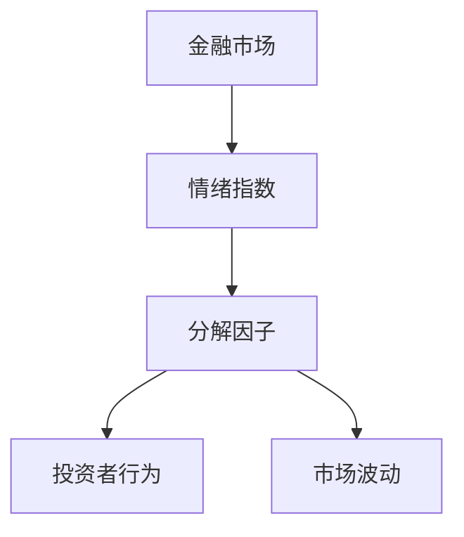
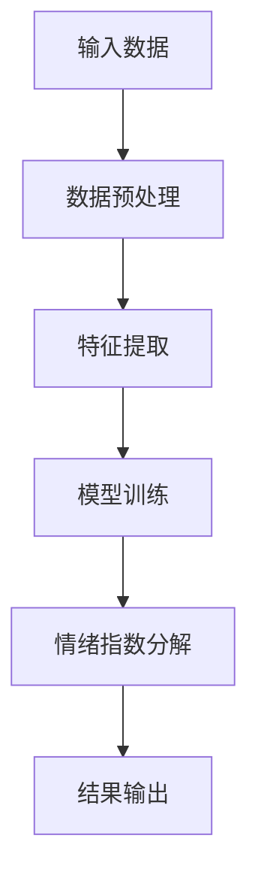
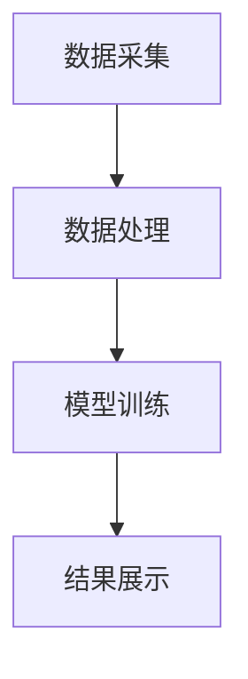
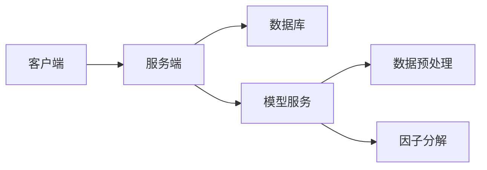

                 


# 开发智能化的金融市场情绪指数分解模型

## 关键词：金融市场，情绪指数，分解模型，人工智能，Python

## 摘要：本文详细介绍了开发智能化的金融市场情绪指数分解模型的全过程，包括背景分析、核心概念、算法原理、系统架构设计以及项目实战。通过结合统计学、机器学习和自然语言处理技术，本文为读者提供了一个从理论到实践的完整指南，帮助他们理解和实现一个高效的情绪指数分解系统。

---

# 第一部分: 金融市场情绪指数分解模型背景与概述

# 第1章: 情绪指数分解模型的背景与问题描述

## 1.1 问题背景

### 1.1.1 金融市场情绪分析的重要性
金融市场中的情绪分析是理解市场波动的重要手段。投资者行为、新闻报道、社交媒体评论等都会影响市场情绪，从而进一步影响资产价格。通过分析情绪指数，投资者可以更好地把握市场的短期波动，辅助决策。

### 1.1.2 情绪指数在金融决策中的作用
情绪指数可以作为量化的情绪指标，帮助投资者、机构和政策制定者理解市场参与者的整体情绪状态。情绪指数还可以用于风险评估、资产配置和交易策略制定。

### 1.1.3 当前情绪指数分析的局限性
传统的情绪指数分析方法通常依赖于主观的新闻分类或简单的文本关键词提取，存在以下问题：
- 数据来源单一，难以覆盖多维度的情绪信息。
- 情绪分析结果缺乏量化标准，难以直接用于交易策略。
- 高频市场波动难以捕捉，传统方法时间分辨率不足。

## 1.2 问题描述

### 1.2.1 情绪指数分解的目标
开发一个智能化的情绪指数分解模型，能够从多源数据中提取情绪信号，并将其分解为多个具有实际意义的因子。

### 1.2.2 情绪指数分解的核心问题
- 如何从异构数据中提取有效的情绪特征？
- 如何将提取的情绪特征分解为有意义的因子？
- 如何量化这些因子对市场的影响程度？

### 1.2.3 情绪指数分解的边界与外延
- 数据范围：包括新闻文本、社交媒体数据、市场交易数据等。
- 时间范围：支持分钟级到日级的市场情绪分析。
- 分解维度：支持多种分解因子，如市场情绪、投资者信心等。

## 1.3 本章小结
本章从金融市场情绪分析的重要性出发，提出了情绪指数分解模型的目标和核心问题，并明确了模型的边界和外延。

---

# 第2章: 情绪指数分解模型的核心概念与联系

## 2.1 核心概念原理

### 2.1.1 情绪指数分解的基本原理
情绪指数分解模型通过多源数据的融合，利用统计和机器学习方法，将市场情绪分解为多个具有解释力的因子。这些因子可以表示不同的市场情绪维度，如乐观情绪、恐慌情绪等。

### 2.1.2 情绪指数分解的关键技术
- 数据预处理：清洗、去噪、特征提取。
- 情绪特征提取：文本挖掘、自然语言处理、情感分析。
- 因子分解：主成分分析（PCA）、因子分析（FA）、非负矩阵分解（NMF）。

### 2.1.3 情绪指数分解的数学模型概述
情绪指数分解模型可以表示为一个多步骤的数学模型，包括数据预处理、特征提取和因子分解。

## 2.2 核心概念属性对比

### 2.2.1 情绪指数分解模型的属性特征对比表格
```markdown
| 属性 | 描述 |
|------|------|
| 数据来源 | 文本数据、市场数据 |
| 输入格式 | 文本、数值、时间序列 |
| 输出结果 | 情绪因子、因子权重 |
| 分解方法 | PCA、NMF、K-Means |
| 应用场景 | 风险管理、交易策略、情绪监控 |
```

## 2.3 实体关系图



## 2.4 本章小结
本章通过对比分析，明确了情绪指数分解模型的核心概念和关键属性，并通过实体关系图展示了模型的组成部分及其相互关系。

---

# 第3章: 情绪指数分解模型的算法原理

## 3.1 算法原理概述

### 3.1.1 情绪指数分解的步骤
1. 数据预处理：清洗、标准化、特征提取。
2. 情绪特征提取：使用NLP技术提取文本特征。
3. 因子分解：利用PCA或NMF分解情绪特征矩阵。
4. 因子权重计算：计算每个因子对情绪指数的贡献权重。
5. 结果输出：输出分解后的因子及其权重。

### 3.1.2 情绪指数分解的数学模型

$$
\text{情绪指数} = \sum_{i=1}^{n} w_i \cdot f_i
$$

其中，$w_i$ 是因子权重，$f_i$ 是因子值。

## 3.2 算法流程图



## 3.3 算法实现代码

### 3.3.1 数据预处理与特征提取

```python
import pandas as pd
from sklearn.preprocessing import StandardScaler
from sklearn.decomposition import PCA

# 示例数据加载
data = pd.read_csv('market_sentiment_data.csv')

# 数据预处理
processed_data = data.dropna()
scaled_data = StandardScaler().fit_transform(processed_data)

# 特征提取（假设特征为文本数据）
from sklearn.feature_extraction.text import TfidfVectorizer

tfidf = TfidfVectorizer(max_features=100)
text_features = tfidf.fit_transform(processed_data['text'])
```

### 3.3.2 因子分解与权重计算

```python
# PCA分解
pca = PCA(n_components=5)
components = pca.fit_transform(text_features)

# 因子权重计算
factor_weights = pd.DataFrame(pca.components_, 
                              columns=tfidf.get_feature_names_out())
```

## 3.4 本章小结
本章详细介绍了情绪指数分解模型的算法原理，包括数据预处理、特征提取和因子分解的具体步骤，并通过代码示例展示了实现过程。

---

# 第4章: 情绪指数分解模型的系统架构设计

## 4.1 问题场景介绍

### 4.1.1 项目介绍
开发一个智能化的情绪指数分解系统，支持实时数据处理和高频市场情绪分析。

## 4.2 系统功能设计

### 4.2.1 系统功能模块
1. 数据采集模块：实时采集新闻、社交媒体数据。
2. 数据处理模块：清洗、标准化、特征提取。
3. 模型训练模块：训练情绪指数分解模型。
4. 结果展示模块：可视化分解因子及其权重。

### 4.2.2 系统功能流程图



## 4.3 系统架构设计

### 4.3.1 系统架构图



## 4.4 系统接口设计

### 4.4.1 API接口
- `/api/v1/data`：接收市场数据，返回处理后的特征。
- `/api/v1/decompose`：接收特征数据，返回分解因子及其权重。

## 4.5 系统交互流程图

```mermaid
graph LR
    Client --> Server: 请求数据
    Server --> Client: 返回分解结果
    Client --> Server: 请求更多数据
    Server --> Client: 返回更多结果
```

## 4.6 本章小结
本章从系统架构的角度，详细设计了情绪指数分解系统的功能模块、架构图和接口设计，为后续的系统实现提供了指导。

---

# 第5章: 项目实战与案例分析

## 5.1 环境安装与配置

### 5.1.1 环境依赖
- Python 3.8+
- Jupyter Notebook
- NumPy、Pandas、Scikit-learn、NLTK

## 5.2 核心代码实现

### 5.2.1 数据预处理与特征提取

```python
import pandas as pd
from sklearn.preprocessing import StandardScaler
from sklearn.decomposition import PCA
from sklearn.feature_extraction.text import TfidfVectorizer

# 数据加载
data = pd.read_csv('market_sentiment_data.csv')

# 数据预处理
processed_data = data.dropna()
scaled_data = StandardScaler().fit_transform(processed_data)

# 特征提取
tfidf = TfidfVectorizer(max_features=100)
text_features = tfidf.fit_transform(processed_data['text'])
```

### 5.2.2 因子分解与结果展示

```python
# PCA分解
pca = PCA(n_components=5)
components = pca.fit_transform(text_features)

# 可视化分解因子
import matplotlib.pyplot as plt

principal_components = pd.DataFrame(pca.components_, 
                                 columns=tfidf.get_feature_names_out())

principal_components.plot(kind='bar', stacked=True)
plt.title('Factor Decomposition')
plt.xlabel('Factors')
plt.ylabel('Weights')
plt.show()
```

## 5.3 案例分析与结果解读

### 5.3.1 数据案例
假设我们有一个包含新闻文本和市场数据的样本数据集，模型可以分解出5个因子，每个因子代表一种市场情绪。

### 5.3.2 分解结果解读
通过因子分解，我们发现某些关键词（如“增长”、“收益”）与因子1正相关，而另一些关键词（如“下跌”、“损失”）与因子2负相关。这表明因子1可能代表乐观情绪，因子2代表悲观情绪。

## 5.4 本章小结
本章通过实际案例展示了情绪指数分解模型的实现过程，并对分解结果进行了详细解读。

---

# 第6章: 最佳实践、小结与展望

## 6.1 最佳实践

### 6.1.1 数据质量的重要性
确保数据来源多样、数据清洗充分，避免噪声干扰。

### 6.1.2 模型调优的技巧
通过网格搜索优化模型参数，选择合适的分解方法。

## 6.2 本章小结
本文详细介绍了开发智能化的金融市场情绪指数分解模型的全过程，从理论到实践，为读者提供了一个完整的解决方案。

## 6.3 未来展望
未来，随着AI技术的发展，情绪指数分解模型可以进一步结合图神经网络、强化学习等技术，提升分解精度和应用范围。

---

# 作者：AI天才研究院/AI Genius Institute & 禅与计算机程序设计艺术 /Zen And The Art of Computer Programming

