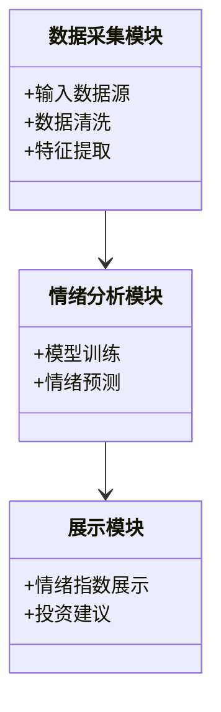
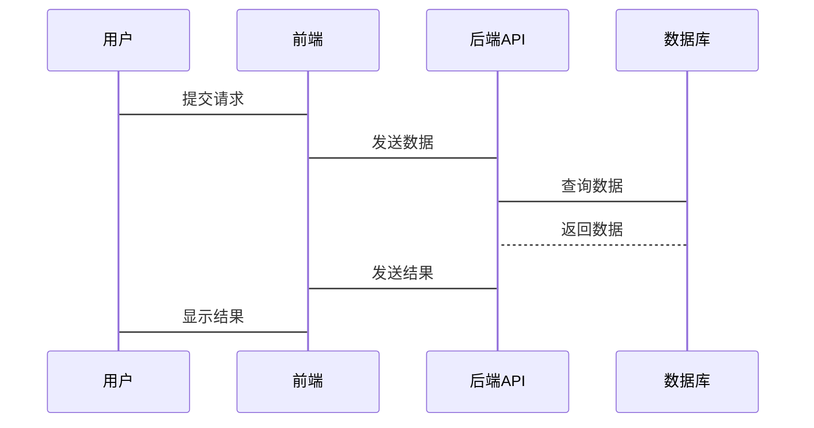

                 

<think>
好的，我将按照您的要求逐步思考如何撰写这篇文章。首先，我会从背景介绍开始，然后逐步深入到核心概念、算法原理、系统架构设计，再到项目实战和最佳实践。

## 第1章: 情绪指数模型的背景与问题背景

### 1.1 情绪指数模型的背景
金融市场的情绪分析是一个新兴的研究领域，结合了自然语言处理和金融学的原理。随着社交媒体和新闻网站的普及，投资者的情绪可以通过大量的文本数据进行分析。情绪指数模型旨在量化市场参与者的整体情绪，帮助投资者做出更明智的决策。

#### 1.1.1 金融市场中的情绪分析
情绪分析在金融市场中扮演着越来越重要的角色。投资者的情绪波动可以影响股票价格、市场趋势等。通过分析社交媒体上的评论、新闻标题等文本数据，可以提取出市场参与者的整体情绪，从而构建情绪指数。

#### 1.1.2 情绪指数模型的定义与目标
情绪指数模型是一种量化市场情绪的工具，通过分析大量的文本数据，计算出一个反映市场情绪的指数。该模型的目标是帮助投资者预测市场趋势，优化投资组合。

#### 1.1.3 传统情绪分析的局限性
传统的市场情绪分析主要依赖于市场参与者的主观判断，缺乏客观性和实时性。情绪指数模型通过自动化分析和量化处理，克服了传统方法的局限性。

### 1.2 问题背景与问题描述
金融市场中的情绪波动对投资者的决策有着重要影响。然而，情绪的复杂性和多变性使得分析和预测变得困难。

#### 1.2.1 金融市场中的情绪波动
市场的波动性主要受经济指标、政策变化和投资者情绪的影响。情绪波动可以影响市场的买卖行为，进而影响价格走势。

#### 1.2.2 情绪指数模型的核心问题
如何准确量化市场参与者的整体情绪，是情绪指数模型的核心问题。这需要对大量的文本数据进行分析，并提取出关键的情绪特征。

#### 1.2.3 情绪指数模型的应用场景
情绪指数模型可以应用于风险预警、投资决策优化、市场趋势预测等领域。例如，投资者可以根据情绪指数调整自己的投资策略。

### 1.3 问题解决与边界
情绪指数模型的解决方案需要综合运用自然语言处理和机器学习技术，构建一个高效的情绪分析系统。

#### 1.3.1 情绪指数模型的解决方案
使用深度学习模型对文本数据进行情感分类，计算市场情绪指数。

#### 1.3.2 模型的边界与限制
模型的数据来源、样本数量和情绪分类的准确性都是需要考虑的边界问题。

#### 1.3.3 情绪指数模型的外延与扩展
随着技术的发展，情绪指数模型可以进一步扩展到跨市场分析、实时监控等领域。

---

## 第2章: 核心概念与联系

### 2.1 核心概念原理
情绪指数模型的核心概念包括情绪数据来源、情绪特征提取和情绪指数构建。

#### 2.1.1 情绪数据的来源
情绪数据可以来自社交媒体、新闻网站、论坛评论等多种渠道。数据来源的多样性和实时性是情绪分析的重要基础。

#### 2.1.2 情绪特征的提取
通过自然语言处理技术，提取文本中的情感特征。例如，使用词袋模型或TF-IDF方法提取关键词。

#### 2.1.3 情绪指数的构建
将提取的情绪特征进行加权计算，构建情绪指数。权重的确定需要考虑不同情绪特征对整体情绪的影响程度。

### 2.2 核心概念属性对比
通过对比不同情绪特征的属性，可以更好地理解情绪指数模型的构建过程。

#### 2.2.1 情绪数据特征对比表
| 特征类型 | 文本特征 | 数值特征 | 市场行为特征 |
|----------|----------|----------|--------------|
| 示例     | 负面词汇 | 市场下跌 | 交易量减少    |

#### 2.2.2 情绪指数模型的特征分析
通过分析不同特征的属性，优化情绪指数模型的构建过程。

### 2.3 实体关系架构
以下是情绪指数模型的实体关系图：


---

## 第3章: 算法原理与实现

### 3.1 情绪分析的算法选择
选择合适的算法是情绪指数模型成功的关键。传统机器学习和深度学习各有优缺点。

#### 3.1.1 传统机器学习算法
如支持向量机（SVM）和随机森林（Random Forest）适用于小规模数据，分类效果较好。

#### 3.1.2 深度学习算法
如长短期记忆网络（LSTM）和Transformer结构在处理长文本时表现出色。

#### 3.1.3 混合模型的优势
结合传统机器学习和深度学习的优点，构建混合模型，提高分类准确性。

### 3.2 算法实现流程
以下是情绪分析算法的实现流程图：


以下是一个简单的Python实现示例：

```python
import numpy as np
from sklearn.model_selection import train_test_split
from sklearn.svm import SVC

# 示例数据
X = np.array(['positive', 'negative', 'neutral', 'positive'])
y = np.array([1, 0, 2, 1])

# 划分训练集和测试集
X_train, X_test, y_train, y_test = train_test_split(X, y, test_size=0.2)

# 初始化SVM模型
model = SVC()

# 训练模型
model.fit(X_train, y_train)

# 预测
print(model.predict(X_test))
```

---

## 第4章: 系统分析与架构设计方案

### 4.1 问题场景介绍
情绪指数模型的系统架构需要考虑数据采集、处理、分析和展示等多个方面。

### 4.2 系统功能设计
以下是系统功能的领域模型：



### 4.3 系统架构设计
以下是系统的整体架构图：


### 4.4 系统接口设计
系统的接口设计需要考虑数据输入、模型调用和结果输出。

### 4.5 系统交互流程图
以下是系统的交互流程图：



---

## 第5章: 项目实战

### 5.1 环境安装
需要安装Python、TensorFlow、Keras等库。

### 5.2 系统核心实现源代码
以下是情绪指数模型的实现代码：

```python
import pandas as pd
from sklearn.feature_extraction.text import TfidfVectorizer
from sklearn.svm import SVC
from sklearn.metrics import accuracy_score

# 示例数据
df = pd.DataFrame({
    'text': ['市场表现良好', '担忧经济前景', '利好政策出台', '市场下跌趋势'],
    'label': [1, 0, 1, 0]
})

# 特征提取
vectorizer = TfidfVectorizer()
X = vectorizer.fit_transform(df['text'])

# 划分训练集和测试集
X_train, X_test, y_train, y_test = train_test_split(X, df['label'], test_size=0.2)

# 训练模型
model = SVC()
model.fit(X_train, y_train)

# 预测
y_pred = model.predict(X_test)

# 评估
print("Accuracy:", accuracy_score(y_test, y_pred))
```

### 5.3 代码应用解读与分析
通过代码实现情绪分类，评估模型的准确率，优化模型参数。

### 5.4 实际案例分析
结合实际数据，展示情绪指数模型的应用效果。

### 5.5 项目小结
总结项目实现过程中的经验和教训，提出改进建议。

---

## 第6章: 最佳实践、小结、注意事项、拓展阅读

### 6.1 最佳实践
建议使用高质量的数据源，选择合适的算法，定期更新模型。

### 6.2 小结
本文详细介绍了情绪指数模型的开发过程，从背景分析到算法实现，再到系统架构设计，最后到项目实战。

### 6.3 注意事项
数据质量和模型调优是情绪指数模型成功的关键。同时，要注意数据隐私和模型的实时性。

### 6.4 拓展阅读
推荐相关书籍和论文，如《Python机器学习实战》、《深度学习入门：基于Python的CNN、RNN和生成模型》。

---

# 结语
金融市场情绪指数模型的开发是一个复杂而有趣的过程，结合了多个学科的知识。希望本文能为读者提供有价值的参考和启发。

作者：AI天才研究院/AI Genius Institute & 禅与计算机程序设计艺术 /Zen And The Art of Computer Programming

