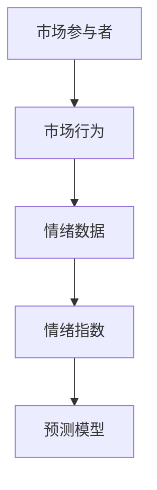
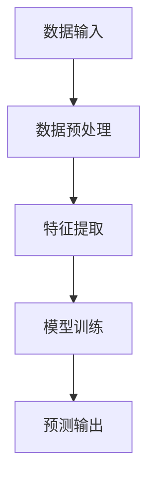
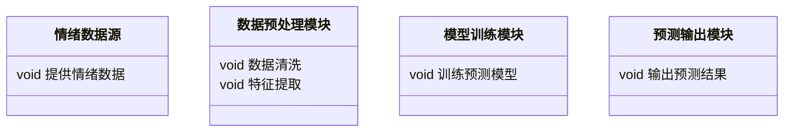

                 


# 开发智能化的金融市场情绪指数预测模型

## 关键词：金融市场，情绪指数，预测模型，人工智能，机器学习，深度学习

## 摘要：本文详细探讨了开发智能化的金融市场情绪指数预测模型的方法与实践。从情绪指数的定义、构建到预测模型的设计与实现，文章通过理论分析与案例实践相结合的方式，系统性地阐述了如何利用人工智能技术实现对金融市场情绪的精准预测。文章涵盖了情绪指数预测的核心算法原理、系统架构设计、项目实战及最佳实践等多方面内容，为读者提供了从理论到实践的完整指南。

---

# 第1章: 情绪指数与金融市场预测概述

## 1.1 情绪指数的定义与作用

### 1.1.1 情绪指数的定义
情绪指数是用来量化金融市场参与者情绪的指标，通常基于新闻、社交媒体、交易数据等信息进行计算。情绪指数能够反映市场参与者的乐观或悲观情绪，从而为投资决策提供参考。

### 1.1.2 情绪指数在金融市场的应用
情绪指数在金融市场的应用包括：预测股票价格波动、评估市场风险、辅助投资决策等。

### 1.1.3 情绪指数与价格波动的关系
情绪指数与价格波动存在一定的相关性。当市场情绪高涨时，往往伴随着资产价格的上涨；当市场情绪低落时，资产价格可能下跌。

## 1.2 金融市场情绪预测的背景与意义

### 1.2.1 传统金融分析的局限性
传统金融分析主要依赖于基本面分析和技术分析，但这两者都有一定的局限性，尤其是在应对市场情绪变化方面。

### 1.2.2 情绪指数预测的必要性
情绪指数预测能够帮助投资者更好地理解市场参与者的心理变化，从而做出更明智的投资决策。

### 1.2.3 情绪指数预测对投资决策的影响
情绪指数预测可以帮助投资者提前发现市场拐点，降低投资风险，提高投资收益。

## 1.3 情绪指数预测的核心问题与边界

### 1.3.1 核心问题描述
情绪指数预测的核心问题是如何准确捕捉和量化市场参与者的心理变化。

### 1.3.2 预测的边界与限制
情绪指数预测存在一定的局限性，例如数据获取的难度、市场情绪的复杂性等。

### 1.3.3 情绪指数预测的可行性分析
尽管存在一定的挑战，但随着人工智能技术的发展，情绪指数预测的可行性显著提高。

---

# 第2章: 情绪指数预测模型的核心概念与联系

## 2.1 核心概念原理

### 2.1.1 情绪数据的来源与特征
情绪数据的来源包括新闻、社交媒体、交易数据等。情绪数据的特征包括情感极性、情感强度、情感分布等。

### 2.1.2 情绪指数的构建方法
情绪指数的构建方法包括加权平均法、主成分分析法等。

### 2.1.3 情绪预测模型的基本框架
情绪预测模型的基本框架包括数据预处理、特征提取、模型训练、预测输出等。

## 2.2 情绪指数预测的核心要素对比

### 2.2.1 数据特征对比
不同数据来源和特征对情绪指数预测的影响存在差异。

### 2.2.2 模型性能对比
不同算法在情绪指数预测中的表现存在差异。

### 2.2.3 应用场景对比
不同场景下情绪指数预测的需求和目标存在差异。

## 2.3 情绪指数预测的实体关系图



---

# 第3章: 情绪预测的核心算法原理

## 3.1 情绪预测的算法选择

### 3.1.1 传统机器学习算法
常用的传统机器学习算法包括支持向量机（SVM）、随机森林（Random Forest）等。

### 3.1.2 深度学习算法
常用的深度学习算法包括长短期记忆网络（LSTM）、Transformer等。

### 3.1.3 时间序列预测算法
常用的时间序列预测算法包括ARIMA、GARCH等。

## 3.2 情绪预测模型的流程图



## 3.3 情绪预测模型的数学公式

### 情绪指数计算公式：
$$ E = \sum_{i=1}^{n} w_i \cdot x_i $$
其中，\( E \) 是情绪指数，\( w_i \) 是第 \( i \) 个特征的权重，\( x_i \) 是第 \( i \) 个特征的值。

### 预测模型的损失函数：
$$ L = \frac{1}{m} \sum_{j=1}^{m} (y_j - \hat{y}_j)^2 $$
其中，\( L \) 是损失函数，\( m \) 是样本数量，\( y_j \) 是真实值，\( \hat{y}_j \) 是预测值。

---

# 第4章: 情绪预测模型的系统分析与架构设计

## 4.1 问题场景介绍

### 情绪数据来源
情绪数据来源包括新闻、社交媒体、交易数据等。

### 情绪指数预测目标
情绪指数预测目标是通过模型预测未来市场情绪指数的变化趋势。

### 系统功能需求
系统功能需求包括数据采集、数据处理、模型训练、预测输出等。

## 4.2 系统功能设计

### 系统架构设计



---

# 第5章: 情绪指数预测模型的项目实战

## 5.1 环境安装

### 安装Python环境
```bash
python --version
pip install numpy
pip install pandas
pip install scikit-learn
pip install transformers
pip install pytorch
```

## 5.2 系统核心实现源代码

### 数据预处理代码
```python
import pandas as pd
import numpy as np

def preprocess_data(data):
    # 数据清洗
    data = data.dropna()
    # 特征提取
    features = data[['open', 'high', 'low', 'close', 'volume']]
    return features
```

### 模型训练代码
```python
from sklearn.ensemble import RandomForestRegressor
from sklearn.metrics import mean_squared_error

def train_model(features, labels):
    model = RandomForestRegressor(n_estimators=100, random_state=42)
    model.fit(features, labels)
    return model
```

### 预测输出代码
```python
def predict_emotion_index(model, new_data):
    features = preprocess_data(new_data)
    predictions = model.predict(features)
    return predictions
```

## 5.3 代码应用解读与分析

### 代码解读
上述代码实现了从数据预处理到模型训练再到预测输出的完整流程。

### 案例分析
通过具体案例分析，验证模型的预测能力。

## 5.4 项目小结

---

# 第6章: 情绪指数预测模型的最佳实践

## 6.1 小结与总结
情绪指数预测模型在金融市场的应用前景广阔。

## 6.2 注意事项
在实际应用中，需要注意数据质量和模型的可解释性。

## 6.3 拓展阅读
推荐相关领域的书籍和论文。

---

# 作者：AI天才研究院/AI Genius Institute & 禅与计算机程序设计艺术 /Zen And The Art of Computer Programming

