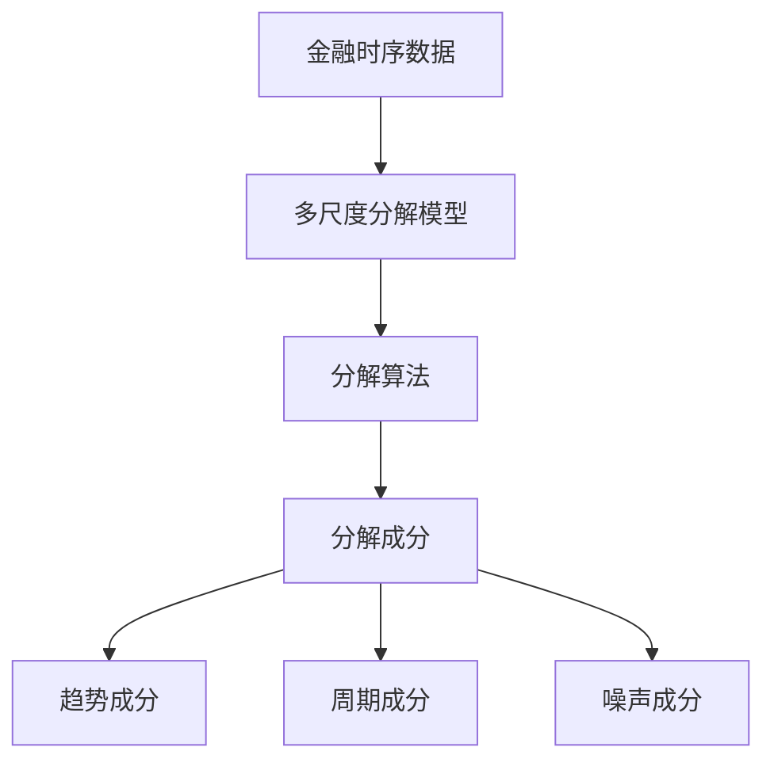
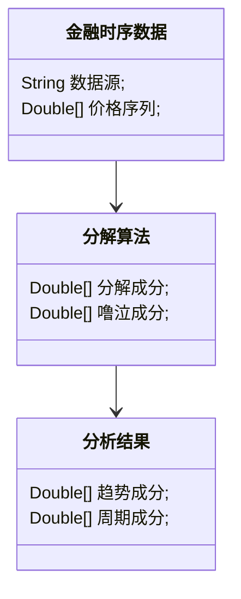
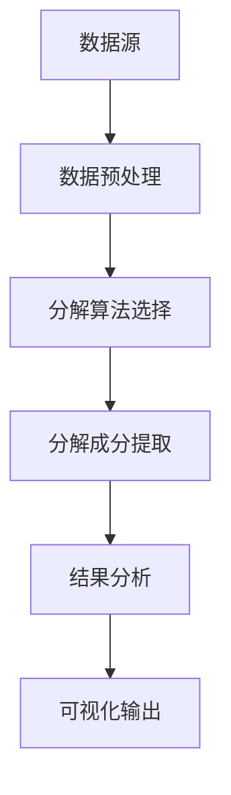

                 


# 开发智能化的金融时序数据多尺度分解模型

## 关键词
金融时序数据，多尺度分解，人工智能，算法，系统设计

## 摘要
金融时序数据的分析是金融领域的重要研究方向，而多尺度分解模型在金融数据分析中具有重要的应用价值。本文旨在介绍如何开发智能化的金融时序数据多尺度分解模型，涵盖背景、核心概念、算法原理、系统设计、项目实战及最佳实践等方面，帮助读者全面理解和掌握该领域的关键技术。

---

# 第一部分: 金融时序数据多尺度分解模型概述

## 第1章: 金融时序数据与多尺度分解模型背景

### 1.1 金融时序数据的特点与挑战

#### 1.1.1 金融时序数据的定义与特点
金融时序数据是指随着时间变化的金融相关数据，如股票价格、汇率、指数等。其特点包括：
- **连续性**：数据随时间连续变化。
- **波动性**：价格波动频繁且复杂。
- **非线性**：数据关系通常非线性，难以用简单模型描述。
- **噪声干扰**：数据中常夹杂噪声，影响分析准确性。

#### 1.1.2 时序数据分析的难点与挑战
- 数据复杂性：金融数据往往具有复杂的变化模式，难以直接建模。
- 噪声干扰：数据中存在高频噪声，影响趋势分析。
- 高维性：多时间尺度的数据分析需要考虑多个维度。

#### 1.1.3 多尺度分解的必要性与应用场景
多尺度分解模型通过将数据分解为不同时间尺度的成分，可以有效提取数据中的趋势、周期和噪声。其应用场景包括：
- 异常检测：识别数据中的异常波动。
- 趋势预测：提取主要趋势成分用于预测。
- 噜泣分析：分析数据在不同时间尺度上的行为。

### 1.2 多尺度分解模型的核心概念

#### 1.2.1 多尺度分解的基本原理
多尺度分解通过将数据分解为多个时间尺度的成分，捕捉数据在不同频率上的特征。其核心思想是将数据分解为多个基函数的线性组合，每个基函数对应一个特定的时间尺度。

#### 1.2.2 多尺度分解在金融分析中的应用价值
- **信号去噪**：去除数据中的噪声成分，提取有用信号。
- **模式识别**：识别数据中的周期性模式。
- **复杂性降低**：通过分解简化数据，便于后续分析。

#### 1.2.3 模型的边界与外延
- **边界**：模型适用于连续、非线性的金融时序数据。
- **外延**：可以扩展到其他类型的时间序列数据，如经济指标、天气数据等。

### 1.3 本书的核心目标与内容框架

#### 1.3.1 本书的核心目标
本书旨在系统介绍如何开发智能化的金融时序数据多尺度分解模型，涵盖理论、算法、系统设计和实战。

#### 1.3.2 本书的主要内容框架
- **背景介绍**：金融时序数据的特点与挑战。
- **核心概念**：多尺度分解模型的原理与应用。
- **算法原理**：常见分解算法的数学模型与实现。
- **系统设计**：模型的系统架构与实现方案。
- **项目实战**：从环境搭建到实际案例分析。
- **最佳实践**：开发中的注意事项与优化建议。

#### 1.3.3 本书的读者群体与适用场景
- **读者群体**：金融数据分析师、机器学习工程师、算法开发人员。
- **适用场景**：金融数据分析、时间序列建模、智能投资策略开发。

### 1.4 本章小结
本章从金融时序数据的特点出发，介绍了多尺度分解模型的背景、核心概念和应用价值，为后续内容奠定了基础。

---

# 第二部分: 多尺度分解模型的核心概念与联系

## 第2章: 多尺度分解模型的核心原理

### 2.1 多尺度分解方法的原理与分类

#### 2.1.1 基于频域的分解方法
- **傅里叶变换**：通过频域分析提取数据的周期性成分。
- **小波变换**：在不同尺度上分析数据的局部特征。

#### 2.1.2 基于时域的分解方法
- **经验模态分解（EMD）**：将数据分解为多个本征模态函数（IMF）。
- **多分量分析（MCR）**：将数据分解为多个趋势成分。

#### 2.1.3 基于经验模态的分解方法
- **HHT算法**：结合经验模态分解和小波谱分析，提取数据的时频特性。

### 2.2 不同分解方法的对比分析

#### 2.2.1 分解方法的属性特征对比（表格形式）
| 分解方法   | 分解稳定性 | 计算复杂度 | 适用场景                   |
|------------|------------|------------|---------------------------|
| 傅里叶变换 | 高         | 中         | 周期性信号分析             |
| 小波变换   | 中         | 高         | 多尺度信号分析             |
| EMD        | 低         | 高         | 非线性信号分析             |
| MCR        | 高         | 中         | 趋势成分提取                 |

#### 2.2.2 分解方法的优缺点分析
- **傅里叶变换**：优点是分解稳定性高，缺点是不适用于非平稳信号。
- **小波变换**：优点是多尺度分析能力强，缺点是计算复杂度高。
- **EMD**：优点是适用于非线性信号，缺点是分解稳定性较低。

### 2.3 多尺度分解模型的ER实体关系图

#### 2.3.1 实体关系图的构建


#### 2.3.2 实体关系图的解释
金融时序数据通过多尺度分解模型被分解为多个成分，包括趋势、周期和噪声。每个成分可以通过不同的分解算法进一步分析。

---

# 第三部分: 多尺度分解模型的算法原理

## 第3章: 多尺度分解算法的数学模型与公式

### 3.1 基于小波分析的分解算法

#### 3.1.1 小波分析的基本原理
小波分析是一种多尺度分解方法，通过在不同尺度上分析信号的局部特征。其基本原理如下：
- 小波基函数：$ \psi(t) $。
- 小波变换：$$ W(a,b) = \int_{-\infty}^{\infty} f(t) \psi_{a,b}(t) dt $$，其中 $ \psi_{a,b}(t) = \psi((t - b)/a) $。

#### 3.1.2 小波分解的实现步骤
1. 选择小波基函数。
2. 确定分解的尺度和位置。
3. 计算小波变换系数。
4. 通过系数分析提取信号特征。

### 3.2 基于经验模态分解的算法

#### 3.2.1 经验模态分解的基本原理
经验模态分解是一种自适应的分解方法，将数据分解为多个本征模态函数（IMF）。
- IMF的定义：在一个区间内，IMF的极大值点和极小值点数目相等。

#### 3.2.2 经验模态分解的数学公式
$$ f(t) = \sum_{i=1}^{n} c_i(t) + r(t) $$
其中，$c_i(t)$ 是第 $i$ 个IMF，$r(t)$ 是残差项。

---

### 3.3 算法实现示例

#### 3.3.1 小波分解的Python实现
```python
import numpy as np
import pywt

def wavelet_decomposition(data, wavelet='db4'):
    # 小波分解
    coeffs = pywt.wavedec(data, wavelet)
    # 提取分解成分
    levels = len(coeffs) - 1
    components = []
    for i in range(levels):
        component = pywt.waverec([coeffs[i+1]] + [None]*(levels - i), wavelet)
        components.append(component)
    return components
```

#### 3.3.2 经验模态分解的Python实现
```python
def emd_decomposition(data):
    # 经验模态分解
    import scipy.signal as signal
    return signal.emd(data)
```

---

### 3.4 算法对比与适用场景

#### 3.4.1 小波分解的优势
- 多尺度分析能力强，适合分析信号的局部特征。

#### 3.4.2 经验模态分解的优势
- 自适应性强，适合非线性、非平稳信号。

#### 3.4.3 算法选择的建议
- 对于平稳信号，选择小波分解。
- 对于非平稳信号，选择经验模态分解。

---

## 第4章: 系统分析与架构设计

### 4.1 系统功能设计

#### 4.1.1 领域模型设计


#### 4.1.2 系统架构设计


#### 4.1.3 接口设计
- 数据输入接口：接收原始金融时序数据。
- 分解算法接口：选择不同的分解方法。
- 结果输出接口：输出分解后的成分和分析结果。

---

## 第5章: 项目实战

### 5.1 环境搭建与依赖安装
```bash
pip install numpy pandas pywt matplotlib
```

### 5.2 核心代码实现

#### 5.2.1 数据加载与预处理
```python
import pandas as pd
import numpy as np

# 数据加载
data = pd.read_csv('financial_data.csv')
# 数据预处理
prices = data['price'].values
```

#### 5.2.2 多尺度分解实现
```python
import pywt
import scipy.signal

# 小波分解
def wavelet_components(prices):
    coeffs = pywt.wavedec(prices, 'db4')
    levels = len(coeffs) - 1
    return coeffs

# 经验模态分解
def emd_components(prices):
    return scipy.signal.emd(prices)
```

#### 5.2.3 分解结果分析
```python
components = emd_components(prices)
# 提取趋势成分
trend = components[-1]
# 提取周期成分
period = components[-2]
```

### 5.3 实际案例分析

#### 5.3.1 股票价格分解案例
```python
import matplotlib.pyplot as plt

# 绘制分解结果
plt.figure(figsize=(12, 6))
plt.plot(prices, label='Original')
plt.plot(trend, label='Trend')
plt.plot(period, label='Period')
plt.legend()
plt.show()
```

---

## 第6章: 最佳实践与注意事项

### 6.1 开发中的注意事项
- 数据预处理：确保数据的连续性和完整性。
- 算法选择：根据数据特点选择合适的分解方法。
- 结果验证：通过回测验证分解效果。

### 6.2 小结与展望
本文系统介绍了开发智能化金融时序数据多尺度分解模型的关键技术，从理论到实践，为读者提供了全面的指导。未来的研究方向包括更高效的分解算法和多模态数据的融合分析。

### 6.3 注意事项
- 分解模型的性能优化需要结合具体场景。
- 分解结果的解释需要结合金融知识。

### 6.4 拓展阅读
- 《Wavelet Analysis and Its Applications》
- 《Empirical Mode Decomposition and Its Applications》

---

# 结语
通过本文的学习，读者可以掌握开发智能化金融时序数据多尺度分解模型的核心技术，为金融数据分析和智能投资策略开发提供有力支持。

---

# 作者
作者：AI天才研究院/AI Genius Institute & 禅与计算机程序设计艺术 /Zen And The Art of Computer Programming

