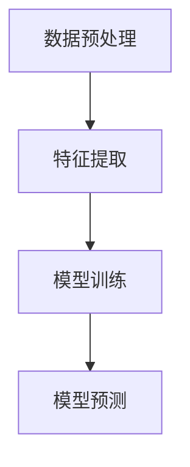
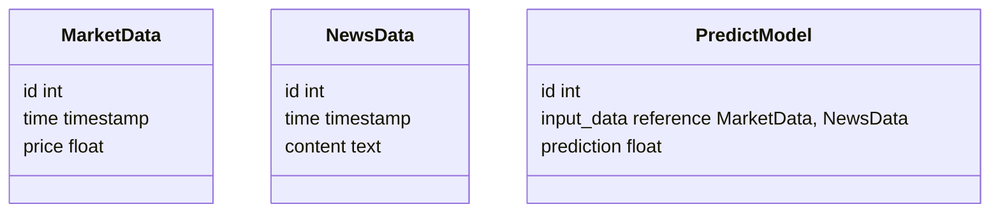

                 


# 开发智能化的金融时序数据多源信息融合预测模型

> 关键词：金融时序数据，多源信息融合，预测模型，智能化，机器学习

> 摘要：本文系统地介绍了如何开发智能化的金融时序数据多源信息融合预测模型。从问题背景、核心概念到算法原理、系统设计，再到项目实战，详细阐述了每一步的实现细节。通过本文，读者可以掌握从数据预处理、特征提取、模型训练到系统架构设计的完整流程，最终实现一个高效的金融预测模型。

---

## 第1章: 背景介绍

### 1.1 问题背景

#### 1.1.1 金融时序数据的特点
金融时序数据具有以下特点：
- **连续性**：数据按时间顺序排列，具有严格的时序性。
- **波动性**：价格波动频繁，受多种因素影响。
- **相关性**：不同时间点的数据之间存在相关性。
- **非线性**：价格波动往往呈现非线性特征。

#### 1.1.2 多源信息融合的必要性
在金融领域，单一数据源的预测能力有限，需要结合多种数据源（如市场数据、新闻数据、经济指标等）来提高预测精度。

#### 1.1.3 预测模型在金融领域的应用价值
预测模型可以帮助投资者做出更科学的决策，优化投资组合，降低风险。

### 1.2 问题描述

#### 1.2.1 金融时序数据的复杂性
金融数据受多种因素影响，具有高度不确定性。

#### 1.2.2 多源信息融合的挑战
- 数据格式多样。
- 数据量大，处理复杂。
- 数据之间的关联性难以提取。

#### 1.2.3 预测模型的精度与实时性要求
模型需要在保证精度的前提下，满足实时预测的需求。

### 1.3 问题解决

#### 1.3.1 多源信息融合的基本思路
- 数据清洗与预处理。
- 特征提取与融合。
- 模型训练与优化。

#### 1.3.2 预测模型的设计目标
- 高精度：模型预测准确率高。
- 实时性：模型能够快速响应。
- 可解释性：模型结果可解释。

#### 1.3.3 智能化预测的核心要素
- 数据驱动：基于大量数据进行建模。
- 智能算法：使用机器学习和深度学习算法。
- 自适应性：模型能够自适应数据变化。

### 1.4 边界与外延

#### 1.4.1 数据范围的界定
- 数据范围：金融市场的相关数据。
- 数据类型：结构化数据和非结构化数据。

#### 1.4.2 模型适用场景的限制
- 适用于中短期预测。
- 适用于单变量或多变量预测。

#### 1.4.3 外延与相关领域的联系
- 与量化交易、风险管理等领域密切相关。

### 1.5 核心概念与联系

#### 1.5.1 核心概念原理
- 数据融合：将多源数据进行整合，提取有用特征。
- 时序预测：基于历史数据预测未来趋势。
- 智能化：利用机器学习和深度学习技术提升预测能力。

#### 1.5.2 概念属性特征对比表格

| 概念       | 属性特征               |
|------------|------------------------|
| 数据融合    | 数据来源多样，格式统一 |
| 时序预测    | 数据具有时间依赖性     |
| 智能化      | 使用机器学习算法       |

#### 1.5.3 ER实体关系图架构
```mermaid
erd
    title 实体关系图
    MarketData {
        id int
        time timestamp
        price float
    }
    NewsData {
        id int
        time timestamp
        content text
    }
    EconomyIndicator {
        id int
        time timestamp
        value float
    }
    PredictModel {
        id int
        input_data reference MarketData, NewsData, EconomyIndicator
        prediction float
    }
```

---

## 第2章: 核心概念与联系

### 2.1 核心概念原理

#### 2.1.1 多源信息融合的基本原理
将来自不同数据源的信息进行清洗、转换和融合，提取有用的特征。

#### 2.1.2 时序数据的特征提取
- 移动平均：计算短期和长期平均值。
- 偏差：计算数据与均值的偏离程度。
- 自相关性：分析数据的自相关性。

#### 2.1.3 智能化预测的核心算法
- 机器学习：随机森林、支持向量机。
- 深度学习：LSTM、Transformer。

### 2.2 概念属性特征对比表格

| 概念       | 特征对比               |
|------------|------------------------|
| 数据融合    | 需要清洗和转换数据     |
| 时序预测    | 需要考虑时间依赖性     |
| 智能化      | 需要使用复杂算法       |

### 2.3 ER实体关系图架构

```mermaid
erd
    title 实体关系图
    MarketData {
        id int
        time timestamp
        price float
    }
    NewsData {
        id int
        time timestamp
        content text
    }
    EconomyIndicator {
        id int
        time timestamp
        value float
    }
    PredictModel {
        id int
        input_data reference MarketData, NewsData, EconomyIndicator
        prediction float
    }
```

---

## 第3章: 算法原理讲解

### 3.1 算法原理概述

#### 3.1.1 多源信息融合的基本流程
1. 数据清洗：去除噪声数据。
2. 特征提取：提取有用的特征。
3. 模型训练：训练预测模型。

#### 3.1.2 时序数据的处理方法
- 数据平滑：使用移动平均法。
- 数据差分：计算一阶差分和二阶差分。

#### 3.1.3 智能化预测的核心算法
- LSTM：长短期记忆网络。
- Transformer：基于注意力机制的模型。

### 3.2 算法流程图



### 3.3 算法实现代码

#### 3.3.1 数据预处理代码
```python
import pandas as pd
import numpy as np

# 数据清洗
data = pd.read_csv('data.csv')
data.dropna(inplace=True)
```

#### 3.3.2 特征提取代码
```python
# 特征提取
from sklearn.feature_selection import SelectKBest
from sklearn.feature_selection import chi2

selector = SelectKBest(score_func=chi2, k=5)
selector.fit_transform(data, labels)
```

#### 3.3.3 模型训练与预测代码
```python
# 模型训练
from tensorflow.keras.models import Sequential
from tensorflow.keras.layers import LSTM, Dense

model = Sequential()
model.add(LSTM(64, input_shape=(timesteps, features)))
model.add(Dense(1))
model.compile(loss='mean_squared_error', optimizer='adam')
model.fit(X_train, y_train, epochs=100, batch_size=32)

# 模型预测
y_pred = model.predict(X_test)
```

### 3.4 数学模型

#### 3.4.1 LSTM模型
LSTM的数学模型如下：
$$
f_t = \sigma(W_{f}x_t + U_{f}h_{t-1} + b_f)
$$
其中，$f_t$ 是遗忘门，$x_t$ 是输入，$h_{t-1}$ 是前一时刻的隐藏状态。

---

## 第4章: 系统分析与架构设计方案

### 4.1 问题场景介绍

#### 4.1.1 金融时序数据的应用场景
- 股票价格预测。
- 外汇汇率预测。
- 债券价格预测。

#### 4.1.2 多源信息融合的实际需求
- 综合市场数据、新闻数据和经济指标进行预测。

#### 4.1.3 智能化预测的系统架构
- 数据预处理模块。
- 特征提取模块。
- 模型训练模块。
- 模型预测模块。

### 4.2 系统功能设计

#### 4.2.1 领域模型设计


#### 4.2.2 系统架构设计


#### 4.2.3 系统接口设计
- 数据预处理接口：`preprocess(data: DataFrame) -> DataFrame`
- 特征提取接口：`extract_features(data: DataFrame) -> ndarray`
- 模型训练接口：`train_model(X: ndarray, y: ndarray) -> Model`
- 模型预测接口：`predict_model(X: ndarray) -> ndarray`

### 4.3 系统架构图


---

## 第5章: 项目实战

### 5.1 环境安装

#### 5.1.1 开发环境配置
- Python 3.8+
- 虚拟环境：`venv`

#### 5.1.2 依赖库安装
```bash
pip install pandas numpy scikit-learn tensorflow
```

#### 5.1.3 数据集准备
- 数据来源：股票价格数据、新闻数据、经济指标数据。
- 数据格式：CSV文件。

### 5.2 核心代码实现

#### 5.2.1 数据预处理
```python
import pandas as pd
import numpy as np

# 数据清洗
data = pd.read_csv('data.csv')
data.dropna(inplace=True)
```

#### 5.2.2 特征提取
```python
from sklearn.feature_selection import SelectKBest
from sklearn.feature_selection import chi2

selector = SelectKBest(score_func=chi2, k=5)
selector.fit_transform(data, labels)
```

#### 5.2.3 模型训练与预测
```python
from tensorflow.keras.models import Sequential
from tensorflow.keras.layers import LSTM, Dense

model = Sequential()
model.add(LSTM(64, input_shape=(timesteps, features)))
model.add(Dense(1))
model.compile(loss='mean_squared_error', optimizer='adam')
model.fit(X_train, y_train, epochs=100, batch_size=32)

y_pred = model.predict(X_test)
```

### 5.3 案例分析与解读

#### 5.3.1 数据预处理案例
- 数据清洗：去除缺失值。
- 数据标准化：归一化处理。

#### 5.3.2 模型训练案例
- 训练LSTM模型，预测股票价格。
- 使用测试数据验证模型性能。

### 5.4 项目小结
通过本章的实战，读者可以掌握从数据预处理到模型训练的完整流程，为后续的优化和部署打下基础。

---

## 第6章: 模型优化与部署

### 6.1 模型优化策略
- 调参：调整LSTM的参数。
- 增加特征：引入更多的金融指标。
- 使用集成学习：结合多个模型的结果。

### 6.2 模型部署
- 部署模型到云平台。
- 实时预测接口开发。

### 6.3 模型监控
- 监控模型性能。
- 及时调整模型参数。

---

## 第7章: 总结与展望

### 7.1 全文总结
本文详细介绍了开发智能化的金融时序数据多源信息融合预测模型的完整流程，包括背景、核心概念、算法原理、系统设计和项目实战。

### 7.2 最佳实践 tips
- 数据预处理是关键。
- 特征提取要精准。
- 模型优化要持续。

### 7.3 注意事项
- 数据隐私问题。
- 模型解释性问题。
- 实时性与精度的平衡。

### 7.4 拓展阅读
- 《深度学习》
- 《时间序列分析》

---

## 作者：AI天才研究院/AI Genius Institute & 禅与计算机程序设计艺术 /Zen And The Art of Computer Programming

