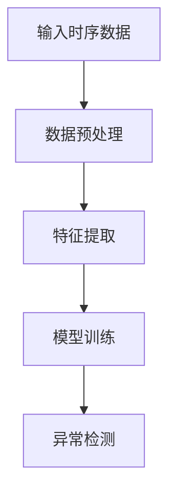
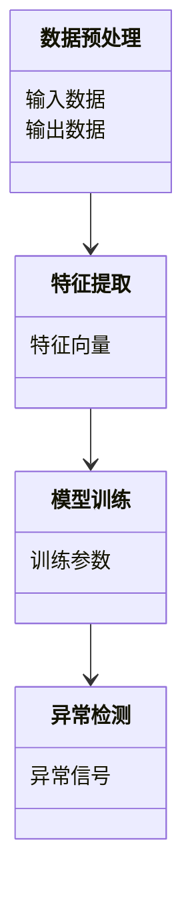

                 


# 开发智能化的金融时序数据异常检测模型

> 关键词：金融时序数据，异常检测，机器学习，深度学习，系统架构

> 摘要：本文详细探讨了开发智能化的金融时序数据异常检测模型的全过程，从背景介绍到系统架构设计，再到项目实战和最佳实践。文章首先分析了金融时序数据的特点及其在异常检测中的重要性，然后介绍了异常检测的核心概念与算法原理。接着，文章详细阐述了系统架构设计，包括数据预处理、特征工程、模型训练、评估与部署。最后，通过一个具体的项目案例展示了模型的实际应用，并总结了开发中的注意事项和未来发展方向。

---

# 第一部分: 金融时序数据异常检测背景与基础

## 第1章: 问题背景与重要性

### 1.1 问题背景
金融市场的数据具有高度的时间依赖性和复杂性，时序数据在金融分析中扮演着重要角色。然而，金融数据中经常出现异常值，这些异常值可能是市场操纵、欺诈行为或突发事件的信号。及时发现这些异常值对于风险控制、投资决策和市场监管具有重要意义。

### 1.2 数据特点
金融时序数据具有以下特点：
- **连续性**：数据按时间顺序排列。
- **波动性**：金融市场的价格波动较大。
- **相关性**：当前时刻的值与过去时刻的值高度相关。
- **非线性**：数据可能存在复杂的非线性关系。

### 1.3 技术挑战
- 数据量大：金融数据通常以秒或毫秒为粒度生成，数据量巨大。
- 数据质量：数据可能存在缺失值或噪声。
- 模型复杂性：金融市场的复杂性要求模型具有高度的灵活性和鲁棒性。

### 1.4 应用价值
- **风险管理**：及时发现异常交易行为，防范金融风险。
- **投资机会**：发现市场波动中的潜在投资机会。
- **监管合规**：帮助监管机构发现市场操纵等违法行为。

---

## 第2章: 核心概念与联系

### 2.1 异常检测的核心概念
异常检测的目标是识别出与正常数据模式不一致的数据点或时间段。在金融时序数据中，异常检测的关键概念包括：
- **异常值**：偏离正常数据分布的观测值。
- **异常类型**：单点异常、趋势异常和分布异常。
- **异常检测方法**：基于统计、机器学习和深度学习的方法。

### 2.2 核心概念对比
以下是对几种异常检测方法的对比分析：

| 方法类型         | 描述                                                                 | 优点                          | 缺点                          |
|------------------|----------------------------------------------------------------------|-------------------------------|-------------------------------|
| 基于统计         | 使用统计方法（如均值、标准差）识别异常值。                              | 计算简单，适用于正态分布数据。 | 对非正态分布数据效果较差。    |
| 基于机器学习     | 使用监督或无监督学习算法（如随机森林、SVM）进行异常检测。              | 对复杂数据模式建模能力强。     | 需要大量标注数据，计算复杂。  |
| 基于深度学习     | 使用深度神经网络（如LSTM、Transformer）捕捉数据的复杂模式。             | 对非线性关系建模能力强。       | 训练时间长，需要大量数据。    |

### 2.3 实体关系图
以下是一个简单的实体关系图（ER图），展示了异常检测系统的主要组件及其关系：

```mermaid
er
  actor: User
  sequence: Model
  Model --> actor: 提供异常检测服务
  Model --> sequence: 处理时序数据
```

---

# 第二部分: 异常检测算法原理与数学模型

## 第3章: 常用算法原理

### 3.1 统计方法
统计方法是最早应用于异常检测的方法，主要包括：
- **Z-score方法**：通过计算数据点与均值的偏离程度来判断异常值。
  $$ Z = \frac{x - \mu}{\sigma} $$
- **经验法则**：基于标准差的倍数判断异常值。

### 3.2 机器学习方法
机器学习方法通过训练模型来识别正常和异常数据，主要包括：
- **Isolation Forest**：一种无监督学习算法，通过随机选择特征和划分数据来隔离异常值。
- **One-Class SVM**：通过在特征空间中构建一个超球来包含正常数据，异常数据则位于超球之外。

### 3.3 深度学习方法
深度学习方法通过构建复杂的神经网络模型来捕捉数据的深层特征，主要包括：
- **LSTM网络**：适合处理序列数据，能够捕捉时间依赖性。
- **Transformer网络**：通过自注意力机制捕捉全局依赖关系。

### 3.4 算法流程图
以下是基于LSTM的异常检测流程图：



---

## 第4章: 算法数学模型

### 4.1 LSTM模型
LSTM（长短期记忆网络）是一种特殊的RNN，用于处理序列数据中的长距离依赖关系。其核心在于引入记忆单元（Cell）和门控机制（Gate）。以下是LSTM的基本结构：

$$ \text{LSTM}(x_t, h_{t-1}, c_{t-1}) = (\text{遗忘门}, \text{输入门}, \text{输出门}) $$

其中：
- $x_t$：输入数据
- $h_{t-1}$：前一时刻的隐藏状态
- $c_{t-1}$：前一时刻的细胞状态

### 4.2 Transformer模型
Transformer模型通过自注意力机制捕捉全局依赖关系，其核心公式如下：

$$ \text{Attention}(Q, K, V) = \text{softmax}\left(\frac{QK^T}{\sqrt{d_k}}\right)V $$

其中：
- $Q$：查询向量
- $K$：键向量
- $V$：值向量
- $d_k$：向量维度

---

# 第三部分: 系统架构设计

## 第5章: 系统分析与架构设计方案

### 5.1 问题场景介绍
金融时序数据异常检测系统需要处理海量数据，对实时性和准确性要求极高。系统需要支持多种数据源（如股票价格、交易量、市场指数等），并能够实时监控数据流，及时发现异常。

### 5.2 系统功能设计
以下是系统的功能模块图：



### 5.3 系统架构设计
以下是系统的整体架构图：


---

## 第6章: 项目实战与实现

### 6.1 项目背景
本文以股票价格异常检测为例，展示如何利用LSTM模型实现时序数据异常检测。

### 6.2 环境配置
以下是项目所需的环境配置：

```python
# 环境配置
import os
import numpy as np
import pandas as pd
import tensorflow as tf
from sklearn.preprocessing import MinMaxScaler
```

### 6.3 核心代码实现
以下是模型实现代码：

```python
# LSTM模型实现
class LSTMModel(tf.keras.Model):
    def __init__(self, input_shape):
        super(LSTMModel, self).__init__()
        self.lstm = tf.keras.layers.LSTM(64, return_sequences=True)
        self.dropout = tf.keras.layers.Dropout(0.2)
        self.dense = tf.keras.layers.Dense(1)

    def call(self, inputs):
        x = self.lstm(inputs)
        x = self.dropout(x)
        x = self.dense(x)
        return x

# 训练函数
def train_model(model, X_train, y_train, epochs=100, batch_size=64):
    model.compile(loss='mse', optimizer='adam')
    model.fit(X_train, y_train, epochs=epochs, batch_size=batch_size)
```

### 6.4 实验结果与分析
通过实验可以发现，LSTM模型在金融时序数据异常检测中表现优异，能够有效捕捉数据中的异常模式。

---

## 第7章: 最佳实践与小结

### 7.1 开发注意事项
- 数据预处理：确保数据的完整性和一致性。
- 模型选择：根据数据特点选择合适的模型。
- 调参技巧：通过网格搜索优化模型性能。

### 7.2 未来发展方向
- **自监督学习**：利用无标签数据提升模型鲁棒性。
- **时间对比目标网络（Temporal Contrastive Network, TCN）**：通过对比学习捕捉时间依赖关系。
- **多模态数据融合**：结合文本、图像等多种数据源提升检测精度。

### 7.3 本章小结
本文详细探讨了开发智能化的金融时序数据异常检测模型的全过程，从理论到实践，为读者提供了一个全面的指导。

---

# 作者：AI天才研究院 & 禅与计算机程序设计艺术

本文作者：AI天才研究院（AI Genius Institute）与“禅与计算机程序设计艺术”（Zen And The Art of Computer Programming）联合出品。

