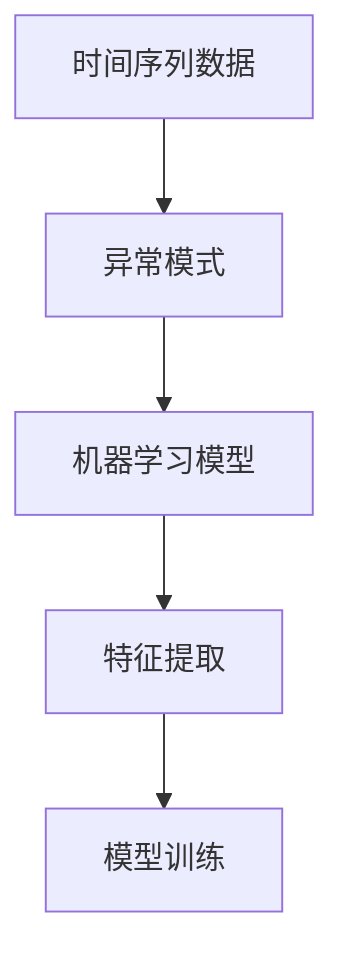
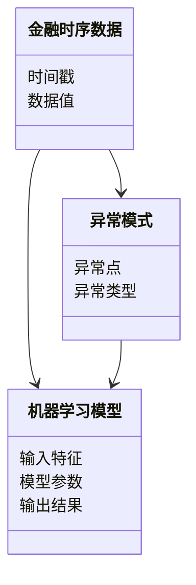
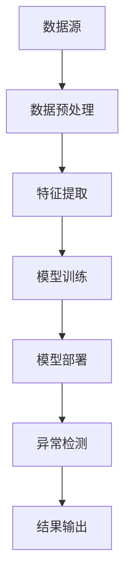
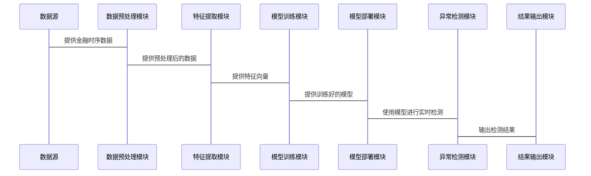

                 


# 开发智能化的金融时序数据异常模式识别模型

> 关键词：金融时序数据、异常模式识别、机器学习、深度学习、LSTM、Isolation Forest

> 摘要：本文系统地探讨了开发智能化的金融时序数据异常模式识别模型的核心方法与实践。从金融数据的特性与应用场景出发，详细阐述了异常模式识别的核心概念与联系，深入分析了基于机器学习与深度学习的异常检测算法原理与实现，结合实际案例展示了系统架构设计与项目实战，并总结了最佳实践与未来研究方向。本文旨在为金融领域的技术人员提供一份从理论到实践的全面指南。

---

## 第一部分: 金融时序数据异常模式识别模型的背景与核心概念

### 第1章: 金融时序数据异常模式识别的背景与挑战

#### 1.1 金融数据的特性与应用场景

金融数据具有高度的时间依赖性和复杂性，其波动性、周期性和趋势性使得时序数据异常模式识别成为一项具有挑战性的任务。以下是金融数据的主要特性：

- **连续性**：金融数据通常按时间顺序记录，形成连续的时间序列。
- **周期性**：许多金融数据（如股票价格、汇率）表现出明显的周期性波动。
- **波动性**：金融市场的波动性较高，异常事件往往伴随着剧烈的价格波动。
- **复杂性**：金融数据可能受到多种因素的影响，如经济指标、政策变化、市场情绪等。

金融时序数据异常模式识别的主要应用场景包括：

- **风险管理**：识别异常交易或市场波动，防范金融风险。
- **投资决策**：通过识别异常模式，帮助投资者做出更明智的投资决策。
- **欺诈检测**：发现异常交易行为，防止金融欺诈。

#### 1.2 异常模式识别的重要性

在金融领域，异常模式识别是确保市场公平、防范风险的重要工具。例如：

- **市场操纵**：识别异常交易行为，防止市场操纵。
- **突发事件**：识别突发事件引发的异常波动，提前采取应对措施。
- **系统性风险**：通过识别全局异常模式，评估系统性风险。

#### 1.3 现有方法的局限性

传统的统计方法（如Z-score、Moving Average）在处理复杂金融数据时存在以下局限性：

- **假设的局限性**：假设数据服从某种分布（如正态分布），在实际金融市场中并不成立。
- **单变量分析**：难以捕捉多变量之间的复杂关系。
- **计算复杂性**：难以处理大规模、高频金融数据。

### 第2章: 金融时序数据异常模式识别的核心概念与联系

#### 2.1 核心概念与原理

- **时间序列数据**：按时间顺序排列的数据，具有连续性、周期性和趋势性。
- **异常模式**：数据中的异常点或模式，可能表现为孤立点、突变、周期性变化等。
- **机器学习模型**：用于模式识别的算法，包括监督学习、无监督学习和半监督学习。

#### 2.2 核心概念对比与ER实体关系图

##### 2.2.1 核心概念对比表格

| 概念         | 定义                                                                 | 属性                |
|--------------|----------------------------------------------------------------------|---------------------|
| 时间序列数据 | 按时间顺序排列的数据，如股票价格、汇率等。                          | 连续性、时序性、周期性 |
| 异常模式     | 数据中的异常点或模式，可能由突发事件或市场操纵引起。                  | 突发性、局部性、全局性 |
| 机器学习模型 | 用于模式识别的算法，如LSTM、Isolation Forest等。                      | 监督学习、无监督学习、半监督学习 |

##### 2.2.2 ER实体关系图



---

## 第二部分: 异常模式识别算法原理与实现

### 第3章: 异常模式识别算法原理与实现

#### 3.1 算法原理

##### 3.1.1 基于机器学习的异常检测算法

- **基于监督学习的算法**：如随机森林、SVM，适用于有标签数据。
- **基于无监督学习的算法**：如K-Means、Isolation Forest，适用于无标签数据。

##### 3.1.2 基于深度学习的异常检测算法

- **基于RNN的算法**：如LSTM，适用于捕捉时间序列中的长-term依赖关系。
- **基于CNN的算法**：如1D-CNN，适用于捕捉局部模式。

##### 3.1.3 算法的优缺点对比

| 算法类型          | 优点                     | 缺点                     |
|-------------------|--------------------------|--------------------------|
| 基于监督学习的算法 | 高准确性                   | 需要大量标注数据         |
| 基于无监督学习的算法 | 无需标注数据               | 准确性较低                 |
| 基于深度学习的算法 | 强大学习能力，捕捉复杂模式 | 计算资源消耗大             |

#### 3.2 算法实现流程

##### 3.2.1 数据预处理

- **数据清洗**：处理缺失值、异常值。
- **标准化/归一化**：将数据转换到统一尺度。
- **滑动窗口技术**：提取时间序列的局部特征。

##### 3.2.2 特征提取

- **统计特征**：如均值、标准差、自相关系数。
- **频域特征**：如傅里叶变换后的频域特征。
- **时域特征**：如趋势、周期性。

##### 3.2.3 模型训练

- **基于监督学习的模型**：使用有标签数据训练分类器。
- **基于无监督学习的模型**：使用聚类算法发现异常簇。
- **基于深度学习的模型**：使用LSTM或1D-CNN训练时序模型。

##### 3.2.4 模型评估与优化

- **评估指标**：如准确率、召回率、F1分数。
- **超参数优化**：使用网格搜索或随机搜索优化模型性能。

#### 3.3 算法实现代码示例

##### 3.3.1 使用LSTM实现异常检测

```python
import numpy as np
from tensorflow.keras.models import Sequential
from tensorflow.keras.layers import LSTM, Dense, Dropout

# 示例数据：股票价格时间序列
data = np.array([1, 2, 3, 4, 5, 6, 7, 8, 9, 10, 11, 12, 13, 14, 15])

# 数据预处理
def create_dataset(data, window_size=5):
    X = []
    Y = []
    for i in range(len(data) - window_size):
        X.append(data[i:i+window_size])
        Y.append(data[i+window_size])
    return np.array(X), np.array(Y)

X, Y = create_dataset(data)

# LSTM模型构建
model = Sequential()
model.add(LSTM(50, return_sequences=True, input_shape=(5, 1)))
model.add(LSTM(50, return_sequences=False))
model.add(Dense(1))

model.compile(loss='mean_squared_error', optimizer='adam')
model.fit(X, Y, epochs=100, batch_size=1)

# 预测异常值
predicted = model.predict(X)
# 比较实际值和预测值，判断异常
threshold = 0.2
anomalies = np.where(abs(predicted - Y) > threshold, True, False)
```

##### 3.3.2 LSTM模型的数学公式

LSTM的细胞状态更新公式为：

$$
f_t = \sigma(W_f \cdot [h_{t-1}, x_t] + b_f)
$$

$$
i_t = \sigma(W_i \cdot [h_{t-1}, x_t] + b_i)
$$

$$
o_t = \sigma(W_o \cdot [h_{t-1}, x_t] + b_o)
$$

$$
c_t = f_t \cdot c_{t-1} + i_t \cdot tanh(W_c \cdot [h_{t-1}, x_t] + b_c)
$$

$$
h_t = o_t \cdot tanh(c_t)
$$

其中，$f_t$ 是遗忘门，$i_t$ 是输入门，$o_t$ 是输出门，$c_t$ 是细胞状态，$h_t$ 是隐藏状态。

---

## 第三部分: 系统分析与架构设计方案

### 第4章: 金融时序数据异常模式识别系统架构设计

#### 4.1 系统功能设计

##### 4.1.1 领域模型类图



##### 4.1.2 系统架构设计



##### 4.1.3 系统接口设计

- **输入接口**：接收金融时序数据，如股票价格、交易量。
- **输出接口**：输出异常检测结果，如异常点、异常类型。

##### 4.1.4 系统交互设计



---

## 第四部分: 项目实战

### 第5章: 金融时序数据异常模式识别项目实战

#### 5.1 项目背景与目标

本项目旨在开发一个智能化的金融时序数据异常模式识别系统，目标是通过机器学习与深度学习算法，实现对金融数据的实时监控与异常检测。

#### 5.2 核心代码实现

##### 5.2.1 数据加载与预处理

```python
import pandas as pd
import numpy as np
from sklearn.model_selection import train_test_split

# 加载数据
data = pd.read_csv('financial_data.csv')
data = data['price'].values

# 数据预处理
def create_dataset(data, window_size=5):
    X = []
    Y = []
    for i in range(len(data) - window_size):
        X.append(data[i:i+window_size])
        Y.append(data[i+window_size])
    return np.array(X), np.array(Y)

X, Y = create_dataset(data)
X_train, X_test, Y_train, Y_test = train_test_split(X, Y, test_size=0.2)
```

##### 5.2.2 模型训练与评估

```python
from tensorflow.keras.models import Sequential
from tensorflow.keras.layers import LSTM, Dense, Dropout

# 模型构建
model = Sequential()
model.add(LSTM(50, return_sequences=True, input_shape=(5, 1)))
model.add(LSTM(50, return_sequences=False))
model.add(Dense(1))
model.compile(loss='mean_squared_error', optimizer='adam')

# 训练模型
model.fit(X_train, Y_train, epochs=100, batch_size=1, validation_data=(X_test, Y_test))

# 评估模型
loss = model.evaluate(X_test, Y_test)
print(f"损失: {loss}")
```

##### 5.2.3 异常检测与可视化

```python
# 预测异常值
predicted = model.predict(X_test)
threshold = 0.2
anomalies = np.where(abs(predicted - Y_test) > threshold, True, False)

# 可视化
import matplotlib.pyplot as plt

plt.plot(Y_test, label='实际值')
plt.plot(predicted, label='预测值')
plt.plot(anomalies, label='异常点')
plt.legend()
plt.show()
```

#### 5.3 实际案例分析

通过实际案例分析，验证模型的异常检测能力。例如，识别某只股票在特定时间点的异常波动，并分析其原因。

#### 5.4 项目总结与优化

总结项目成果，分析模型的优缺点，并提出优化方向，如引入更多特征、优化模型结构等。

---

## 第五部分: 最佳实践与未来展望

### 第6章: 最佳实践与未来展望

#### 6.1 小结

本文系统地探讨了金融时序数据异常模式识别模型的开发方法，从背景与核心概念、算法原理与实现、系统架构设计到项目实战，为读者提供了一套完整的解决方案。

#### 6.2 注意事项

- 数据预处理是关键，需仔细处理缺失值和异常值。
- 特征提取需结合业务场景，选择合适的特征。
- 模型评估需结合业务目标，选择合适的评估指标。

#### 6.3 拓展阅读

- 《时间序列分析：方法与应用》
- 《深度学习实战：金融时间序列预测》
- 《机器学习在金融领域的应用》

---

## 作者

作者：AI天才研究院/AI Genius Institute & 禅与计算机程序设计艺术/Zen And The Art of Computer Programming

