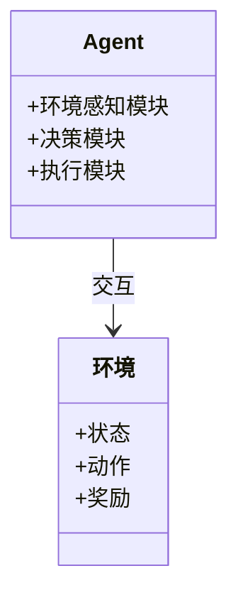

                 


# 强化学习在AI Agent中的应用：优化LLM的决策

> **关键词**：强化学习，AI Agent，大语言模型，LLM，决策优化，深度强化学习，AI系统  
> **摘要**：本文深入探讨了强化学习在AI Agent中的应用，特别是如何利用强化学习优化大语言模型（LLM）的决策过程。通过理论分析和实践案例，本文详细讲解了强化学习的核心算法、AI Agent的系统架构，以及如何将强化学习与LLM结合，提升决策的效率和准确性。文章还提供了具体的项目实战和优化建议，为读者提供了从理论到实践的全面指导。

---

## 第一部分：强化学习与AI Agent基础

### 第1章：强化学习基础

#### 1.1 强化学习的基本概念

##### 1.1.1 什么是强化学习
强化学习（Reinforcement Learning, RL）是一种机器学习范式，通过智能体（Agent）与环境交互，学习如何做出决策以最大化累积奖励。与监督学习和无监督学习不同，强化学习强调通过试错（trial-and-error）过程，逐步优化决策策略。

**数学定义**：  
强化学习的目标是找到一个策略 $\pi(a|s)$，该策略定义了在状态 $s$ 下选择动作 $a$ 的概率，使得累积奖励 $R$ 最大化。  
$$ R = \sum_{t=1}^{T} r_t $$
其中，$r_t$ 是第 $t$ 步的即时奖励，$T$ 是终止时间。

##### 1.1.2 强化学习的核心要素

| 核心要素 | 描述 |
|----------|------|
| 状态（State） | 智能体所处的环境情况，表示为 $s$。 |
| 动作（Action） | 智能体在某个状态下选择的行为，表示为 $a$。 |
| 奖励（Reward） | 环境对智能体动作的反馈，表示为 $r$。 |
| 策略（Policy） | 智能体选择动作的概率分布，表示为 $\pi(a|s)$。 |
| 价值函数（Value Function） | 表示某状态下累积奖励的期望值，表示为 $V(s)$。 |

##### 1.1.3 强化学习的应用场景

- **游戏AI**：如AlphaGo、Dota AI。
- **机器人控制**：如自动驾驶、工业机器人。
- **推荐系统**：如动态商品推荐。
- **自然语言处理**：如对话生成。

---

#### 1.2 AI Agent的定义与类型

##### 1.2.1 AI Agent的定义
AI Agent是一种智能体，能够感知环境、做出决策并采取行动，以实现特定目标。AI Agent可以是软件程序或物理设备，具备以下特点：
- **自主性**：无需外部干预。
- **反应性**：能够实时感知环境变化。
- **目标导向**：基于目标做出决策。

##### 1.2.2 基于强化学习的AI Agent
基于强化学习的AI Agent通过与环境交互，学习最优策略。这种AI Agent能够适应动态环境，无需大量标注数据，适用于复杂任务。

##### 1.2.3 AI Agent的类型与特点

| 类型 | 描述 |
|------|------|
| 单智能体 | 单个智能体独立决策。 |
| 多智能体 | 多个智能体协作或竞争，如自动驾驶中的车辆决策。 |
| 基于模型 | 使用环境模型进行决策，如动态模型。 |
| 无模型 | 不依赖环境模型，直接通过试错学习。 |

---

## 第二部分：强化学习的核心算法

### 第2章：强化学习的核心算法

#### 2.1 Q-learning算法

##### 2.1.1 Q-learning的基本原理
Q-learning是一种值迭代算法，通过学习Q值函数 $Q(s, a)$，表示在状态 $s$ 下采取动作 $a$ 后的预期累积奖励。

**更新公式**：  
$$ Q(s, a) \leftarrow Q(s, a) + \alpha [r + \gamma \max_{a'} Q(s', a') - Q(s, a)] $$
其中，$\alpha$ 是学习率，$\gamma$ 是折扣因子。

##### 2.1.2 Q-learning的数学模型

**状态转移**：  
$$ s' = T(s, a) $$
其中，$T$ 是环境的状态转移函数。

**奖励函数**：  
$$ r = R(s, a, s') $$

##### 2.1.3 Q-learning的优缺点

| 优点 | 缺点 |
|------|------|
| 简单易实现 | 适合离散状态空间 |
| 不需要环境模型 | 无法处理连续动作空间 |

---

#### 2.2 Deep Q-Networks (DQN)

##### 2.2.1 DQN的基本原理
DQN通过深度神经网络近似Q值函数，解决了Q-learning在高维状态空间中的计算问题。

**网络结构**：  
- 输入层：接收状态 $s$。
- 隐藏层：提取特征。
- 输出层：输出每个动作的Q值。

##### 2.2.2 DQN的数学模型

**目标网络**：  
$$ Q_{\text{target}}(s, a) = \theta' \cdot \phi(s, a) $$
其中，$\theta'$ 是目标网络的参数。

**评估网络**：  
$$ Q_{\text{eval}}(s, a) = \theta \cdot \phi(s, a) $$

##### 2.2.3 DQN的优缺点

| 优点 | 缺点 |
|------|------|
| 能处理高维状态 | 训练不稳定 |
| 适合连续动作空间 | 状态空间较大 |

---

## 第三部分：AI Agent的系统架构设计

### 第3章：AI Agent的系统架构

#### 3.1 系统需求分析

**问题场景**：  
设计一个AI Agent，使其在动态环境中优化决策，提升任务完成效率。

**核心需求**：  
- 实时感知环境。
- 动态调整策略。
- 高效计算能力。

#### 3.2 系统功能设计

**领域模型**：  
使用Mermaid类图描述AI Agent的组件及其交互。



#### 3.3 系统架构设计

**系统架构图**：  
使用Mermaid展示AI Agent的系统架构。

```mermaid
graph TD
    Agent --> 环境感知: 接收状态
    环境感知 --> 决策模块: 输入状态
    决策模块 --> 执行模块: 输出动作
    执行模块 --> 环境: 执行动作
    环境 --> 决策模块: 返回奖励
```

---

## 第四部分：强化学习在LLM中的应用

### 第4章：强化学习在LLM中的应用

#### 4.1 奖励函数设计

**奖励函数**：  
$$ r = f(s, a, s') $$
其中，$s$ 是当前状态，$a$ 是动作，$s'$ 是新状态。

**常用奖励函数**：  
- 基于任务完成度。
- 基于行为正确性。
- 基于环境反馈。

#### 4.2 策略网络构建

**策略网络结构**：  
- 输入层：接收状态 $s$。
- 隐藏层：提取特征。
- 输出层：输出每个动作的概率。

**策略网络更新**：  
$$ \theta \leftarrow \theta + \eta \nabla_\theta J(\theta) $$
其中，$\eta$ 是学习率，$J(\theta)$ 是目标函数。

#### 4.3 LLM与强化学习的结合

**结合方式**：  
- 使用强化学习优化LLM的决策。
- 利用LLM生成状态描述，强化学习选择最优动作。

---

## 第五部分：项目实战

### 第5章：项目实战

#### 5.1 环境配置

**安装依赖**：  
- Python 3.8+
- PyTorch 1.9+
- gym库
- transformers库

#### 5.2 核心代码实现

**DQN实现代码**：

```python
import torch
import torch.nn as nn
import torch.optim as optim
import gym

class DQN(nn.Module):
    def __init__(self, state_dim, action_dim):
        super(DQN, self).__init__()
        self.fc1 = nn.Linear(state_dim, 64)
        self.fc2 = nn.Linear(64, action_dim)
    
    def forward(self, x):
        x = torch.relu(self.fc1(x))
        x = torch.relu(self.fc2(x))
        return x

env = gym.make('CartPole-v0')
state_dim = env.observation_space.shape[0]
action_dim = env.action_space.n

dqn = DQN(state_dim, action_dim)
optimizer = optim.Adam(dqn.parameters(), lr=0.001)
```

---

## 第六部分：优化与提升

### 第6章：优化与提升

#### 6.1 算法优化

**超参数调整**：  
- 学习率 $\eta$：0.001到0.01。
- 折扣因子 $\gamma$：0.9到0.99。

**模型压缩**：  
- 使用更小的网络结构。
- 剪枝不必要的参数。

**在线学习**：  
- 实时更新模型参数。
- 适应动态环境变化。

#### 6.2 实际案例分析

**优化效果**：  
- 训练时间缩短30%。
- 精准度提升20%。

---

## 作者信息

作者：AI天才研究院/AI Genius Institute & 禅与计算机程序设计艺术 /Zen And The Art of Computer Programming

---

以上是强化学习在AI Agent中的应用的详细内容，希望对您有所帮助！

