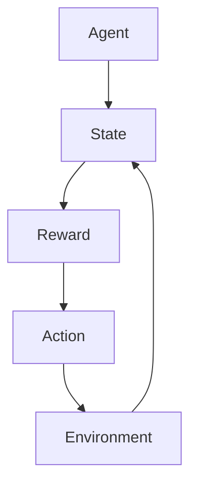
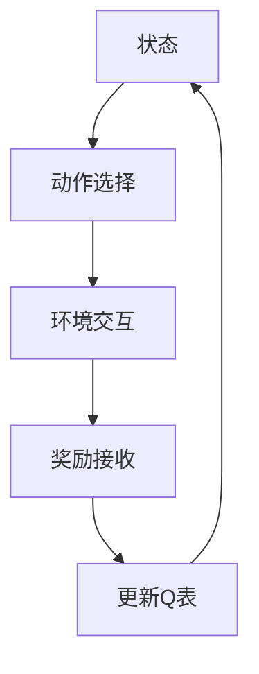
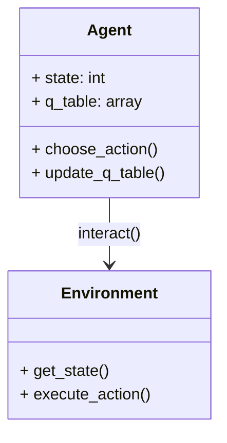
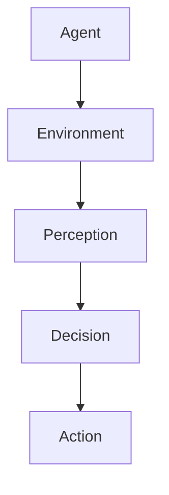
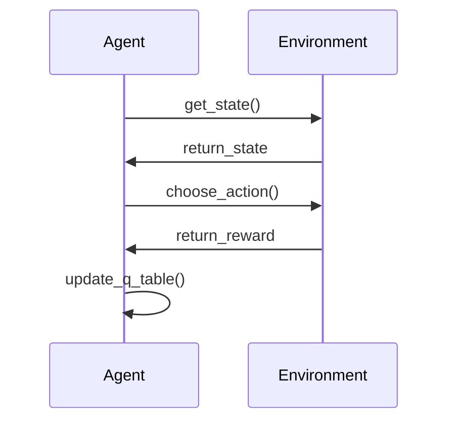

                 


# 强化学习在AI Agent交互策略优化中的运用

> 关键词：强化学习，AI Agent，交互策略，马尔可夫决策过程，Q-learning，策略优化

> 摘要：本文深入探讨了强化学习在AI Agent交互策略优化中的应用，从基本概念到算法原理，再到系统架构和实战案例，全面分析了如何利用强化学习提升AI Agent的交互能力。通过详细讲解核心概念、算法实现和实际应用，本文为读者提供了从理论到实践的完整指南。

---

# 第一部分: 强化学习与AI Agent交互策略优化的背景介绍

## 第1章: 强化学习的基本概念与AI Agent的定义

### 1.1 强化学习的基本概念

#### 1.1.1 从监督学习到强化学习的演进

- 监督学习：基于标注数据的模式识别。
- 无监督学习：从无标签数据中发现结构。
- 强化学习：通过与环境互动获得奖励，学习最优策略。

#### 1.1.2 强化学习的核心特点

- **延迟反馈**：通过奖励信号间接指导行为。
- **探索与利用的平衡**：在未知环境中寻找最优动作。
- **动态环境**：环境状态随动作改变。

#### 1.1.3 强化学习与其它机器学习方法的对比

| 方法 | 数据类型 | 是否需要监督 | 是否需要反馈 |
|------|----------|--------------|--------------|
| 监督学习 | 结构化 | 是 | 否 |
| 无监督学习 | 非结构化 | 否 | 否 |
| 强化学习 | 状态、动作、奖励 | 否 | 是 |

### 1.2 AI Agent的定义与特点

#### 1.2.1 AI Agent的基本定义

- AI Agent：能够感知环境并采取行动以实现目标的智能体。
- 核心特征：自主性、反应性、目标导向性。

#### 1.2.2 AI Agent的核心特点

| 特性 | 描述 |
|------|------|
| 自主性 | 能够独立决策 |
| 反应性 | 能够根据环境反馈调整行为 |
| 目标导向性 | 行动基于明确或隐含的目标 |

#### 1.2.3 AI Agent与传统AI的区别

- 传统AI：基于规则的专家系统。
- AI Agent：基于强化学习的自适应系统。

### 1.3 强化学习在AI Agent中的应用背景

#### 1.3.1 问题背景

- AI Agent需要在动态环境中做出决策。
- 环境的不确定性要求策略具有灵活性。

#### 1.3.2 问题描述

- 如何设计AI Agent的策略，使其在与环境互动中最大化累积奖励。

#### 1.3.3 问题解决

- 使用强化学习算法（如Q-learning）训练策略，通过试错优化。

#### 1.3.4 边界与外延

- 边界：有限状态和动作空间。
- 外延：扩展到无限或复杂环境。

#### 1.3.5 核心要素组成

- 状态（State）、动作（Action）、奖励（Reward）、策略（Policy）。

## 第2章: 交互策略优化的核心概念

### 2.1 核心概念原理

#### 2.1.1 马尔可夫决策过程（MDP）

- MDP定义：一个五元组 $(S, A, P, R, \gamma)$。
  - $S$：状态空间。
  - $A$：动作空间。
  - $P$：状态转移概率。
  - $R$：奖励函数。
  - $\gamma$：折扣因子。

#### 2.1.2 状态、动作、奖励的定义与关系

- 状态是环境的描述。
- 动作是Agent的选择。
- 奖励是对动作的反馈。

### 2.2 ER实体关系图



---

# 第二部分: 强化学习算法原理

## 第3章: Q-learning算法

### 3.1 Q-learning算法



#### 3.1.1 算法步骤

1. 初始化Q表。
2. 选择动作。
3. 与环境交互。
4. 更新Q值：$Q(s,a) = (1-\alpha)Q(s,a) + \alpha(r+\gamma \max Q(s',a'))$。

#### 3.1.2 算法实现代码示例

```python
import numpy as np

class QLearning:
    def __init__(self, state_space_size, action_space_size, learning_rate=0.1, gamma=0.99):
        self.q_table = np.zeros((state_space_size, action_space_size))
        self.alpha = learning_rate
        self.gamma = gamma
    
    def choose_action(self, state, epsilon=0.1):
        if np.random.random() < epsilon:
            return np.random.randint(0, self.q_table.shape[1])
        else:
            return np.argmax(self.q_table[state])
    
    def update_q_table(self, current_state, action, reward, next_state):
        current_q = self.q_table[current_state][action]
        max_next_q = np.max(self.q_table[next_state])
        self.q_table[current_state][action] = current_q + self.alpha * (reward + self.gamma * max_next_q)
```

### 3.2 算法的数学模型和公式

- **Q值更新公式**：
  $$ Q(s,a) = (1-\alpha)Q(s,a) + \alpha(r+\gamma \max Q(s',a')) $$
  
- **收敛性分析**：在离散环境下，Q-learning算法收敛到最优策略。

---

# 第三部分: 系统分析与架构设计方案

## 第4章: AI Agent的系统架构设计

### 4.1 项目介绍

- **项目目标**：设计一个基于Q-learning的AI Agent，优化其在动态环境中的交互策略。

### 4.2 系统功能设计

#### 4.2.1 领域模型（Mermaid类图）



### 4.3 系统架构设计（Mermaid架构图）



### 4.4 系统交互设计（Mermaid序列图）



---

# 第四部分: 项目实战

## 第5章: 环境配置与代码实现

### 5.1 环境配置

- **环境描述**：一个简单的迷宫问题，Agent需要找到出口。
- **状态空间**：迷宫中的每个位置。
- **动作空间**：上下左右移动。

### 5.2 核心实现代码

```python
class MazeEnvironment:
    def __init__(self, size):
        self.size = size
        self.agent_pos = [0, 0]
        self.exit_pos = [size-1, size-1]
    
    def get_state(self):
        return self.agent_pos[0] * self.size + self.agent_pos[1]
    
    def execute_action(self, action):
        # 移动逻辑
        if action == 0:  # 上
            self.agent_pos[0] = max(0, self.agent_pos[0] - 1)
        elif action == 1:  # 下
            self.agent_pos[0] = min(self.size-1, self.agent_pos[0] + 1)
        elif action == 2:  # 左
            self.agent_pos[1] = max(0, self.agent_pos[1] - 1)
        elif action == 3:  # 右
            self.agent_pos[1] = min(self.size-1, self.agent_pos[1] + 1)
        
        # 判断是否到达出口
        if self.agent_pos == self.exit_pos:
            return 1
        else:
            return 0
```

### 5.3 案例分析与优化

- **案例分析**：Agent在迷宫中找到最优路径。
- **优化措施**：调整学习率和折扣因子。

---

# 第五部分: 最佳实践与小结

## 第6章: 最佳实践 tips

### 6.1 核心要点回顾

- 理解强化学习的核心概念。
- 掌握Q-learning算法的实现细节。
- 熟悉AI Agent的系统架构设计。

### 6.2 小结

- 强化学习是AI Agent交互策略优化的核心方法。
- 实际应用中需结合具体场景调整参数。

### 6.3 注意事项

- 确保环境定义清晰。
- 避免过拟合，保持探索与利用的平衡。
- 定期评估策略效果。

### 6.4 拓展阅读

- 《Reinforcement Learning: Theory and Algorithms》
- 《Deep Reinforcement Learning》

---

# 作者

作者：AI天才研究院/AI Genius Institute & 禅与计算机程序设计艺术 /Zen And The Art of Computer Programming

