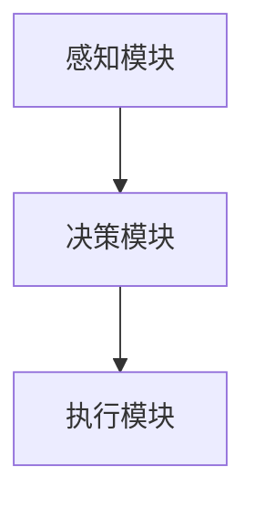

                 


# 强化学习在AI Agent人机协作中的应用

> 关键词：强化学习、AI Agent、人机协作、协作任务、强化学习算法、系统架构

> 摘要：本文详细探讨了强化学习在AI Agent人机协作中的应用，从强化学习的基本概念到AI Agent的设计与实现，再到人机协作的建模与优化，系统地分析了强化学习在人机协作中的理论基础和实际应用。文章结合具体案例，详细讲解了强化学习的算法实现和系统架构设计，最后通过项目实战，展示了如何将强化学习应用于实际的人机协作场景中。

---

## 第1章: 强化学习的基本概念与核心要素

### 1.1 强化学习的定义与特点

#### 1.1.1 什么是强化学习
强化学习（Reinforcement Learning, RL）是一种机器学习范式，其中智能体通过与环境交互来学习如何采取行动以最大化累积的奖励。与监督学习和无监督学习不同，强化学习不需要明确的标签数据，而是通过与环境的互动来获得经验。

#### 1.1.2 强化学习的核心特点
- **试错性**：智能体通过不断尝试不同的动作，逐步学习最优策略。
- **延迟奖励**：奖励可能在动作之后的多个步骤后才出现，智能体需要具备记忆能力。
- **不确定性**：环境可能具有不确定性，智能体需要在不确定的环境中做出决策。

#### 1.1.3 强化学习与监督学习、无监督学习的区别
- **监督学习**：基于有标签的数据进行学习，目标是预测标签。
- **无监督学习**：基于无标签的数据进行学习，目标是发现数据的结构。
- **强化学习**：基于与环境的互动进行学习，目标是通过最大化累积奖励来优化策略。

### 1.2 AI Agent的基本概念

#### 1.2.1 什么是AI Agent
AI Agent（人工智能代理）是一种能够感知环境、自主决策并采取行动的智能实体。AI Agent可以是软件程序、机器人或其他智能系统。

#### 1.2.2 AI Agent的核心功能与类型
- **核心功能**：
  - 感知环境：通过传感器或其他输入方式感知环境状态。
  - 决策与行动：基于感知的信息，做出决策并采取行动。
  - 学习与优化：通过与环境的互动，不断优化自身的决策策略。
- **类型**：
  - **反应式AI Agent**：基于当前感知做出即时反应，不依赖历史信息。
  - **认知式AI Agent**：具备复杂推理和规划能力，能够根据目标和环境信息做出决策。

#### 1.2.3 AI Agent在人机协作中的角色
AI Agent在人机协作中充当桥梁的角色，负责理解和执行用户的指令，同时与环境或其他智能体进行互动，实现协作任务的目标。

---

## 第2章: 强化学习的核心概念与数学模型

### 2.1 强化学习的数学模型

#### 2.1.1 状态空间与动作空间
- **状态空间（State Space）**：所有可能的状态的集合，状态描述了环境的当前情况。
- **动作空间（Action Space）**：所有可能的动作的集合，动作是智能体可以采取的行动。

#### 2.1.2 奖励机制与折扣因子
- **奖励机制（Reward Mechanism）**：智能体在每个时间步采取动作后，会获得一个奖励值，奖励反映了智能体行为的好坏。
- **折扣因子（Discount Factor）**：用于调整未来奖励的价值，通常用$\gamma$表示，取值范围在0到1之间。

#### 2.1.3 策略与价值函数
- **策略（Policy）**：描述智能体在每个状态下采取的动作的概率分布。
- **价值函数（Value Function）**：衡量某个状态下采取某种动作的期望累积奖励。

### 2.2 强化学习的核心算法

#### 2.2.1 Q-learning算法
Q-learning是一种经典的强化学习算法，适用于离散动作空间和状态空间。其核心思想是通过更新Q表（Q-table）来学习最优策略。

**算法流程：**
1. 初始化Q表为零。
2. 在每个时间步，智能体根据当前状态选择一个动作。
3. 执行动作，观察新的状态和获得的奖励。
4. 更新Q表：$Q(s, a) = Q(s, a) + \alpha [r + \gamma \max Q(s', a') - Q(s, a)]$，其中$\alpha$是学习率。

#### 2.2.2 策略梯度方法
策略梯度方法直接优化策略，通过梯度上升或下降来更新策略参数。

**数学公式：**
$$ \theta \leftarrow \theta + \alpha \nabla_\theta J(\theta) $$
其中，$J(\theta)$是目标函数，通常为策略的期望累积奖励。

#### 2.2.3 Actor-Critic架构
Actor-Critic架构结合了策略梯度和价值函数的优势，通过同时优化策略和价值函数来实现更稳定的训练。

**算法流程：**
1. 初始化策略网络和价值网络。
2. 在每个时间步，策略网络（Actor）根据当前状态生成动作。
3. 价值网络（Critic）评估当前状态和动作的Q值。
4. 根据Q值更新策略网络，优化动作选择。

---

## 第3章: AI Agent的协作机制与任务分配

### 3.1 多智能体协作的基本原理

#### 3.1.1 多智能体协作的定义
多智能体协作是指多个智能体通过合作共同完成任务，每个智能体负责不同的子任务或角色。

#### 3.1.2 协作任务的分配策略
- **基于角色的分配**：根据任务需求分配不同的角色，每个角色负责特定的任务。
- **基于能力的分配**：根据智能体的能力和当前状态分配任务。

#### 3.1.3 协作中的通信与协调
智能体之间需要通过通信来共享信息，协调行动，确保协作任务的顺利进行。

### 3.2 基于强化学习的协作策略

#### 3.2.1 协作任务的建模
- **任务建模**：将协作任务分解为多个子任务，每个子任务由一个智能体负责。
- **奖励机制**：设计合理的奖励机制，激励智能体之间的协作。

#### 3.2.2 基于Q-learning的协作学习
通过多智能体协作学习，智能体之间通过共享信息和经验，逐步优化协作策略。

#### 3.2.3 联合策略优化方法
联合策略优化方法通过优化多个智能体的策略，实现协作任务的全局最优。

---

## 第4章: 人机协作任务的建模与优化

### 4.1 任务建模的基本方法

#### 4.1.1 状态空间的构建
根据协作任务的特点，构建合适的状态空间，确保智能体能够感知任务的状态。

#### 4.1.2 动作空间的设计
设计合适的动作空间，确保智能体能够采取有效的行动。

#### 4.1.3 奖励函数的定义
定义合理的奖励函数，激励智能体采取正确的行动。

### 4.2 基于强化学习的协作优化

#### 4.2.1 协作任务的优化目标
通过优化协作任务的目标函数，实现协作任务的最优解。

#### 4.2.2 基于强化学习的优化算法
使用强化学习算法对协作任务进行优化，确保智能体之间的协作效果。

#### 4.2.3 优化过程中的挑战与解决方案
- **挑战**：智能体之间的通信和协调问题。
- **解决方案**：通过设计合理的奖励机制和通信协议，解决协作中的通信问题。

---

## 第5章: 强化学习的算法实现

### 5.1 算法实现的步骤

#### 5.1.1 环境搭建
选择合适的强化学习框架，如OpenAI Gym，搭建实验环境。

#### 5.1.2 算法实现
实现强化学习算法的核心部分，包括策略网络和价值网络的训练。

#### 5.1.3 算法优化
通过调整超参数和优化算法，提升算法的性能和效果。

### 5.2 算法实现的代码示例

#### 5.2.1 DQN算法实现
```python
class DQN:
    def __init__(self, state_space, action_space, gamma=0.99, epsilon=1.0, eps_min=0.01, eps_decay=0.995, lr=0.001):
        self.state_space = state_space
        self.action_space = action_space
        self.gamma = gamma
        self.epsilon = epsilon
        self.eps_min = eps_min
        self.eps_decay = eps_decay
        self.lr = lr
        
        self.q_network = self.build_network()
        self.target_network = self.build_network()
        
    def build_network(self):
        model = Sequential()
        model.add(Dense(32, activation='relu', input_dim=self.state_space))
        model.add(Dense(32, activation='relu'))
        model.add(Dense(self.action_space, activation='linear'))
        model.compile(loss='mean_squared_error', optimizer=Adam(lr=self.lr))
        return model
```

#### 5.2.2 算法优化
通过经验回放和目标网络的更新，提升DQN算法的稳定性和收敛速度。

---

## 第6章: 人机协作系统的架构与设计

### 6.1 系统功能设计

#### 6.1.1 系统功能模块
- **感知模块**：负责感知环境状态。
- **决策模块**：负责根据感知信息做出决策。
- **执行模块**：负责执行决策的动作。

#### 6.1.2 系统功能流程
1. 感知模块获取环境状态。
2. 决策模块根据状态做出决策。
3. 执行模块执行决策动作。

### 6.2 系统架构设计

#### 6.2.1 系统架构图


#### 6.2.2 系统接口设计
定义系统各模块之间的接口，确保模块之间的通信和协作。

---

## 第7章: 项目实战

### 7.1 项目介绍

#### 7.1.1 项目背景
选择一个具体的协作任务，例如智能客服中的协作任务。

#### 7.1.2 项目目标
通过强化学习实现智能客服中的协作任务，提升服务质量和效率。

### 7.2 项目实现

#### 7.2.1 环境搭建
安装必要的库和框架，搭建实验环境。

#### 7.2.2 核心实现
实现强化学习算法的核心部分，包括策略网络和价值网络的训练。

#### 7.2.3 代码实现
提供详细的代码实现，展示如何将强化学习应用于实际场景中。

### 7.3 案例分析

#### 7.3.1 实验结果
展示实验结果，分析算法的性能和效果。

#### 7.3.2 案例总结
总结项目实施的经验和教训，提出改进建议。

---

## 第8章: 总结与展望

### 8.1 总结

#### 8.1.1 强化学习的核心作用
强化学习在AI Agent人机协作中发挥着核心作用，通过与环境的互动，智能体能够不断优化自身的决策策略。

#### 8.1.2 人机协作的未来发展
随着技术的进步，人机协作将更加智能化和高效化，强化学习将在其中发挥越来越重要的作用。

### 8.2 展望

#### 8.2.1 未来的挑战
- **复杂环境的处理**：如何在复杂的环境中实现高效的协作。
- **多智能体协作的优化**：如何进一步优化多智能体协作的算法和机制。

#### 8.2.2 未来的发展方向
- **强化学习的进一步发展**：探索更高效的强化学习算法。
- **人机协作的创新应用**：将强化学习应用于更多的领域和场景。

---

## 作者：AI天才研究院/AI Genius Institute & 禅与计算机程序设计艺术 /Zen And The Art of Computer Programming

---

通过以上目录结构和内容安排，您可以逐步撰写完整的文章。每一章的内容都需要结合具体的案例和详细的代码实现，确保文章的深度和实用性。希望这篇目录结构对您有所帮助！

