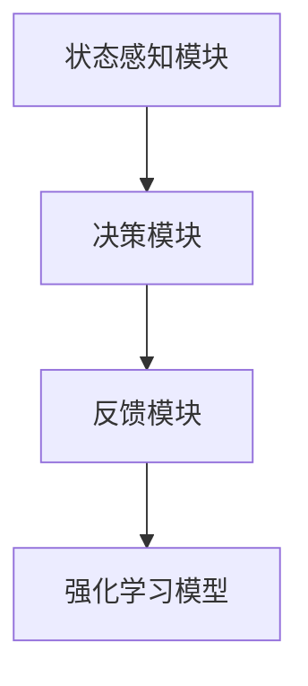

                 


# 强化学习在AI Agent决策优化中的应用

> 关键词：强化学习, AI Agent, 决策优化, Q-learning, 策略梯度, 深度强化学习, 多智能体协作

> 摘要：本文将深入探讨强化学习在AI Agent决策优化中的应用，从强化学习的基础概念到AI Agent的决策过程，再到具体的算法实现和系统架构设计，全面解析强化学习如何助力AI Agent做出更优决策。通过实际案例分析和系统设计，帮助读者理解并掌握强化学习在AI Agent中的核心作用。

---

# 第一部分: 强化学习基础

## 第1章: 强化学习基本概念

### 1.1 强化学习的定义与特点

#### 1.1.1 什么是强化学习
强化学习是一种机器学习范式，通过智能体与环境的交互，智能体通过试错的方式学习策略，以最大化累积奖励。与监督学习不同，强化学习不需要标注数据，而是通过奖励信号来指导学习过程。

#### 1.1.2 强化学习的核心特点
- **自主性**：智能体根据当前状态和历史经验做出决策。
- **试错性**：通过不断尝试动作，逐步逼近最优策略。
- **延迟反馈**：奖励通常不是即时的，而是基于长期目标的。
- **不确定性**：环境可能具有随机性和不可预测性。

#### 1.1.3 强化学习与监督学习的区别
| 特性 | 监督学习 | 强化学习 |
|------|----------|----------|
| 数据 | 标签数据 | 奖励信号 |
| 目标 | 分类/回归 | 最大化累积奖励 |
| 决策 | 确定性 | 概率性 |
| 交互 | 无 | 有 |

### 1.2 强化学习的基本元素

#### 1.2.1 状态（State）
状态是环境在某一时刻的描述，表示智能体所处的环境情况。例如，在迷宫导航问题中，状态可以是智能体所在的位置。

#### 1.2.2 动作（Action）
动作是智能体在给定状态下可以执行的操作。例如，在迷宫导航中，动作可以是“上、下、左、右”。

#### 1.2.3 奖励（Reward）
奖励是智能体执行动作后获得的反馈，用于衡量动作的好坏。奖励通常是一个标量值，正数表示好，负数表示差。

#### 1.2.4 策略（Policy）
策略是智能体选择动作的规则。策略可以是确定性的（如贪心策略）或概率性的（如随机策略）。

#### 1.2.5 值函数（Value Function）
值函数用于衡量某个状态下采取某种动作后的预期累积奖励。例如，Q(s, a) 表示在状态 s 下执行动作 a 后的预期奖励。

### 1.3 强化学习的核心问题

#### 1.3.1 最大化累积奖励
智能体的目标是通过选择一系列动作，使累积奖励最大化。

#### 1.3.2 探索与利用的平衡
在强化学习中，智能体需要在探索新动作（以发现更好的策略）和利用已知的好动作之间找到平衡。

#### 1.3.3 马尔可夫决策过程（MDP）
马尔可夫决策过程是一种数学模型，用于描述强化学习问题。它包括状态、动作、转移概率和奖励函数。

---

## 第2章: 强化学习的数学模型

### 2.1 马尔可夫决策过程（MDP）的定义

#### 2.1.1 状态空间
状态空间 S 是所有可能状态的集合。

#### 2.1.2 动作空间
动作空间 A 是所有可能动作的集合。

#### 2.1.3 转移概率
转移概率 P(s' | s, a) 表示在状态 s 下执行动作 a 后转移到状态 s' 的概率。

#### 2.1.4 奖励函数
奖励函数 r(s, a, s') 表示在状态 s 下执行动作 a 并转移到状态 s' 后获得的奖励。

### 2.2 值函数与策略的数学表达

#### 2.2.1 状态值函数（V(s)）
状态值函数 V(s) 表示在状态 s 下，按照当前策略 π 采取行动后的预期累积奖励。

$$ V(s) = \mathbb{E}[R_t | s_t = s, \pi] $$

#### 2.2.2 状态-动作值函数（Q(s,a)）
状态-动作值函数 Q(s, a) 表示在状态 s 下执行动作 a 后的预期累积奖励。

$$ Q(s, a) = \mathbb{E}[R_t | s_t = s, a_t = a, \pi] $$

#### 2.2.3 策略的数学表示
策略 π 可以是确定性的或概率性的。概率性策略 π(a|s) 表示在状态 s 下选择动作 a 的概率。

### 2.3 动态规划与强化学习的关系

#### 2.3.1 动态规划的基本概念
动态规划是一种通过分解问题来求解最优解的方法，常用于强化学习中计算值函数。

#### 2.3.2 强化学习中的动态规划方法
动态规划可以用于计算值函数，从而优化策略。例如，值迭代和策略迭代是两种常见的动态规划方法。

---

## 第3章: 强化学习的经典算法

### 3.1 Q-learning算法

#### 3.1.1 Q-learning的基本原理
Q-learning是一种基于值函数的强化学习算法，通过更新 Q 表来逼近最优策略。

#### 3.1.2 Q-learning的更新公式
$$ Q(s, a) = Q(s, a) + \alpha (r + \gamma \max Q(s', a') - Q(s, a)) $$

其中：
- α 是学习率
- γ 是折扣因子
- r 是即时奖励

### 3.2 策略梯度方法

#### 3.2.1 策略梯度的基本思想
策略梯度方法通过直接优化策略的参数，使得累积奖励最大化。

#### 3.2.2 策略梯度的数学推导
$$ \nabla J(\theta) = \mathbb{E}[ \nabla \log \pi_\theta(a|s) Q(s,a) ] $$

其中：
- J(θ) 是累积奖励的期望
- π_θ(a|s) 是策略的参数化表示
- Q(s, a) 是状态-动作值函数

### 3.3 深度强化学习

#### 3.3.1 DQN算法的原理
DQN（Deep Q-Network）是一种结合深度学习和强化学习的算法，通过神经网络近似 Q 函数。

#### 3.3.2 DQN的网络结构与训练流程
DQN 使用两个神经网络：主网络和目标网络。主网络用于选择动作，目标网络用于计算目标值。

---

# 第二部分: AI Agent决策优化

## 第4章: AI Agent的基本概念

### 4.1 AI Agent的定义与分类

#### 4.1.1 什么是AI Agent
AI Agent 是能够感知环境并采取行动以实现目标的智能体。

#### 4.1.2 AI Agent的分类
- **简单反射型 Agent**：基于当前状态做出反应。
- **基于模型的 Agent**：维护环境的内部模型，用于规划和决策。
- **目标驱动型 Agent**：根据目标选择最优动作。

### 4.2 AI Agent的决策过程

#### 4.2.1 决策的基本流程
1. 状态感知
2. 状态分析
3. 动作选择
4. 执行动作
5. 反馈收集

#### 4.2.2 决策过程中的强化学习应用
AI Agent 的决策过程可以通过强化学习算法优化。

---

## 第5章: 基于强化学习的AI Agent决策优化

### 5.1 强化学习在AI Agent中的应用

#### 5.1.1 状态表示
将环境状态转换为强化学习中的状态表示。

#### 5.1.2 动作空间设计
设计适合强化学习的动作空间。

#### 5.1.3 奖励机制设计
设计合理的奖励机制以引导 AI Agent 的行为。

### 5.2 多智能体协作中的强化学习

#### 5.2.1 多智能体协作的挑战
- 状态空间的复杂性
- 动作空间的复杂性
- 协作策略的优化

#### 5.2.2 多智能体协作中的强化学习算法
- **MAPO**：多智能体策略优化算法
- **QMIX**：基于 Q 值的多智能体协作算法

---

# 第三部分: 系统分析与架构设计

## 第6章: 系统功能设计

### 6.1 问题场景介绍
设计一个 AI Agent 系统，用于优化某个特定任务的决策过程。

### 6.2 系统功能设计
- **状态感知模块**：感知环境状态。
- **决策模块**：基于强化学习算法选择动作。
- **反馈模块**：收集奖励并更新模型。

### 6.3 系统架构设计
使用 Mermaid 绘制系统架构图：



---

## 第7章: 系统实现

### 7.1 环境安装
安装必要的库，如 TensorFlow 和 Gym。

### 7.2 系统核心实现源代码
```python
import numpy as np
import gym

class AI-Agent:
    def __init__(self, env):
        self.env = env
        self.state_space = env.observation_space
        self.action_space = env.action_space

    def perceive(self):
        state = self.env.observation()
        return state

    def decide(self, state):
        # 假设使用Q-learning算法
        if np.random.rand() < 0.1:
            action = np.random.randint(self.action_space.n)
        else:
            action = np.argmax(self.Q[state])
        return action

    def update(self, state, action, reward):
        next_state = self.env.step(action)
        self.Q[state][action] = self.Q[state][action] + 0.1 * (reward + 0.99 * np.max(self.Q[next_state]) - self.Q[state][action])

agent = AI-Agent(env)
```

---

## 第8章: 实际案例分析

### 8.1 案例分析
分析一个具体的强化学习应用案例，如机器人导航。

### 8.2 详细讲解剖析
解释案例中的强化学习算法实现和优化过程。

---

## 第9章: 项目小结

### 9.1 最佳实践 tips
- 合理设计奖励机制
- 平衡探索与利用
- 选择合适的算法

### 9.2 注意事项
- 确保环境的稳定性
- 避免过拟化
- 定期监控和调整策略

---

## 第10章: 总结与展望

### 10.1 总结
本文详细介绍了强化学习在AI Agent决策优化中的应用，从理论到实践，全面解析了强化学习的核心概念和算法实现。

### 10.2 展望
未来，强化学习在AI Agent中的应用将更加广泛，特别是在多智能体协作和复杂决策任务中。

---

作者：AI天才研究院/AI Genius Institute & 禅与计算机程序设计艺术 /Zen And The Art of Computer Programming

