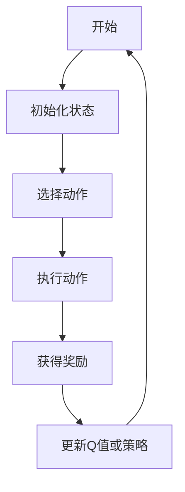

                 


# 强化学习在AI Agent对话策略中的应用

## 关键词：强化学习，AI Agent，对话策略，机器学习，自然语言处理

## 摘要：  
本文深入探讨了强化学习在AI Agent对话策略中的应用，从理论基础到算法实现，再到实际应用，全面分析了强化学习如何优化对话系统的行为策略。文章首先介绍了强化学习的基本概念和对话系统的背景，然后详细讲解了强化学习的核心算法及其在对话策略中的数学模型。接着，通过对实际对话场景的分析，展示了如何设计高效的对话系统架构，并结合项目实战，详细阐述了强化学习在对话策略优化中的具体实现方法。最后，文章总结了当前研究的进展与挑战，并展望了未来的研究方向。

---

# 第1章: 强化学习与AI Agent对话策略的背景

## 1.1 强化学习的基本概念

### 1.1.1 强化学习的定义与核心概念  
强化学习（Reinforcement Learning, RL）是一种机器学习范式，通过智能体与环境的交互来学习最优策略。其核心概念包括：  
- **状态（State）**：环境在某一时刻的观察。  
- **动作（Action）**：智能体在给定状态下采取的行为。  
- **奖励（Reward）**：智能体在采取动作后获得的反馈，用于衡量动作的好坏。  
- **策略（Policy）**：智能体在给定状态下选择动作的概率分布。  
- **价值函数（Value Function）**：衡量某个状态下智能体能够获得的预期奖励。

### 1.1.2 强化学习的基本原理  
强化学习的核心是通过试错（trial and error）不断优化策略，使智能体在与环境交互的过程中获得最大化的累计奖励。智能体通过感知环境状态，采取相应动作，并根据获得的奖励调整策略，最终达到最优行为。

### 1.1.3 强化学习与监督学习、无监督学习的区别  
- **监督学习**：基于标注数据，学习输入到输出的映射关系。  
- **无监督学习**：基于未标注数据，发现数据中的潜在结构。  
- **强化学习**：通过与环境交互，基于奖励信号优化策略。

## 1.2 AI Agent对话系统的定义与特点

### 1.2.1 AI Agent对话系统的定义  
AI Agent对话系统是一种能够与用户进行自然语言交互的智能系统，通过理解和生成人类语言，帮助用户完成特定任务或提供信息。

### 1.2.2 对话系统的类型与应用场景  
- **任务导向型对话系统**：专注于完成特定任务（如客服、订单处理）。  
- **开放域对话系统**：支持广泛的主题和自由对话（如智能音箱、聊天机器人）。  

### 1.2.3 对话系统的核心挑战  
- **语义理解**：准确理解用户的意图和情感。  
- **对话策略**：生成连贯且符合逻辑的回复。  
- **知识表示**：管理对话历史和上下文信息。

## 1.3 强化学习在对话策略中的应用背景

### 1.3.1 对话策略优化的必要性  
对话系统的性能依赖于策略的优化，而强化学习是一种有效的策略优化方法。

### 1.3.2 强化学习在对话策略优化中的优势  
- **端到端优化**：强化学习可以直接优化对话行为，无需明确的规则。  
- **动态适应**：能够根据对话进展调整策略。  

## 1.4 本章小结  
本章介绍了强化学习的基本概念和对话系统的定义，分析了强化学习在对话策略优化中的应用背景和优势。

---

# 第2章: 强化学习的核心概念与数学基础

## 2.1 强化学习的核心概念

### 2.1.1 状态、动作、奖励的定义  
- **状态（State）**：对话系统当前的上下文信息。  
- **动作（Action）**：系统在给定状态下生成的回复。  
- **奖励（Reward）**：用户对系统回复的反馈（如满意度评分）。  

### 2.1.2 策略与价值函数的定义  
- **策略（Policy）**：在给定状态下选择动作的概率分布。  
- **价值函数（Value Function）**：衡量某个状态下能够获得的累计奖励。  

### 2.1.3 马尔可夫决策过程（MDP）的定义  
MDP是一个强化学习的基本模型，由状态空间、动作空间、转移概率和奖励函数组成。

## 2.2 强化学习的数学模型

### 2.2.1 Q-learning的数学表达  
Q-learning的目标是学习Q值函数，表示在状态s和动作a下的最大预期奖励：  
$$ Q(s, a) = r + \gamma \max_{a'} Q(s', a') $$  

### 2.2.2 策略梯度方法的数学推导  
策略梯度方法通过优化策略的参数，使累积奖励最大化：  
$$ \theta = \theta + \alpha \nabla_\theta J(\theta) $$  

### 2.2.3 动态规划与近似动态规划的对比  
动态规划基于精确的状态转移模型，而近似动态规划使用经验或样本近似模型。

## 2.3 常用强化学习算法的对比

### 2.3.1 Q-learning与DQN的对比  
- **Q-learning**：离线学习，直接更新Q值。  
- **DQN**：使用经验回放和网络近似，适合高维状态空间。  

### 2.3.2 Actor-Critic方法的对比  
Actor-Critic方法同时优化策略和价值函数，适用于连续动作空间。  

### 2.3.3 策略梯度方法的对比  
策略梯度方法直接优化策略参数，适用于高维状态空间。

## 2.4 本章小结  
本章详细讲解了强化学习的核心概念和数学模型，为后续对话策略优化奠定了基础。

---

# 第3章: 对话系统的强化学习建模

## 3.1 对话系统的状态表示

### 3.1.1 基于文本的对话状态表示  
- **词袋模型**：基于词语的出现频率。  
- **词嵌入模型**：如Word2Vec、GloVe。  

### 3.1.2 基于向量的对话状态表示  
- **向量空间模型**：将对话历史表示为向量。  
- **注意力机制**：聚焦于关键部分。  

### 3.1.3 基于图的对话状态表示  
- **知识图谱**：构建领域知识图谱。  
- **对话图**：记录对话历史的依赖关系。  

## 3.2 对话系统的动作空间设计

### 3.2.1 动作空间的定义  
- **离散动作空间**：如预定义的回复选项。  
- **连续动作空间**：如生成任意文本回复。  

### 3.2.2 动作空间的维度分析  
动作空间的维度影响算法的复杂度和效率。

## 3.3 对话系统的奖励机制设计

### 3.3.1 基于用户反馈的奖励设计  
- **直接反馈**：如用户满意度评分。  
- **间接反馈**：如对话长度、用户沉默时间。  

### 3.3.2 基于任务完成度的奖励设计  
- **任务完成奖励**：任务成功时给予高奖励。  
- **过程奖励**：逐步给予奖励。  

## 3.4 对话系统强化学习的算法实现

### 3.4.1 算法流程图（使用mermaid）  


### 3.4.2 Python代码实现  
```python
import numpy as np

class DQN:
    def __init__(self, state_space, action_space):
        self.state_space = state_space
        self.action_space = action_space
        self.gamma = 0.99
        self.epsilon = 0.1
        # 初始化Q值矩阵
        self.Q = np.zeros((state_space, action_space))
    
    def choose_action(self, state):
        if np.random.random() < self.epsilon:
            return np.random.randint(self.action_space)
        else:
            return np.argmax(self.Q[state, :])
    
    def update_Q(self, state, action, reward, next_state):
        self.Q[state, action] = reward + self.gamma * np.max(self.Q[next_state, :])
```

## 3.5 本章小结  
本章详细讲解了对话系统的状态表示、动作空间和奖励机制，并通过mermaid流程图和Python代码展示了强化学习算法的实现。

---

# 第4章: 强化学习算法优化与实际应用

## 4.1 强化学习算法优化策略

### 4.1.1 离线与在线学习的对比  
- **离线学习**：基于历史数据更新模型。  
- **在线学习**：实时与环境交互更新模型。  

### 4.1.2 奖励函数设计的优化  
- **多目标奖励**：结合多个奖励指标。  
- **动态奖励**：根据对话进展调整奖励权重。  

## 4.2 强化学习在对话策略中的实际应用

### 4.2.1 任务导向型对话系统  
- **场景**：订单处理、客户支持。  
- **挑战**：准确理解用户需求。  

### 4.2.2 开放域对话系统  
- **场景**：智能音箱、聊天机器人。  
- **挑战**：保持对话连贯性。  

## 4.3 对话系统性能评估指标

### 4.3.1 基于任务完成度的指标  
- **任务完成率**：任务完成的成功比例。  
- **任务耗时**：完成任务所需的时间。  

### 4.3.2 基于用户反馈的指标  
- **用户满意度评分**：用户的主观反馈。  
- **对话长度**：对话的平均长度。  

## 4.4 本章小结  
本章分析了强化学习算法的优化策略，并结合实际应用场景，探讨了对话系统性能的评估指标。

---

# 第5章: 高级主题与未来研究方向

## 5.1 多轮对话中的强化学习

### 5.1.1 多轮对话的特点  
- **对话历史依赖性**：需要考虑之前的对话内容。  
- **动态上下文理解**：根据对话进展调整策略。  

### 5.1.2 多轮对话中的挑战  
- **长期依赖**：如何保持对话的连贯性。  
- **上下文模糊性**：如何处理不明确的信息。  

## 5.2 多智能体协作对话系统

### 5.2.1 多智能体对话系统的特点  
- **分工合作**：不同智能体负责不同的任务。  
- **协同学习**：智能体之间共享信息和策略。  

### 5.2.2 多智能体对话系统的优势  
- **任务效率**：通过协作提高任务完成效率。  
- **知识互补**：利用不同智能体的知识优势。  

## 5.3 个性化对话策略

### 5.3.1 个性化对话的定义  
- **用户偏好**：根据用户的偏好调整对话内容。  
- **用户画像**：基于用户数据构建画像。  

### 5.3.2 个性化对话策略的实现  
- **动态策略调整**：根据用户反馈实时调整策略。  
- **用户分群**：针对不同用户群定制策略。  

## 5.4 本章小结  
本章探讨了强化学习在多轮对话、多智能体协作和个性化策略中的应用，并展望了未来的研究方向。

---

# 附录: 强化学习框架与工具

## 附录A: 常用强化学习框架

### A.1 TensorFlow  
- **特点**：支持端到端的模型开发。  
- **适用场景**：适合复杂的对话系统。  

### A.2 PyTorch  
- **特点**：动态计算图支持。  
- **适用场景**：适合快速实验和研究。  

### A.3 OpenAI Gym  
- **特点**：提供丰富的环境库。  
- **适用场景**：强化学习算法的快速验证。  

## 附录B: 强化学习相关论文推荐

### B.1 经典论文  
- **"Deep Reinforcement Learning for Dialogue Systems"**  
- **"End-to-End Dialogue Systems with Reinforcement Learning"**  

### B.2 最新研究  
- **"Hierarchical Reinforcement Learning for Multi-Domain Dialogue Systems"**  
- **"Reinforcement Learning with Human Feedback for Dialogue Generation"**  

---

# 结语

强化学习作为一种强大的机器学习技术，正在深刻改变AI Agent对话策略的设计与优化。通过本文的探讨，我们不仅了解了强化学习的核心概念和算法，还看到了其在实际对话系统中的广泛应用。未来，随着强化学习技术的不断发展，对话系统将更加智能化和个性化，为人类与机器的交互带来更多的可能性。

---

# 作者：AI天才研究院/AI Genius Institute & 禅与计算机程序设计艺术 /Zen And The Art of Computer Programming

