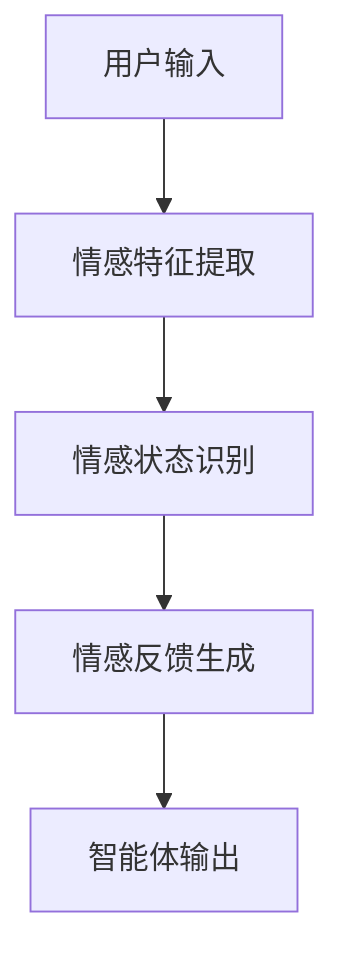

                 


# 强化学习在AI Agent情感计算中的创新应用

> 关键词：强化学习、情感计算、AI Agent、机器学习、人机交互

> 摘要：本文探讨了强化学习在AI Agent情感计算中的创新应用。首先介绍了强化学习和情感计算的基本概念及其在AI Agent中的重要性。接着详细分析了强化学习的核心原理和算法，包括Q-learning、Deep Q-Network（DQN）和策略梯度方法。然后，本文深入探讨了情感计算系统的架构设计，包括功能模块、系统架构图和接口设计。最后，通过实际项目案例展示了强化学习在情感计算中的应用，并总结了未来的研究方向。

---

# 第一部分: 强化学习与AI Agent情感计算的背景介绍

## 第1章: 强化学习与情感计算概述

### 1.1 强化学习的基本概念

#### 1.1.1 强化学习的定义与特点
强化学习是一种机器学习范式，通过智能体与环境的交互，学习如何通过执行动作来最大化累积奖励。其特点包括：
- **目标导向性**：智能体通过最大化累积奖励来学习最优策略。
- **在线学习**：智能体通过与环境实时交互进行学习。
- **适应性**：智能体能够根据环境反馈调整行为。

#### 1.1.2 强化学习的核心要素：状态、动作、奖励
- **状态（State）**：智能体所处环境的当前情况。
- **动作（Action）**：智能体在给定状态下选择的行为。
- **奖励（Reward）**：智能体执行动作后获得的反馈，用于指导学习方向。

#### 1.1.3 强化学习与监督学习、无监督学习的区别
- **监督学习**：基于标记的训练数据进行学习。
- **无监督学习**：从无标记数据中发现模式。
- **强化学习**：通过与环境交互，基于奖励信号学习最优策略。

### 1.2 情感计算的定义与应用

#### 1.2.1 情感计算的定义
情感计算（Affective Computing）是研究如何构建能够识别、理解和响应人类情感的计算机系统。

#### 1.2.2 情感计算的主要应用领域
- **人机交互**：改善用户体验，如智能助手、虚拟客服。
- **心理健康**：通过情感分析帮助识别抑郁、焦虑等心理问题。
- **教育技术**：根据学生情感状态调整教学策略。

#### 1.2.3 情感计算与人机交互的关系
情感计算通过理解用户情感，使交互更加自然和高效。

### 1.3 AI Agent的基本概念

#### 1.3.1 AI Agent的定义
AI Agent是具有感知和行动能力的智能实体，能够自主决策并执行任务。

#### 1.3.2 AI Agent的核心功能与分类
- **核心功能**：感知环境、决策、执行动作。
- **分类**：简单反射型、基于模型的反应型、目标驱动型、效用驱动型。

#### 1.3.3 AI Agent在情感计算中的作用
AI Agent通过情感计算理解用户情感，提供更智能化的服务。

### 1.4 本章小结
本章介绍了强化学习、情感计算和AI Agent的基本概念及其在情感计算中的应用。

---

# 第二部分: 强化学习与情感计算的核心概念与联系

## 第2章: 强化学习的核心原理

### 2.1 强化学习的数学模型

#### 2.1.1 状态空间的表示
状态空间表示智能体可能遇到的所有状态，通常用集合S表示。

#### 2.1.2 动作空间的表示
动作空间表示智能体在给定状态下可执行的所有动作，通常用集合A表示。

#### 2.1.3 奖励函数的设计
奖励函数$r: S \times A \rightarrow \mathbb{R}$，定义智能体在状态s执行动作a后获得的奖励。

#### 2.1.4 策略函数的定义
策略函数$\pi(a|s)$表示在状态s下选择动作a的概率。

### 2.2 强化学习的算法原理

#### 2.2.1 Q-learning算法的原理
Q-learning算法通过更新Q值表来学习最优策略：
$$ Q(s, a) = Q(s, a) + \alpha (r + \gamma \max Q(s', a') - Q(s, a)) $$

#### 2.2.2 Deep Q-Network（DQN）算法的原理
DQN算法结合Q-learning和深度学习，使用神经网络近似Q函数：
$$ Q(s, a) = \theta \cdot \phi(s, a) $$

#### 2.2.3 策略梯度方法（Policy Gradient）的原理
策略梯度方法通过优化策略的参数来最大化期望奖励：
$$ \nabla \theta J(\theta) = \mathbb{E}_{s,a}[\nabla \log \pi_\theta(a|s) Q(s,a)] $$

### 2.3 强化学习与情感计算的联系

#### 2.3.1 情感计算在强化学习中的应用
情感计算用于设计奖励函数，使智能体更好地理解用户情感。

#### 2.3.2 强化学习在情感计算中的创新点
通过强化学习，AI Agent能够根据用户情感反馈调整行为，实现更自然的交互。

#### 2.3.3 两者结合的数学模型
结合强化学习和情感计算，构建情感驱动的强化学习模型。

### 2.4 本章小结
本章详细讲解了强化学习的核心原理及其与情感计算的联系。

---

# 第三部分: 强化学习在情感计算中的算法实现

## 第3章: 基于强化学习的情感计算算法

### 3.1 Q-learning算法在情感计算中的应用

#### 3.1.1 Q-learning算法的数学公式
$$ Q(s, a) = Q(s, a) + \alpha (r + \gamma \max Q(s', a') - Q(s, a)) $$

#### 3.1.2 Q-learning算法在情感计算中的实现步骤
1. 初始化Q值表。
2. 与用户交互，获取情感反馈。
3. 更新Q值表，最大化累积奖励。

#### 3.1.3 Q-learning算法的优缺点分析
- 优点：简单易实现。
- 缺点：在复杂环境中表现不佳。

### 3.2 Deep Q-Network（DQN）算法的实现

#### 3.2.1 DQN算法的数学模型
$$ Q(s, a) = \theta \cdot \phi(s, a) $$

#### 3.2.2 DQN算法的网络结构设计
- 输入层：处理情感特征。
- 隐藏层：提取高阶特征。
- 输出层：预测Q值。

#### 3.2.3 DQN算法在情感计算中的应用案例
通过DQN算法训练AI Agent理解用户情感，优化交互策略。

### 3.3 策略梯度方法在情感计算中的应用

#### 3.3.1 策略梯度方法的数学公式
$$ \nabla \theta J(\theta) = \mathbb{E}_{s,a}[\nabla \log \pi_\theta(a|s) Q(s,a)] $$

#### 3.3.2 策略梯度方法的网络结构设计
- 输入层：处理情感特征。
- 隐藏层：提取高阶特征。
- 输出层：生成动作概率分布。

#### 3.3.3 策略梯度方法在情感计算中的优势
- 更直接优化策略，避免Q值估计误差。

### 3.4 本章小结
本章详细讲解了Q-learning、DQN和策略梯度方法在情感计算中的应用。

---

# 第四部分: 情感计算系统的架构与设计

## 第4章: 情感计算系统的架构设计

### 4.1 情感计算系统的功能模块

#### 4.1.1 情感特征提取模块
提取用户情感特征，如语调、语速、词汇选择。

#### 4.1.2 情感状态识别模块
识别用户当前情感状态，如快乐、悲伤、愤怒。

#### 4.1.3 情感反馈生成模块
根据情感状态生成适当的反馈，如安慰、鼓励。

### 4.2 情感计算系统的架构图


### 4.3 情感计算系统的接口设计

#### 4.3.1 输入接口
接收用户输入，如文本、语音、表情。

#### 4.3.2 输出接口
生成情感反馈，如文本、语音、图像。

### 4.4 情感计算系统的交互设计

#### 4.4.1 情感反馈生成流程
1. 提取情感特征。
2. 识别情感状态。
3. 生成情感反馈。

#### 4.4.2 情感反馈生成案例
用户输入“我感到很沮丧”，系统识别并生成“我可以帮助你缓解压力”。

### 4.5 本章小结
本章详细设计了情感计算系统的架构和接口。

---

# 第五部分: 项目实战与总结

## 第5章: 强化学习在情感计算中的项目实战

### 5.1 项目环境安装
安装Python、TensorFlow、Keras等开发环境。

### 5.2 系统核心实现源代码

#### 5.2.1 Q-learning实现代码
```python
import numpy as np

class QLearning:
    def __init__(self, state_space, action_space):
        self.q_table = np.zeros((state_space, action_space))
        
    def choose_action(self, state, epsilon):
        if np.random.random() < epsilon:
            return np.random.randint(0, action_space)
        else:
            return np.argmax(self.q_table[state])
    
    def update_q_table(self, state, action, reward, next_state, alpha, gamma):
        self.q_table[state, action] = self.q_table[state, action] + alpha * (reward + gamma * np.max(self.q_table[next_state]) - self.q_table[state, action])
```

#### 5.2.2 DQN实现代码
```python
import tensorflow as tf

class DQN:
    def __init__(self, input_dim, output_dim):
        self.model = tf.keras.Sequential([
            tf.keras.layers.Dense(64, activation='relu', input_dim=input_dim),
            tf.keras.layers.Dense(output_dim, activation='linear')
        ])
        self.optimizer = tf.keras.optimizers.Adam(learning_rate=0.001)
        
    def call(self, x):
        return self.model(x)
    
    def train(self, x, y, batch_size):
        with tf.GradientTape() as tape:
            y_pred = self.call(x)
            loss = tf.keras.losses.MeanSquaredError()(y, y_pred)
        gradients = tape.gradient(loss, self.model.trainable_variables)
        self.optimizer.apply_gradients(zip(gradients, self.model.trainable_variables))
```

### 5.3 项目实战案例分析
通过训练AI Agent识别用户情感并生成适当反馈，提升用户体验。

### 5.4 项目小结
本章通过实际项目展示了强化学习在情感计算中的应用。

---

## 第6章: 总结与展望

### 6.1 本章总结
本文详细探讨了强化学习在AI Agent情感计算中的创新应用，包括理论基础、算法实现和系统设计。

### 6.2 未来研究方向
- 更复杂的奖励函数设计。
- 深度强化学习在情感计算中的应用。
- 多模态情感计算的研究。

### 6.3 最佳实践 tips
- 理解用户情感需求，设计合理的奖励函数。
- 在实际应用中结合领域知识优化模型。

### 6.4 本章小结
本文总结了强化学习在情感计算中的应用，并展望了未来的研究方向。

---

# 作者：AI天才研究院/AI Genius Institute & 禅与计算机程序设计艺术 /Zen And The Art of Computer Programming

---

感谢您的阅读！如需进一步探讨或获取代码，请随时联系！

