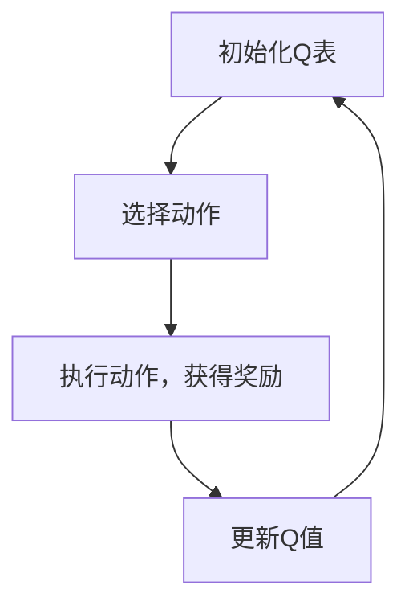

                 


# 强化学习在AI Agent自动化测试中的应用

## 关键词：强化学习, AI Agent, 自动化测试, 机器学习, 测试优化

## 摘要

本文探讨了强化学习在AI Agent自动化测试中的应用，涵盖背景、核心概念、算法实现和系统设计。通过详细分析强化学习的原理、AI Agent的架构，以及在测试场景中的应用，本文旨在提供一个全面的视角，帮助读者理解如何利用强化学习提升自动化测试的效率和效果。通过实际案例和代码示例，文章展示了强化学习算法的实现及其在系统设计中的应用。

---

# 第一章: 强化学习与AI Agent概述

## 1.1 强化学习的定义与核心概念

### 1.1.1 强化学习的基本概念

强化学习（Reinforcement Learning，RL）是一种机器学习范式，其中智能体通过与环境交互来学习最优策略。智能体通过执行动作并获得奖励或惩罚来优化其行为，目标是最大化累积奖励。

### 1.1.2 强化学习的核心要素

| 核心要素 | 描述 |
|----------|------|
| 状态（State） | 环境的当前情况 |
| 动作（Action） | 智能体采取的行为 |
| 奖励（Reward） | 对动作的反馈，指导智能体行为 |
| 策略（Policy） | 动作选择的概率分布 |
| 价值函数（Value Function） | 状态或动作的价值评估 |

### 1.1.3 AI Agent的定义与分类

AI Agent是能够感知环境并采取行动以实现目标的智能实体。分类包括基于规则的Agent和基于学习的Agent。

## 1.2 强化学习与AI Agent的关系

### 1.2.1 强化学习在AI Agent中的作用

强化学习通过试错法优化AI Agent的决策过程，使其在动态环境中做出最优选择。

### 1.2.2 AI Agent的决策过程

AI Agent通过感知环境状态，选择动作，获得奖励，并更新策略。

### 1.2.3 强化学习与监督学习的区别

| 方面 | 强化学习 | 监督学习 |
|------|---------|----------|
| 数据 | 环境反馈 | 标签数据 |
| 目标 | 最大化奖励 | 分类或回归 |

## 1.3 强化学习在自动化测试中的应用背景

### 1.3.1 自动化测试的现状与挑战

自动化测试面临测试覆盖率低、测试用例生成困难等问题。

### 1.3.2 强化学习如何解决测试问题

强化学习帮助生成高效测试用例，提高测试覆盖率和质量。

### 1.3.3 AI Agent在测试中的潜在价值

AI Agent能够自动执行测试任务，优化测试流程，提高效率。

---

# 第二章: 强化学习的核心概念与数学模型

## 2.1 强化学习的基本原理

### 2.1.1 状态空间与动作空间

状态空间是所有可能状态的集合，动作空间是所有可能动作的集合。

### 2.1.2 奖励机制与价值函数

奖励机制指导智能体行为，价值函数评估状态或动作的价值。

### 2.1.3 策略与价值函数的关系

策略决定动作选择，价值函数评估状态价值，两者相互依赖。

## 2.2 马尔可夫决策过程（MDP）

### 2.2.1 MDP的定义与组成部分

MDP由状态、动作、转移概率和奖励函数组成。

### 2.2.2 离散与连续MDP的区别

离散MDP状态和动作有限，连续MDP则无限。

### 2.2.3 MDP在强化学习中的应用

MDP为强化学习提供理论基础，用于建模决策过程。

## 2.3 强化学习的数学模型

### 2.3.1 Q-learning算法的数学表达

Q-learning的目标是学习最优Q值，公式如下：

$$ Q(s, a) = Q(s, a) + \alpha [r + \gamma \max Q(s', a') - Q(s, a)] $$

### 2.3.2 Deep Q-Network的数学模型

DQN使用深度神经网络近似Q值函数，目标是最小化损失函数：

$$ \text{损失} = \mathbb{E}[(r + \gamma Q(s', a') - Q(s, a))^2] $$

### 2.3.3 Actor-Critic架构的数学公式

Actor选择动作，Critic评估价值，两者共同优化策略：

$$ \nabla \theta = \nabla \log \pi(a|s) \cdot Q(s, a) $$

---

# 第三章: AI Agent在自动化测试中的应用

## 3.1 AI Agent的基本架构

### 3.1.1 规则驱动型Agent

基于预定义规则进行决策，适用于简单场景。

### 3.1.2 学习驱动型Agent

通过强化学习不断优化策略，适用于复杂场景。

### 3.1.3 混合驱动型Agent

结合规则和学习，提升适应性和灵活性。

## 3.2 强化学习在测试场景中的应用

### 3.2.1 测试用例生成

AI Agent通过强化学习生成高效测试用例，覆盖更多场景。

### 3.2.2 测试覆盖率优化

优化测试策略，提高测试覆盖率和质量。

### 3.2.3 测试策略选择

动态选择测试策略，适应环境变化。

## 3.3 自动化测试中的挑战与解决方案

### 3.3.1 状态空间的复杂性

通过简化状态空间或分层方法应对复杂性。

### 3.3.2 动作空间的多样性

设计合理的动作空间，避免动作过多。

### 3.3.3 奖励机制的设计

设计合理的奖励机制，引导智能体行为。

---

# 第四章: 强化学习算法的实现与优化

## 4.1 Q-learning算法的实现

### 4.1.1 算法流程图



### 4.1.2 Python代码实现

```python
import numpy as np

class QLearning:
    def __init__(self, state_space, action_space):
        self.state_space = state_space
        self.action_space = action_space
        self.Q = np.zeros((state_space, action_space))
    
    def choose_action(self, state, epsilon):
        if np.random.random() < epsilon:
            return np.random.randint(self.action_space)
        return np.argmax(self.Q[state])
    
    def update_Q(self, state, action, reward, next_state, alpha):
        self.Q[state][action] += alpha * (reward + np.max(self.Q[next_state]) - self.Q[state][action])
```

### 4.1.3 算法优化策略

使用经验回放和目标网络优化Q-learning算法。

## 4.2 Deep Q-Network的实现

### 4.2.1 DQN算法的数学模型

DQN通过神经网络近似Q值函数，公式如下：

$$ Q(s, a) = \theta \cdot \phi(s, a) $$

### 4.2.2 神经网络结构设计

输入层、隐藏层和输出层结构设计，使用ReLU激活函数。

### 4.2.3 训练过程中的技巧

使用Adam优化器，调整学习率和批量大小。

---

# 第五章: 系统分析与架构设计

## 5.1 问题场景介绍

### 5.1.1 测试平台功能模块

测试用例生成、执行、结果分析和优化模块。

### 5.1.2 系统功能设计

领域模型类图展示各模块关系。

### 5.1.3 系统架构设计

分层架构，包括前端、后端和数据库。

## 5.2 项目介绍

### 5.2.1 项目目标

提高测试效率和质量，降低测试成本。

### 5.2.2 系统架构设计

使用微服务架构，展示各组件交互关系。

### 5.2.3 系统接口设计

定义API接口，规范数据格式和交互流程。

## 5.3 系统交互设计

### 5.3.1 测试用例生成流程

AI Agent选择测试路径，生成测试用例。

### 5.3.2 测试执行流程

执行测试用例，收集结果并优化策略。

### 5.3.3 系统交互序列图

展示测试执行过程中的交互步骤。

---

# 第六章: 项目实战与最佳实践

## 6.1 环境安装

安装Python、TensorFlow和OpenAI Gym库。

## 6.2 核心实现源代码

实现Q-learning和DQN算法，展示代码结构和功能。

## 6.3 实际案例分析

分析一个实际测试项目，展示算法的应用和效果。

## 6.4 最佳实践 tips

### 6.4.1 性能优化

优化神经网络结构和训练参数。

### 6.4.2 小结

总结强化学习在自动化测试中的优势和挑战。

### 6.4.3 注意事项

注意算法的收敛性和稳定性，避免过拟合。

### 6.4.4 拓展阅读

推荐相关书籍和论文，鼓励深入学习。

---

# 作者：AI天才研究院/AI Genius Institute & 禅与计算机程序设计艺术 /Zen And The Art of Computer Programming

