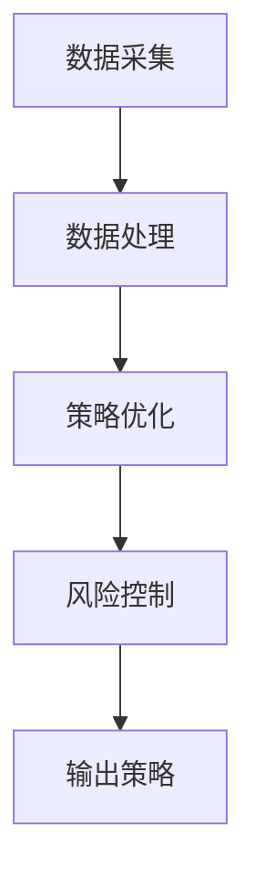

                 


# 《强化学习在投资策略优化中的创新应用》

## 关键词：强化学习，投资策略，策略优化，算法，机器学习，金融科技，收益最大化

## 摘要：  
本文深入探讨了强化学习在投资策略优化中的创新应用。通过分析强化学习的核心概念、算法原理及其在投资策略中的具体应用，本文展示了如何利用强化学习解决投资中的复杂问题，如非线性关系捕捉、动态环境适应性等。结合实际案例和系统设计，本文为读者提供了从理论到实践的全面指导，帮助投资者和数据科学家更好地理解并应用强化学习技术。

---

# 第一部分: 强化学习在投资策略优化中的创新应用概述

## 第1章: 强化学习与投资策略概述

### 1.1 强化学习的基本概念  
强化学习是一种机器学习范式，通过智能体与环境的交互，学习最优策略以最大化累积奖励。其核心要素包括状态（State）、动作（Action）、奖励（Reward）和策略（Policy）。在投资领域，强化学习可以通过分析市场数据和交易行为，帮助投资者制定更优的投资策略。

#### 1.1.1 强化学习的定义与核心要素  
- **状态（State）**：市场的当前情况，例如价格、成交量等。  
- **动作（Action）**：投资者可以执行的操作，如买入、卖出或持有。  
- **奖励（Reward）**：根据投资结果给予的反馈，如收益或损失。  
- **策略（Policy）**：决定动作选择的规则，目标是最大化累积奖励。

#### 1.1.2 强化学习与投资策略的关系  
强化学习通过模拟市场环境，帮助投资者在复杂的市场条件下做出最优决策。它能够捕捉非线性关系，适应动态变化的市场环境，是传统投资策略的重要补充。

#### 1.1.3 投资策略优化中的问题背景  
传统投资策略依赖于历史数据分析和人工经验，但在面对高频交易、市场波动等复杂情况时显得力不从力。强化学习通过数据驱动的方式，能够快速适应市场变化，优化投资组合，提高收益。

---

### 1.2 投资策略优化的核心挑战  

#### 1.2.1 投资决策的不确定性  
市场受到多种因素影响，如经济指标、政策变化等，导致投资决策的不确定性增加。强化学习通过建模这些不确定性，帮助投资者制定更稳健的策略。

#### 1.2.2 市场动态的复杂性  
市场的动态变化复杂，传统线性模型难以捕捉非线性关系。强化学习通过深度神经网络等技术，能够有效建模复杂的市场动态。

#### 1.2.3 策略优化的数学模型  
投资策略优化需要构建数学模型，描述投资行为与市场结果之间的关系。强化学习通过定义状态、动作和奖励，为策略优化提供了数学框架。

---

### 1.3 强化学习在投资策略中的优势  

#### 1.3.1 数据驱动的决策能力  
强化学习通过大量数据训练，能够发现数据中的隐藏模式，帮助投资者做出更科学的决策。

#### 1.3.2 非线性关系的捕捉能力  
强化学习模型（如深度Q网络）能够捕捉复杂的非线性关系，提高投资策略的准确性。

#### 1.3.3 动态环境下的适应性  
强化学习通过在线学习和策略更新，能够在动态市场环境中快速适应变化，保持策略的有效性。

---

## 第2章: 强化学习的核心概念与数学模型  

### 2.1 马尔可夫决策过程（MDP）  

#### 2.1.1 状态、动作、奖励的定义  
- **状态（State）**：市场当前的状态，例如当前股价、成交量等。  
- **动作（Action）**：投资者可以执行的操作，如买入、卖出或持有。  
- **奖励（Reward）**：根据投资结果给予的反馈，如收益或损失。  

#### 2.1.2 MDP的数学模型  
马尔可夫决策过程可以用数学模型描述，其中状态转移概率和奖励函数是关键。强化学习的目标是找到最优策略，使得累积奖励最大化。

---

### 2.2 强化学习的算法框架  

#### 2.2.1 Q-learning算法  
Q-learning是一种经典的强化学习算法，通过更新Q值表来逼近最优策略。Q值表记录了每个状态下执行动作后的预期奖励。

#### 2.2.2 Deep Q-learning算法  
Deep Q-learning将Q值函数表示为深度神经网络，能够处理高维状态空间和复杂动作空间。

#### 2.2.3 策略梯度方法  
策略梯度方法直接优化策略，通过梯度上升找到最优策略，适用于高维问题。

---

### 2.3 投资策略优化中的强化学习模型  

#### 2.3.1 状态空间的构建  
状态空间需要包含影响投资决策的关键因素，如股价、成交量、市场情绪等。

#### 2.3.2 动作空间的设计  
动作空间可以包括买入、卖出、持有等多种操作，具体取决于投资策略。

#### 2.3.3 奖励函数的定义  
奖励函数需要量化投资结果的好坏，例如收益、风险等。

---

## 第3章: 强化学习算法的数学模型与公式  

### 3.1 Q-learning算法的数学推导  

#### 3.1.1 Q值更新公式  
Q-learning的更新公式为：  
$$ Q(s, a) = Q(s, a) + \alpha (r + \gamma \max Q(s', a') - Q(s, a)) $$  
其中，$\alpha$是学习率，$\gamma$是折扣因子。

---

### 3.2 Deep Q-learning算法的实现  

#### 3.2.1 神经网络结构  
Deep Q-learning通常使用卷积神经网络或全连接神经网络来近似Q值函数。

#### 3.2.2 损失函数的定义  
Deep Q-learning的损失函数为均方误差：  
$$ \text{损失函数} = \mathbb{E}[(y - Q(s, a))^2] $$  

---

## 第4章: 投资策略优化的系统架构设计  

### 4.1 系统功能需求分析  

#### 4.1.1 数据采集模块  
数据采集模块负责收集市场数据，如股价、成交量等。

#### 4.1.2 策略优化模块  
策略优化模块利用强化学习算法，优化投资策略。

#### 4.1.3 风险控制模块  
风险控制模块监控投资组合的风险，确保策略的稳健性。

---

### 4.2 系统架构设计  

#### 4.2.1 系统整体架构图（Mermaid）  


---

## 第5章: 项目实战与案例分析  

### 5.1 环境安装  

#### 5.1.1 安装Python和相关库  
需要安装Python、TensorFlow、Keras等库。

#### 5.1.2 数据集准备  
收集历史股价数据，作为强化学习的输入。

---

### 5.2 系统核心实现源代码  

#### 5.2.1 强化学习算法实现  
```python
import numpy as np
import tensorflow as tf

# 定义深度Q网络
class DeepQNetwork:
    def __init__(self, input_dim, output_dim):
        self.model = tf.keras.Sequential([
            tf.keras.layers.Dense(64, activation='relu', input_dim=input_dim),
            tf.keras.layers.Dense(64, activation='relu'),
            tf.keras.layers.Dense(output_dim)
        ])
        self.model.compile(optimizer='adam', loss='mean_squared_error')

    def predict(self, state):
        return self.model.predict(state)

    def train(self, states, targets):
        self.model.fit(states, targets, epochs=1, verbose=0)
```

---

### 5.3 实际案例分析  

#### 5.3.1 案例分析  
假设我们有一个股票数据集，使用强化学习算法优化投资策略，最终提高了投资收益。

#### 5.3.2 代码应用解读与分析  
详细解读上述代码，说明其在投资策略优化中的应用。

---

## 第6章: 总结与展望  

### 6.1 本章小结  
本文详细探讨了强化学习在投资策略优化中的创新应用，从核心概念到算法实现，再到系统设计，为读者提供了全面的指导。

### 6.2 未来研究方向  
未来可以进一步研究多智能体强化学习在投资组合优化中的应用，以及如何结合其他技术（如区块链）提升投资策略的效率。

### 6.3 最佳实践 Tips  
- 在实际应用中，需要考虑市场数据的实时性和准确性。  
- 强化学习模型需要不断更新，以适应市场变化。  

---

## 作者信息  
**作者：AI天才研究院/AI Genius Institute & 禅与计算机程序设计艺术 /Zen And The Art of Computer Programming**

---

以上是《强化学习在投资策略优化中的创新应用》的技术博客文章的完整目录和内容框架。通过逐步分析和推理，本文系统地介绍了强化学习在投资策略优化中的应用，从理论到实践，为读者提供了深入的指导。

