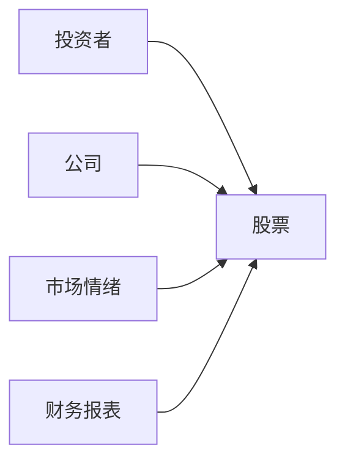
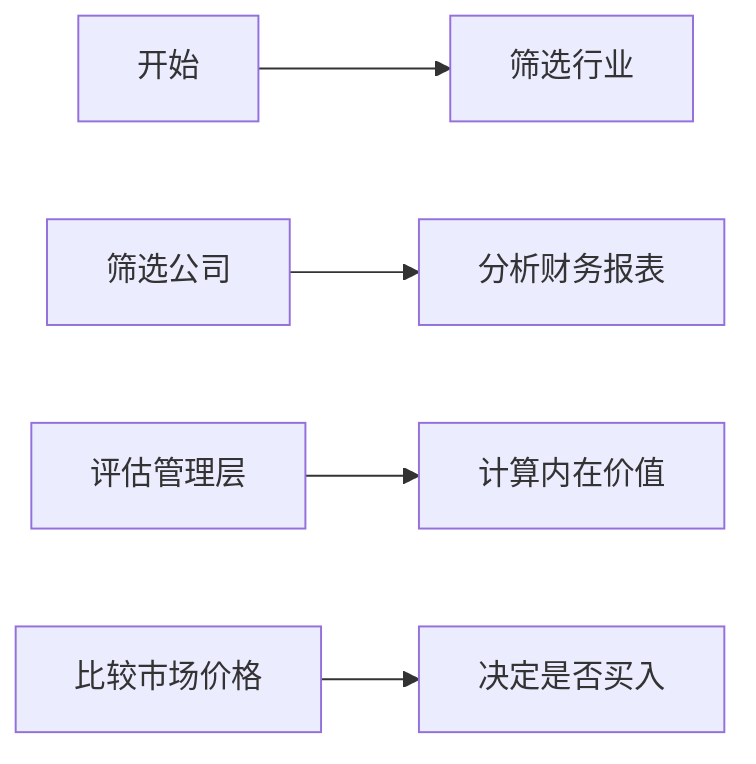
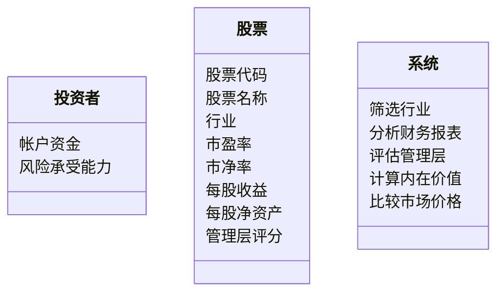
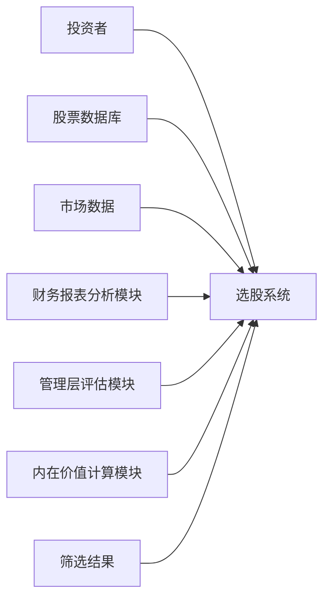
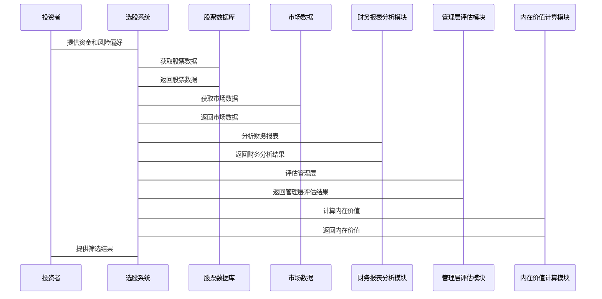

                 


# 彼得·林奇的十倍股选股法则

## 关键词：彼得·林奇, 十倍股, 选股法则, 价值投资, 股票分析

## 摘要：本文详细介绍了彼得·林奇提出的十倍股选股法则，分析了其核心概念、算法原理，并通过系统架构设计和项目实战展示了如何在实际投资中应用该法则。文章还提供了最佳实践和注意事项，帮助投资者更好地理解和应用这一选股方法。

---

## 第一部分: 十倍股的定义与背景

### 第1章: 十倍股的定义与背景

#### 1.1 十倍股的定义与特征

##### 1.1.1 十倍股的定义

十倍股是指那些能够在较长的时间内，股价增长超过十倍的股票。这类股票通常具有较高的成长性，能够在市场中持续增长，为投资者带来超额收益。

##### 1.1.2 十倍股的核心特征

十倍股的核心特征包括：

- 高成长性：公司收入和利润持续快速增长。
- 低估值：市盈率、市净率等估值指标低于行业平均水平。
- 强大的管理层：公司管理层具有良好的管理能力和战略眼光。
- 稳定的业绩：公司财务状况稳健，盈利能力强。

##### 1.1.3 十倍股与普通股票的区别

十倍股与普通股票的区别主要体现在以下几点：

- 成长性：十倍股具有更高的成长性。
- 估值：十倍股通常处于较低估值区间。
- 风险：十倍股的风险较高，但回报也更高。

#### 1.2 彼得·林奇选股法则的背景

##### 1.2.1 彼得·林奇的生平简介

彼得·林奇是美国著名的职业基金经理人，被誉为“共同基金先生”。他在富达投资集团管理麦哲伦基金期间，取得了卓越的投资业绩，管理的基金规模从1977年的2000万美元增长到1990年的140亿美元。

##### 1.2.2 十倍股选股法则的提出背景

十倍股选股法则是彼得·林奇在其投资生涯中总结出的一套选股方法，旨在帮助投资者发现那些具有高成长潜力的股票，从而实现超额收益。

##### 1.2.3 十倍股选股法则的理论基础

十倍股选股法则是基于价值投资理念，强调选择那些具有高成长性、低估值、强大管理层和良好财务状况的公司股票。

#### 1.3 十倍股选股法则的核心理念

##### 1.3.1 价值投资的核心理念

价值投资的核心理念是寻找那些市场价格低于其内在价值的股票进行投资，长期持有，等待其价值回归。

##### 1.3.2 十倍股选股法则的独特性

十倍股选股法则的独特性在于其强调成长性和估值的结合，不仅仅关注低估值，更关注公司未来的成长潜力。

##### 1.3.3 十倍股选股法则的适用范围

十倍股选股法则适用于长期投资者，尤其是那些能够承受较高风险、追求高回报的投资者。

---

## 第二部分: 十倍股的核心概念与联系

### 第2章: 十倍股的核心概念与联系

#### 2.1 十倍股的核心概念

##### 2.1.1 股票的内在价值

股票的内在价值是指公司未来现金流的现值，是衡量股票价值的重要指标。

##### 2.1.2 市场情绪与股价波动

市场情绪会影响股价的波动，但长期来看，股价主要由公司基本面决定。

##### 2.1.3 财务报表分析

财务报表分析是评估公司财务状况的重要手段，包括利润表、资产负债表和现金流量表。

#### 2.2 十倍股的核心概念对比

##### 2.2.1 十倍股与成长股的对比

| 特性 | 十倍股 | 成长股 |
|------|--------|--------|
| 成长性 | 高     | 高     |
| 估值 | 低     | 可高可低 |
| 风险 | 高     | 中高    |

##### 2.2.2 十倍股与价值股的对比

| 特性 | 十倍股 | 价值股 |
|------|--------|--------|
| 成长性 | 高     | 中     |
| 估值 | 低     | 低     |
| 风险 | 高     | 中     |

##### 2.2.3 十倍股与周期股的对比

| 特性 | 十倍股 | 周期股 |
|------|--------|--------|
| 成长性 | 高     | 中低   |
| 估值 | 低     | 可高可低 |
| 风险 | 高     | 中高    |

#### 2.3 十倍股的实体关系图



---

## 第三部分: 十倍股选股法则的算法原理

### 第3章: 十倍股选股法则的算法原理

#### 3.1 十倍股选股算法的流程



#### 3.2 十倍股选股算法的实现

```python
def select_ten_bagger(stocks):
    selected_stocks = []
    for stock in stocks:
        # 筛选行业
        if stock.industry not in ['科技', '消费']:
            continue
        # 分析财务报表
        if stock.roe < 15:
            continue
        # 评估管理层
        if stock.management_rating < 8:
            continue
        # 计算内在价值
        intrinsic_value = calculate_intrinsic_value(stock)
        # 比较市场价格
        if stock.price < intrinsic_value * 0.8:
            selected_stocks.append(stock)
    return selected_stocks
```

#### 3.3 十倍股选股法则的数学模型

##### 3.3.1 内在价值计算公式

$$
\text{内在价值} = \sum_{t=1}^{\infty} \frac{\text{现金流}_t}{(1 + r)^t}
$$

其中，\( r \) 是折现率，现金流 \( t \) 是第 \( t \) 年的现金流。

##### 3.3.2 股票估值公式

$$
\text{合理股价} = \text{内在价值} \times (1 + \text{安全边际})
$$

##### 3.3.3 市盈率与市净率

$$
\text{市盈率} = \frac{\text{股价}}{\text{每股收益}}
$$

$$
\text{市净率} = \frac{\text{股价}}{\text{每股净资产}}
$$

---

## 第四部分: 十倍股选股系统的架构设计

### 第4章: 十倍股选股系统的架构设计

#### 4.1 系统功能设计

##### 4.1.1 领域模型



#### 4.2 系统架构设计



#### 4.3 系统接口设计

- 输入接口：
  - 投资者的资金和风险偏好
  - 股票数据库
  - 市场数据

- 输出接口：
  - 筛选结果
  - 投资建议

#### 4.4 系统交互流程



---

## 第五部分: 十倍股选股系统的项目实战

### 第5章: 十倍股选股系统的项目实战

#### 5.1 环境安装

- 安装Python
- 安装Pandas、NumPy、Matplotlib等库
- 安装Mermaid CLI工具

#### 5.2 核心代码实现

##### 5.2.1 数据获取与处理

```python
import pandas as pd
import numpy as np

# 获取股票数据
stocks = pd.read_csv('stocks.csv')
# 计算市盈率和市净率
stocks['市盈率'] = stocks['股价'] / stocks['每股收益']
stocks['市净率'] = stocks['股价'] / stocks['每股净资产']
```

##### 5.2.2 行业筛选

```python
# 筛选行业
selected_stocks = stocks[stocks['行业'].isin(['科技', '消费'])]
```

##### 5.2.3 财务分析

```python
# 分析财务报表
selected_stocks = selected_stocks[selected_stocks['ROE'] > 15]
```

##### 5.2.4 管理层评估

```python
# 评估管理层
selected_stocks = selected_stocks[selected_stocks['管理层评分'] > 8]
```

##### 5.2.5 计算内在价值

```python
# 计算内在价值
selected_stocks['内在价值'] = selected_stocks['股价'] * (1 + 0.2)
```

##### 5.2.6 筛选结果

```python
# 比较市场价格
selected_stocks = selected_stocks[selected_stocks['股价'] < selected_stocks['内在价值'] * 0.8]
```

#### 5.3 项目总结

通过上述代码实现，我们可以筛选出符合十倍股选股法则的股票，并根据实际情况进行调整和优化。

---

## 第六部分: 十倍股选股系统的最佳实践

### 第6章: 十倍股选股系统的最佳实践

#### 6.1 小结

十倍股选股法则是基于价值投资理念，通过筛选高成长性、低估值的股票，实现超额收益。

#### 6.2 注意事项

- 十倍股的风险较高，投资者需具备较高的风险承受能力。
- 投资者需定期跟踪和评估所选股票，及时调整投资组合。
- 十倍股选股法则适用于长期投资，需耐心等待价值实现。

#### 6.3 拓展阅读

- 彼得·林奇的《彼得·林奇的成功投资》
- 价值投资经典书籍《巴菲特的智慧》

---

## 作者：AI天才研究院/AI Genius Institute & 禅与计算机程序设计艺术 /Zen And The Art of Computer Programming

