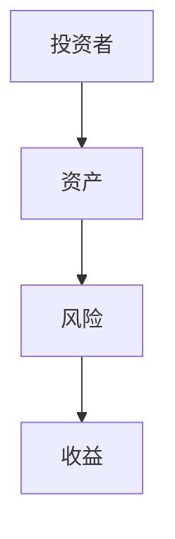
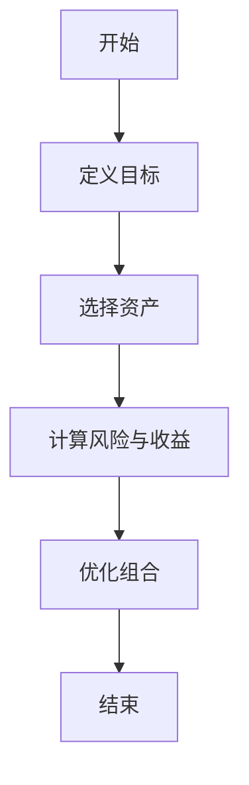
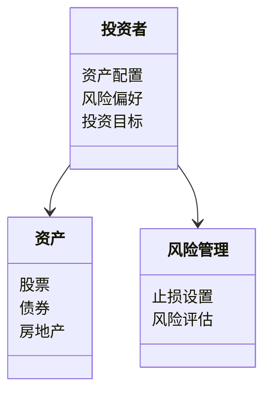
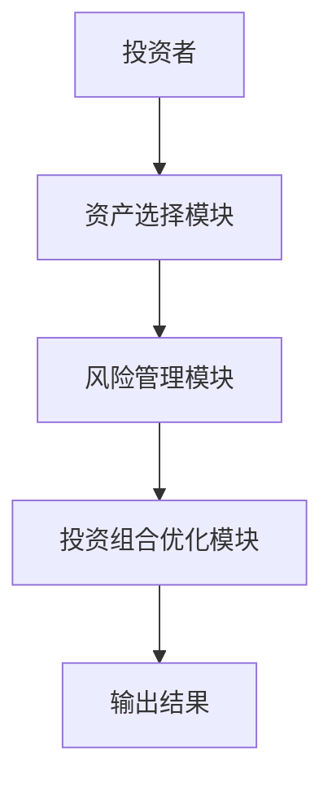
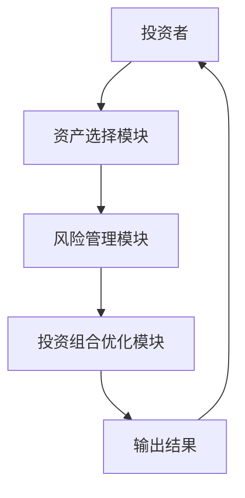

                 


# 彼得·林奇的多元化投资组合构建

## 关键词：投资组合，多元化投资，风险管理，资产配置，彼得·林奇，现代投资组合理论，价值投资

## 摘要：本文将详细探讨彼得·林奇的多元化投资策略，从基本概念到具体实现，结合现代投资组合理论，分析如何构建一个有效的投资组合。通过理论与实践的结合，为投资者提供实用的指导。

---

## 第一部分: 多元化投资组合构建的背景与基础

### 第1章: 多元化投资组合概述

#### 1.1 多元化投资的基本概念

##### 1.1.1 投资组合的定义与特点
投资组合是指将多种不同资产（如股票、债券、房地产等）按照一定比例组合在一起的投资方式。其特点是通过分散投资来降低风险，同时追求收益的最大化。投资组合的总风险通常低于单一资产的风险。

##### 1.1.2 多元化投资的意义与优势
多元化投资能够有效降低投资组合的非系统性风险。通过将资金分配到不同资产类别、行业或地区，投资者可以减少因单一资产价格波动带来的损失。此外，多元化还能提高投资组合的稳定性，避免因市场波动而遭受重大损失。

##### 1.1.3 多元化投资的边界与外延
多元化投资并非无边界，它需要考虑资产的相关性、流动性以及市场环境等因素。外延则包括动态调整投资组合，以适应市场变化和投资者风险偏好的变化。

#### 1.2 彼得·林奇的投资理念

##### 1.2.1 彼得·林奇的个人背景与投资风格
彼得·林奇是美国著名的投资专家，曾管理富达麦哲伦基金，取得了卓越的投资业绩。他主张长期投资，注重基本面分析，并强调通过分散投资来降低风险。

##### 1.2.2 林奇对多元化投资的贡献
林奇提出了“一篮子鸡蛋理论”，即通过广泛分散投资来降低风险。他认为，投资者应选择具有长期增长潜力的公司，并耐心持有，避免频繁交易。

##### 1.2.3 林奇投资策略的核心要素
- **价值投资**：寻找被市场低估的股票。
- **分散投资**：通过投资不同类型资产来降低风险。
- **长期持有**：避免短期市场波动的干扰。

#### 1.3 投资组合构建的核心要素

##### 1.3.1 资产配置的重要性
资产配置是投资组合构建的基础，决定了投资组合的风险和收益。合理的资产配置需要根据市场环境和投资者的风险偏好进行调整。

##### 1.3.2 风险管理的必要性
风险管理是投资组合构建的关键，通过分散投资、设置止损等方式，有效降低投资组合的潜在损失。

##### 1.3.3 分散投资的实现方式
分散投资可以通过投资不同资产类别、行业或地理区域来实现。这种分散可以降低特定资产或市场的风险，提高整体投资组合的稳定性。

---

## 第二部分: 投资组合构建的核心概念与联系

### 第2章: 投资组合构建的原理与方法

#### 2.1 投资组合构建的原理

##### 2.1.1 现代投资组合理论（MPT）简介
现代投资组合理论（MPT）由哈里·马科维茨提出，强调通过分散投资来优化风险与收益的平衡。MPT认为，最佳的投资组合是在给定风险水平下收益最大化，或者在给定收益下风险最小化。

##### 2.1.2 风险与收益的权衡
投资组合的收益与风险密切相关。通常，高风险资产可能带来高收益，而低风险资产收益较低。投资者需要根据自身风险偏好选择合适的投资组合。

##### 2.1.3 资产相关性的分析
资产的相关性影响投资组合的分散效果。低相关性的资产组合可以更有效地降低风险，而高相关性则可能增加整体风险。

#### 2.2 投资组合构建的核心方法

##### 2.2.1 资产配置的步骤与流程
1. **确定投资目标和风险承受能力**：明确投资者的投资目标和对风险的容忍度。
2. **选择资产类别**：根据目标选择股票、债券、房地产等资产。
3. **计算各资产的权重**：确定每种资产在组合中的比例。
4. **定期调整**：根据市场变化和个人情况调整投资组合。

##### 2.2.2 风险调整后的收益分析
通过计算各资产的风险调整后收益（RAR），选择具有更高RAR的资产，以优化投资组合的收益风险比。

##### 2.2.3 投资组合优化的数学模型
使用均值-方差模型优化投资组合，目标是最小化风险（方差）或最大化收益（均值），在给定约束条件下求解最优解。

#### 2.3 核心概念对比分析

##### 2.3.1 资产配置与分散投资的对比
资产配置侧重于各类资产的权重分配，而分散投资则关注于降低特定资产或市场的风险。两者相辅相成，共同构建稳健的投资组合。

##### 2.3.2 风险管理与收益最大化的关系
风险管理是收益最大化的基础，通过有效管理风险，投资者可以在承受可接受风险的前提下，追求更高的收益。

##### 2.3.3 不同投资策略的优缺点
- **价值投资**：注重长期增长，风险较低，但需要深入的基本面分析。
- **成长投资**：追求高增长企业，收益潜力大，但风险也较高。
- **指数投资**：通过投资指数基金实现市场平均收益，风险分散，操作简单。

#### 2.4 实体关系图与流程图

##### 2.4.1 投资组合构建的ER实体关系图


##### 2.4.2 投资组合优化的流程图


#### 2.5 本章小结
本章详细介绍了投资组合构建的原理与方法，包括资产配置、风险管理、分散投资等核心概念，并通过图表展示了投资组合优化的流程。

---

## 第三部分: 投资组合构建的算法原理

### 第3章: 现代投资组合理论（MPT）详解

#### 3.1 MPT的核心算法

##### 3.1.1 均值-方差优化模型
均值-方差模型的目标是优化投资组合的风险和收益。数学公式如下：
$$ \text{Minimize } \sigma^2 \text{ subject to } \mu \geq \text{目标收益} $$
其中，σ²是投资组合的方差（风险），μ是期望收益。

##### 3.1.2 马科维茨有效前沿的数学公式
有效前沿表示在给定风险下，收益最大的投资组合，或在给定收益下，风险最小的投资组合。其数学表达式为：
$$ \text{Maximize } \mu \text{ subject to } \sigma^2 \leq \text{目标风险} $$

#### 3.2 投资组合优化的实现步骤

##### 3.2.1 数据收集与预处理
收集各资产的历史价格数据，计算收益率，并进行数据清洗（如处理缺失值）。

##### 3.2.2 计算资产的相关性矩阵
使用协方差矩阵计算资产的相关性，用于评估资产之间的相互影响。

##### 3.2.3 构建优化模型并求解
使用优化算法（如拉格朗日乘数法）求解最优投资组合。

##### 3.2.4 验证与调整
验证优化结果的可行性，并根据实际情况进行调整。

#### 3.3 算法实现的代码示例
以下是一个简单的投资组合优化的Python代码示例：
```python
import numpy as np
from scipy.optimize import minimize

# 模拟数据
n_assets = 3
returns = np.array([0.1, 0.15, 0.08])
cov_matrix = np.array([
    [0.02, 0.01, 0.01],
    [0.01, 0.03, 0.02],
    [0.01, 0.02, 0.03]
])

def portfolio_risk(weights, covariance):
    return np.sqrt(np.dot(weights.T, np.dot(covariance, weights)))

# 约束条件
cons = ({'type': 'eq', 'fun': lambda w: np.sum(w) - 1.0})

# 目标函数
def objective(w):
    return portfolio_risk(w, cov_matrix)

# 求解
result = minimize(objective, np.array([1/3, 1/3, 1/3]), constraints=cons)

print("最优权重:", result.x)
print("最小风险:", result.fun)
```

#### 3.4 本章小结
本章通过数学公式和代码示例，详细讲解了现代投资组合理论的核心算法及其实现步骤。

---

## 第四部分: 投资组合构建的系统分析与架构设计

### 第4章: 系统架构与功能设计

#### 4.1 项目介绍
本项目旨在开发一个投资组合管理系统的原型，帮助投资者根据彼得·林奇的多元化投资策略构建和优化投资组合。

#### 4.2 系统功能设计

##### 4.2.1 领域模型


##### 4.2.2 系统架构


##### 4.2.3 系统接口设计
系统提供以下接口：
- 输入接口：投资者的风险偏好和投资目标。
- 输出接口：优化后的投资组合配置和风险收益分析。

##### 4.2.4 系统交互流程图


#### 4.3 本章小结
本章通过系统架构和功能设计，展示了如何将彼得·林奇的多元化投资策略转化为实际的系统实现。

---

## 第五部分: 项目实战

### 第5章: 项目实战与案例分析

#### 5.1 环境安装与配置
安装必要的Python库，如numpy、pandas、scipy等。

#### 5.2 核心代码实现

##### 5.2.1 投资组合优化模块
```python
def optimize_portfolio(weights, covariance):
    # 定义目标函数
    def objective(w):
        return np.dot(w.T, np.dot(covariance, w))  # 方差

    # 约束条件：权重之和为1
    cons = ({'type': 'eq', 'fun': lambda w: np.sum(w) - 1.0})

    # 使用SLSQP方法求解
    result = minimize(objective, weights, method='SLSQP', constraints=cons)

    return result.x, result.fun

# 示例数据
n_assets = 4
returns = np.array([0.08, 0.12, 0.06, 0.10])
cov_matrix = np.array([
    [0.03, 0.02, 0.01, 0.015],
    [0.02, 0.05, 0.01, 0.02],
    [0.01, 0.01, 0.02, 0.01],
    [0.015, 0.02, 0.01, 0.03]
])

initial_weights = np.array([0.25, 0.25, 0.25, 0.25])

optimal_weights, min_variance = optimize_portfolio(initial_weights, cov_matrix)
print("最优权重:", optimal_weights)
print("最小方差:", min_variance)
```

##### 5.2.2 风险管理模块
```python
def calculateVaR(returns, confidence_level=0.95):
    # 计算VaR
    sorted_returns = np.sort(returns)
    var_index = int(len(sorted_returns) * (1 - confidence_level))
    var = sorted_returns[var_index]
    return var

# 示例数据
returns = np.array([0.05, 0.07, -0.02, 0.03, 0.06])
var = calculateVaR(returns)
print("VaR:", var)
```

#### 5.3 案例分析
假设一个投资者希望构建一个包含股票、债券和房地产的多元投资组合，风险偏好为中等。根据优化模型，计算出各资产的最优权重，并分析其风险和收益。

#### 5.4 本章小结
本章通过实际案例展示了如何将理论应用于实践，帮助投资者根据自身情况构建和优化投资组合。

---

## 第六部分: 最佳实践与总结

### 第6章: 最佳实践与注意事项

#### 6.1 投资组合构建的最佳实践
- **定期审查和调整**：根据市场变化和个人情况，定期调整投资组合。
- **避免过度分散**：虽然分散投资有助于降低风险，但过度分散可能降低收益。
- **长期投资**：避免短期波动的影响，坚持长期投资。

#### 6.2 小结
彼得·林奇的多元化投资策略强调分散投资和长期持有，结合现代投资组合理论，投资者可以通过科学的方法构建有效投资组合。

#### 6.3 注意事项
- **了解投资工具**：确保对所投资的资产有足够的了解。
- **控制杠杆**：避免使用过多杠杆，增加整体风险。
- **关注费用**：高费用可能侵蚀投资收益。

#### 6.4 拓展阅读
推荐书籍：
- 《投资学》（ Investments ）—— 巴曙松
- 《彼得·林奇的成功投资》 —— 彼得·林奇

---

## 作者：AI天才研究院/AI Genius Institute & 禅与计算机程序设计艺术 /Zen And The Art of Computer Programming

---

**摘要**：本文系统地分析了彼得·林奇的多元化投资策略，从理论到实践，详细讲解了投资组合构建的核心概念、算法原理和系统架构设计。通过案例分析和代码实现，帮助读者更好地理解和应用这些方法。

