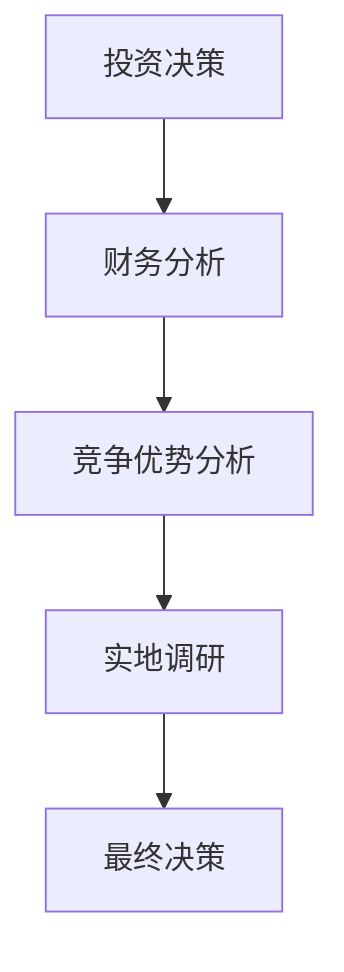

                 

# 彼得·林奇的实地调研方法：走进公司

> 关键词：彼得·林奇，实地调研，投资分析，财务指标，竞争优势，风险管理

> 摘要：本文详细介绍了彼得·林奇的实地调研方法，探讨了如何通过深入分析公司基本面、竞争优势和财务数据来评估投资价值。文章结合实例，分析了实地调研的核心步骤、数据分析方法及投资决策策略，并提供了实战演练和最佳实践建议。

---

## 第一部分：背景介绍

### 第1章：实地调研的重要性

#### 1.1 投资的本质
- **1.1.1 投资的核心：价值发现**
  - 投资不仅仅是买入股票，更是对公司的深入了解和价值判断。
  - 彼得·林奇认为，成功的投资来自于对公司基本面的深入分析和实地调研。

- **1.1.2 实地调研在投资中的作用**
  - 实地调研是验证公司财务数据、了解管理层能力和竞争优势的关键。
  - 通过实地调研，投资者能够更全面地评估公司的内在价值和成长潜力。

- **1.1.3 彼得·林奇的投资哲学**
  - 林奇强调，投资是一项长期的、耐心的事业。
  - 通过实地调研，找到那些被市场低估的优秀公司，长期持有，分享其成长成果。

---

## 第二部分：彼得·林奇的分析框架

### 第2章：财务指标分析

#### 2.1 财务指标的核心作用
- 财务指标是评估公司财务健康状况的重要工具。
- 通过分析收入、利润、资产负债表和现金流量，投资者可以判断公司的盈利能力和财务风险。

#### 2.2 核心财务指标解析
- **收入与利润分析**
  - 收入增长率：衡量公司业务扩展能力。
  - 净利润率：反映公司盈利效率。
- **资产负债表分析**
  - 资产负债率：评估公司债务风险。
  - 存货周转率：衡量库存管理效率。
- **现金流量分析**
  - 经营活动现金流：判断公司盈利质量。
  - 自由现金流：评估公司再投资能力。

#### 2.3 财务指标分析方法
- 使用财务比率分析（如ROE、ROA、毛利率等）评估公司盈利能力。
- 对比分析：将公司财务指标与行业平均水平或竞争对手进行对比。

---

### 第3章：竞争优势分析

#### 3.1 核心竞争力的识别
- **竞争优势来源**：技术优势、成本优势、品牌优势等。
- **护城河分析**：评估公司是否具备可持续的竞争优势。

#### 3.2 行业地位与市场份额
- 行业集中度分析：判断行业竞争格局。
- 公司市场份额：评估公司在行业中的地位和影响力。

#### 3.3 可持续竞争优势
- **创新能力**：公司是否具备持续创新的能力。
- **管理团队**：管理层的战略眼光和执行力。

---

## 第三部分：实地调研的核心步骤

### 第4章：制定调研计划

#### 4.1 确定调研目标
- 明确调研的目的：评估公司投资价值、验证财务数据、了解管理层等。

#### 4.2 制定调研方案
- 设计调研流程：包括调研时间、地点、参与人员等。
- 准备调研工具：如调研问卷、数据分析工具等。

#### 4.3 准备调研工具
- 调研问卷设计：涵盖财务、管理、市场等方面的问题。
- 数据收集工具：如财务报表、行业报告等。

---

### 第5章：实地调研实施

#### 5.1 与管理层沟通
- 了解公司战略：与CEO、 CFO等高管讨论公司未来发展方向。
- 获取第一手信息：了解公司的财务状况、经营策略等。

#### 5.2 参观生产车间
- 实地考察生产过程：评估公司生产能力、成本控制能力。
- 了解产品质量：判断公司在行业中的竞争力。

#### 5.3 与客户和供应商交流
- 客户反馈：了解公司产品市场表现和客户满意度。
- 供应商关系：评估供应链稳定性。

---

## 第四部分：数据分析与决策

### 第6章：数据分析方法

#### 6.1 数据收集与整理
- 财务数据收集：包括收入、利润、现金流等。
- 非财务数据收集：如市场数据、行业报告等。
- 数据清洗：去除无效数据，确保数据质量。

#### 6.2 数据分析方法
- 趋势分析：分析公司财务指标的变化趋势。
- 对比分析：将公司与竞争对手进行对比。
- 财务比率分析：计算ROE、ROA等指标，评估公司盈利能力。

---

### 第7章：投资决策模型

#### 7.1 构建决策模型
- 确定关键指标：如ROE、毛利率、负债率等。
- 设定评分标准：根据指标表现给予评分。
- 综合评估：计算综合得分，判断投资价值。

#### 7.2 模型验证与优化
- 回测历史数据：验证模型的有效性。
- 根据实际表现调整模型参数。

---

## 第五部分：案例分析与实战演练

### 第8章：案例分析

#### 8.1 案例介绍
- 以某公司为例，分析其财务状况、竞争优势和市场地位。

#### 8.2 分析过程展示
- 财务数据整理与分析。
- 竞争优势评估。
- 投资价值判断。

---

### 第9章：实战演练

#### 9.1 模拟调研过程
- 设计调研方案：包括调研目标、时间、地点等。
- 收集数据：整理财务报表、行业报告等。
- 分析数据：计算财务比率，评估竞争优势。

#### 9.2 数据分析实践
- 使用Excel或Python进行数据分析。
- 绘制财务指标趋势图，进行对比分析。

---

## 第六部分：总结与最佳实践

### 第10章：总结

#### 10.1 核心内容回顾
- 彼得·林奇实地调研方法的核心步骤和关键点。
- 数据分析与投资决策的重要性。

#### 10.2 最佳实践
- 投资前做好充分准备。
- 持续学习，不断优化分析方法。

---

### 第11章：小结与注意事项

#### 11.1 小结
- 实地调研是投资的重要环节，需要系统规划和执行。
- 数据分析是投资决策的依据，需要准确和全面。

#### 11.2 注意事项
- 避免过度依赖财务数据，关注公司整体情况。
- 投资需谨慎，保持长期视角。

---

## 附录：工具与资源

### 附录A：常用财务指标公式

- 净利润 = 收入 - 成本 - 费用
- 净利率 = 净利润 / 收入
- 资产负债率 = 负债总额 / 资产总额

### 附录B：调研问卷模板

- 公司财务状况：请提供最近三年的财务报表。
- 管理层团队：请介绍公司主要管理人员的背景和职责。
- 市场情况：请描述公司主要产品的市场地位和竞争对手情况。

### 附录C：数据分析工具推荐

- Excel：常用的数据分析工具，适合基础分析。
- Python：强大的编程语言，适合复杂的数据分析。
- SQL：用于数据库查询和数据处理。

---

## 图表展示

### 分析框架图

### 竞争优势分析图

---

## 作者

作者：AI天才研究院 & 禅与计算机程序设计艺术

---

通过以上目录大纲，您可以逐步深入了解彼得·林奇的实地调研方法，并将其应用到实际投资中。每个章节都详细解释了相关概念和步骤，结合实例和工具，帮助您全面掌握这一投资方法。

