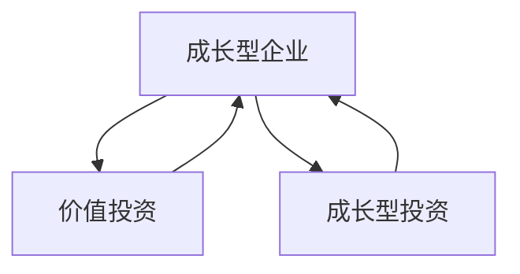

                 

# 彼得·林奇的成长型价值投资方法论

## 关键词：成长型投资，价值投资，彼得·林奇，投资策略，股票分析

## 摘要：本文详细探讨了彼得·林奇的成长型价值投资方法论，分析了成长型投资和价值投资的核心概念及其结合的优势，通过实际案例展示了如何在投资实践中应用这些理念，并提供了系统的投资策略和方法论。

---

## 第一部分: 成长型价值投资的背景与核心概念

### 第1章: 投资的基本概念与背景介绍

#### 1.1 投资的基本概念

- **1.1.1 什么是投资**
  - 投资是指将资金投入特定资产以期获得未来收益的行为。
  - 投资的目标是通过资产增值实现财富增长。
  - 投资可以分为股票、债券、房地产等多种形式。

- **1.1.2 投资的分类与特点**
  - 股票投资：高风险高回报，适合长期持有。
  - 债券投资：相对稳定，适合保守投资者。
  - 房地产投资：实物资产，具有较高的流动性。

- **1.1.3 投资的基本原则**
  - 长期视角：投资不是短期交易，而是长期价值的积累。
  - 风险分散：通过多样化投资降低风险。
  - 价值评估：准确评估资产的真实价值。

#### 1.2 彼得·林奇与成长型投资

- **1.2.1 彼得·林奇的生平简介**
  - 彼得·林奇是美国著名投资专家，曾任富达投资的基金经理。
  - 他以长期的投资成绩斐然，尤其在成长型股票方面表现突出。

- **1.2.2 成长型投资的定义与特点**
  - 成长型投资关注的是公司的未来增长潜力。
  - 投资对象通常是那些收入和利润快速增长的公司。
  - 这种投资方式具有高风险高回报的特点。

- **1.2.3 成长型投资的核心理念**
  - 寻找那些具有强大竞争优势，并能在未来持续增长的公司。
  - 通过长期持有这些公司股票，实现资产增值。

#### 1.3 价值投资的基本原理

- **1.3.1 价值投资的起源与发展**
  - 价值投资由本杰明·格雷厄姆提出，强调寻找市场价格低于其内在价值的股票。
  - 价值投资在市场低迷时期特别有效，因为许多优质股票会被低估。

- **1.3.2 价值投资的核心理念**
  - 买入被市场低估的股票，等待其价值回归。
  - 重视公司的基本面分析，尤其是财务报表和行业地位。

- **1.3.3 成长型投资与价值投资的联系与区别**

| **对比维度** | **成长型投资** | **价值投资** |
|--------------|----------------|--------------|
| 投资目标     | 寻找高成长潜力的公司 | 寻找被低估的股票 |
| 风险承受能力 | 较高            | 较低          |
| 投资期限     | 长期            | 长期          |
| 适用市场环境 | 增长期          | 低迷期        |

---

## 第2章: 成长型价值投资的核心概念与联系

### 2.1 成长型投资的核心原理

- **2.1.1 企业成长性的评估标准**
  - 收入增长率：公司收入是否持续增长。
  - 利润增长率：公司利润是否稳步上升。
  - 市场占有率：公司在行业中的地位。

- **2.1.2 企业生命周期与投资策略**
  - 初创期：高风险，高潜力。
  - 成长期：快速扩张，适合成长型投资。
  - 成熟期：稳定增长，适合价值投资。

- **2.1.3 成长型企业识别的关键指标**
  - 净利润率：衡量公司盈利能力。
  - 资产负债率：评估公司财务健康状况。
  - 研发投入：判断公司创新能力和未来发展潜力。

### 2.2 价值投资的核心原理

- **2.2.1 市场情绪与价值偏离**
  - 市场情绪波动会影响股票价格。
  - 当市场价格低于内在价值时，即是投资机会。

- **2.2.2 安全边际的概念与应用**
  - 安全边际是指市场价格与内在价值之间的差距。
  - 买入价格低于内在价值，确保投资的安全性。

- **2.2.3 价值投资的长期视角**
  - 长期持有优质股票，等待价值回归。
  - 忽略短期市场波动，专注于公司长期价值。

### 2.3 成长型与价值投资的结合

- **2.3.1 成长型价值投资的定义**
  - 寻找那些具有高成长潜力且市场价格低于内在价值的公司。
  - 结合成长型和价值型的特点，寻找最优的投资机会。

- **2.3.2 两者的结合优势**
  - 成长型投资提供高增长潜力。
  - 价值投资提供价格安全边际。
  - 结合两者，可以在高成长的同时降低投资风险。

- **2.3.3 实际案例分析**
  - 假设有一家科技公司，收入和利润持续增长，但当前市场价格低于其未来预期价值。
  - 这种公司符合成长型价值投资的条件，适合长期持有。

---

## 第3章: 成长型价值投资的核心概念对比与联系

### 3.1 成长型与价值投资的核心概念对比

- **3.1.1 投资目标对比**
  - 成长型投资：寻找高成长潜力的公司。
  - 价值投资：寻找被低估的股票。

- **3.1.2 投资策略对比**
  - 成长型投资：注重公司未来增长。
  - 价值投资：注重公司当前价值。

- **3.1.3 风险承受能力对比**
  - 成长型投资：高风险高回报。
  - 价值投资：低风险稳定回报。

### 3.2 成长型与价值投资的联系

- **3.2.1 长期视角的共同点**
  - 两者都强调长期投资，而非短期交易。

- **3.2.2 投资理念的互补性**
  - 成长型投资提供高增长潜力。
  - 价值投资提供价格安全边际。

- **3.2.3 实际操作中的结合点**
  - 在成长型企业中寻找被低估的股票。
  - 结合成长性和价值性，优化投资组合。

### 3.3 成长型与价值投资的ER实体关系图

---

## 第四部分: 成长型价值投资的算法与数学模型

---

## 小结

彼得·林奇的成长型价值投资方法论是一种结合了成长型和价值型投资的策略，通过寻找具有高成长潜力且市场价格低于内在价值的公司，实现长期的财富增长。这种方法强调长期投资、基本面分析和风险控制，为投资者提供了一种科学且实用的投资方式。

---

## 作者

作者：AI天才研究院/AI Genius Institute & 禅与计算机程序设计艺术 /Zen And The Art of Computer Programming

