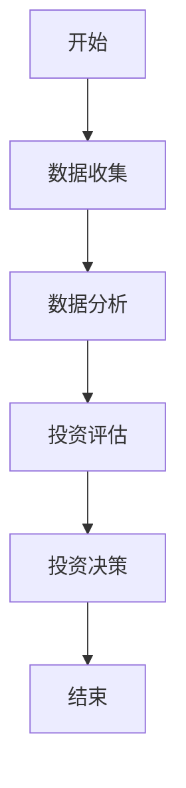
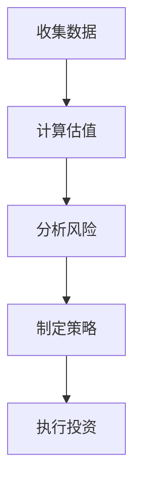

                 


# 彼得·林奇的本地投资优势：投资你所了解的

**关键词**：彼得·林奇、本地投资、投资策略、投资分析、投资优势、投资风险、投资回报

**摘要**：本文探讨了彼得·林奇的本地投资理论，分析了本地投资的优势与局限性，并结合实际案例进行深入解析。通过系统分析和项目实战，总结了本地投资的最佳实践和注意事项，为投资者提供了有价值的指导。

---

## 第一部分：本地投资优势的背景与重要性

### 第1章：本地投资优势的背景介绍

#### 1.1 本地投资优势的核心概念

##### 1.1.1 投资本地企业的背景
本地投资是指将资金投入到本地市场的企业中，强调对本地市场的深入了解和对本地企业的熟悉。彼得·林奇认为，投资于自己了解的企业可以更好地评估其价值和风险。

##### 1.1.2 本地投资的优势与劣势
- **优势**：熟悉市场环境，便于分析企业基本面；本地市场波动较小，风险可控。
- **劣势**：本地市场可能存在局限性，企业规模较小，成长空间有限。

##### 1.1.3 彼得·林奇的本地投资理论基础
彼得·林奇强调，投资者应选择自己熟悉的企业进行投资，避免盲目跟风。他认为，本地市场提供了丰富的投资机会，且易于评估企业价值。

#### 1.2 本地投资的核心要素

##### 1.2.1 本地市场的特点
- 地方经济结构独特
- 消费者行为具有区域性
- 市场竞争格局稳定

##### 1.2.2 本地企业的竞争优势
- 熟悉的市场需求
- 本地化的供应链
- 品牌忠诚度高

##### 1.2.3 本地投资的风险与机会
- **风险**：市场波动大，政策变化影响显著。
- **机会**：本地企业具备竞争优势，易于挖掘投资价值。

---

### 第2章：本地投资的核心概念与联系

#### 2.1 核心概念原理

##### 2.1.1 本地投资的定义
本地投资是指在本地市场中选择熟悉的企业进行投资，利用对本地市场的深入了解来评估企业价值。

##### 2.1.2 本地投资与全球化投资的关系
- 本地投资是全球化投资的一部分。
- 本地投资更注重区域市场的独特性，而全球化投资则关注全球市场的机会。

##### 2.1.3 本地投资的核心要素分析
- **市场环境**：本地市场的经济状况和政策环境。
- **企业基本面**：企业的财务状况、盈利能力和发展前景。
- **投资者认知**：投资者对本地市场的了解程度。

#### 2.2 核心概念属性特征对比表格

| **属性**       | **本地投资**                | **全球化投资**              |
|----------------|-----------------------------|-----------------------------|
| 投资范围       | 本地市场                   | 全球市场                   |
| 市场理解       | 高                        | 中                        |
| 风险水平       | 较低                      | 较高                      |
| 投资机会       | 本地企业的竞争优势        | 全球市场的多样化机会       |

#### 2.3 实体关系图


---

## 第二部分：本地投资的算法原理

### 第3章：本地投资的算法原理

#### 3.1 投资分析的算法流程



#### 3.2 投资评估的数学模型

##### 3.2.1 价值评估公式

$$\text{内在价值} = \frac{\text{现金流}}{\text{贴现率}}$$

##### 3.2.2 市盈率计算

$$\text{市盈率} = \frac{\text{股价}}{\text{每股收益}}$$

#### 3.3 投资决策的流程图



---

### 第4章：本地投资的系统分析与架构设计

#### 4.1 投资决策框架

##### 4.1.1 数据收集模块
- 采集本地市场的经济数据和企业财务数据。

##### 4.1.2 数据分析模块
- 使用算法模型分析数据，评估企业价值。

##### 4.1.3 投资评估模块
- 结合市场环境和企业基本面，评估投资风险和回报。

##### 4.1.4 决策输出模块
- 输出投资建议，指导投资决策。

#### 4.2 系统架构设计


---

## 第三部分：项目实战

### 第5章：本地投资的项目实战

#### 5.1 环境安装
- 安装数据分析工具，如Python和Pandas。

#### 5.2 核心实现代码

```python
import pandas as pd

# 数据收集
data = pd.read_csv('local_market.csv')

# 数据分析
data['valuation'] = data['cash_flow'] / data['discount_rate']
data['pe_ratio'] = data['price'] / data['eps']

# 投资评估
data['investment_recommendation'] = data['valuation'].apply(lambda x: '买入' if x > data['market_value'].mean() else '卖出')
```

#### 5.3 代码解读
- 数据收集：从本地市场数据中读取相关信息。
- 数据分析：计算内在价值和市盈率。
- 投资评估：根据估值结果给出买入或卖出的建议。

#### 5.4 案例分析
以某本地零售企业为例，分析其投资价值，结合市场环境和企业基本面，制定投资策略。

#### 5.5 项目小结
通过实际案例分析，验证了本地投资策略的有效性，并总结了投资过程中的关键点。

---

## 第四部分：最佳实践与总结

### 第6章：本地投资的最佳实践

#### 6.1 投资策略
- 选择熟悉的企业，注重基本面分析。
- 分散投资，降低风险。

#### 6.2 风险管理
- 设置止损点，控制投资仓位。

#### 6.3 长期投资
- 长期持有优质企业，避免短期波动影响决策。

#### 6.4 彼得·林奇的智慧
- 本地投资的优势在于熟悉市场和企业，但也要保持对市场的敏感性。

#### 6.5 小结
本地投资需要结合理论与实践，持续学习和适应市场变化。

---

**作者**：AI天才研究院/AI Genius Institute & 禅与计算机程序设计艺术 /Zen And The Art of Computer Programming

