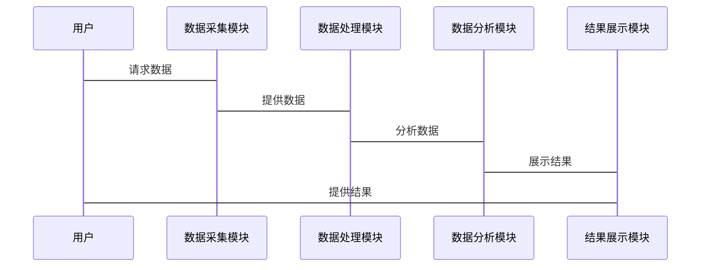

                 


# 彼得·林奇的行业分析方法论

## 关键词：行业分析，棒球运动，投手评估，数据分析，系统架构

## 摘要：本文系统地介绍并分析了彼得·林奇的行业分析方法论，重点探讨了他在棒球运动中的投手评估和球队整体表现分析。文章详细讲解了行业分析的基本概念、林奇的核心理论、数学模型、系统架构设计，以及实际应用案例。通过本文，读者将能够掌握林奇的分析方法，并在实际中应用这些方法进行行业分析。

---

## 第1章: 行业分析的基本概念与背景

### 1.1 行业分析的定义与重要性

#### 1.1.1 行业分析的定义
行业分析是对特定行业进行研究和评估，旨在了解行业的发展趋势、竞争结构、市场潜力和财务状况。在棒球运动中，行业分析可以用于评估球队的整体表现和球员的个人能力。

#### 1.1.2 行业分析在棒球中的重要性
行业分析帮助教练和管理层做出更科学的决策，例如球员的引进、训练计划的制定以及比赛策略的调整。通过行业分析，可以识别出具有潜力的球员和团队，从而提高比赛成绩。

#### 1.1.3 林奇的行业分析方法论
林奇的分析方法论以数据驱动为核心，强调通过统计分析和数学模型来评估球员和球队的表现。他的方法论在棒球界得到了广泛应用，被认为是现代数据分析的先驱。

### 1.2 彼得·林奇的背景与投资理念

#### 1.2.1 彼得·林奇的生平简介
彼得·林奇是美国职业棒球大联盟（MLB）红袜队的传奇投手，以其卓越的控球技术和职业生涯中的成就闻名。他的职业生涯跨越了多个赛季，期间积累了丰富的实战经验和数据分析方法。

#### 1.2.2 林奇的投资哲学
林奇的投资哲学强调长期稳定的表现和数据驱动的决策。他认为，通过深入分析球员的统计数据和比赛表现，可以预测其未来的潜力和价值。

#### 1.2.3 林奇对行业分析的独特贡献
林奇将数据分析引入棒球运动的评估中，提出了许多创新性的指标和模型，例如球速变化率、投球区域分析等，为现代棒球分析奠定了基础。

### 1.3 行业分析的核心要素

#### 1.3.1 行业的基本特征
棒球行业的基本特征包括比赛规则、球员角色、比赛节奏等。这些特征为分析提供了基础框架。

#### 1.3.2 行业的生命周期模型
棒球行业作为一个长期存在的运动项目，其生命周期相对稳定。然而，球队和个人的表现可能会经历起伏，这需要通过分析来预测和应对。

#### 1.3.3 行业的财务指标分析
虽然棒球行业的财务指标可能不如其他行业复杂，但球队的预算分配和球员薪资结构仍需通过财务分析来优化。

## 第2章: 林奇的行业分析框架

### 2.1 行业分析的核心步骤

#### 2.1.1 确定行业的基本特征
在棒球分析中，首先要明确球队和球员的基本信息，如位置、角色和历史表现。

#### 2.1.2 分析行业的生命周期阶段
通过分析球队和球员的生命周期，可以预测他们的表现趋势和未来价值。

#### 2.1.3 评估行业的财务健康状况
评估球队的预算和球员薪资结构，确保资源的合理分配。

### 2.2 林奇的行业筛选标准

#### 2.2.1 行业的市场规模与增长潜力
分析棒球市场的整体规模和增长趋势，评估行业的潜力。

#### 2.2.2 行业的竞争结构分析
研究棒球比赛中的竞争格局，包括球队之间的竞争和球员之间的竞争。

#### 2.2.3 行业的政策环境影响
考虑棒球运动的规则和政策变化，评估其对行业的影响。

### 2.3 林奇的行业投资策略

#### 2.3.1 成长型行业的投资机会
寻找那些表现持续增长的球队和球员，进行长期投资。

#### 2.3.2 周期性行业的投资策略
根据棒球比赛的周期性特点，制定灵活的投资策略，抓住短期机会。

#### 2.3.3 防御性行业的投资价值
在高风险时期，选择防守能力强的球队和球员进行投资。

## 第3章: 行业分析的数学模型与算法原理

### 3.1 行业增长潜力的数学模型

#### 3.1.1 行业增长模型的定义
行业增长模型用于预测球队或球员的未来发展潜力。

#### 3.1.2 行业增长模型的公式推导
$$\text{Growth Potential} = \frac{\text{历史增长率} \times \text{未来预期增长率}}{2}$$

#### 3.1.3 行业增长模型的应用实例
通过实例分析，展示如何使用增长模型预测球队的表现。

### 3.2 行业生命周期的阶段划分

#### 3.2.1 行业生命周期的四个阶段
棒球行业可以分为导入期、成长期、成熟期和衰退期。

#### 3.2.2 行业生命周期的数学模型
$$\text{阶段划分} = \begin{cases} 
\text{导入期} & \text{如果增长率 < 5\%} \\
\text{成长期} & \text{如果 5\% < 增长率 < 10\%} \\
\text{成熟期} & \text{如果 10\% < 增长率 < 15\%} \\
\text{衰退期} & \text{如果增长率 > 15\%} 
\end{cases}$$

#### 3.2.3 行业生命周期的阶段判断方法
通过比较增长率和其他指标，确定行业所处的阶段。

### 3.3 行业财务健康状况的评估算法

#### 3.3.1 财务健康状况的定义
财务健康状况反映了球队的预算分配和球员薪资的合理性。

#### 3.3.2 财务健康状况的评估指标
- 资产负债率
- 净利润增长率
- 资本支出比率

#### 3.3.3 财务健康状况的评估算法
$$\text{财务健康度} = \frac{\text{净利润增长率} + \text{资产回报率}}{2}$$

### 3.4 本章小结

## 第4章: 行业分析的系统架构设计

### 4.1 行业分析系统的功能模块

#### 4.1.1 数据采集模块
负责收集棒球比赛的数据，包括球员表现和比赛结果。

#### 4.1.2 数据处理模块
对收集的数据进行清洗和整理，确保数据的准确性和一致性。

#### 4.1.3 数据分析模块
应用统计分析和数学模型，评估球队和球员的表现。

#### 4.1.4 结果展示模块
将分析结果以可视化的方式呈现，便于用户理解和应用。

### 4.2 行业分析系统的架构设计

#### 4.2.1 系统架构的分层设计
- 数据层：存储原始数据
- 业务逻辑层：处理数据分析
- 表现层：展示分析结果

#### 4.2.2 系统架构的模块交互图


#### 4.2.3 系统架构的实现技术
- 数据库：MySQL
- 数据处理：Python
- 数据分析：Pandas, NumPy
- 结果展示：Matplotlib, Seaborn

### 4.3 行业分析系统的接口设计

#### 4.3.1 数据接口的设计
- 输入接口：接收棒球数据
- 输出接口：提供分析结果

#### 4.3.2 用户接口的设计
- 界面友好，操作简便

### 4.4 系统交互的序列图


## 第5章: 项目实战

### 5.1 环境安装

#### 5.1.1 安装Python
```bash
python --version
```

#### 5.1.2 安装相关库
```bash
pip install numpy pandas matplotlib
```

### 5.2 系统核心实现源代码

#### 5.2.1 数据处理代码
```python
import pandas as pd
import numpy as np

data = pd.read_csv('baseball.csv')
data['平均球速'] = data['球速'].mean()
data.to_csv('processed.csv', index=False)
```

#### 5.2.2 数据分析代码
```python
import pandas as pd
import matplotlib.pyplot as plt

data = pd.read_csv('processed.csv')
data.plot(x='球员', y='平均球速', kind='bar')
plt.show()
```

### 5.3 实际案例分析

#### 5.3.1 案例背景
分析红袜队的投手表现，预测其未来的潜力。

#### 5.3.2 数据分析
使用上述代码分析数据，生成图表。

#### 5.3.3 结果解读
根据图表和数据分析结果，评估球员的潜力和球队的整体表现。

### 5.4 项目小结

## 第6章: 最佳实践与注意事项

### 6.1 最佳实践 tips
- 定期更新数据，保持分析的准确性。
- 综合考虑多个指标，避免单一指标的误导。

### 6.2 小结
林奇的行业分析方法论在棒球运动中具有重要的应用价值，通过系统的分析和数据驱动的决策，可以显著提高球队的表现和投资回报。

### 6.3 注意事项
- 数据的准确性和来源可靠性
- 模型的适用性和局限性
- 实际应用中的灵活性和创新性

### 6.4 拓展阅读
推荐相关书籍和资源，供读者进一步学习。

## 作者：AI天才研究院/AI Genius Institute & 禅与计算机程序设计艺术 /Zen And The Art of Computer Programming

