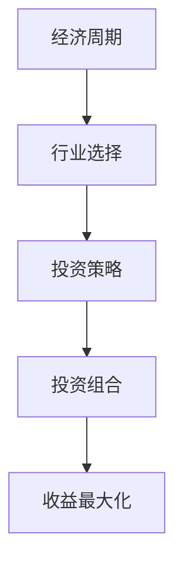
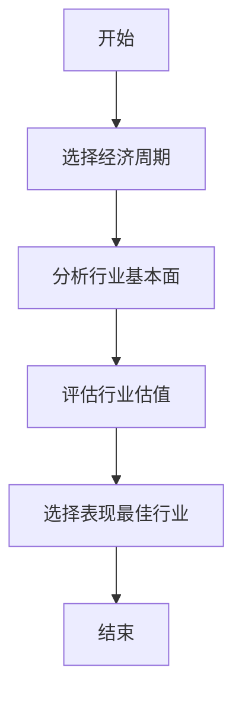
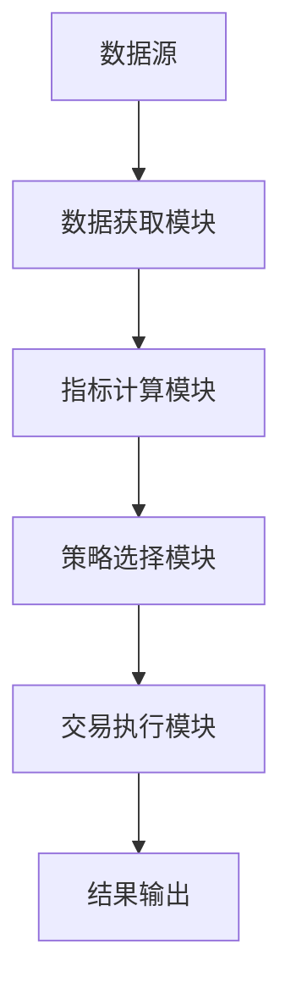

                 


# 彼得·林奇的行业轮动投资策略

> 关键词：行业轮动、投资策略、彼得·林奇、经济周期、技术分析、投资组合优化、风险管理

> 摘要：本文深入探讨了彼得·林奇的行业轮动投资策略，分析其核心理念、策略实施步骤及实际案例，帮助投资者掌握如何根据经济周期选择合适的行业，优化投资组合，并通过技术分析和数学模型实现科学的投资决策。

---

## 目录大纲：

### 第1章：行业轮动投资策略概述

- 1.1 行业轮动的基本概念
- 1.2 彼得·林奇的投资理念
- 1.3 行业轮动与经济周期的关系

### 第2章：行业轮动的核心概念与联系

- 2.1 经济周期对行业轮动的影响
- 2.2 不同行业的特征对比
- 2.3 通过表格和Mermaid图展示行业轮动的核心概念

### 第3章：行业轮动的算法原理

- 3.1 行业轮动的筛选标准
- 3.2 通过Mermaid图展示行业轮动的筛选流程
- 3.3 使用Python代码实现行业轮动筛选标准

### 第4章：行业轮动的系统分析与架构设计

- 4.1 系统功能模块设计
- 4.2 通过Mermaid图展示系统架构
- 4.3 系统接口设计与交互流程

### 第5章：行业轮动投资的项目实战

- 5.1 项目背景与目标
- 5.2 通过Python代码实现行业轮动策略
- 5.3 实战案例分析与结果解读

### 第6章：行业轮动投资的最佳实践

- 6.1 投资策略的优化建议
- 6.2 小结：行业轮动投资的关键点
- 6.3 投资风险提示与注意事项
- 6.4 拓展阅读推荐

---

## 正文部分

### 第1章：行业轮动投资策略概述

#### 1.1 行业轮动的基本概念

行业轮动是一种投资策略，旨在通过识别不同行业在经济周期中的表现差异，选择当前表现最佳的行业进行投资。这种方法的核心在于，不同行业在不同的经济阶段会有不同的表现，投资者可以通过轮动投资，捕捉到市场的最佳收益机会。

#### 1.2 彼得·林奇的投资理念

彼得·林奇是美国著名的投资专家，以其成功的共同基金管理经验和市场分析能力闻名。他认为，行业轮动是投资者在不同经济周期中调整投资组合的重要手段。他强调，投资者应根据市场变化，灵活选择具有增长潜力的行业。

#### 1.3 行业轮动与经济周期的关系

经济周期通常分为复苏、扩张、衰退和萧条四个阶段。在每个阶段，不同行业的表现会有所不同。例如，在经济衰退期，防御性行业（如公用事业、医疗保健）通常表现较好；而在经济扩张期，周期性行业（如制造业、信息技术）则可能有更高的收益。

---

### 第2章：行业轮动的核心概念与联系

#### 2.1 经济周期对行业轮动的影响

经济周期的变化直接影响行业的表现。通过分析经济周期的阶段，投资者可以更好地判断哪些行业可能在未来一段时间内表现优异。

#### 2.2 不同行业的特征对比

以下是不同行业在经济周期中的表现对比（以表格形式展示）：

| 经济阶段       | 优秀行业                     | 较差行业                     |
|----------------|------------------------------|------------------------------|
| 经济衰退       | 公用事业、医疗保健           | 制造业、信息技术             |
| 经济复苏       | 制造业、房地产               | 零售、旅游                 |
| 经济扩张       | 信息技术、金融               | 公用事业、农业             |
| 经济萧条       | 防御性行业（如必需品）       | 周期性行业（如汽车制造）     |

#### 2.3 通过表格和Mermaid图展示行业轮动的核心概念

以下是通过Mermaid图展示的行业轮动核心概念：



---

### 第3章：行业轮动的算法原理

#### 3.1 行业轮动的筛选标准

行业轮动的筛选标准包括以下几个方面：

1. **行业基本面分析**：包括行业的收入、利润、增长率等指标。
2. **行业估值分析**：包括市盈率、市净率等估值指标。
3. **行业竞争分析**：包括行业的市场集中度、竞争格局等。

#### 3.2 通过Mermaid图展示行业轮动的筛选流程

以下是行业轮动筛选流程的Mermaid图：



#### 3.3 使用Python代码实现行业轮动筛选标准

以下是Python代码实现行业轮动筛选标准的示例：

```python
import pandas as pd
import numpy as np

# 假设我们有一个包含各行业数据的DataFrame
df = pd.DataFrame({
    '行业': ['行业1', '行业2', '行业3'],
    '收入': [100, 200, 150],
    '利润': [20, 30, 25],
    '市盈率': [15, 20, 18]
})

# 计算行业评分
def calculate_score(row):
    # 假设评分公式为：收入占比 + 利润占比 + 市盈率折扣
    income_weight = 0.4
    profit_weight = 0.3
    pe_weight = 0.3
    
    row['评分'] = (row['收入']/df['收入'].sum()) * income_weight + \
                  (row['利润']/df['利润'].sum()) * profit_weight + \
                  (1 / (row['市盈率'] + 1)) * pe_weight
    return row

df = df.apply(calculate_score, axis=1)
print(df)
```

---

### 第4章：行业轮动的系统分析与架构设计

#### 4.1 系统功能模块设计

行业轮动投资系统的功能模块包括：

1. 数据获取模块：获取各行业的历史数据。
2. 指标计算模块：计算各行业的基本面指标和估值指标。
3. 策略选择模块：根据指标计算结果，选择表现最佳的行业。
4. 交易执行模块：根据选择的行业，执行相应的交易操作。

#### 4.2 通过Mermaid图展示系统架构

以下是系统架构的Mermaid图：



---

### 第5章：行业轮动投资的项目实战

#### 5.1 项目背景与目标

本项目旨在通过行业轮动策略，帮助投资者在不同的经济周期中选择表现最佳的行业，实现投资收益的最大化。

#### 5.2 使用Python代码实现行业轮动策略

以下是Python代码实现行业轮动策略的示例：

```python
import pandas as pd
import numpy as np

# 假设我们有一个包含各行业数据的DataFrame
df = pd.DataFrame({
    '行业': ['行业1', '行业2', '行业3'],
    '收入': [100, 200, 150],
    '利润': [20, 30, 25],
    '市盈率': [15, 20, 18]
})

# 计算行业评分
def calculate_score(row):
    # 假设评分公式为：收入占比 + 利润占比 + 市盈率折扣
    income_weight = 0.4
    profit_weight = 0.3
    pe_weight = 0.3
    
    row['评分'] = (row['收入']/df['收入'].sum()) * income_weight + \
                  (row['利润']/df['利润'].sum()) * profit_weight + \
                  (1 / (row['市盈率'] + 1)) * pe_weight
    return row

df = df.apply(calculate_score, axis=1)
print(df)
```

#### 5.3 实战案例分析与结果解读

通过上述代码，我们可以计算出每个行业的评分，并选择评分最高的行业进行投资。例如，假设行业2的评分为最高，那么我们应选择行业2进行投资。

---

### 第6章：行业轮动投资的最佳实践

#### 6.1 投资策略的优化建议

1. **定期调整投资组合**：根据经济周期的变化，定期调整投资组合中的行业配置。
2. **结合技术分析**：利用技术分析工具，进一步优化行业选择的准确性。
3. **分散投资**：避免过度集中投资于某一个行业，以降低风险。

#### 6.2 小结

行业轮动投资策略是一种有效的投资方法，通过分析经济周期和行业特征，选择表现最佳的行业进行投资，可以帮助投资者实现收益最大化。

#### 6.3 投资风险提示与注意事项

1. **市场风险**：经济周期的变化可能导致投资收益不及预期。
2. **行业风险**：某些行业可能受到政策或市场环境的影响，导致表现不佳。
3. **操作风险**：投资者需要具备一定的投资知识和技能，才能有效实施行业轮动策略。

#### 6.4 拓展阅读推荐

1. 《彼得·林奇的投资策略》
2. 《行业轮动与经济周期分析》

---

## 作者：AI天才研究院/AI Genius Institute & 禅与计算机程序设计艺术 /Zen And The Art of Computer Programming

---

以上是完整的目录大纲和文章内容，涵盖了行业轮动投资策略的各个方面，从理论到实践，帮助投资者更好地理解和应用这一策略。

