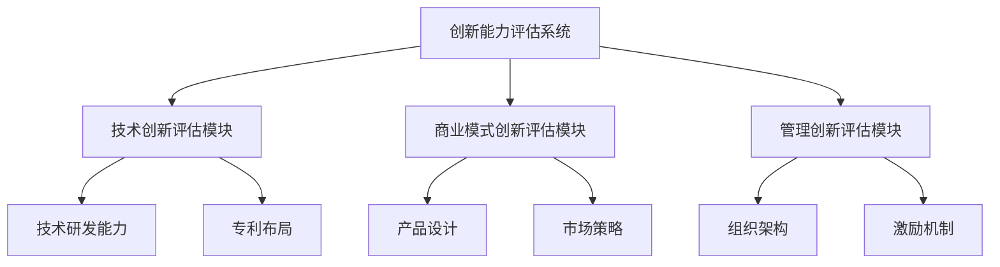

                 


# 彼得林奇如何看待公司的创新能力

## 关键词：创新能力，彼得林奇，投资价值，创新评估，创新战略

## 摘要：  
彼得林奇作为投资界的重要人物，他对公司的创新能力有着独到的见解。本文从创新能力的定义、核心要素、评估标准、数学模型构建、系统架构设计以及实际案例分析等方面，详细探讨了彼得林奇如何审视公司的创新能力，并通过量化评估和实际案例分析，揭示创新能力对投资决策的影响。本文旨在为投资者和企业管理者提供一种系统化的创新评估方法，帮助他们在投资和管理决策中更好地把握创新能力的核心价值。

---

## 第一部分：创新能力的核心概念与背景介绍

### 第1章：创新能力的定义与重要性

#### 1.1 创新能力的定义与重要性

创新是推动企业持续发展的核心动力，创新能力则是企业实现创新目标的关键能力。从狭义的角度来看，创新能力是指企业在技术研发、产品设计、商业模式等方面进行创新的能力；从广义的角度来看，创新能力涵盖了企业从战略制定、组织管理到市场反馈的全链条创新能力。

- **创新的定义**：创新不仅仅是技术研发，还包括商业模式、管理方法、产品设计等多方面的改进和突破。  
- **创新能力的重要性**：创新能力是企业保持竞争优势的关键，尤其是在技术驱动型的行业中，创新能力往往决定企业的生死存亡。

#### 1.2 彼得林奇的投资理念概述

彼得林奇是全球著名的价值投资者，他的投资理念以基本面分析为核心，注重企业的长期价值和竞争优势。他认为，企业的创新能力是决定其长期价值的重要因素之一。

- **彼得林奇的核心投资原则**：  
  1. **长期价值投资**：关注企业的基本面，寻找那些具有持续竞争优势的企业。  
  2. **分散投资**：避免将所有资金投入到单一行业或公司，以降低风险。  
  3. **注重管理团队**：优秀的管理层是企业持续创新和发展的关键。  

#### 1.3 创新能力与投资价值的关系

创新能力是企业实现长期价值增长的核心驱动力。彼得林奇认为，一个具有强大创新能力的企业，能够通过持续的技术创新和产品升级，不断扩大市场份额，从而为投资者带来超额回报。

---

## 第二部分：创新能力的核心要素与评估标准

### 第2章：创新能力的核心要素与评估标准

#### 2.1 创新能力的构成要素

创新能力是一个复杂的系统，其构成要素包括技术创新、商业模式创新和管理创新三个方面。

- **技术创新**：技术创新是创新能力的核心，包括技术研发能力、技术储备和专利布局等。  
- **商业模式创新**：商业模式创新是企业实现价值创造的关键，包括产品设计、市场策略和盈利模式的创新。  
- **管理创新**：管理创新是企业持续优化运营效率的重要手段，包括组织架构、激励机制和流程优化等方面。  

#### 2.2 创新能力的评估标准

创新能力的评估需要从多个维度进行综合考量，包括技术创新的可行性、商业模式的可持续性和管理创新的有效性。

- **技术创新评估**：包括技术研发能力、技术储备和专利布局等。  
- **商业模式评估**：包括产品设计、市场策略和盈利模式的创新性。  
- **管理创新评估**：包括组织架构、激励机制和流程优化的有效性。  

#### 2.3 创新能力与企业竞争优势的关系

创新能力是企业竞争优势的核心来源。一个具有强大创新能力的企业，能够通过持续的技术创新和产品升级，不断扩大市场份额，从而为投资者带来超额回报。

---

## 第三部分：彼得林奇视角下的创新能力分析框架

### 第3章：彼得林奇视角下的创新能力分析框架

#### 3.1 彼得林奇分析创新公司的方法论

彼得林奇在分析创新公司时，通常从以下几个方面入手：

- **公司基本面分析**：包括财务状况、盈利能力、成长性和现金流等。  
- **管理团队分析**：包括管理层的背景、经验和战略眼光。  
- **创新战略分析**：包括企业的创新方向、研发投入和创新成果等。  

#### 3.2 创新能力的多维度评估

彼得林奇认为，创新能力的评估需要从多个维度进行综合考量，包括技术创新、商业模式创新和管理创新三个方面。

- **技术创新评估**：包括技术研发能力、技术储备和专利布局等。  
- **商业模式评估**：包括产品设计、市场策略和盈利模式的创新性。  
- **管理创新评估**：包括组织架构、激励机制和流程优化的有效性。  

#### 3.3 创新能力与投资决策的关系

创新能力是企业竞争优势的核心来源。一个具有强大创新能力的企业，能够通过持续的技术创新和产品升级，不断扩大市场份额，从而为投资者带来超额回报。

---

## 第四部分：创新能力的数学模型与量化评估

### 第4章：创新能力的数学模型与量化评估

#### 4.1 创新能力的量化指标

创新能力的量化评估需要从多个维度进行综合考量，包括技术创新、商业模式创新和管理创新三个方面。

- **技术创新指数**：衡量企业在技术研发、专利布局等方面的能力。  
- **商业模式创新指数**：衡量企业在产品设计、市场策略和盈利模式等方面的创新性。  
- **管理创新指数**：衡量企业在组织架构、激励机制和流程优化等方面的能力。  

#### 4.2 创新能力的数学模型构建

创新能力的综合指数模型可以通过以下公式计算：

$$创新能力指数 = \alpha \times 技术创新指数 + \beta \times 商业模式创新指数 + \gamma \times 管理创新指数$$

其中，$\alpha$、$\beta$、$\gamma$是权重系数，根据具体情况进行调整。

---

## 第五部分：系统分析与架构设计

### 第5章：系统分析与架构设计

#### 5.1 问题场景介绍

本文将从系统工程的角度，构建一个创新能力评估系统，帮助投资者和企业管理者更好地理解和评估公司的创新能力。

#### 5.2 系统功能设计

- **技术创新评估模块**：包括技术研发能力、专利布局等。  
- **商业模式创新评估模块**：包括产品设计、市场策略和盈利模式等。  
- **管理创新评估模块**：包括组织架构、激励机制和流程优化等。  

#### 5.3 系统架构设计

以下是创新能力评估系统的架构图：



---

## 第六部分：项目实战

### 第6章：项目实战

#### 6.1 环境配置

为了实现创新能力评估系统，需要以下环境配置：

- **编程语言**：Python  
- **开发工具**：Jupyter Notebook  
- **数据存储**：MySQL  

#### 6.2 核心实现代码

以下是创新能力指数计算的Python代码：

```python
def calculate_innovation_index(tech_index, business_index, management_index, alpha=0.5, beta=0.3, gamma=0.2):
    return alpha * tech_index + beta * business_index + gamma * management_index

# 示例计算
tech_index = 0.8
business_index = 0.7
management_index = 0.6

index = calculate_innovation_index(tech_index, business_index, management_index)
print(f"创新能力指数为：{index}")
```

#### 6.3 案例分析

以某科技公司为例，假设其技术创新指数为0.8，商业模式创新指数为0.7，管理创新指数为0.6，计算其创新能力指数：

$$创新能力指数 = 0.5 \times 0.8 + 0.3 \times 0.7 + 0.2 \times 0.6 = 0.4 + 0.21 + 0.12 = 0.73$$

---

## 第七部分：最佳实践与小结

### 第7章：最佳实践与小结

#### 7.1 创新能力的关键点

- **技术创新**：技术创新是企业持续发展的核心动力。  
- **商业模式创新**：商业模式创新是企业实现价值创造的关键。  
- **管理创新**：管理创新是企业持续优化运营效率的重要手段。  

#### 7.2 投资中的注意事项

- **关注管理团队**：优秀的管理层是企业持续创新和发展的关键。  
- **注重风险管理**：创新过程中存在不确定性，需要注重风险管理。  
- **长期投资视角**：创新能力的培养需要时间和资源的投入，投资者需要有长期视角。  

#### 7.3 小结

创新能力是企业竞争优势的核心来源，也是投资者关注的重要因素。通过本文的分析，我们希望为投资者和企业管理者提供一种系统化的创新评估方法，帮助他们在投资和管理决策中更好地把握创新能力的核心价值。

---

## 作者：AI天才研究院/AI Genius Institute & 禅与计算机程序设计艺术/Zen And The Art of Computer Programming

