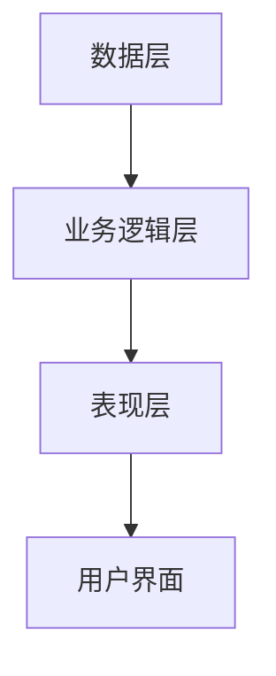
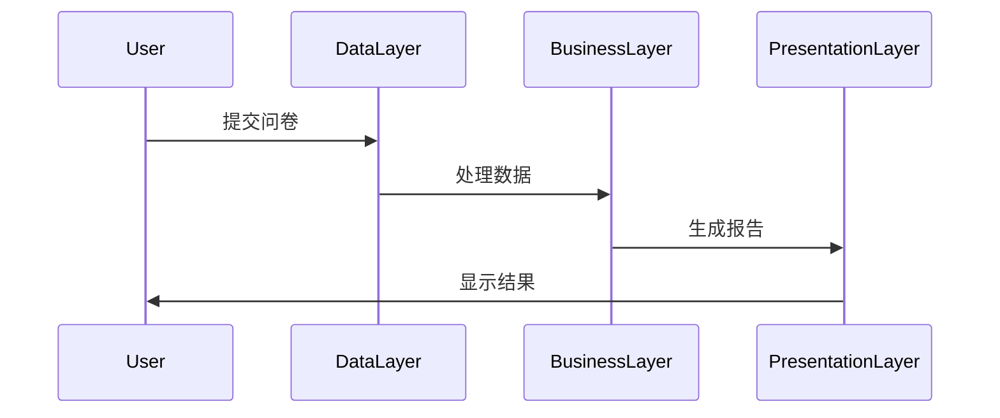

                 


# 彼得林奇如何看待公司的员工满意度

> **关键词**：彼得林奇，员工满意度，企业价值，投资决策，员工绩效，彼得林奇投资哲学

> **摘要**：本文从彼得林奇的投资哲学出发，探讨员工满意度对公司价值的影响。通过分析员工满意度的核心概念、算法原理、系统设计、项目实战及最佳实践，揭示彼得林奇如何将员工满意度纳入投资决策，并提出提升员工满意度的具体方法。

---

## 第一部分: 背景介绍

### 第1章: 员工满意度的核心概念

#### 1.1 什么是员工满意度

##### 1.1.1 员工满意度的定义
员工满意度是指员工对工作环境、薪酬、职业发展、管理风格等方面满足程度的综合评价。高满意度的员工通常表现出更高的生产力和忠诚度。

##### 1.1.2 员工满意度的核心要素
- **工作满意度**：员工对工作的内容和意义的满意程度。
- **薪酬满意度**：员工对薪资和福利的满意程度。
- **上级满意度**：员工对直接上司的沟通和领导风格的满意程度。
- **同事满意度**：员工对团队合作和同事关系的满意程度。
- **工作条件满意度**：员工对工作环境和资源的满意程度。

##### 1.1.3 员工满意度与企业绩效的关系
研究表明，员工满意度与企业绩效呈正相关。满意的员工更有可能主动解决问题，创新并提高效率，从而推动企业增长。

#### 1.2 彼得林奇视角下的员工满意度

##### 1.2.1 彼得林奇的投资哲学
彼得林奇强调基本面分析，认为企业的长期成功取决于管理团队和员工的凝聚力。他关注员工满意度，因为满意的员工能推动企业创新和增长。

##### 1.2.2 员工满意度与企业价值的关系
彼得林奇认为，员工满意度是企业价值的重要指标。高满意度的员工更可能在困难时期保持忠诚，推动企业度过难关，从而提升企业长期价值。

##### 1.2.3 彼得林奇对员工满意度的特别关注
彼得林奇在投资决策中，会评估员工满意度数据，作为判断企业健康的重要依据。他倾向于投资那些员工满意度高的公司，认为这预示着企业具备更强的抗风险能力和增长潜力。

### 第2章: 员工满意度的背景与问题

#### 2.1 当前员工满意度的现状

##### 2.1.1 全球员工满意度的现状分析
全球范围内，员工满意度呈现多样化趋势。发达国家如美国的员工满意度相对较高，而发展中国家则因经济和社会差异，满意度差异较大。

##### 2.1.2 美国员工满意度的特殊性
美国企业普遍重视员工满意度，许多公司定期进行满意度调查，并采取措施提升员工幸福感。这与彼得林奇的投资策略高度契合。

##### 2.1.3 彼得林奇时代员工满意度的背景
在彼得林奇活跃的投资时期，员工满意度逐渐成为企业竞争力的重要指标。他敏锐地意识到这一点，并将其纳入投资分析框架。

#### 2.2 员工满意度的核心问题

##### 2.2.1 员工满意度的核心问题描述
员工满意度受多种因素影响，包括工作环境、薪酬、管理风格等。如何准确测量和提升员工满意度是企业面临的重要挑战。

##### 2.2.2 问题的边界与外延
员工满意度不仅涉及员工个人感受，还影响团队合作、企业文化和创新氛围。因此，提升员工满意度需要系统性的解决方案。

##### 2.2.3 核心概念的结构与组成
员工满意度的结构包括主观和客观因素，主观因素如员工感受，客观因素如薪酬、工作条件等。彼得林奇关注这些因素的综合作用。

### 第3章: 员工满意度与企业价值的关系

#### 3.1 员工满意度对企业价值的影响

##### 3.1.1 员工满意度与企业绩效的正相关性
研究表明，员工满意度高的公司通常业绩更优，利润率更高。满意的员工更积极，工作效率更高。

##### 3.1.2 员工满意度与企业创新的关系
满意的员工更有动力提出创新想法，推动企业技术进步和产品创新，从而增强企业的市场竞争力。

##### 3.1.3 员工满意度与企业长期发展的联系
长期来看，高员工满意度有助于企业吸引和保留优秀人才，形成稳定的团队，为企业的持续发展提供保障。

#### 3.2 彼得林奇视角下的员工满意度分析

##### 3.2.1 彼得林奇对员工满意度的特殊关注
彼得林奇认为，员工满意度是企业健康的重要指标。他在评估公司时，会关注员工满意度数据，认为这反映了企业的管理质量和员工忠诚度。

##### 3.2.2 员工满意度与企业创新的关
彼得林奇注意到，创新能力强的公司通常员工满意度较高。他倾向于投资那些既能创新又能保持员工满意度的公司，认为这些公司具备更强的市场竞争力。

---

## 第二部分: 核心概念与联系

### 第4章: 员工满意度的核心概念原理

#### 4.1 员工满意度的核心要素

##### 4.1.1 工作满意度
工作满意度是员工对工作内容的满意程度。满意的员工更投入，工作效率更高。

##### 4.1.2 薪酬满意度
薪酬满意度影响员工的工作积极性。合理的薪酬体系能有效提升员工满意度，增强企业的凝聚力。

##### 4.1.3 上级满意度
满意的员工通常对直接上司的领导风格和沟通方式满意，这有助于构建良好的上下级关系，促进信息流畅和团队协作。

##### 4.1.4 同事满意度
良好的同事关系有助于营造和谐的工作环境，提升团队合作效率，降低员工流失率。

##### 4.1.5 工作条件满意度
工作条件如办公环境、设备等影响员工的工作体验。舒适的环境能提升员工的工作满意度和效率。

#### 4.2 彼得林奇视角下的员工满意度分析

##### 4.2.1 投资视角下的员工满意度权重
彼得林奇在投资决策中，会将员工满意度作为一个重要考量因素。他认为，高满意度的员工更可能在困难时期保持忠诚，推动企业度过难关。

##### 4.2.2 彼得林奇对员工满意度的特殊关注点
彼得林奇关注员工满意度的具体数据，如员工流失率、员工反馈等，认为这些数据能真实反映企业的管理状况。

##### 4.2.3 彼得林奇对员工满意度的量化方法
彼得林奇通过调查问卷、员工访谈等方式，收集员工满意度数据，并将其与企业绩效指标进行对比分析，以评估员工满意度对企业价值的影响。

### 第5章: 核心概念的属性特征对比

#### 5.1 员工满意度与其他相关概念的对比

##### 5.1.1 员工满意度与员工忠诚度
员工满意度是员工忠诚度的重要基础。满意的员工更可能对企业忠诚，降低流失率。

##### 5.1.2 员工满意度与员工绩效
员工满意度与绩效呈正相关。满意员工的工作积极性高，绩效表现优异。

##### 5.1.3 员工满意度与员工幸福感
员工满意度是员工幸福感的重要组成部分。幸福的员工通常满意度较高，工作体验更佳。

#### 5.2 彼得林奇视角下的员工满意度与其他概念的联系

##### 5.2.1 员工满意度与企业价值的关系
彼得林奇认为，员工满意度高的公司通常具有更高的企业价值，因为这些公司能够吸引和留住优秀人才，推动持续创新和发展。

##### 5.2.2 员工满意度与企业创新的关
高员工满意度的企业更可能鼓励创新，推动产品和技术的不断进步，从而增强企业的市场竞争力。

---

## 第三部分: 算法原理

### 第6章: 算法原理

#### 6.1 员工满意度预测模型

##### 6.1.1 模型的数学公式
$$ \text{员工满意度} = \beta_0 + \beta_1 \times \text{薪酬} + \beta_2 \times \text{工作条件} + \beta_3 \times \text{上级关系} + \epsilon $$

##### 6.1.2 模型的解释
通过回归分析，我们可以量化薪酬、工作条件和上级关系对员工满意度的影响程度，从而预测员工满意度的变化。

##### 6.1.3 算法的实现步骤
1. 收集员工满意度相关数据，包括薪酬、工作条件等。
2. 选择合适的回归模型，如多元线性回归。
3. 使用Python的scikit-learn库进行建模和预测。

#### 6.2 员工满意度算法实现

##### 6.2.1 数据收集与处理
使用调查问卷收集员工满意度数据，包括薪酬、工作条件、上级关系等方面。

##### 6.2.2 算法实现代码
```python
import pandas as pd
from sklearn.linear_model import LinearRegression
from sklearn.metrics import mean_squared_error

# 数据加载
data = pd.read_csv('employee_satisfaction.csv')

# 特征和目标变量
X = data[['salary', 'work_conditions', 'supervisor_relation']]
y = data['satisfaction']

# 模型训练
model = LinearRegression()
model.fit(X, y)

# 预测
y_pred = model.predict(X)

# 评估
 mse = mean_squared_error(y, y_pred)
 print(f"均方误差: {mse}")
```

##### 6.2.3 算法原理的数学模型
通过多元回归分析，我们可以量化各因素对员工满意度的影响，帮助管理者制定有效的改进策略。

---

## 第四部分: 系统设计

### 第7章: 系统设计

#### 7.1 系统功能设计

##### 7.1.1 功能模块
- 调查问卷模块：用于收集员工满意度数据。
- 数据分析模块：对数据进行统计分析，生成报告。
- 改进建议模块：基于分析结果，提出提升员工满意度的建议。

##### 7.1.2 系统架构设计
使用分层架构，包括数据层、业务逻辑层和表现层。数据层负责数据存储和管理，业务逻辑层处理逻辑，表现层提供用户界面。

##### 7.1.3 系统交互流程
1. 用户填写调查问卷。
2. 数据传输到服务器，进行处理和分析。
3. 生成报告，提出改进建议。

#### 7.2 系统架构设计

##### 7.2.1 系统架构图


##### 7.2.2 系统交互流程图


---

## 第五部分: 项目实战

### 第8章: 项目实战

#### 8.1 项目介绍

##### 8.1.1 项目目标
通过实施员工满意度调查和分析，帮助企业提升员工满意度，优化管理策略。

##### 8.1.2 项目范围
涵盖薪酬、工作条件、上级关系等多个方面，提供全面的满意度分析和改进建议。

#### 8.2 系统核心实现

##### 8.2.1 环境安装
需要安装Python、pandas、scikit-learn等库。

##### 8.2.2 核心代码实现
```python
import pandas as pd
from sklearn.linear_model import LinearRegression
from sklearn.metrics import mean_squared_error

# 数据加载
data = pd.read_csv('employee_satisfaction.csv')

# 特征和目标变量
X = data[['salary', 'work_conditions', 'supervisor_relation']]
y = data['satisfaction']

# 模型训练
model = LinearRegression()
model.fit(X, y)

# 预测
y_pred = model.predict(X)

# 评估
 mse = mean_squared_error(y, y_pred)
 print(f"均方误差: {mse}")
```

##### 8.2.3 代码应用解读
该代码使用线性回归模型，分析薪酬、工作条件和上级关系对员工满意度的影响，帮助企业制定有效的管理策略。

#### 8.3 实际案例分析

##### 8.3.1 案例背景
某科技公司面临员工流失率上升的问题，希望通过提升员工满意度来改善这一状况。

##### 8.3.2 数据分析与结果
通过分析，发现薪酬和工作条件是影响员工满意度的主要因素。建议公司优化薪酬结构，改善工作环境。

##### 8.3.3 改进建议
1. 提高员工薪酬，尤其是基层员工的薪资水平。
2. 改善工作环境，提供更好的办公设施和舒适的工作条件。
3. 加强管理者培训，提升上级与员工的沟通效果。

---

## 第六部分: 最佳实践

### 第9章: 最佳实践

#### 9.1 提升员工满意度的关键点

##### 9.1.1 优化薪酬结构
合理设计薪酬体系，确保公平性和竞争力，提升员工的满意度和忠诚度。

##### 9.1.2 改善工作环境
提供舒适的工作环境和先进的设备，营造良好的工作氛围，增强员工的归属感。

##### 9.1.3 加强沟通与反馈
建立畅通的沟通渠道，及时收集员工反馈，解决员工问题，增强员工的参与感和主人翁意识。

#### 9.2 小结

##### 9.2.1 总结
员工满意度是企业价值的重要组成部分。彼得林奇将员工满意度纳入投资决策，认为高满意度的员工能推动企业创新和增长。

##### 9.2.2 注意事项
在实施员工满意度提升措施时，企业需要结合自身实际情况，制定切实可行的策略，确保措施的有效性和可持续性。

#### 9.3 拓展阅读

##### 9.3.1 推荐书籍
1. 《彼得·林奇的成功投资》
2. 《员工满意度与企业绩效》

##### 9.3.2 推荐文章
1. 彼得林奇的投资哲学与员工满意度
2. 如何通过数据分析提升员工满意度

---

## 作者：AI天才研究院/AI Genius Institute & 禅与计算机程序设计艺术 /Zen And The Art of Computer Programming

---

**摘要**：本文从彼得林奇的投资哲学出发，探讨员工满意度对公司价值的影响。通过分析员工满意度的核心概念、算法原理、系统设计、项目实战及最佳实践，揭示彼得林奇如何将员工满意度纳入投资决策，并提出提升员工满意度的具体方法。

**关键词**：彼得林奇，员工满意度，企业价值，投资决策，员工绩效，彼得林奇投资哲学

