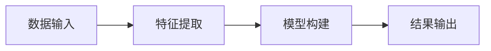
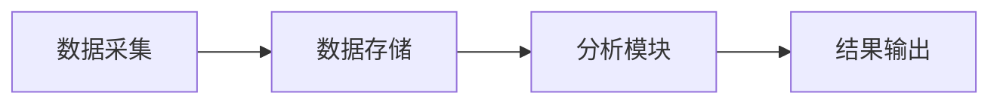

                 


# 彼得林奇如何看待公司的客户粘性

> 关键词：彼得林奇，客户粘性，投资策略，企业分析，竞争优势

> 摘要：本文从彼得·林奇的投资哲学出发，详细探讨了客户粘性在企业价值评估中的重要性。通过分析客户粘性的核心要素、构建分析框架、制定投资策略、案例分析以及系统设计，本文为投资者提供了全面的视角和实用的方法。

---

## 第一章：引言

### 1.1 背景介绍

客户粘性是指客户对企业产品或服务的依赖程度，是企业竞争优势的重要体现。彼得·林奇作为著名投资专家，强调了客户粘性对企业长期价值的影响。本文将从林奇的投资哲学出发，分析客户粘性的核心要素、分析框架和投资策略。

### 1.2 核心概念与术语

- **客户粘性**：客户对企业产品的依赖程度。
- **彼得·林奇**：价值投资倡导者，注重企业竞争优势。

### 1.3 问题背景与重要性

客户粘性影响企业的收入和品牌价值，是企业竞争优势的核心。本文将探讨如何通过客户粘性评估企业投资价值。

---

## 第二章：客户粘性的核心要素

### 2.1 核心要素与属性

客户粘性由多个要素构成，包括产品依赖性、服务满意度、品牌忠诚度等。通过对比分析，明确各要素对客户粘性的影响。

#### 核心要素对比表

| 要素       | 描述                                         |
|------------|--------------------------------------------|
| 产品依赖性 | 产品功能是否满足客户需求                     |
| 服务满意度 | 客户对服务的满意程度                         |
| 品牌忠诚度 | 客户对企业品牌的忠诚度                       |

### 2.2 构建客户粘性分析模型

使用mermaid图展示分析模型，包括数据输入、特征提取、模型构建和结果输出。



---

## 第三章：客户粘性分析的理论基础

### 3.1 客户粘性分析框架

从客户生命周期和价值理论出发，构建分析框架，明确分析指标和方法。

### 3.2 彼得·林奇的客户粘性视角

通过林奇的投资哲学，分析客户粘性在企业估值中的作用，结合竞争优势的判断。

---

## 第四章：客户粘性分析的指标体系

### 4.1 定量指标

包括客户留存率、复购率等，通过公式和图表展示。

#### 例子：客户留存率计算

$$ 客户留存率 = \frac{老客户数量}{老客户 + 新客户} $$

### 4.2 定性指标

如客户满意度，通过NPS评分系统进行评估。

---

## 第五章：客户粘性分析的数学模型

### 5.1 客户生命周期价值模型

$$ CLV = (ARPU \times (1 - 离职率)) / 离职率 $$

### 5.2 客户保留预测模型

使用逻辑回归或决策树进行客户保留预测。

---

## 第六章：系统分析与架构设计

### 6.1 系统架构设计

使用mermaid图展示系统架构，包括数据采集、分析模块和输出模块。



### 6.2 功能模块设计

包括数据清洗、特征提取和模型构建等功能模块。

---

## 第七章：项目实战

### 7.1 环境搭建与数据采集

安装必要的库，如Pandas、Scikit-learn，并收集客户数据。

### 7.2 核心代码实现

使用Python实现客户粘性分析，包括数据处理和模型构建。

```python
import pandas as pd
from sklearn.metrics import accuracy_score

# 数据处理
data = pd.read_csv('customer.csv')
X = data[['feature1', 'feature2']]
y = data['label']

# 模型训练
from sklearn.tree import DecisionTreeClassifier
model = DecisionTreeClassifier()
model.fit(X, y)

# 预测与评估
y_pred = model.predict(X)
print(accuracy_score(y, y_pred))
```

### 7.3 结果解读与分析

通过代码输出结果，分析客户粘性，指导投资决策。

---

## 第八章：总结与展望

### 8.1 总结

客户粘性是企业竞争优势的核心，彼得·林奇的投资策略为投资者提供了重要视角。

### 8.2 展望

未来研究可结合AI技术，提升客户粘性分析的深度和广度。

---

## 参考文献

- 彼得·林奇：《彼得·林奇的投资哲学》
- 其他相关文献和数据来源。

---

作者：AI天才研究院 & 禅与计算机程序设计艺术

