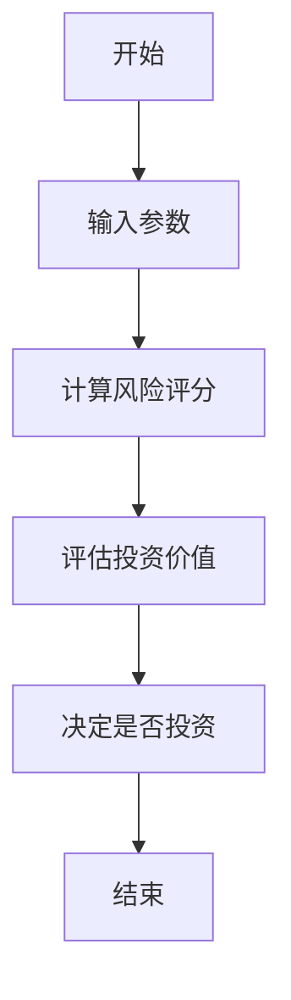
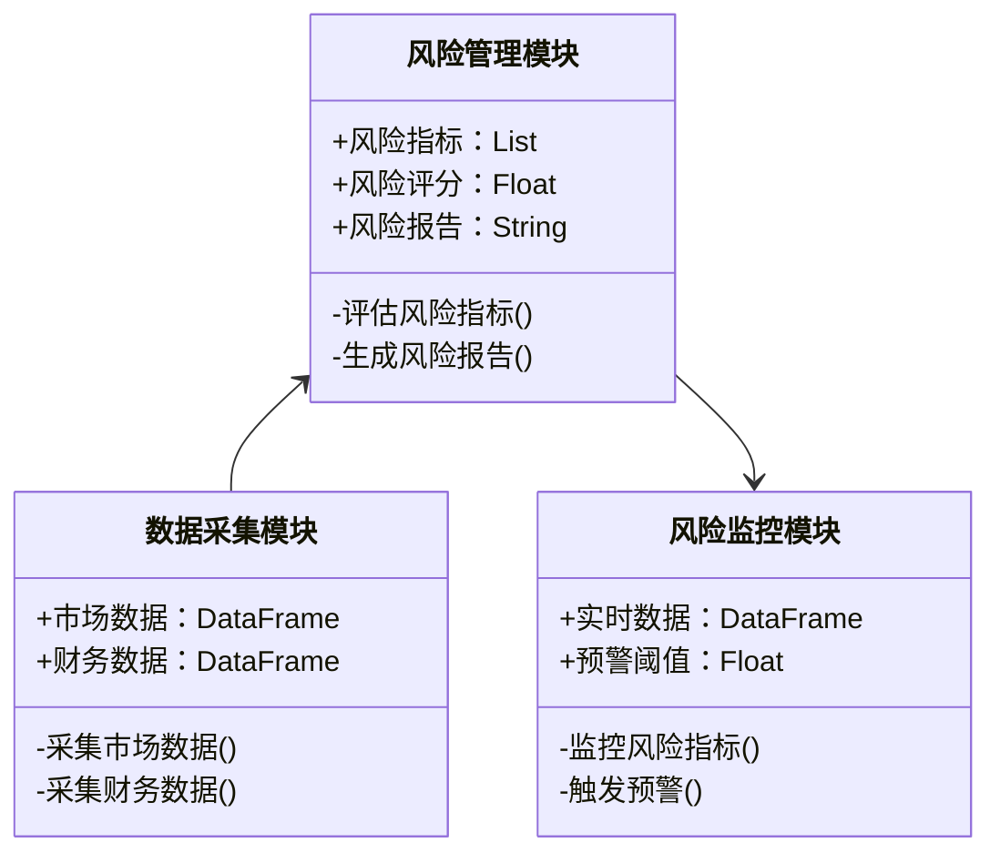

                 


# 彼得林奇如何看待公司的风险管理能力

> 关键词：风险管理，彼得林奇，投资策略，风险管理能力，价值投资，风险管理模型

> 摘要：本文深入探讨了彼得林奇在公司风险管理能力方面的独特见解，结合风险管理的核心概念、数学模型、系统架构以及实际案例，全面解析了如何通过风险管理能力评估框架和价值投资策略来优化公司风险管理。

---

## 第一部分：风险管理的核心概念与重要性

### 第1章：风险管理的核心概念与重要性

#### 1.1 风险管理的基本概念

- **风险的定义与特征**
  - 风险是未来结果的不确定性，可能带来收益或损失。
  - 风险具有普遍性、客观性、可度量性和可控性。

- **风险管理的核心要素**
  - 风险识别：识别潜在风险来源。
  - 风险评估：量化风险的可能性和影响程度。
  - 风险控制：制定和实施风险管理策略。

- **风险管理与企业价值的关系**
  - 良好的风险管理能力可以降低企业失败的概率，提升企业价值。
  - 风险管理是企业长期稳健发展的基石。

#### 1.2 彼得·林奇与风险管理

- **彼得·林奇的投资者背景介绍**
  - 彼得·林奇是美国著名投资经理人，曾管理富达麦哲伦基金，创造了卓越的投资业绩。
  - 他以价值投资著称，注重基本面分析和风险管理。

- **彼得·林奇对风险管理的独特见解**
  - 风险管理是投资成功的关键，而非单纯追求高收益。
  - 风险管理的核心在于识别和避免“永久性资本损失”。

- **风险管理在投资决策中的重要性**
  - 风险管理帮助投资者避免重大损失，确保投资组合的长期稳健增长。
  - 风险管理能力是区分优秀投资者和普通投资者的重要标志。

#### 1.3 本章小结

- 本章介绍了风险管理的基本概念和核心要素，强调了风险管理在企业稳健发展中的重要性。
- 结合彼得·林奇的背景和投资理念，提出了风险管理在投资决策中的独特价值。

---

## 第2章：公司风险管理能力的评估框架

### 第2.1 风险管理能力的核心维度

- **财务风险评估**
  - 利息覆盖倍数（ Interest Coverage Ratio）
  - 负债与资产比率（Debt-to-Asset Ratio）
  - 速动比率（Quick Ratio）

- **经营风险评估**
  - 市场风险：市场需求波动对公司的影响。
  - 运营风险：供应链、生产流程中的潜在风险。
  - 竞争风险：行业竞争格局的变化对公司的威胁。

- **市场风险评估**
  - 行业周期性：行业处于上升期还是衰退期。
  - 宏观经济环境：利率、通货膨胀、政策变化对市场的冲击。

### 第2.2 彼得·林奇的风险评估方法

- **财务指标分析**
  - 净利润增长率：反映公司盈利能力的持续性。
  - 每股收益（EPS）：衡量公司每股的盈利能力。
  - 股东权益回报率（ROE）：评估公司使用股东资金的效率。

- **非财务指标分析**
  - 管理团队的稳定性：优秀管理层是公司稳健发展的关键。
  - 公司治理结构：良好的治理结构有助于降低经营风险。
  - 市场地位：公司在行业中的竞争地位和品牌影响力。

- **行业与市场环境分析**
  - 行业发展趋势：行业是否处于增长期或成熟期。
  - 宏观经济政策：政府政策和法规对行业的潜在影响。
  - 市场容量：市场规模和增长潜力对公司的支持程度。

### 第2.3 风险管理能力的量化评估

- **风险评分模型**
  - 通过加权评分法，将各项风险指标量化为具体的分数。
  - 计算公式：
    $$ \text{风险评分} = \sum (\text{指标权重} \times \text{指标得分}) $$

- **风险与收益的平衡点**
  - 通过风险调整后的净现值（Risk-Adjusted NPV）模型，找到风险与收益的最佳平衡点。
  - 计算公式：
    $$ NPV_{\text{adjusted}} = NPV - \text{风险溢价} $$

### 第2.4 本章小结

- 本章详细介绍了公司风险管理能力的评估框架，包括财务、经营和市场风险的评估维度。
- 结合彼得·林奇的风险评估方法，提出了通过财务指标、非财务指标和市场环境分析来量化公司风险管理能力的模型。

---

## 第3章：风险管理的数学模型与算法原理

### 第3.1 风险评估的数学模型

- **风险值（Risk Value）的计算公式**
  $$ \text{风险值} = \frac{\text{潜在损失}}{\text{损失发生的概率}} $$
  - 例如：某项目潜在损失为100万美元，损失发生的概率为5%，则风险值为20万美元。

- **风险调整后的净现值（Risk-Adjusted NPV）**
  $$ NPV_{\text{adjusted}} = NPV - \text{风险溢价} $$
  - 风险溢价是根据项目风险程度调整的额外收益要求。

### 第3.2 彼得·林奇的选股模型

- **模型输入参数**
  - 股价的市盈率（P/E Ratio）
  - 股价与书值比（Price-to-Book Ratio）
  - 净利润增长率
  - 现金储备情况

- **模型算法流程图**



### 第3.3 本章小结

- 本章通过数学模型和算法流程图，详细阐述了风险管理的量化方法。
- 彼得·林奇的选股模型结合了财务指标和市场环境分析，为投资者提供了有效的风险管理工具。

---

## 第4章：系统分析与架构设计方案

### 第4.1 问题场景介绍

- 某公司面临市场需求波动、供应链不稳定等多重风险，希望通过风险管理系统优化公司运营。

### 第4.2 系统功能设计

- **领域模型（Mermaid 类图）**



### 第4.3 系统架构设计

- **系统架构图（Mermaid 架构图）**

```mermaid
dataclass
    title 系统架构图
    网络层 --> 数据库层
    数据库层 --> 业务逻辑层
    业务逻辑层 --> 用户界面层
    用户界面层 --> 网络层
```

### 第4.4 系统交互设计

- **系统交互图（Mermaid 序列图）**

```mermaid
sequenceDiagram
    participant 用户
    participant 系统
    用户 -> 系统：提交风险管理需求
    系统 -> 用户：确认需求
    用户 -> 系统：提供数据
    系统 -> 数据采集模块：采集数据
    数据采集模块 -> 系统：返回数据
    系统 -> 风险管理模块：评估风险
    风险管理模块 -> 系统：返回风险评分
    系统 -> 用户：生成风险报告
```

### 第4.5 本章小结

- 本章通过系统分析和架构设计，展示了如何将风险管理能力评估框架应用于实际系统中。
- 使用Mermaid图表详细描述了系统模块、架构和交互流程，为实际项目提供了参考。

---

## 第5章：项目实战

### 第5.1 环境安装

- **工具安装**
  - 安装Python和相关库（Pandas、Matplotlib、Seaborn）用于数据分析和可视化。
  - 安装Mermaid CLI用于生成图表。

### 第5.2 系统核心实现源代码

- **风险评分计算代码**

```python
import pandas as pd

def calculate_risk_score(data):
    # 计算风险评分
    risk_score = data['潜在损失'] / data['损失发生的概率']
    return risk_score

# 示例数据
data = {'潜在损失': [1000000, 500000, 200000],
         '损失发生的概率': [0.1, 0.2, 0.3]}
df = pd.DataFrame(data)

# 计算风险评分
risk_scores = calculate_risk_score(df)
print("风险评分结果：")
print(risk_scores)
```

### 第5.3 代码应用解读与分析

- **代码功能解读**
  - 通过输入潜在损失和损失发生的概率，计算每个风险的评分。
  - 风险评分帮助投资者量化风险程度，辅助决策。

### 第5.4 实际案例分析

- **案例分析：假设某公司面临市场需求下降的风险**
  - 数据采集：收集过去三年的销售数据和市场报告。
  - 风险评估：计算市场需求下降对收入的影响程度。
  - 风险管理策略：调整生产计划，优化库存管理。

### 第5.5 本章小结

- 本章通过实际案例和代码实现，展示了风险管理能力评估框架在实际项目中的应用。
- 通过具体操作，读者可以理解如何将理论应用于实践，提升公司的风险管理能力。

---

## 第6章：总结与展望

### 6.1 本章总结

- 本文从风险管理的核心概念出发，结合彼得·林奇的投资理念，提出了公司风险管理能力的评估框架。
- 通过数学模型、系统架构和实际案例，详细阐述了风险管理能力的量化方法和应用实践。

### 6.2 本章展望

- 随着人工智能和大数据技术的发展，未来风险管理将更加智能化和自动化。
- 投资者和企业需要不断优化风险管理模型，应对日益复杂的市场环境。

---

## 作者信息

作者：AI天才研究院/AI Genius Institute & 禅与计算机程序设计艺术/Zen And The Art of Computer Programming

---

感谢您的阅读！如果您对本文内容有疑问或建议，请随时与我们联系。

