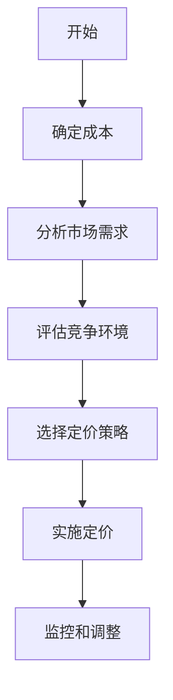
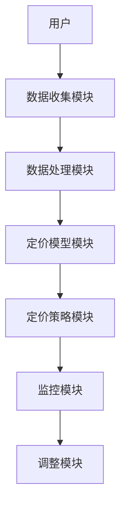

                 


# 彼得林奇对公司定价能力的评估

## 关键词：定价能力，彼得林奇，定价策略，定价模型，投资评估，市场分析

## 摘要：本文探讨彼得·林奇如何评估公司的定价能力，分析定价能力的核心要素、评估指标，以及定价能力对公司的绩效影响。通过数学模型、算法原理和系统架构的详细讲解，结合实际案例，指导读者如何评估和优化公司的定价能力。

---

## 第1章：定价能力评估的背景与重要性

### 1.1 定价能力的核心概念

#### 1.1.1 定价能力的定义
定价能力是指公司在不同市场条件下调整价格，以保持竞争力并最大化利润的能力。有效的定价策略能帮助公司应对成本变化、市场需求波动和竞争环境变化。

#### 1.1.2 定价能力的重要性
定价能力直接影响公司的利润和市场份额。一个拥有强大定价能力的公司能在竞争中占据优势，实现可持续增长。

#### 1.1.3 定价能力的边界与外延
定价能力不仅涉及价格设定，还包括定价策略的执行和调整。外延包括成本控制、市场需求预测和竞争对手分析。

### 1.2 公司定价能力的背景分析

#### 1.2.1 当前市场环境对定价的影响
全球经济波动和供应链问题影响成本，进而影响定价策略。公司需灵活调整价格以应对这些变化。

#### 1.2.2 消费者行为变化与定价策略
消费者行为受经济状况和购买习惯影响，公司需根据这些变化调整定价策略以吸引客户。

#### 1.2.3 行业竞争格局对定价能力的影响
行业竞争激烈程度影响定价能力。在高竞争行业，公司需更灵活地调整价格以保持竞争力。

---

## 第2章：定价能力的核心要素与评估指标

### 2.1 定价能力的核心要素

#### 2.1.1 成本结构分析
公司需分析固定成本和变动成本，确保定价策略既能覆盖成本又具竞争力。

#### 2.1.2 市场需求分析
了解市场需求弹性，确定价格调整对销量的影响，制定合适的价格策略。

#### 2.1.3 竞争对手分析
分析竞争对手的定价策略，制定差异化定价策略，提升市场竞争力。

### 2.2 定价能力的评估指标

#### 2.2.1 市场份额
市场份额高表明公司定价策略有效，能吸引和保留客户。

#### 2.2.2 利润率
高利润率反映定价策略的有效性，确保公司在竞争中获得更高收益。

#### 2.2.3 客户满意度
客户满意度高表明定价策略合理，客户对公司定价接受度高。

---

## 第3章：定价能力与企业绩效的关系

### 3.1 定价能力对企业利润的影响

#### 3.1.1 高定价能力与高利润率的关联
有效的定价策略能提高产品附加值，增加利润。

#### 3.1.2 低定价能力对企业利润的负面影响
定价过低可能导致利润减少，影响公司长期发展。

### 3.2 定价能力与市场份额的关系

#### 3.2.1 高定价能力如何提升市场份额
通过合理定价，公司能吸引更多的客户，扩大市场份额。

#### 3.2.2 低价策略的局限性
低价策略可能导致利润率下降，难以支撑公司的长期发展。

---

## 第4章：定价能力评估的核心概念与联系

### 4.1 定价能力的评估指标对比

| 核心要素   | 成本结构 | 市场需求 | 竞争环境 |
|------------|----------|----------|----------|
| 影响因素   | 成本变动 | 需求弹性 | 竞争对手定价 |

#### 4.1.2 图表展示：定价能力的多维分析
（使用Mermaid绘制图表）

### 4.2 定价能力的ER实体关系图

```mermaid
erd
  entity 公司 {
    id
    名称
  }
  entity 产品 {
    id
    类型
  }
  entity 价格 {
    id
    价格
  }
  entity 市场 {
    id
    区域
  }
  entity 客户 {
    id
    满意度
  }
  公司 -[拥有]-> 产品
  产品 -[定价]-> 价格
  价格 -[影响]-> 市场
  市场 -[影响]-> 客户
  客户 -[反馈]-> 公司
```

---

## 第5章：定价能力评估的算法原理

### 5.1 定价模型的构建

#### 5.1.1 成本加成定价法
基于成本加上合理利润制定价格。

#### 5.1.2 价值定价法
根据产品价值和市场需求制定价格。

#### 5.1.3 需求弹性定价法
根据价格弹性调整价格以最大化收益。

### 5.2 定价模型的实现

#### 5.2.1 Mermaid流程图：定价模型构建步骤



#### 5.2.2 Python代码实现：简单定价模型

```python
def calculate_price(cost, demand, competitor_price):
    # 成本加成定价法
    price = cost * 1.2  # 成本加成20%
    # 考虑市场需求和竞争价格
    if demand > 100 and competitor_price < price:
        price *= 1.1  # 提高价格10%
    return price

# 示例
cost = 50
demand = 150
competitor_price = 40
print(calculate_price(cost, demand, competitor_price))
```

---

## 第6章：定价能力评估的数学模型与公式

### 6.1 需求函数模型

#### 需求函数公式：$$Q = a - bP$$

- Q：需求量
- a：最大需求量
- b：价格弹性系数
- P：价格

#### 例子：假设a=100，b=2，P=20，计算Q=60。

### 6.2 利润最大化模型

#### 利润公式：$$\text{利润} = (P - C) \times Q$$

- C：单位成本
- P：价格
- Q：需求量

---

## 第7章：系统分析与架构设计方案

### 7.1 问题场景介绍
设计一个系统，帮助公司评估和优化定价能力。

### 7.2 系统功能设计

#### 功能模块：
- 数据收集与处理
- 定价模型构建
- 定价策略制定
- 监控与调整

### 7.3 系统架构设计



---

## 第8章：项目实战

### 8.1 环境安装
安装Python和相关库，如NumPy和Pandas。

### 8.2 核心代码实现

#### 数据收集与处理
```python
import pandas as pd

data = pd.read_csv('pricing_data.csv')
# 数据预处理
data_cleaned = data.dropna()
```

#### 模型训练与评估
```python
from sklearn.linear_model import LinearRegression

model = LinearRegression()
model.fit(X_train, y_train)
```

#### 结果分析
```python
import matplotlib.pyplot as plt

plt.scatter(X_test, y_test, color='r')
plt.plot(X_test, model.predict(X_test), color='b')
plt.show()
```

### 8.3 案例分析与详细解读
分析某公司的定价策略，展示如何通过模型优化定价。

---

## 第9章：最佳实践与总结

### 9.1 最佳实践 tips
- 定期监控市场和竞争环境。
- 灵活调整定价策略。
- 投资定价能力的培训和工具。

### 9.2 小结
定价能力是公司成功的关键因素，通过科学的方法和工具，公司能有效提升定价能力，实现利润和市场份额的双重目标。

### 9.3 注意事项
- 定价策略需考虑公司整体战略。
- 数据分析是定价决策的重要依据。

### 9.4 拓展阅读
推荐书籍和资源，深入学习定价策略和模型。

---

## 作者：AI天才研究院 & 禅与计算机程序设计艺术

---

通过以上内容，我们详细探讨了彼得·林奇对公司定价能力的评估，从理论到实践，帮助读者全面理解并应用定价能力评估的方法。

