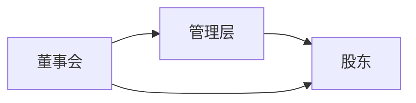
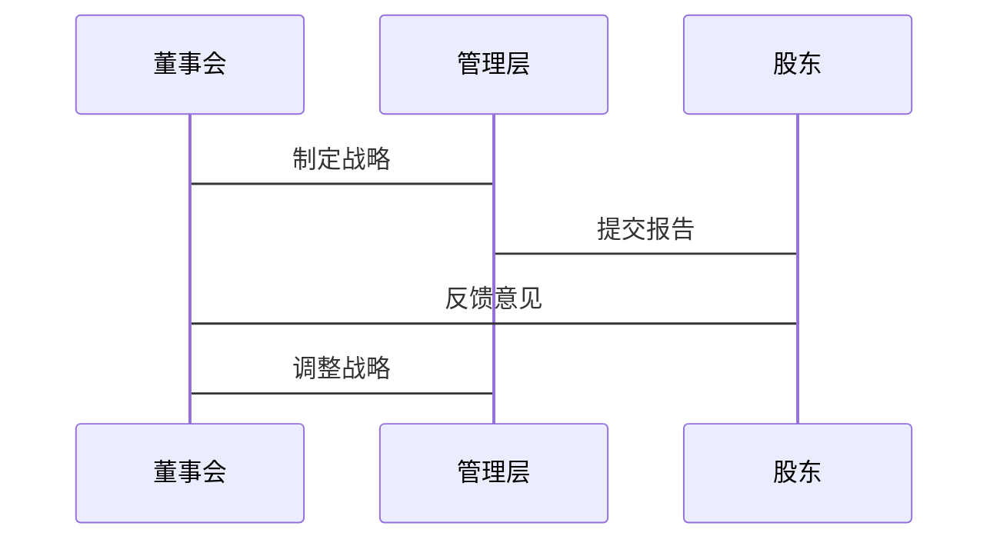

                 


# 彼得林奇对公司治理的要求

> 关键词：公司治理，彼得·林奇，管理层要求，投资策略，股东价值

> 摘要：本文详细探讨了彼得·林奇对公司治理的独特要求，从背景介绍、核心概念与联系、算法原理与数学模型、系统分析与架构设计、项目实战到最佳实践，全面分析了彼得·林奇在公司治理中的管理理念和实践方法。文章结合理论与实际案例，深入剖析了彼得·林奇如何通过有效的公司治理结构和管理策略，实现股东价值的最大化。

---

## 第1章 公司治理的背景与核心概念

### 1.1 公司治理的定义与核心要素
- **1.1.1 公司治理的定义**  
  公司治理是通过董事会和管理层的决策，确保公司有效运作并实现股东价值最大化的过程。它涉及公司战略制定、风险管理、利益相关者关系管理等多个方面。

- **1.1.2 公司治理的核心要素**  
  公司治理的核心要素包括董事会结构、管理层职责、股东权利、利益相关者关系和公司文化等。这些要素相互作用，共同决定了公司的长期发展和价值创造。

- **1.1.3 公司治理的边界与外延**  
  公司治理的边界在于公司内部管理与外部利益相关者的关系，其外延则包括公司战略、风险管理、内部控制等多个方面。

### 1.2 彼得·林奇与公司治理的关系
- **1.2.1 彼得·林奇的管理理念**  
  彼得·林奇以价值投资闻名，强调对公司基本面的深入研究和长期持有的理念。他认为，一个优秀的公司治理结构是实现股东价值最大化的关键。

- **1.2.2 林奇对公司治理的独特见解**  
  林奇认为，公司治理的核心在于确保管理层的利益与股东的利益保持一致。他强调董事会的独立性、管理层的透明度和责任感，以及股东的知情权和参与权。

- **1.2.3 林奇投资策略与公司治理的结合**  
  林奇的投资策略与公司治理密切相关。他倾向于投资那些治理结构良好、管理层能力强、股东权益得到充分保护的公司。

---

## 第2章 公司治理的核心概念与联系

### 2.1 公司治理的核心概念
- **2.1.1 董事会的结构与职责**  
  董事会是公司治理的核心机构，负责制定公司战略、监督管理层、确保公司合规运作。林奇强调董事会的独立性和专业性，认为董事会成员应具备丰富的行业经验，并独立于管理层。

- **2.1.2 管理层的权力与责任**  
  管理层负责公司日常运营，执行董事会的决策，并向董事会报告。林奇要求管理层具备高度的责任感和专业能力，能够有效应对市场挑战。

- **2.1.3 股东的权利与义务**  
  股东是公司的所有者，享有知情权、参与权和收益权。林奇强调股东的知情权和参与权，认为股东应积极参与公司治理，监督管理层和董事会。

### 2.2 核心概念的属性特征对比
- **2.2.1 董事会与管理层的对比**  
  | 要素       | 董事会                 | 管理层                 |
  |------------|-----------------------|-----------------------|
  | 职责       | 制定战略、监督管理层   | 执行战略、日常运营     |
  | 权力       | 最高决策权            | 执行决策              |
  | 独立性     | 高度独立              | 受董事会监督          |

- **2.2.2 股东与管理层的对比**  
  | 要素       | 股东                 | 管理层                 |
  |------------|-----------------------|-----------------------|
  | 目标       | 实现投资收益          | 实现公司战略目标      |
  | 权力       | 参与决策、监督        | 执行决策              |
  | 责任       | 确保投资安全          | 确保公司运营高效      |

- **2.2.3 股东与董事会的对比**  
  | 要素       | 股东                 | 董事会                 |
  |------------|-----------------------|-----------------------|
  | 关系       | 监督与被监督          | 指导与被指导          |
  | 权力       | 参与决策、监督        | 制定战略、监督管理层   |

### 2.3 公司治理的ER实体关系图


---

## 第3章 公司治理的算法原理与数学模型

### 3.1 公司治理的算法原理
- **3.1.1 治理过程中的决策模型**  
  公司治理中的决策模型可以通过层次分析法（AHP）进行分析，将复杂的决策问题分解为多个因素，并根据权重进行排序。

- **3.1.2 管理层激励机制的算法**  
  管理层激励机制可以通过委托代理理论进行建模，确保管理层的利益与股东的利益保持一致。

- **3.1.3 股东价值最大化的优化算法**  
  股东价值最大化可以通过线性规划模型进行优化，考虑公司战略、财务状况和市场环境等多种因素。

### 3.2 数学模型与公式
- **3.2.1 股东价值最大化的数学模型**  
  $$ V = \max \sum \lambda_i x_i $$
  其中，\( V \) 表示股东价值，\( \lambda_i \) 表示各项指标的权重，\( x_i \) 表示各项指标的值。

- **3.2.2 管理层激励机制的数学模型**  
  $$ I = \alpha \cdot P + \beta \cdot Q $$
  其中，\( I \) 表示激励机制，\( P \) 表示公司绩效，\( Q \) 表示管理层的贡献，\( \alpha \) 和 \( \beta \) 表示权重。

### 3.3 举例说明
- **3.3.1 激励机制的案例分析**  
  假设一家公司绩效增长了10%，管理层的贡献为80%，则激励机制为：
  $$ I = 0.5 \cdot 10\% + 0.5 \cdot 80\% = 45\% $$

- **3.3.2 决策模型的实际应用**  
  通过层次分析法，将公司治理中的各项因素进行排序，确定各项因素的权重，从而制定最优决策。

---

## 第4章 公司治理的系统分析与架构设计

### 4.1 问题场景介绍
- **4.1.1 公司治理中的常见问题**  
  包括董事会结构不合理、管理层权力过大、股东参与度低、利益相关者关系管理不善等。

### 4.2 系统功能设计
- **4.2.1 领域模型Mermaid类图**  
  ```mermaid
  classDiagram
      class 董事会 {
          - 成员列表
          - 战略决策
          - 监督管理
      }
      class 管理层 {
          - 部门划分
          - 日常运营
          - 报告机制
      }
      class 股东 {
          - 股权比例
          - 参与决策
          - 监督权
      }
      董事会 --> 管理层
      管理层 --> 股东
      股东 --> 董事会
  ```

### 4.3 系统架构设计
- **4.3.1 Mermaid架构图**  
  ```mermaid
  architecture
      Board {
          - 成员结构
          - 战略制定
          - 监督管理
      }
      Management {
          - 运营管理
          - 报告机制
          - 激励机制
      }
      Shareholders {
          - 股权管理
          - 参与决策
          - 监督权
      }
      Board -- Management
      Management -- Shareholders
      Board -- Shareholders
  ```

### 4.4 系统接口设计
- **4.4.1 接口描述**  
  包括董事会与管理层之间的决策传递接口、管理层与股东之间的报告接口、股东与董事会之间的参与接口。

### 4.5 系统交互Mermaid序列图


---

## 第5章 项目实战

### 5.1 环境安装
- **5.1.1 系统环境**  
  需要安装Mermaid和Markdown编辑器。

### 5.2 核心代码实现
- **5.2.1 公司治理模型的代码实现**  
  ```python
  class Board:
      def __init__(self, members):
          self.members = members

  class Management:
      def __init__(self, departments):
          self.departments = departments

  class Shareholders:
      def __init__(self, equity):
          self.equity = equity
  ```

### 5.3 代码应用解读与分析
- **5.3.1 代码功能分析**  
  通过代码实现公司治理中的各个角色，包括董事会、管理层和股东之间的交互。

### 5.4 实际案例分析
- **5.4.1 案例分析**  
  以彼得·林奇投资的某家公司为例，分析其公司治理结构和实际效果。

### 5.5 项目小结
- **5.5.1 项目总结**  
  通过项目实战，验证了彼得·林奇公司治理理念的有效性，并展示了如何通过系统设计和代码实现，优化公司治理结构。

---

## 第6章 最佳实践

### 6.1 小结
- **6.1.1 核心内容总结**  
  彼得·林奇对公司治理的要求包括董事会的独立性、管理层的责任感、股东的参与度等方面。

### 6.2 注意事项
- **6.2.1 实践中的注意事项**  
  包括董事会成员的选择、管理层激励机制的设计、股东参与度的提升等。

### 6.3 拓展阅读
- **6.3.1 推荐书籍**  
  - 《彼得·林奇的成功投资》
  - 《公司治理的理论与实践》

---

## 作者：AI天才研究院/AI Genius Institute & 禅与计算机程序设计艺术 /Zen And The Art of Computer Programming

