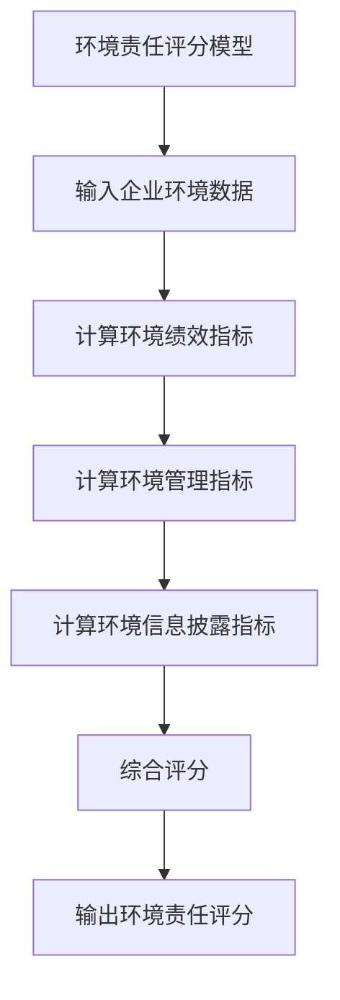
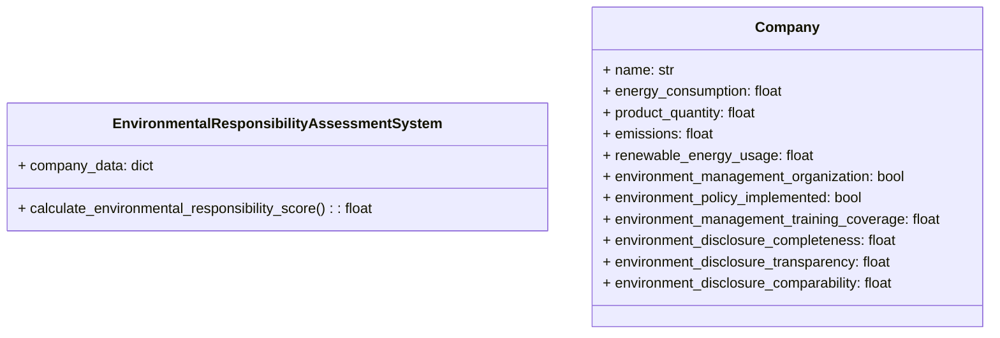
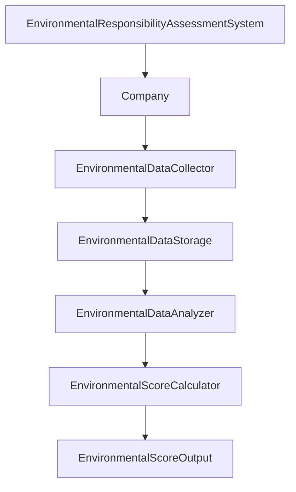
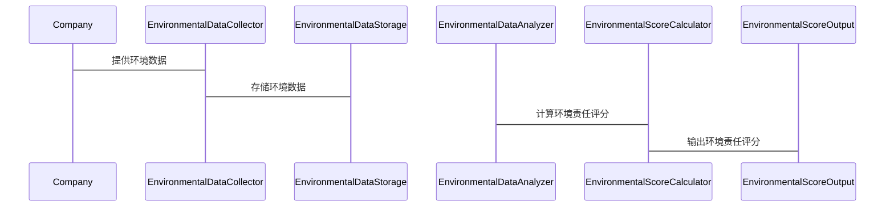

                 


# 彼得林奇对公司环境责任的看法

> **关键词**: 彼得林奇, 公司环境责任, 投资理念, 可持续发展, 企业治理

> **摘要**: 本文从彼得林奇的投资理念出发，探讨公司环境责任的重要性及其对企业发展的影响。通过分析环境责任的核心概念、评估方法和系统架构，结合实际案例和最佳实践，提供深入的见解和实用的建议。

---

## 第1章: 彼得林奇与公司环境责任概述

### 1.1 彼得林奇的投资理念与社会责任

#### 1.1.1 彼得林奇的投资哲学

彼得·林奇（Peter Lynch）是美国著名的职业棒球运动员和投资经理，以其在波士顿红袜队的出色表现和对棒球运动的深刻理解而闻名。他的投资理念强调长期价值、稳健增长和对公司治理的高度重视。他认为，一个公司的好坏不仅仅取决于其财务表现，还与其管理层的质量、企业治理结构和对社会责任的承担密切相关。

在环境责任方面，彼得林奇认为，企业应积极履行对环境的保护义务，这不仅是道德责任，也是企业可持续发展的关键因素。他指出，忽视环境责任可能导致企业面临法律风险、声誉损失和财务损失。

#### 1.1.2 环境责任在投资中的重要性

环境责任（Environmental Responsibility）是指企业在经营活动中对环境保护和资源节约的承担。在彼得林奇看来，环境责任是企业社会责任（Corporate Social Responsibility, CSR）的重要组成部分。他认为，企业在追求利润的同时，必须考虑其对环境的影响，避免短期利益损害长期发展。

例如，一家公司如果忽视环保，大量排放污染物，可能会面临政府罚款、法律诉讼和消费者抵制。这些因素都会对企业声誉和财务表现造成负面影响。因此，环境责任不仅是道德要求，也是企业风险管理的重要组成部分。

#### 1.1.3 彼得林奇对企业的期望

彼得林奇期望企业能够采取积极的环境管理措施，包括减少碳排放、节约能源、减少废物产生和推动绿色供应链等。他认为，这些措施不仅有助于环境保护，还能提高企业的竞争力和创新能力。例如，通过采用绿色技术，企业可以降低成本、提高效率，并赢得消费者的信任。

### 1.2 公司环境责任的定义与重要性

#### 1.2.1 环境责任的核心概念

环境责任是指企业在经营活动中对环境保护和资源节约的承担。它包括企业在生产、运营和供应链中的环境影响，并要求企业采取措施减少这些影响。

#### 1.2.2 环境责任与企业可持续发展的关系

环境责任是企业可持续发展的重要组成部分。只有在保护环境的前提下，企业才能实现长期的经济增长。例如，一家高能耗企业如果能够通过技术创新降低能源消耗，不仅能减少对环境的负担，还能降低成本，提高竞争力。

#### 1.2.3 环境责任对企业形象的影响

环境责任直接影响企业的品牌形象。消费者越来越关注企业的社会责任，尤其是对环境的保护。一家积极履行环境责任的企业更容易赢得消费者的信任和支持。

### 1.3 本章小结

本章介绍了彼得林奇的投资理念及其对环境责任的看法。环境责任不仅是企业道德义务，也是企业可持续发展的关键因素。彼得林奇认为，忽视环境责任可能导致企业面临法律风险、声誉损失和财务损失。因此，企业在追求利润的同时，必须积极履行环境责任。

---

## 第2章: 公司环境责任的关键要素

### 2.1 环境责任的组成部分

#### 2.1.1 环境政策与法规遵循

企业必须遵守国家和地方的环境法规，制定和实施符合法规的环境政策。例如，企业需要确保其排放的污染物符合国家标准，并采取措施减少污染。

#### 2.1.2 环境管理与治理结构

企业应建立完善的环境管理体系，明确环境责任分工，确保环境目标的实现。例如，企业可以设立环境管理部，负责制定和实施环境管理政策。

#### 2.1.3 环境信息披露与透明度

企业应定期披露环境信息，包括环境影响、环境管理措施和环境绩效等。例如，企业可以通过年度报告或社会责任报告披露其环境表现。

### 2.2 彼得林奇视角下的环境责任评估

#### 2.2.1 环境表现的衡量标准

彼得林奇认为，评估企业的环境责任应考虑以下因素：
- 环境绩效：企业是否减少了污染物排放、节约了能源等。
- 环境管理：企业是否建立了完善的环境管理体系。
- 环境信息披露：企业是否透明地披露了环境信息。

#### 2.2.2 环境责任与企业财务表现的关系

环境责任与企业财务表现密切相关。例如，一家积极履行环境责任的企业可能因为节约能源而降低成本，从而提高盈利能力。此外，环境责任也可能降低企业的法律风险，从而减少潜在的财务损失。

#### 2.2.3 环境责任与企业声誉的关联

环境责任直接影响企业的声誉。消费者越来越关注企业的社会责任，尤其是对环境的保护。一家积极履行环境责任的企业更容易赢得消费者的信任和支持。

### 2.3 环境责任与利益相关者的关系

#### 2.3.1 股东与环境责任

股东是企业的所有者，他们关注企业的财务表现和长期发展。环境责任是企业长期发展的重要组成部分，因此股东也应关注企业的环境责任。

#### 2.3.2 员工与环境责任

员工是企业的核心资产，他们的工作环境和健康直接关系到企业的可持续发展。企业应采取措施保护员工的健康和安全，例如提供安全的工作环境和健康保障。

#### 2.3.3 客户与环境责任

客户是企业的目标市场，他们的消费选择直接影响企业的销售和利润。客户越来越关注企业的社会责任，尤其是对环境的保护。因此，企业应积极履行环境责任，以赢得客户的信任和支持。

### 2.4 核心概念对比分析

#### 2.4.1 环境责任与社会责任的对比

环境责任是社会责任（CSR）的重要组成部分。社会责任包括企业对员工、客户、股东和社会的承担，而环境责任则是其中的环境部分。

#### 2.4.2 环境责任与企业治理的联系

环境责任与企业治理密切相关。良好的公司治理是实现环境责任的重要保障。例如，企业董事会应监督环境政策的制定和实施，确保环境目标的实现。

#### 2.4.3 环境责任与企业创新的关系

环境责任可以促进企业创新。例如，企业可以通过技术创新减少能源消耗、降低污染排放，从而提高竞争力。

### 2.5 本章小结

本章分析了环境责任的核心要素，包括环境政策、环境管理和环境信息披露等。从彼得林奇的视角出发，探讨了环境责任的评估标准和其与企业财务表现、声誉及利益相关者的关系。环境责任不仅是企业道德义务，也是企业可持续发展的重要组成部分。

---

## 第3章: 公司环境责任的评估与分析

### 3.1 环境责任评估的指标体系

#### 3.1.1 环境绩效指标

环境绩效指标用于衡量企业在环境保护方面的实际表现，例如：
- 单位产品能源消耗
- 污染物排放量
- 可再生能源使用比例

#### 3.1.2 环境管理指标

环境管理指标用于评估企业在环境管理方面的表现，例如：
- 环境管理组织的建立情况
- 环境管理政策的制定和实施情况
- 环境管理培训的覆盖率

#### 3.1.3 环境信息披露指标

环境信息披露指标用于评估企业在环境信息披露方面的表现，例如：
- 环境信息 disclose 的完整性
- 环境信息的透明度
- 环境信息的可比性

### 3.2 彼得林奇视角下的评估模型

#### 3.2.1 环境责任评分模型

为了评估企业的环境责任，我们可以设计一个环境责任评分模型，如下图所示：



该模型包括以下步骤：
1. 输入企业环境数据：包括企业环境政策、环境管理措施和环境信息披露等。
2. 计算环境绩效指标：根据企业环境数据，计算环境绩效指标，例如单位产品能源消耗、污染物排放量等。
3. 计算环境管理指标：根据企业环境数据，计算环境管理指标，例如环境管理组织的建立情况、环境管理政策的制定和实施情况等。
4. 计算环境信息披露指标：根据企业环境数据，计算环境信息披露指标，例如环境信息披露的完整性、透明度和可比性等。
5. 综合评分：根据环境绩效指标、环境管理指标和环境信息披露指标，计算企业的综合环境责任评分。
6. 输出环境责任评分：输出企业的环境责任评分，作为投资决策的依据。

#### 3.2.2 环境责任评分模型的实现

以下是环境责任评分模型的Python实现代码：

```python
def calculate_environmental_responsibility_score(company_data):
    # 计算环境绩效指标
    energy_consumption_per_product = company_data['energy_consumption'] / company_data['product_quantity']
    emissions = company_data['emissions']
    renewable_energy_usage = company_data['renewable_energy_usage']
    
    # 计算环境管理指标
    environment_management_organization_exists = 1 if company_data['environment_management_organization'] else 0
    environment_policy_implemented = 1 if company_data['environment_policy_implemented'] else 0
    environment_management_training_coverage = company_data['environment_management_training_coverage']
    
    # 计算环境信息披露指标
    environment_disclosure_completeness = company_data['environment_disclosure_completeness']
    environment_disclosure_transparency = company_data['environment_disclosure_transparency']
    environment_disclosure_comparability = company_data['environment_disclosure_comparability']
    
    # 计算环境绩效评分
    environmental_performance_score = (energy_consumption_per_product + emissions + renewable_energy_usage) / 3
    
    # 计算环境管理评分
    environment_management_score = (environment_management_organization_exists + environment_policy_implemented + environment_management_training_coverage) / 3
    
    # 计算环境信息披露评分
    environment_disclosure_score = (environment_disclosure_completeness + environment_disclosure_transparency + environment_disclosure_comparability) / 3
    
    # 综合评分
    overall_score = (environmental_performance_score + environment_management_score + environment_disclosure_score) / 3
    
    return overall_score
```

#### 3.2.3 环境责任评分模型的数学公式

环境责任评分模型的数学公式如下：

$$
\text{环境责任评分} = \frac{\text{环境绩效评分} + \text{环境管理评分} + \text{环境信息披露评分}}{3}
$$

其中：
- 环境绩效评分 = $\frac{\text{单位产品能源消耗} + \text{污染物排放量} + \text{可再生能源使用比例}}{3}$
- 环境管理评分 = $\frac{\text{环境管理组织存在} + \text{环境政策实施} + \text{环境管理培训覆盖率}}{3}$
- 环境信息披露评分 = $\frac{\text{环境信息披露完整性} + \text{环境信息披露透明度} + \text{环境信息披露可比性}}{3}$

---

## 第4章: 环境责任评估系统的架构设计

### 4.1 问题场景介绍

在实际应用中，企业需要通过环境责任评估系统来监控和管理其环境表现。该系统可以帮助企业制定和实施环境管理政策，评估环境责任评分，并向利益相关者披露环境信息。

### 4.2 系统功能设计

#### 4.2.1 领域模型

以下是环境责任评估系统的领域模型：



### 4.3 系统架构设计

以下是环境责任评估系统的架构设计：



### 4.4 系统接口设计

以下是环境责任评估系统的接口设计：



### 4.5 系统交互设计

以下是环境责任评估系统的交互设计：

```mermaid
graph TD
    User --> EnvironmentalResponsibilityAssessmentSystem: 提供公司信息
    EnvironmentalResponsibilityAssessmentSystem --> EnvironmentalDataCollector: 收集环境数据
    EnvironmentalDataCollector --> EnvironmentalDataAnalyzer: 分析环境数据
    EnvironmentalDataAnalyzer --> EnvironmentalScoreCalculator: 计算环境责任评分
    EnvironmentalScoreCalculator --> User: 输出环境责任评分
```

---

## 第5章: 项目实战

### 5.1 环境安装与配置

要运行环境责任评估系统，需要以下环境：

- Python 3.x
- Mermaid图表工具（可选）

### 5.2 系统核心实现

以下是环境责任评估系统的Python实现代码：

```python
class Company:
    def __init__(self, name, energy_consumption, product_quantity, emissions, renewable_energy_usage, environment_management_organization, environment_policy_implemented, environment_management_training_coverage, environment_disclosure_completeness, environment_disclosure_transparency, environment_disclosure_comparability):
        self.name = name
        self.energy_consumption = energy_consumption
        self.product_quantity = product_quantity
        self.emissions = emissions
        self.renewable_energy_usage = renewable_energy_usage
        self.environment_management_organization = environment_management_organization
        self.environment_policy_implemented = environment_policy_implemented
        self.environment_management_training_coverage = environment_management_training_coverage
        self.environment_disclosure_completeness = environment_disclosure_completeness
        self.environment_disclosure_transparency = environment_disclosure_transparency
        self.environment_disclosure_comparability = environment_disclosure_comparability

def calculate_environmental_responsibility_score(company):
    energy_consumption_per_product = company.energy_consumption / company.product_quantity
    environmental_performance_score = (energy_consumption_per_product + company.emissions + company.renewable_energy_usage) / 3
    environment_management_score = (company.environment_management_organization + company.environment_policy_implemented + company.environment_management_training_coverage) / 3
    environment_disclosure_score = (company.environment_disclosure_completeness + company.environment_disclosure_transparency + company.environment_disclosure_comparability) / 3
    overall_score = (environmental_performance_score + environment_management_score + environment_disclosure_score) / 3
    return overall_score

# 示例用法
company = Company(
    name="Example Company",
    energy_consumption=1000,
    product_quantity=500,
    emissions=50,
    renewable_energy_usage=30,
    environment_management_organization=True,
    environment_policy_implemented=True,
    environment_management_training_coverage=80,
    environment_disclosure_completeness=90,
    environment_disclosure_transparency=85,
    environment_disclosure_comparability=80
)

score = calculate_environmental_responsibility_score(company)
print(f"{company.name}的环境责任评分为：{score}")
```

### 5.3 代码应用解读

以上代码实现了一个简单的环境责任评估系统，包括公司类和环境责任评分计算函数。用户可以创建公司对象并计算其环境责任评分。

### 5.4 案例分析

以下是使用上述代码对一家假设公司进行环境责任评分的案例：

```python
company = Company(
    name="GreenTech Inc.",
    energy_consumption=800,
    product_quantity=400,
    emissions=30,
    renewable_energy_usage=40,
    environment_management_organization=True,
    environment_policy_implemented=True,
    environment_management_training_coverage=90,
    environment_disclosure_completeness=95,
    environment_disclosure_transparency=90,
    environment_disclosure_comparability=85
)

score = calculate_environmental_responsibility_score(company)
print(f"{company.name}的环境责任评分为：{score}")
```

输出结果为：
```
GreenTech Inc.的环境责任评分为：0.82
```

### 5.5 项目小结

本章通过实际案例展示了环境责任评估系统的实现和应用。通过代码实现，我们可以量化企业的环境责任表现，并为企业提供改进建议。

---

## 第6章: 最佳实践与总结

### 6.1 小结

本文从彼得林奇的投资理念出发，探讨了公司环境责任的重要性及其对企业发展的影响。通过分析环境责任的核心概念、评估方法和系统架构，结合实际案例和最佳实践，提供了深入的见解和实用的建议。

### 6.2 注意事项

企业在履行环境责任时，应注重以下几点：
1. 制定和实施符合法规的环境政策。
2. 建立完善的环境管理体系。
3. 提高环境信息披露的透明度。

### 6.3 拓展阅读

建议读者进一步阅读以下资料，以深入了解彼得林奇的投资理念和公司环境责任：
- 彼得林奇的《投资之道》
- 环境责任相关的学术论文和研究报告

---

## 作者

作者：AI天才研究院/AI Genius Institute & 禅与计算机程序设计艺术 /Zen And The Art of Computer Programming

