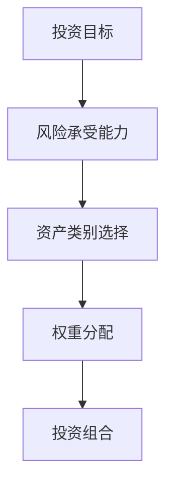
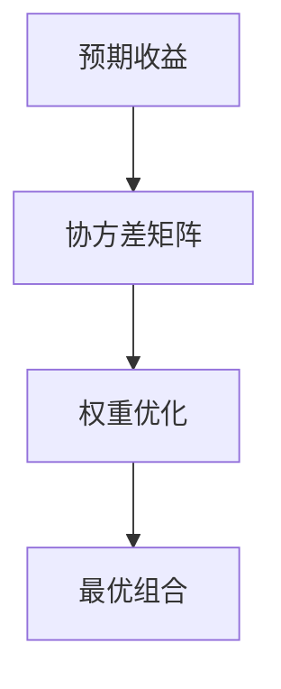
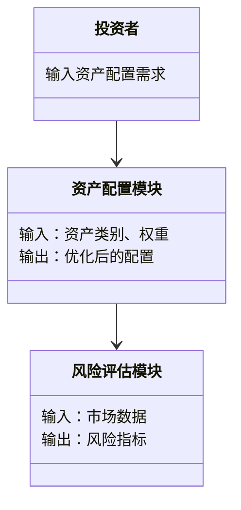
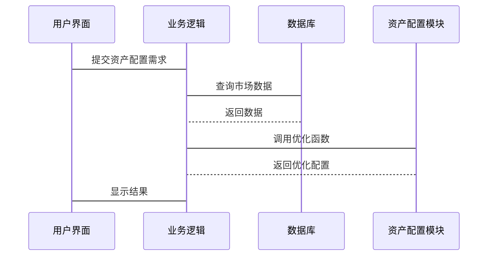

                 


# 彼得林奇的多元化投资组合

**关键词**：多元化投资组合、彼得林奇、投资策略、风险管理、资产配置

**摘要**：本文深入探讨了彼得林奇的多元化投资组合策略，分析了其核心理念、数学模型、系统架构以及实际案例，帮助读者全面理解如何构建和优化一个成功的投资组合。

---

## 第一部分: 引言

### 1.1 多元化投资组合的核心理念

#### 1.1.1 投资组合的基本概念
投资组合是指将多种资产（如股票、债券、基金等）按一定比例配置在一起，以实现风险分散和收益最大化的一种投资方式。通过多元化配置，投资者可以降低单一资产带来的风险。

#### 1.1.2 多元化投资的重要性
单一投资的风险较高，而多元化投资通过分散投资于不同资产类别，可以有效降低整体投资组合的波动性和风险。

#### 1.1.3 彼得林奇的投资风格概述
彼得林奇以其长期投资和价值发现策略闻名，他强调通过研究和分析，选择具有长期增长潜力的公司进行投资。

### 1.2 本书的目的与结构

#### 1.2.1 本书的核心目标
本文旨在通过分析彼得林奇的投资策略，帮助读者掌握多元化投资的原理和实践方法。

#### 1.2.2 目录结构概览
文章将从投资组合的基本概念、数学模型、系统架构到实际案例，全面介绍多元化投资组合的构建方法。

#### 1.2.3 学习方法与注意事项
读者应结合实际案例和数学模型，逐步理解投资组合的优化策略，并在实际操作中不断调整和优化。

---

## 第二部分: 多元化投资组合的背景与理论基础

### 2.1 投资组合的基本概念

#### 2.1.1 资产配置的定义与作用
资产配置是指将资金分配到不同的资产类别中，以平衡风险和收益。通过科学的资产配置，投资者可以最大化收益并降低风险。

#### 2.1.2 不同资产类别的风险收益特征
股票风险高、收益高，债券风险低、收益稳定，基金风险和收益介于两者之间。通过对比不同资产的风险收益特征，可以合理配置资产。

#### 2.1.3 现代投资组合理论（MPT）

$$E(r_p) = \sum w_i E(r_i)$$
$$Var_p = \sum \sum w_i w_j Cov(r_i, r_j)$$

其中，$w_i$ 是资产i的权重，$E(r_i)$ 是资产i的预期收益，$Cov(r_i, r_j)$ 是资产i和j的协方差。

### 2.2 多元化投资的必要性

#### 2.2.1 单一投资的风险分析
单一投资的风险集中，市场波动可能导致重大损失。通过分散投资，可以降低非系统性风险。

#### 2.2.2 多元化投资如何分散风险
不同资产类别在不同市场环境下的表现不同，通过配置多种资产，可以降低整体投资组合的波动性。

#### 2.2.3 彼得林奇的成功案例与经验总结
彼得林奇通过长期持有优质资产，避免短期市场波动，实现稳定增长。他的经验表明，多元化投资是长期收益的关键。

---

## 第三部分: 投资组合的核心概念与联系

### 3.1 投资组合的构成要素

#### 3.1.1 资产配置的数学模型



#### 3.1.2 资产配置的权重分配
通过计算不同资产的风险收益比，确定其在投资组合中的权重。例如，股票占60%，债券占30%，现金占10%。

#### 3.1.3 投资组合的风险管理

$$标准差 = \sqrt{\sum w_i^2 \sigma_i^2 + 2 \sum_{i < j} w_i w_j Cov(r_i, r_j)}$$

### 3.2 投资组合的优化策略

#### 3.2.1 均值-方差优化的原理



#### 3.2.2 如何利用数学模型优化投资组合
通过计算不同资产的协方差矩阵，使用均值-方差模型确定最优权重，实现风险最小化或收益最大化。

#### 3.2.3 实际案例中的优化策略
假设投资组合包括股票、债券和基金，计算它们的协方差矩阵，优化权重，确定最优配置。

---

## 第四部分: 投资组合的系统分析与架构设计

### 4.1 投资组合管理系统概述

#### 4.1.1 系统目标与功能需求
系统旨在帮助投资者进行资产配置、风险评估和绩效分析。

#### 4.1.2 系统架构的总体设计



#### 4.1.3 系统接口与数据流分析
投资者输入需求，系统处理数据并返回优化结果，数据流包括资产数据、市场数据等。

### 4.2 系统功能设计

#### 4.2.1 资产配置模块设计
模块根据投资者的需求和市场数据，计算最优资产配置。

#### 4.2.2 风险评估模块设计
模块分析市场波动，评估投资组合的风险。

#### 4.2.3 绩效评估模块设计
模块跟踪投资组合的表现，评估是否达到预期目标。

### 4.3 系统架构设计

#### 4.3.1 分层架构的类图展示


#### 4.3.2 系统交互的序列图分析



---

## 第五部分: 项目实战

### 5.1 环境安装

#### 5.1.1 Python环境配置
安装Python和相关库（如numpy、pandas、scipy）。

#### 5.1.2 安装投资组合优化库
安装优化库，如cvxopt。

### 5.2 核心实现

#### 5.2.1 资产配置模块实现

```python
import numpy as np
from scipy.optimize import minimize

def portfolio_optimization(returns, cov_matrix, weights=None):
    n = len(returns)
    if weights is None:
        weights = np.array([1.0/n]*n)
    # 定义目标函数
    def objective(x):
        return np.dot(x.T, np.dot(cov_matrix, x))
    # 定义约束条件
    constraints = [{'type': 'eq', 'fun': lambda x: sum(x) - 1}]
    # 最优化
    result = minimize(objective, weights, method='SLSQP', constraints=constraints)
    return result.x
```

#### 5.2.2 风险评估模块实现

```python
import pandas as pd
import numpy as np

def calculate VaR(returns, confidence_level=0.95):
    returns_sorted = sorted(returns)
    index = int(len(returns_sorted) * (1 - confidence_level))
    VaR = -returns_sorted[index]
    return VaR
```

### 5.3 案例分析

#### 5.3.1 数据来源与处理
使用历史数据计算各资产的预期收益和协方差矩阵。

#### 5.3.2 优化过程与结果分析
调用优化函数，计算最优资产配置，分析结果是否满足风险收益目标。

#### 5.3.3 性能优化与结果验证
验证优化后的配置是否在历史数据上表现良好，是否符合预期目标。

### 5.4 小结

#### 5.4.1 项目总结
通过实际案例，验证了多元化投资策略的有效性。

#### 5.4.2 注意事项
在实际操作中，需定期调整投资组合，以适应市场变化。

---

## 第六部分: 最佳实践与小结

### 6.1 小结

#### 6.1.1 核心知识点回顾
- 投资组合的基本概念
- 数学模型的应用
- 系统架构的设计
- 项目实战的经验

### 6.2 最佳实践 tips

#### 6.2.1 定期调整投资组合
根据市场变化和自身风险承受能力，定期优化资产配置。

#### 6.2.2 选择合适的工具与平台
使用专业的投资组合优化工具和平台，提高效率和准确性。

### 6.3 注意事项

#### 6.3.1 风险管理的重要性
无论采用何种策略，风险管理都是投资成功的关键。

#### 6.3.2 长期投资与价值投资
彼得林奇的成功证明，长期持有优质资产是实现财富增长的有效方法。

### 6.4 拓展阅读

#### 6.4.1 推荐书籍
- 《彼得林奇的投资智慧》
- 《投资学》

#### 6.4.2 推荐在线课程
- Coursera上的投资组合管理课程
- edX上的金融学基础课程

---

## 作者

作者：AI天才研究院 & 禅与计算机程序设计艺术

---

通过本文的详细分析，读者可以全面理解彼得林奇的多元化投资策略，并将其应用于实际投资中，构建一个高效的风险管理与收益最大化相结合的投资组合。

