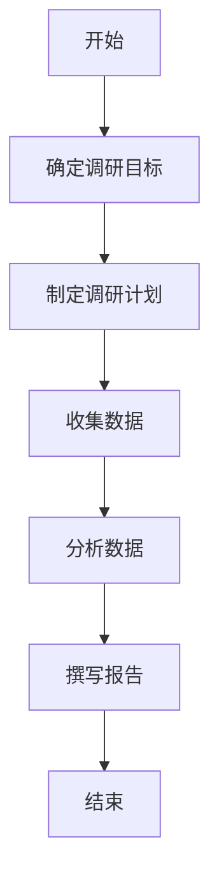

                 


# 彼得林奇的实地调研技巧

> 关键词：彼得林奇，投资分析，实地调研，投资策略，风险评估

> 摘要：本文深入探讨了彼得·林奇的实地调研技巧，分析其在投资决策中的重要性，结合实际案例，详细讲解了实地调研的核心概念、算法原理、数学模型以及系统架构设计，帮助投资者提升分析能力和决策水平。

---

## 第1章：实地调研的背景与重要性

### 1.1 实地调研的定义与核心概念

#### 1.1.1 实地调研的定义
实地调研是一种通过亲临企业现场，与管理层、员工及客户直接交流，收集一手信息的调研方法。它结合了定量分析和定性分析，帮助投资者全面评估企业的经营状况。

#### 1.1.2 实地调研的核心要素
- **信息收集**：通过现场观察、访谈获取详细数据。
- **深度分析**：结合定量与定性方法，评估企业潜在问题。
- **决策支持**：为投资决策提供可靠依据。

#### 1.1.3 实地调研在投资分析中的地位
实地调研是投资分析的关键步骤，尤其在验证财务数据和评估管理层质量方面具有不可替代的作用。

### 1.2 实地调研的重要性

#### 1.2.1 为何实地调研是投资决策的关键
实地调研能发现财务报表中隐藏的问题，如库存质量、应收账款真实性等，帮助投资者避免重大误判。

#### 1.2.2 实地调研与数据分析的结合
通过现场数据验证财务数据的准确性，结合市场趋势分析，提升投资决策的科学性。

#### 1.2.3 实地调研对风险控制的作用
及时发现企业经营中的潜在风险，如管理混乱或市场萎缩，帮助投资者规避损失。

### 1.3 实地调研与其他调研方法的对比

#### 1.3.1 电话调研
优点：快速便捷；缺点：信息量有限，难以深入。

#### 1.3.2 问卷调研
优点：覆盖面广；缺点：回收率低，结果偏差大。

#### 1.3.3 网络调研
优点：高效便捷；缺点：信息真实性和深度不足。

---

## 第2章：彼得林奇实地调研的核心概念与联系

### 2.1 核心概念原理

#### 2.1.1 投资分析的逻辑框架
彼得林奇通过实地调研构建企业估值模型，评估其竞争优势和成长潜力。

#### 2.1.2 公司基本面分析
包括财务状况、盈利能力、管理团队和行业地位等方面。

#### 2.1.3 市场趋势分析
通过现场观察行业动态，判断市场前景和竞争态势。

### 2.2 核心概念属性特征对比

| 调研方法 | 优点 | 缺点 |
|----------|------|------|
| 实地调研 | 信息全面 | 成本高，耗时长 |
| 电话调研 | 快速高效 | 深度不足 |
| 问卷调研 | 覆盖面广 | 回收率低 |

### 2.3 实地调研的ER实体关系图

```mermaid
erDiagram
    company : 公司
    industry : 行业
    market : 市场
    investor : 投资者
    report : 调研报告
    company --> industry : 属于
    industry --> market : 影响
    investor --> report : 委托
    company --> report : 被调研
```

---

## 第3章：实地调研的算法原理与数学模型

### 3.1 调研分析方法

#### 3.1.1 SWOT分析法
- **优势**：发现企业内部优势。
- **劣势**：识别潜在问题。
- **机会**：评估市场机会。
- **威胁**：分析行业风险。

#### 3.1.2 PEST分析法
- **政治因素**：政策法规影响。
- **经济因素**：经济周期波动。
- **社会因素**：消费者偏好变化。
- **技术因素**：技术创新趋势。

#### 3.1.3 价值链分析
从上游供应商到下游客户的整个价值链，分析企业成本结构和竞争优势。

### 3.2 调研流程的Mermaid图



### 3.3 数学模型与公式

#### 3.3.1 投资价值评估模型
$$ V = \text{现金流的现值} + \text{未来增长潜力} $$

#### 3.3.2 风险评估公式
$$ R = \alpha \times \text{市场风险} + \beta \times \text{特定风险} $$

---

## 第4章：系统分析与架构设计

### 4.1 调研系统的功能模块

#### 4.1.1 数据采集模块
负责收集现场调研的数据，包括访谈记录和实物观察结果。

#### 4.1.2 数据分析模块
利用统计工具对数据进行处理，生成分析报告。

#### 4.1.3 报告生成模块
整合分析结果，生成详细的调研报告。

### 4.2 调研系统的架构设计


### 4.3 系统接口设计

#### 4.3.1 数据接口
- 数据输入接口：接收现场调研数据。
- 数据输出接口：生成分析报告。

#### 4.3.2 交互流程
- 用户输入调研目标。
- 系统生成调研计划。
- 用户执行计划并返回数据。
- 系统分析数据并生成报告。

---

## 第5章：项目实战

### 5.1 环境安装

```bash
pip install pandas numpy matplotlib
```

### 5.2 核心代码实现

```python
import pandas as pd
import numpy as np

def calculate_investment_value(fcf, discount_rate):
    return np.npv(discount_rate, fcf)

# 示例数据
fcf = [100, 150, 200]
discount_rate = 0.1

investment_value = calculate_investment_value(fcf, discount_rate)
print(f"投资价值：{investment_value}")
```

### 5.3 案例分析与解读

#### 案例分析
某公司实地调研中发现库存周转率下降，可能暗示市场需求疲软或管理不善。

#### 应用解读
通过实地调研，投资者可以及时发现财务报表中未反映的问题，调整投资策略。

### 5.4 项目小结
项目实战展示了如何将实地调研与数据分析结合，提升投资决策的准确性。

---

## 第6章：最佳实践与小结

### 6.1 小结
实地调研是投资分析的重要环节，结合定量分析和定性分析，帮助投资者做出明智决策。

### 6.2 注意事项
- **时间管理**：合理安排调研时间，确保效率。
- **信息核实**：交叉验证数据，避免误判。
- **风险管理**：制定应急预案，降低调研风险。

### 6.3 拓展阅读
推荐书籍：
- 《彼得·林奇的投资哲学》
- 《投资最重要的事》

---

# 作者：AI天才研究院

通过以上结构化的内容，我们详细分析了彼得林奇的实地调研技巧，从理论到实践，帮助读者全面理解和应用这些技巧。

