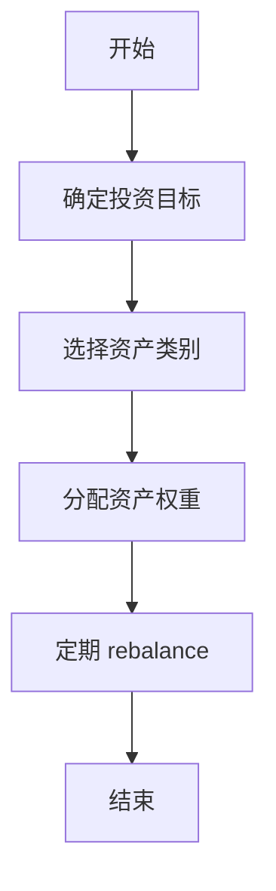
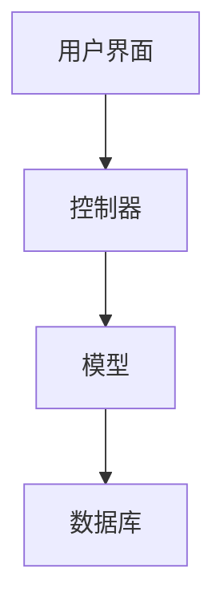
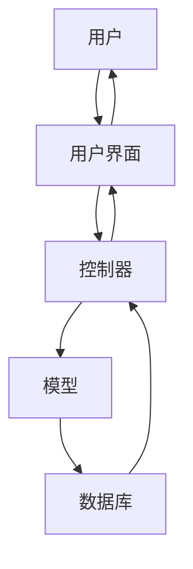
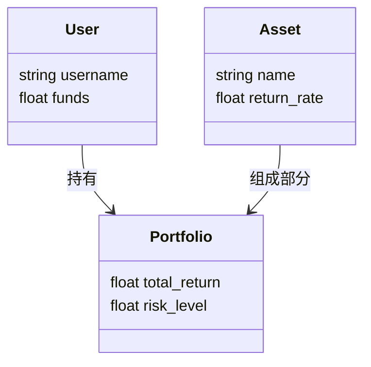

                 


# 彼得林奇的投资组合管理策略

> 关键词：投资组合管理，彼得林奇，投资策略，风险管理，资产配置，投资组合优化，投资分析

> 摘要：本文系统地介绍了彼得林奇的投资组合管理策略，从背景、核心概念、算法原理到系统设计、项目实战和总结，深入剖析了彼得林奇的投资哲学和策略，结合现代投资组合理论和数学模型，给出了详细的理论分析和实际操作指导。

---

# 第1章: 彼得林奇投资组合管理策略的背景与核心概念

## 1.1 投资组合管理的基本概念
### 1.1.1 投资组合管理的定义
投资组合管理是指通过科学的方法和策略，对多种资产进行组合配置，以实现风险最小化、收益最大化的管理过程。

### 1.1.2 投资组合管理的核心要素
- 资产种类：股票、债券、现金等
- 资产比例：不同资产在组合中的权重
- 风险收益比：资产的风险与收益的平衡

### 1.1.3 投资组合管理的目标与边界
目标：实现资产的长期稳健增值  
边界：在可接受的风险范围内最大化收益

## 1.2 彼得林奇投资策略的背景
### 1.2.1 彼得林奇的生平与投资理念
- 彼得林奇是美国著名投资经理，富达麦哲伦基金的传奇经理人。
- 他以基本面分析和长期投资著称，强调深入研究企业基本面。

### 1.2.2 彼得林奇投资策略的形成背景
- 20世纪80年代美国股市的波动性为彼得林奇提供了丰富的实战经验。
- 他提出了以分散投资、长期持有为核心的策略。

### 1.2.3 彼得林奇策略的核心思想
- 买入并持有优质股票，长期投资。
- 通过分散投资降低风险。

## 1.3 彼得林奇投资组合管理策略的特点
### 1.3.1 以基本面分析为基础
- 通过分析企业的财务报表、行业地位等基本面因素选择优质资产。
- 例如，彼得林奇会关注企业的ROE（净资产收益率）和现金流情况。

### 1.3.2 以长期投资为导向
- 避免短期市场波动，坚持长期持有的投资策略。
- 例如，他会选择那些具有持续增长潜力的企业。

### 1.3.3 以分散投资为原则
- 通过分散投资降低组合的整体风险。
- 例如，彼得林奇会将资金分配到多个行业和企业，避免过度集中。

## 1.4 本章小结
本章介绍了彼得林奇投资策略的背景和核心概念，强调了基本面分析、长期投资和分散投资的重要性。

---

# 第2章: 投资组合管理的核心概念与联系

## 2.1 投资组合管理的原理
### 2.1.1 投资组合的风险与收益关系
- 风险与收益呈正相关关系：高风险资产可能带来高收益，但也可能带来更大的损失。
- 风险分散原理：通过投资不同类型的资产降低整体风险。

### 2.1.2 资产配置的原理
- 资产配置是投资组合管理的核心，决定了组合的风险和收益。
- 例如，股票、债券、现金的比例分配。

### 2.1.3 投资组合的优化方法
- 现代投资组合理论（MPT）为基础的优化方法。
- 使用数学模型优化资产配置。

## 2.2 彼得林奇策略的核心概念
### 2.2.1 核心概念的定义与属性
- 资产质量：选择优质企业。
- 投资期限：长期持有。
- 资产分散：避免过度集中。

### 2.2.2 核心概念之间的关系
- 资产质量与投资期限：优质资产适合长期持有。
- 资产分散与风险控制：分散投资降低组合风险。

### 2.2.3 核心概念的数学模型
$$
\text{收益} = \sum w_i \times r_i
$$
其中，\( w_i \) 是资产 \( i \) 的权重，\( r_i \) 是资产 \( i \) 的收益。

$$
\text{风险} = \sqrt{\sum w_i^2 \times \sigma_i^2}
$$
其中，\( \sigma_i \) 是资产 \( i \) 的标准差。

## 2.3 实体关系图与流程图
### 2.3.1 实体关系图（ER图）
```mermaid
erDiagram
    customer[投资者] {
        string 姓名
        string 账号
    }
    asset[资产] {
        string 名称
        float 权重
        float 收益率
    }
    portfolio[投资组合] {
        float 总收益
        float 风险值
    }
    customer --> portfolio : 持有
    asset --> portfolio : 组成部分
```

### 2.3.2 投资组合管理流程图（Mermaid）


## 2.4 本章小结
本章详细讲解了投资组合管理的核心概念及其相互关系，并通过 ER 图和流程图展示了彼得林奇策略的系统结构。

---

# 第3章: 投资组合管理的算法原理与数学模型

## 3.1 投资组合优化的数学模型
### 3.1.1 现代投资组合理论（MPT）简介
- MPT 由 Harry Markowitz 提出，是投资组合管理的基础。
- 核心思想是通过分散投资降低风险。

### 3.1.2 投资组合优化的数学公式
$$
\text{目标函数：} \quad \min \sigma_p^2
$$
$$
\text{约束条件：} \quad \sum w_i = 1
$$

其中，\( \sigma_p \) 是投资组合的风险（标准差），\( w_i \) 是资产 \( i \) 的权重。

### 3.1.3 投资组合优化的算法实现
- 使用拉格朗日乘数法求解优化问题。
- 示例代码如下：

```python
import numpy as np

def portfolio_optimization(returns):
    n = len(returns.columns)
    returns_cov = returns.cov()
    returns_mean = returns.mean()

    A = 0.5 * returns_cov.values
    b = -returns_mean.values

    A_ = np.hstack((A, np.ones((n,1))))
    b_ = np.hstack((b, 0))
    A__ = np.vstack((A_, -A_, -np.eye(n)))

    x = np.linalg.solve(A__, b_)
    return x
```

## 3.2 彼得林奇策略的算法实现
### 3.2.1 基于基本面分析的资产选择
- 通过财务指标（如 ROE、现金流）筛选优质资产。

### 3.2.2 长期投资策略的实现
- 确定投资期限，选择具有持续增长潜力的企业。

### 3.2.3 分散投资的实现
- 通过资产类别和行业分散降低风险。

## 3.3 本章小结
本章介绍了投资组合优化的数学模型和算法实现，并结合彼得林奇策略给出了具体的实现方法。

---

# 第4章: 系统分析与架构设计

## 4.1 系统架构设计
### 4.1.1 系统功能设计
- 输入模块：用户输入投资目标和资产列表。
- 处理模块：计算投资组合的风险和收益。
- 输出模块：显示优化后的投资组合。

### 4.1.2 系统架构图（Mermaid）


## 4.2 系统交互设计
### 4.2.1 系统交互流程图（Mermaid）


## 4.3 系统功能设计
### 4.3.1 领域模型类图（Mermaid）


## 4.4 本章小结
本章从系统架构和交互设计的角度，详细分析了投资组合管理系统的实现方案。

---

# 第5章: 项目实战与案例分析

## 5.1 环境配置
### 5.1.1 安装必要的 Python 库
- 导入 pandas、numpy、scipy 等库。

### 5.1.2 数据获取
- 从 Yahoo Finance 获取历史数据。

## 5.2 核心代码实现
### 5.2.1 数据预处理
```python
import pandas as pd
import numpy as np

# 获取数据
data = pd.read_csv('data.csv')
data.head()
```

### 5.2.2 计算最优投资组合
```python
def compute_portfolio(returns, weights):
    return np.sum(returns * weights)

def compute_risk(returns, weights):
    return np.sqrt(np.dot(weights.T, returns.cov() @ weights))
```

## 5.3 案例分析
### 5.3.1 数据分析与可视化
- 使用 matplotlib 可视化投资组合的风险收益曲线。

### 5.3.2 策略实现
- 选择具有高 ROE 和稳定现金流的企业。

## 5.4 本章小结
本章通过实际案例，详细讲解了彼得林奇策略的实现过程，并给出了具体的代码和分析。

---

# 第6章: 投资组合管理策略的总结与展望

## 6.1 最佳实践 tips
- 长期投资，避免短期波动。
- 分散投资，降低风险。
- 定期 rebalance，保持资产配置。

## 6.2 总结
彼得林奇的投资组合管理策略以基本面分析和长期投资为核心，结合分散投资和风险管理，为投资者提供了科学的投资方法。

## 6.3 注意事项
- 风险控制是投资组合管理的关键。
- 定期评估和调整投资组合。

## 6.4 拓展阅读
- 《彼得林奇选股术》
- 现代投资组合理论（MPT）

## 6.5 本章小结
本章总结了彼得林奇策略的核心思想，并提出了投资的最佳实践和注意事项。

---

作者：AI天才研究院/AI Genius Institute & 禅与计算机程序设计艺术 /Zen And The Art of Computer Programming

