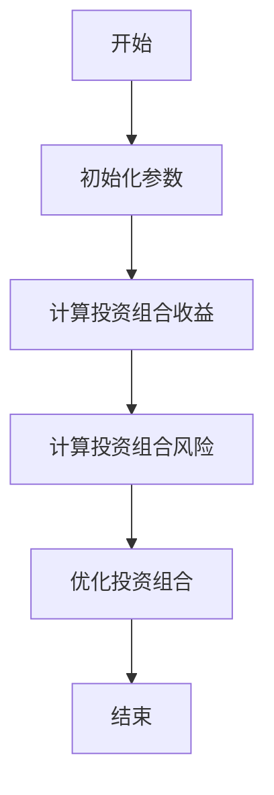
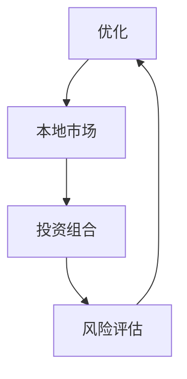

                 


# 彼得林奇的本地投资优势理论

> 关键词：本地投资优势，彼得林奇，投资理论，数学模型，系统架构，项目实战

> 摘要：本文深入探讨了彼得林奇提出的本地投资优势理论，从理论背景、核心概念、数学模型、系统架构到项目实战，全面解析了该理论在投资决策中的应用。通过详细的分析和实例，展示了如何利用本地优势构建投资组合，优化资产配置，并在实际操作中验证理论的有效性。

---

## 第1章：本地投资优势理论的背景与核心概念

### 1.1 本地投资优势的定义与背景

#### 1.1.1 投资理论的演进

投资理论从古典经济学开始，经历了多个阶段的发展。从亚当·斯密的劳动分工理论到现代的投资组合理论，投资学逐渐形成了系统的理论体系。彼得·林奇的本地投资优势理论是这一演变过程中的重要分支，它强调了地域经济特征在投资决策中的独特作用。

#### 1.1.2 本地优势的概念与内涵

本地优势是指某个地区因其地理位置、资源禀赋、产业布局等因素，在特定市场中形成的竞争优势。这些优势可能体现在成本优势、市场接近度、政策支持等方面，使得本地企业在竞争中更具优势。

#### 1.1.3 彼得林奇理论的提出背景

彼得·林奇作为投资大师，提出本地投资优势理论是为了应对全球化背景下市场分割的现象。他认为，投资者应关注本地市场，尤其是那些具有独特资源和竞争优势的地区，以获得超额收益。

### 1.2 本地投资优势的核心要素

#### 1.2.1 本地经济优势的构成

本地经济优势包括自然资源、劳动力成本、基础设施等因素。例如，某个地区丰富的自然资源可能降低生产成本，从而提高企业的盈利能力。

#### 1.2.2 本地竞争优势的特征

本地竞争优势体现在企业运营效率、市场占有、品牌影响力等方面。例如，本地企业可能更了解本地市场需求，从而更有效地制定营销策略。

#### 1.2.3 本地资源与市场的关系

本地资源是竞争优势的基础，而市场则是资源转化为经济收益的平台。两者相互作用，共同构成了本地投资优势的核心。

---

## 第2章：本地投资优势的理论基础

### 2.1 经济学基础

#### 2.1.1 地方经济与投资的关系

地方经济的繁荣离不开有效的投资，而投资又受到本地经济结构和政策的影响。两者相辅相成，形成了一个动态平衡。

#### 2.1.2 资源分配与本地优势

资源的合理分配能够最大化本地优势。通过优化资源配置，投资者可以提高投资效率，实现更高的收益。

#### 2.1.3 市场结构与投资决策

市场结构直接影响投资决策。在本地市场中，投资者需要考虑市场容量、竞争程度等因素，以制定合理的投资策略。

### 2.2 投资学基础

#### 2.2.1 资产定价理论

资产定价理论是投资学的核心内容，它帮助投资者确定资产的合理价格。本地投资优势理论在此基础上，加入了地域因素的影响。

#### 2.2.2 投资组合理论

投资组合理论强调分散投资以降低风险。本地投资优势理论建议投资者在构建投资组合时，优先考虑具有本地优势的资产。

#### 2.2.3 本地市场与投资策略

本地市场具有独特的运行机制，投资者需要根据本地市场特点调整投资策略，以适应市场环境。

---

## 第3章：本地投资优势的核心原理

### 3.1 本地资源的利用效率

#### 3.1.1 本地资源的识别与评估

识别和评估本地资源是利用本地优势的第一步。投资者需要分析本地资源的种类、储量、可利用性等因素，以确定其对投资的影响。

#### 3.1.2 资源稀缺性与投资机会

资源的稀缺性直接影响投资机会。稀缺资源往往具有更高的经济价值，能够吸引更多的投资。

#### 3.1.3 资源优化配置的策略

资源优化配置是提高利用效率的关键。投资者应根据资源特点和市场需求，制定合理的配置策略。

### 3.2 本地竞争优势的构建

#### 3.2.1 本地企业的竞争优势

本地企业通常具有成本优势、市场熟悉度和政策支持等优势，这些因素使其在本地市场中更具竞争力。

#### 3.2.2 本地市场的独特性

本地市场具有独特的消费者偏好和竞争环境，投资者需要充分考虑这些因素，制定相应的投资策略。

#### 3.2.3 本地品牌与市场渗透

本地品牌更容易获得消费者信任，市场渗透能力强。这为企业在本地市场中占据优势提供了保障。

---

## 第4章：本地投资优势的数学模型与算法

### 4.1 投资优势评估模型

#### 4.1.1 模型构建的理论基础

评估模型基于资产定价理论和投资组合理论，结合本地资源和竞争优势因素，构建了一个综合评估框架。

#### 4.1.2 模型的数学表达式

$$
\text{投资优势} = \alpha \times \text{本地资源} + \beta \times \text{竞争优势}
$$

其中，$\alpha$ 和 $\beta$ 是模型的参数，表示本地资源和竞争优势对投资优势的贡献程度。

#### 4.1.3 模型的参数解释

$\alpha$ 表示本地资源对投资优势的影响权重，$\beta$ 表示竞争优势的影响权重。通过调整这两个参数，可以优化模型的预测能力。

### 4.2 投资组合优化算法

#### 4.2.1 投资组合优化的数学模型

$$
\min \sigma^2(w) \quad \text{subject to} \quad \mu^T w \geq \mu_{\text{min}}, \quad w^T 1 = 1
$$

其中，$\sigma^2(w)$ 是投资组合的方差，$\mu^T w$ 是投资组合的期望收益，$\mu_{\text{min}}$ 是最低期望收益要求，$w$ 是投资权重向量。

#### 4.2.2 算法步骤与实现



---

## 第5章：本地投资优势的系统架构与实现

### 5.1 系统架构设计

#### 5.1.1 系统功能模块划分


#### 5.1.2 系统功能设计

系统功能包括投资者信息管理、本地市场分析、投资组合优化和风险评估等模块。每个模块都有具体的实现步骤和功能。

### 5.2 系统架构设计



---

## 第6章：本地投资优势的项目实战

### 6.1 项目介绍

本项目旨在验证本地投资优势理论的有效性，通过实际案例分析，展示如何利用本地优势构建投资组合，优化资产配置。

### 6.2 核心实现

#### 6.2.1 环境安装

需要安装Python、Pandas、NumPy等库，用于数据处理和模型计算。

#### 6.2.2 核心代码实现

```python
import pandas as pd
import numpy as np

def compute_investment Advantage(local_resources, competitive_advantages):
    alpha = 0.6
    beta = 0.4
    return alpha * local_resources + beta * competitive_advantages

# 示例数据
local_resources = 0.8
competitive_advantages = 0.7
investment_advantage = compute_investment Advantage(local_resources, competitive_advantages)
print(investment_advantage)
```

#### 6.2.3 代码解读

上述代码定义了一个计算投资优势的函数，输入本地资源和竞争优势，输出投资优势值。函数通过调整权重参数，实现了对本地资源和竞争优势的综合评估。

### 6.3 案例分析

以某城市为例，分析其本地资源和竞争优势，计算投资优势值，并根据结果制定投资策略。

---

## 第7章：总结与最佳实践

### 7.1 总结

本文系统地介绍了彼得林奇的本地投资优势理论，从理论背景、数学模型到系统实现，全面解析了该理论的应用方法。

### 7.2 最佳实践 tips

- 投资者应充分考虑本地资源和竞争优势，制定合理投资策略。
- 在实际操作中，建议结合具体市场环境，灵活调整投资策略。
- 定期评估投资组合的绩效，及时优化资产配置。

### 7.3 注意事项

- 数据来源的可靠性直接影响评估结果，需谨慎选择数据源。
- 模型参数的调整应基于实际市场情况，避免过度依赖理论假设。

### 7.4 拓展阅读

建议阅读彼得·林奇的其他著作，深入了解本地投资优势理论的其他应用。

---

## 作者

作者：AI天才研究院/AI Genius Institute & 禅与计算机程序设计艺术/Zen And The Art of Computer Programming

