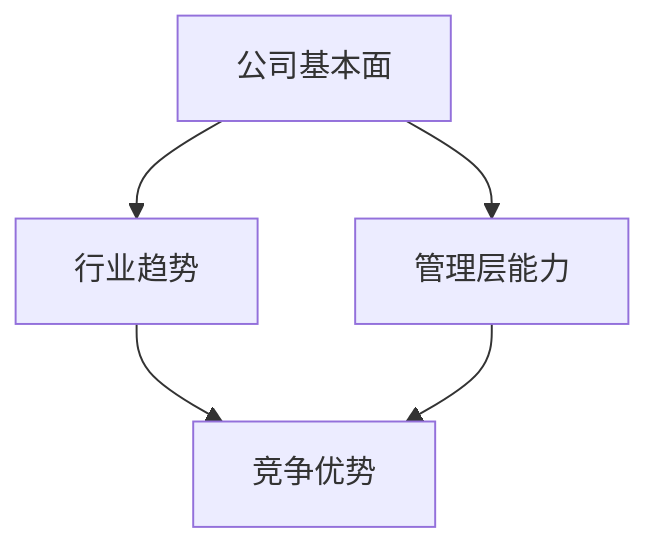
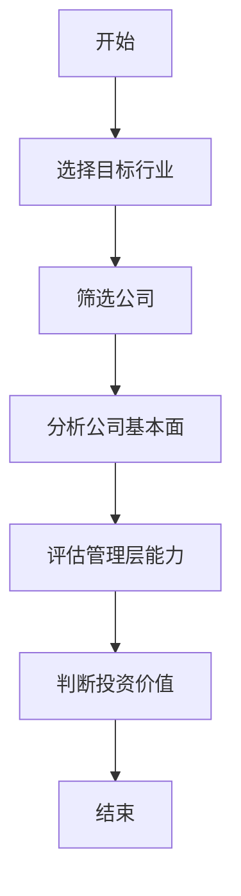
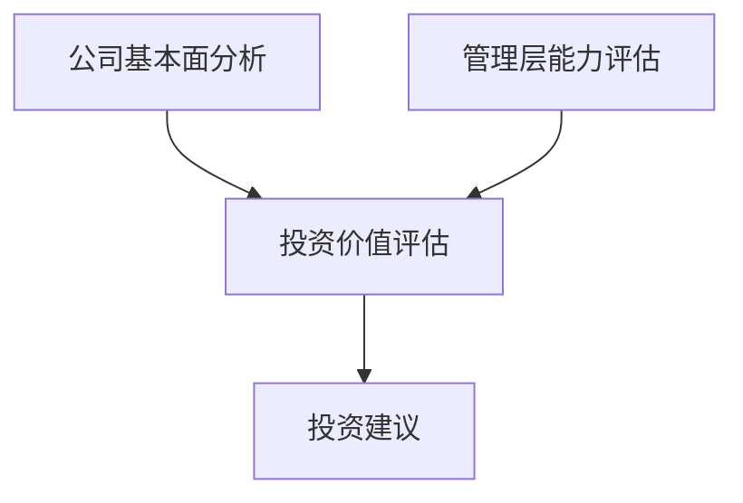
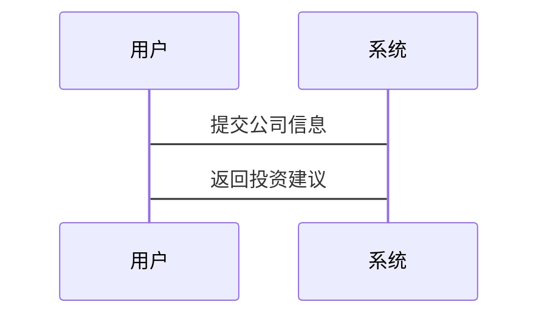

                 


# 彼得林奇的"讲故事"投资法

## 关键词：投资方法, 彼得林奇, 投资策略, 公司基本面, 管理层能力, 财务分析, 市场趋势

## 摘要：彼得林奇的"讲故事"投资法是一种通过深入分析公司背景、管理层能力和财务状况来选择投资标的的方法。本文将详细介绍该方法的核心概念、分析框架、系统架构以及实际案例，帮助读者理解并掌握这一投资策略。

---

# 第一部分: 彼得林奇"讲故事"投资法的背景与核心概念

## 第1章: 彼得林奇与"讲故事"投资法概述

### 1.1 彼得林奇的背景与投资理念
#### 1.1.1 彼得林奇的生平简介
彼得·林奇（Peter Lynch）是美国著名的职业基金经理人，曾管理富达麦哲伦基金（Fidelity Magellan Fund）长达13年，期间取得了惊人的投资业绩。他以独特的投资理念闻名，主张通过深入研究公司基本面来选择投资标的。

#### 1.1.2 "讲故事"投资法的核心理念
"讲故事"投资法的核心在于通过分析公司的背景、管理层的能力、行业地位以及财务状况，将公司“讲成一个故事”，从而判断其投资价值。这种方法强调对公司的深入了解，而非依赖市场情绪或短期价格波动。

#### 1.1.3 该方法在投资领域的地位与影响
彼得林奇的投资理念对全球投资界产生了深远影响，"讲故事"投资法因其简单有效而广受欢迎，尤其适合个人投资者和机构投资者。

### 1.2 "讲故事"投资法的核心概念
#### 1.2.1 什么是"讲故事"投资法
"讲故事"投资法是一种通过深入分析公司基本面和管理层能力，结合行业趋势和市场环境，来评估公司投资价值的方法。其核心在于将公司视为一个“故事”，通过分析故事的各个部分来判断其未来发展前景。

#### 1.2.2 该方法的特点与优势
- **长期视角**：关注公司长期发展，而非短期价格波动。
- **基本面驱动**：以公司财务数据和行业趋势为基础，而非市场情绪。
- **管理层能力**：强调管理层的能力和决策对公司价值的影响。

#### 1.2.3 与传统投资方法的对比分析
传统投资方法往往依赖技术分析或市场趋势，而"讲故事"投资法则更注重公司基本面的深入分析。两者各有优劣，但在实际操作中可以结合使用。

---

## 第2章: 核心概念与分析框架

### 2.1 核心概念的定义与解释
#### 2.1.1 公司基本面分析
公司基本面分析包括对公司财务状况、行业地位、竞争优势等方面的分析。这些分析是“讲故事”投资法的核心内容。

#### 2.1.2 管理层能力评估
管理层的能力和决策对公司的发展至关重要。通过分析管理层的历史表现和战略决策，可以更好地评估公司的未来潜力。

#### 2.1.3 行业趋势与市场环境
行业趋势和市场环境是公司发展的外部因素，通过分析这些因素，可以更好地判断公司的投资价值。

### 2.2 核心概念之间的关系
通过构建概念关系图，可以清晰地看到公司基本面、管理层能力、行业趋势等核心概念之间的相互作用。



---

## 第3章: "讲故事"投资法的算法原理

### 3.1 算法原理的概述
"讲故事"投资法的核心在于通过分析公司基本面和管理层能力，评估其投资价值。这一过程可以看作是一种基于逻辑推理的算法。

### 3.2 算法流程图
通过绘制算法流程图，可以清晰地看到“讲故事”投资法的分析步骤。



### 3.3 算法实现
以下是一个简化的Python代码示例，展示了如何根据公司基本面和管理层能力评估其投资价值。

```python
def calculate_investment_value(company基本面, 管理层能力):
    价值 = 公司基本面 * 管理层能力
    return 价值

# 示例
公司基本面 = {"财务状况": 80, "行业地位": 75}
管理层能力 = {"经验": 90, "战略决策": 85}
投资价值 = calculate_investment_value(公司基本面, 管理层能力)
print(投资价值)
```

---

## 第4章: 数学模型与公式

### 4.1 常用数学公式
在“讲故事”投资法中，通常会用到以下公式：

#### 4.1.1 市盈率（P/E Ratio）
$$市盈率 = \frac{股价}{每股收益}$$

#### 4.1.2 净资产收益率（ROE）
$$ROE = \frac{净利润}{净资产}$$

#### 4.1.3 市净率（P/B Ratio）
$$市净率 = \frac{股价}{每股净资产}$$

### 4.2 公式应用示例
假设某公司股价为$50，每股收益为$2.5，那么其市盈率为：

$$市盈率 = \frac{50}{2.5} = 20$$

这表明该公司的市盈率为20倍，处于合理范围内。

---

# 第二部分: "讲故事"投资法的系统分析与架构设计

## 第5章: 系统分析与架构设计

### 5.1 问题场景介绍
在实际投资过程中，投资者需要面对大量的信息和复杂的决策。通过构建一个基于“讲故事”投资法的系统，可以帮助投资者更高效地进行分析和决策。

### 5.2 系统功能设计
#### 5.2.1 公司基本面分析模块
- 收集和分析公司的财务数据，包括收入、利润、资产负债等。
- 评估公司的行业地位和竞争优势。

#### 5.2.2 管理层能力评估模块
- 分析管理层的历史表现和战略决策。
- 评估管理层的能力和稳定性。

#### 5.2.3 投资价值评估模块
- 综合公司基本面和管理层能力，评估其投资价值。
- 提供投资建议和风险提示。

### 5.3 系统架构设计
通过绘制系统架构图，可以清晰地看到各个模块之间的关系和数据流。



### 5.4 系统接口设计
- 输入接口：接收公司的财务数据和管理层信息。
- 输出接口：提供投资价值评估结果和投资建议。

### 5.5 系统交互设计
通过绘制交互序列图，可以清晰地看到用户与系统之间的交互流程。



---

## 第6章: 项目实战

### 6.1 环境安装与配置
- 需要安装Python和相关数据分析库（如Pandas、NumPy）。

### 6.2 核心代码实现
以下是基于“讲故事”投资法的Python代码实现示例：

```python
import pandas as pd

def analyze_company基本面(finance_data):
    # 分析公司基本面
    revenue_growth = finance_data['收入增长率']
    profit_margin = finance_data['利润率']
    return revenue_growth, profit_margin

def assess_管理层能力(management_data):
    # 评估管理层能力
    management_experience = management_data['经验']
    strategic_decision = management_data['战略决策能力']
    return management_experience, strategic_decision

def calculate_investment_value(company基本面, 管理层能力):
    # 计算投资价值
    value = (company基本面['收入增长率'] * company基本面['利润率']) + (管理层能力['经验'] + 管理层能力['战略决策能力']) / 2
    return value

# 示例数据
finance_data = {'收入增长率': 15, '利润率': 20}
management_data = {'经验': 85, '战略决策能力': 80}

revenue_growth, profit_margin = analyze_company基本面(finance_data)
experience, strategic_decision = assess_管理层能力(management_data)
投资价值 = calculate_investment_value(finance_data, management_data)
print(投资价值)
```

### 6.3 实际案例分析
以微软公司为例，分析其基本面和管理层能力，评估其投资价值。

---

## 第7章: 总结与展望

### 7.1 本章小结
通过本文的详细分析，我们可以看到“讲故事”投资法是一种简单而有效的投资策略，尤其适合那些希望深入了解公司基本面的投资者。

### 7.2 注意事项
- 投资有风险，需谨慎决策。
- 保持对市场的敏感性和对公司的持续关注。

### 7.3 拓展阅读
- 彼得林奇的《股票作手回忆录》
- 其他关于投资策略的经典书籍

---

# 作者：AI天才研究院/AI Genius Institute & 禅与计算机程序设计艺术 /Zen And The Art of Computer Programming

---

通过以上目录和文章结构，我们可以清晰地看到“讲故事”投资法的核心理念和实际应用。希望本文能为读者提供有价值的参考和启发。

