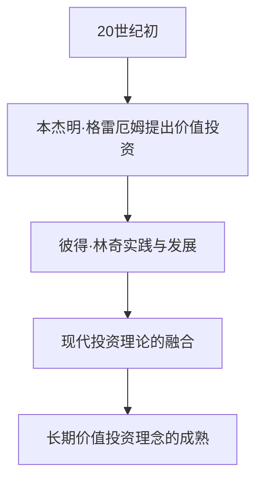
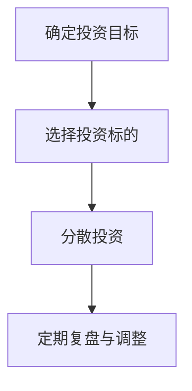
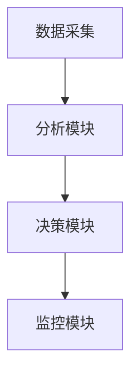
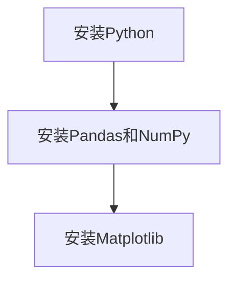

                 


# 彼得林奇的"长期价值"投资理念

> 关键词：长期价值投资，价值投资，彼得林奇，投资理念，投资策略，投资系统

> 摘要：本文深入探讨了彼得·林奇的长期价值投资理念，结合技术分析的方法，详细介绍了长期价值投资的核心概念、算法原理、系统架构、项目实战以及最佳实践。通过系统的分析和实际案例的解读，帮助读者全面理解和应用长期价值投资的理念。

---

## 第1章：长期价值投资的背景与定义

### 1.1 长期价值投资的起源与发展

长期价值投资是一种以寻找投资标的内在价值为核心的投资策略，起源于20世纪初，由本杰明·格雷厄姆和戴维·多德提出，并在实践中得到了彼得·林奇的进一步发展。这种投资理念强调长期持有优质资产，通过深入分析企业的基本面，寻找被市场低估的投资机会。

#### 图1-1：长期价值投资的发展历程



### 1.2 长期价值投资的核心理念

长期价值投资的核心理念是通过深入分析企业的财务状况、行业地位、竞争优势等基本面因素，寻找具有持续增长潜力和合理估值的企业进行投资。以下是长期价值投资的三大核心原则：

1. **安全性**：确保投资标的具有安全边际，即其市场价格低于其内在价值。
2. **稳定性**：选择具有稳定财务状况和持续盈利能力的企业。
3. **成长性**：关注具有长期增长潜力的企业。

---

## 第2章：彼得·林奇的投资策略与方法

### 2.1 彼得·林奇的选股标准

彼得·林奇在选股时注重企业的基本面分析，尤其是企业的盈利能力、财务状况和行业地位。以下是他的选股标准：

- **盈利能力**：关注企业的净利润率、ROE（净资产收益率）等指标。
- **财务状况**：确保企业的资产负债率合理，现金流充裕。
- **行业地位**：选择行业龙头或具有竞争优势的企业。

#### 图2-1：彼得·林奇选股标准的对比表格

| 选股标准       | 具体指标       | 关注点                     |
|----------------|---------------|---------------------------|
| 盈利能力       | 净利润率、ROE  | 盈利能力的持续性和稳定性 |
| 财务状况       | 资产负债率、现金流 | 财务健康，抗风险能力强   |
| 行业地位       | 市场占有率、竞争壁垒 | 行业龙头或具有竞争优势   |

### 2.2 投资组合管理

彼得·林奇强调分散投资，避免过度集中。他建议投资者将资金分散投资于多个具有长期增长潜力的企业，以降低风险。

#### 图2-2：投资组合管理的流程图



---

## 第3章：长期价值投资的算法原理

### 3.1 价值评估算法

长期价值投资的核心是通过数学模型计算企业的内在价值，常用的模型包括DCF（现金流折现法）和PE（市盈率）分析。

#### 图3-1：DCF模型的数学公式

企业内在价值 = ∑(CF_t / (r + g)^t)

其中：
- CF_t：第t年的自由现金流
- r：折现率
- g：永续增长率

#### 图3-2：PE分析法

市盈率 = 股价 / 每股收益

---

## 第4章：长期价值投资的系统分析

### 4.1 系统架构设计

长期价值投资的系统架构包括数据采集、分析模块、决策模块和监控模块。

#### 图4-1：系统架构图



---

## 第5章：项目实战

### 5.1 环境安装与数据准备

#### 图5-1：Python环境安装流程



### 5.2 核心代码实现

#### 图5-2：Python代码实现

```python
import pandas as pd
import numpy as np

# 数据准备
data = pd.DataFrame({
    '企业名称': ['A', 'B', 'C'],
    '净利润率': [10, 15, 8],
    'ROE': [12, 18, 10]
})

# 价值评估函数
def calculate_intrinsic_value(df):
    # 简单计算内在价值（示例）
    df['内在价值'] = df['净利润率'] * df['ROE'] / 100
    return df

# 应用函数
result = calculate_intrinsic_value(data)
print(result)
```

---

## 第6章：总结与展望

### 6.1 总结

彼得·林奇的长期价值投资理念强调基本面分析和长期持有，通过系统的分析和实践，投资者可以更好地把握投资机会。

### 6.2 展望

未来，长期价值投资将与人工智能、大数据分析等技术结合，进一步提升投资决策的科学性和准确性。

---

## 作者信息

作者：AI天才研究院/AI Genius Institute & 禅与计算机程序设计艺术 /Zen And The Art of Computer Programming

---

通过以上结构，本文详细介绍了彼得·林奇的长期价值投资理念，并结合技术分析的方法，为读者提供了全面的理论和实践指导。

