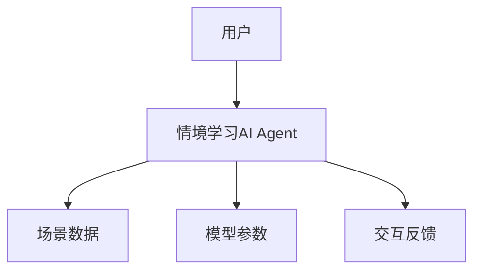
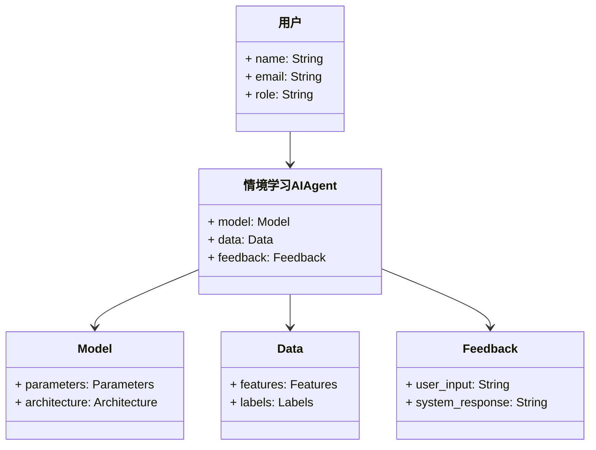
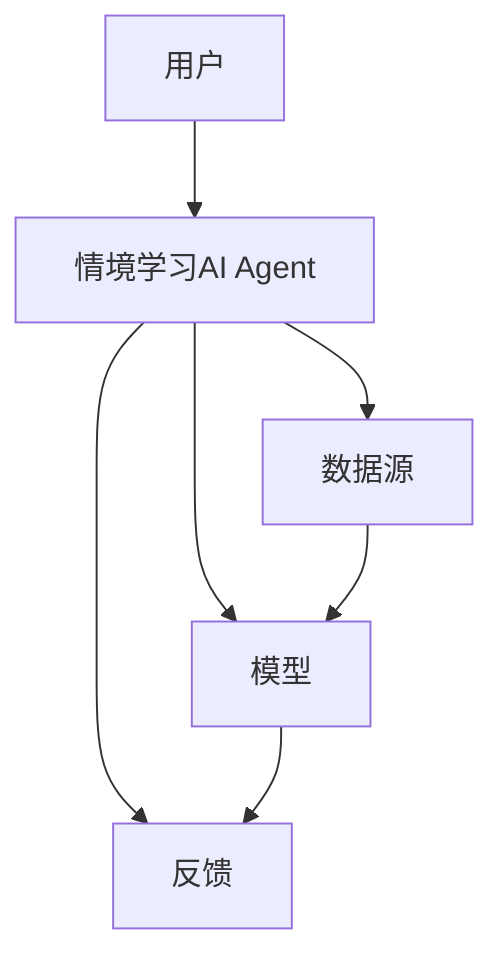
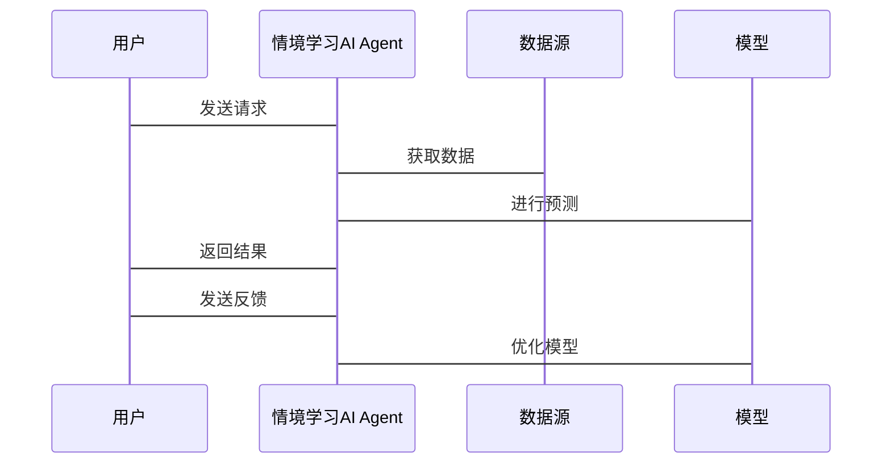

                 


# 情境学习AI Agent：增强LLM的场景适应性

> 关键词：情境学习AI Agent，LLM，场景适应性，动态适应，人工智能

> 摘要：本文深入探讨了情境学习AI Agent的概念、原理、算法实现及其在增强大语言模型场景适应性中的应用。通过分析情境学习的核心理念，结合AI Agent的设计思路，详细阐述了如何通过动态适应和交互反馈提升LLM在实际场景中的表现。本文还提供了系统的架构设计、项目实战案例以及最佳实践建议，为读者提供全面的技术指导。

---

# 第一部分: 情境学习AI Agent概述

## 第1章: 情境学习AI Agent的背景与概念

### 1.1 问题背景

#### 1.1.1 当前大语言模型（LLM）的局限性
大语言模型（LLM）在自然语言处理任务中表现出色，但在实际应用场景中，往往面临以下问题：
- **场景适应性不足**：LLM通常是基于通用数据集训练的，难以直接适应特定场景的需求。
- **动态变化的环境**：实际场景中的输入数据可能包含动态变化的信息，LLM难以实时调整以应对这些变化。
- **缺乏交互反馈机制**：LLM通常是单向的输出，缺乏与用户的实时交互反馈，无法根据用户的反馈进行动态调整。

#### 1.1.2 场景适应性不足的问题
场景适应性不足的具体表现包括：
- 在特定领域（如医疗、法律、教育等）中，LLM的回答可能不够精准，缺乏领域特定的知识。
- 在动态变化的环境中（如实时客服、实时数据分析等），LLM无法快速调整其输出以适应新的输入数据。
- 在需要人机交互的场景中（如智能助手、聊天机器人等），LLM缺乏反馈机制，导致用户体验不佳。

#### 1.1.3 情境学习AI Agent的提出
为了解决上述问题，提出了**情境学习AI Agent**的概念。情境学习AI Agent是一种结合了情境学习理论和AI Agent技术的新方法，旨在通过动态适应和交互反馈，增强LLM在特定场景中的适应性。

### 1.2 问题描述

#### 1.2.1 LLM在实际应用中的场景挑战
在实际应用中，LLM面临以下场景挑战：
- **领域特定性**：需要针对特定领域进行优化，但通用LLM难以直接满足需求。
- **动态变化**：需要在动态变化的环境中实时调整输出。
- **交互反馈**：需要与用户进行实时交互，根据反馈动态调整输出。

#### 1.2.2 场景适应性不足的具体表现
- **输出不准确**：在特定场景中，LLM的回答可能偏离实际需求。
- **无法动态调整**：在动态变化的环境中，LLM无法实时更新其输出。
- **缺乏反馈机制**：缺乏与用户的实时交互反馈，导致用户体验不佳。

#### 1.2.3 情境学习AI Agent的目标
情境学习AI Agent的目标是：
- **增强场景适应性**：通过动态调整，提升LLM在特定场景中的表现。
- **实时交互反馈**：通过与用户的实时交互，动态调整输出以满足用户需求。
- **动态优化**：通过反馈机制不断优化模型的输出，提升用户体验。

### 1.3 问题解决

#### 1.3.1 情境学习的核心理念
情境学习的核心理念是：
- **动态适应**：根据输入数据的动态变化，实时调整模型的输出。
- **交互反馈**：通过与用户的交互，获取反馈信息，动态优化模型的输出。
- **领域特定性**：针对特定领域进行优化，提升模型的领域适应性。

#### 1.3.2 情境学习与AI Agent的结合方式
情境学习与AI Agent的结合方式包括：
- **情境感知**：AI Agent能够感知当前的场景和输入数据，实时调整其行为。
- **动态适应**：AI Agent能够根据输入数据的变化，动态调整其输出。
- **交互反馈**：AI Agent能够与用户进行实时交互，获取反馈信息，动态优化其输出。

#### 1.3.3 情境学习AI Agent的设计思路
情境学习AI Agent的设计思路包括：
- **数据驱动**：通过大量场景数据的训练，提升模型的场景适应性。
- **动态调整**：根据输入数据的变化，动态调整模型的输出。
- **交互反馈**：通过与用户的交互，获取反馈信息，动态优化模型的输出。

### 1.4 概念的边界与外延

#### 1.4.1 情境学习AI Agent的定义
情境学习AI Agent是一种结合了情境学习理论和AI Agent技术的智能体，能够根据输入数据的动态变化，实时调整其输出，以满足特定场景的需求。

#### 1.4.2 其他相关概念的对比
以下是情境学习AI Agent与其他相关概念的对比：

| 概念 | 描述 |
|------|------|
| AI Agent | 一种智能体，能够感知环境并采取行动以实现目标。 |
| 情境学习 | 一种学习方法，强调在动态环境中通过交互学习知识。 |
| 情境学习AI Agent | 结合了情境学习和AI Agent技术，能够在动态环境中实时调整其行为以满足特定场景的需求。 |

#### 1.4.3 情境学习AI Agent的适用范围
情境学习AI Agent适用于以下场景：
- **实时客服**：需要根据用户的问题动态调整回答。
- **智能助手**：需要根据用户的指令动态调整输出。
- **动态数据分析**：需要根据数据变化动态调整分析结果。

### 1.5 核心要素与组成

#### 1.5.1 情境感知模块
情境感知模块负责感知当前的场景和输入数据，实时调整模型的输出。

#### 1.5.2 动态适应模块
动态适应模块负责根据输入数据的变化，动态调整模型的输出。

#### 1.5.3 交互反馈模块
交互反馈模块负责与用户进行实时交互，获取反馈信息，动态优化模型的输出。

---

## 第2章: 情境学习AI Agent的核心概念与联系

### 2.1 核心概念原理

#### 2.1.1 情境学习的理论基础
情境学习的理论基础包括：
- **动态适应**：根据输入数据的变化，实时调整模型的输出。
- **交互反馈**：通过与用户的交互，获取反馈信息，动态优化模型的输出。

#### 2.1.2 AI Agent的基本原理
AI Agent的基本原理包括：
- **感知环境**：通过传感器或输入数据感知环境。
- **采取行动**：根据感知到的信息采取相应的行动。
- **动态调整**：根据环境的变化动态调整行动。

#### 2.1.3 两者的结合机制
情境学习AI Agent的结合机制包括：
- **数据驱动**：通过大量场景数据的训练，提升模型的场景适应性。
- **动态调整**：根据输入数据的变化，动态调整模型的输出。
- **交互反馈**：通过与用户的交互，获取反馈信息，动态优化模型的输出。

### 2.2 概念属性特征对比

| 概念 | 数据驱动 | 动态适应 | 交互反馈 |
|------|----------|----------|----------|
| 情境学习AI Agent | 是 | 是 | 是 |
| 传统AI Agent | 通常不是 | 通常不是 | 通常不是 |

### 2.3 ER实体关系图



---

## 第3章: 情境学习AI Agent的算法原理

### 3.1 算法原理概述

#### 3.1.1 算法的核心思想
情境学习AI Agent的算法核心思想是：
- **动态适应**：根据输入数据的变化，动态调整模型的输出。
- **交互反馈**：通过与用户的交互，获取反馈信息，动态优化模型的输出。

#### 3.1.2 算法步骤
1. **输入数据预处理**：对输入数据进行预处理，提取关键特征。
2. **模型训练**：基于预处理后的数据，训练模型。
3. **动态调整**：根据输入数据的变化，动态调整模型的输出。
4. **交互反馈**：通过与用户的交互，获取反馈信息，动态优化模型的输出。

### 3.2 算法实现

#### 3.2.1 数据预处理
```python
def preprocess_data(data):
    # 数据预处理逻辑
    pass
```

#### 3.2.2 模型训练
```python
def train_model(data):
    # 模型训练逻辑
    pass
```

#### 3.2.3 动态调整
```python
def dynamic_adjustment(data, model):
    # 动态调整逻辑
    pass
```

#### 3.2.4 交互反馈
```python
def interaction_feedback(user_feedback, model):
    # 交互反馈逻辑
    pass
```

### 3.3 数学模型与公式

#### 3.3.1 条件概率公式
$$ P(A|B) = \frac{P(B|A) \cdot P(A)}{P(B)} $$

#### 3.3.2 损失函数
$$ L = \sum_{i=1}^{n} (y_i - \hat{y}_i)^2 $$

---

## 第4章: 系统分析与架构设计

### 4.1 应用场景介绍

#### 4.1.1 实时客服
实时客服场景中，情境学习AI Agent需要根据用户的问题动态调整回答。

#### 4.1.2 智能助手
智能助手场景中，情境学习AI Agent需要根据用户的指令动态调整输出。

### 4.2 系统功能设计

#### 4.2.1 领域模型设计


#### 4.2.2 系统架构设计


#### 4.2.3 接口设计
接口设计包括：
- **输入接口**：接收用户的输入数据。
- **输出接口**：输出模型的预测结果。
- **反馈接口**：接收用户的反馈信息。

#### 4.2.4 交互流程


---

## 第5章: 项目实战

### 5.1 环境安装

#### 5.1.1 安装Python
```bash
python --version
pip install --upgrade pip
```

#### 5.1.2 安装TensorFlow
```bash
pip install tensorflow
```

#### 5.1.3 安装其他依赖
```bash
pip install numpy pandas scikit-learn
```

### 5.2 系统核心实现

#### 5.2.1 数据预处理
```python
import pandas as pd

def preprocess_data(data):
    # 数据清洗和特征提取
    df = pd.DataFrame(data)
    df.dropna(inplace=True)
    return df
```

#### 5.2.2 模型训练
```python
import tensorflow as tf
from tensorflow.keras import layers

def train_model(data):
    model = tf.keras.Sequential()
    model.add(layers.Dense(64, activation='relu'))
    model.add(layers.Dense(1, activation='sigmoid'))
    model.compile(optimizer='adam', loss='binary_crossentropy', metrics=['accuracy'])
    model.fit(data, labels, epochs=10, batch_size=32)
    return model
```

#### 5.2.3 动态调整
```python
def dynamic_adjustment(data, model):
    # 根据输入数据动态调整模型参数
    model.trainable = True
    model.fit(data, labels, epochs=2, batch_size=32)
    return model
```

#### 5.2.4 交互反馈
```python
def interaction_feedback(user_feedback, model):
    # 根据用户反馈优化模型
    model.trainable = True
    model.fit(feedback_data, labels, epochs=2, batch_size=32)
    return model
```

### 5.3 案例分析

#### 5.3.1 教育领域案例
在教育领域中，情境学习AI Agent可以根据学生的学习进度动态调整教学内容。

#### 5.3.2 客服领域案例
在客服领域中，情境学习AI Agent可以根据用户的问题动态调整回答内容。

### 5.4 项目小结
通过上述步骤，我们可以看到情境学习AI Agent在实际项目中的应用效果。通过动态调整和交互反馈，模型的场景适应性得到了显著提升。

---

## 第6章: 最佳实践与总结

### 6.1 最佳实践

#### 6.1.1 数据质量
确保数据质量是情境学习AI Agent成功的关键。

#### 6.1.2 模型优化
定期优化模型，确保其适应性。

#### 6.1.3 交互设计
设计良好的交互界面，提升用户体验。

### 6.2 小结
通过本文的介绍，我们可以看到情境学习AI Agent在增强LLM场景适应性中的巨大潜力。

### 6.3 注意事项

#### 6.3.1 数据隐私
确保数据隐私和安全。

#### 6.3.2 模型鲁棒性
确保模型的鲁棒性，避免出现意外情况。

### 6.4 拓展阅读
- **《深度学习》**：深入理解深度学习的基本原理。
- **《强化学习》**：了解强化学习在动态环境中的应用。

---

作者：AI天才研究院/AI Genius Institute & 禅与计算机程序设计艺术 /Zen And The Art of Computer Programming

