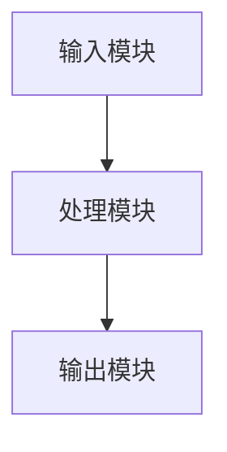
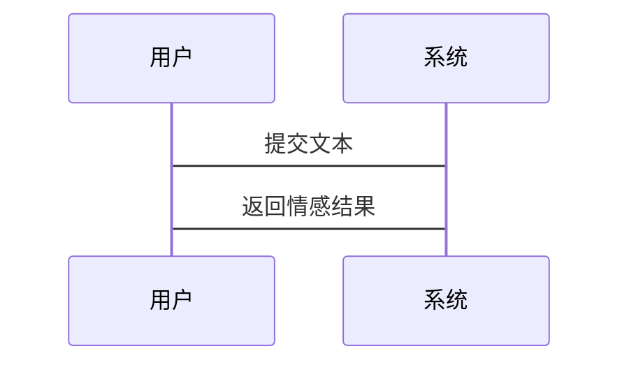

                 


# 情感分析AI Agent：利用LLM洞察文本情感倾向

> **关键词**：情感分析、大语言模型、自然语言处理、文本挖掘、深度学习  
> 
> **摘要**：情感分析是自然语言处理中的重要任务，旨在通过分析文本内容，判断作者的情感倾向。本文从情感分析的基本概念出发，详细探讨了大语言模型（LLM）在情感分析中的应用，分析了情感分析的核心算法与模型，介绍了情感分析系统的架构与实现，并通过具体案例展示了情感分析AI Agent的构建过程。最后，本文总结了情感分析的最佳实践，并展望了未来的发展方向。

---

## 第1章 情感分析的核心概念与问题背景

### 1.1 情感分析的定义与背景

情感分析（Sentiment Analysis）是一种自然语言处理（NLP）任务，旨在通过分析文本内容，判断作者对某个话题或对象的情感倾向。情感倾向可以是正面、负面或中性。情感分析在商业、社交媒体分析、客户反馈分析等领域有广泛应用。

#### 1.1.1 情感分析的定义
情感分析的目标是识别文本中蕴含的情感信息。例如，分析一条社交媒体上的评论，判断其是正面、负面还是中性。

#### 1.1.2 情感分析的背景与重要性
随着社交媒体和在线评论的普及，企业需要通过情感分析了解客户对产品或服务的看法，从而做出更精准的决策。情感分析可以帮助企业进行舆情监控、品牌管理、客户关系管理等。

#### 1.1.3 情感分析的应用场景
- **社交媒体分析**：分析用户对品牌、产品或事件的评价。
- **电商评论分析**：分析用户对商品的评价，帮助其他用户做出购买决策。
- **客服咨询**：通过分析用户的问题，判断用户的情绪，提供更贴心的服务。
- **新闻分析**：分析新闻文本的情感倾向，判断公众对某一事件的态度。

### 1.2 问题描述与目标

#### 1.2.1 情感分析的核心问题
如何从文本中提取情感信息？如何利用大语言模型（LLM）进行情感分析？

#### 1.2.2 情感分析的目标与边界
目标：识别文本的情感倾向（正面、负面、中性）。边界：情感分析不涉及识别具体事实，也不涉及跨语言分析。

#### 1.2.3 情感分析的核心要素与组成
- **文本输入**：需要分析的文本。
- **情感类别**：通常分为正面、负面、中性。
- **情感强度**：情感的强烈程度（如非常正面、稍微正面）。
- **上下文信息**：可能需要考虑文本的上下文信息。

### 1.3 情感分析的边界与外延

#### 1.3.1 情感分析的边界
- 不处理多语言情感分析。
- 不分析未标注的文本。

#### 1.3.2 情感分析的外延
- 可扩展到多模态分析（结合图像、语音等）。
- 可用于实时情感分析。

#### 1.3.3 情感分析与其他NLP任务的关系
- **文本分类**：情感分析是文本分类的一种特殊形式。
- **实体识别**：情感分析可以与实体识别结合，分析特定实体的情感。
- **语义理解**：情感分析依赖于对文本语义的理解。

---

## 第2章 大语言模型（LLM）的原理与应用

### 2.1 大语言模型的基本原理

#### 2.1.1 预训练与微调
- **预训练**：在大规模通用文本数据上进行无监督训练，学习语言的结构和语义。
- **微调**：在特定任务上进行有监督训练，优化模型的性能。

#### 2.1.2 模型的输入输出格式
- 输入：文本片段或句子。
- 输出：情感倾向（如正面、负面、中性）或情感强度。

#### 2.1.3 模型的训练目标
- 预测文本的情感倾向。
- 学习文本中的情感关键词和语义关系。

### 2.2 大语言模型的主流模型

#### 2.2.1 GPT系列模型
- 基于Transformer架构。
- 常见模型：GPT-2、GPT-3。
- 优点：生成能力强，适合需要生成文本的任务。
- 缺点：情感分析效果不如BERT系列。

#### 2.2.2 BERT系列模型
- 基于Transformer的双向编码器。
- 常见模型：BERT、RoBERTa、AlBERT。
- 优点：适合文本理解和语义分析。
- 缺点：生成能力较弱。

#### 2.2.3 其他LLM模型
- **GPT-4**：改进的GPT系列模型，性能更优。
- **PaLM**：Google推出的大语言模型。

### 2.3 大语言模型在情感分析中的应用

#### 2.3.1 LLM与情感分析的结合
- 使用LLM进行情感分类。
- 使用LLM分析情感强度。

#### 2.3.2 LLM在情感分析中的优势
- 模型预训练能力强大，适合情感分析任务。
- 支持多语言情感分析。

#### 2.3.3 LLM在情感分析中的挑战
- 计算资源需求高。
- 模型调优复杂。

---

## 第3章 情感分析的核心算法与模型

### 3.1 情感分析的核心算法

#### 3.1.1 基于词袋模型的情感分析算法
- **词袋模型**：将文本表示为单词的集合，不考虑顺序。
- **实现步骤**：
  1. 文本分词。
  2. 构建词袋。
  3. 训练分类器（如SVM、随机森林）。

#### 3.1.2 基于TF-IDF的情感分析算法
- **TF-IDF**：计算词的频率和重要性。
- **实现步骤**：
  1. 计算TF和IDF。
  2. 构建特征向量。
  3. 训练分类器。

#### 3.1.3 基于深度学习的情感分析算法
- **RNN与LSTM模型**：适用于序列数据，捕捉上下文信息。
- **CNN模型**：适用于短文本，捕捉局部特征。
- **Transformer模型**：基于自注意力机制，适合长文本。

### 3.2 使用大语言模型进行情感分析

#### 3.2.1 模型输入与输出
- 输入：文本片段。
- 输出：情感倾向。

#### 3.2.2 模型调优
- 微调LLM：在情感分析数据集上进行微调。
- 使用LLM的API：直接调用大语言模型进行情感分析。

#### 3.2.3 情感强度分析
- 分析情感的强烈程度。
- 输出结果：情感类别 + 情感强度。

---

## 第4章 情感分析系统的架构与实现

### 4.1 系统设计

#### 4.1.1 模块划分
- **输入模块**：接收文本输入。
- **处理模块**：进行情感分析。
- **输出模块**：返回情感结果。

#### 4.1.2 系统架构图


#### 4.1.3 接口设计
- 输入接口：接收文本字符串。
- 输出接口：返回情感倾向。

#### 4.1.4 交互流程


---

## 第5章 项目实战：基于LLM的情感分析AI Agent

### 5.1 电商评论分析案例

#### 5.1.1 环境搭建
- 安装Python。
- 安装相关库（如transformers、torch）。

#### 5.1.2 代码实现
```python
from transformers import pipeline

# 初始化情感分析模型
sentiment_analyzer = pipeline("sentiment-analysis")

# 分析评论
comment = "This product is amazing!"
result = sentiment_analyzer(comment)
print(result)
```

#### 5.1.3 结果分析
- 输出结果：情感倾向和置信度。
- 例如：`{'label': 'POSITIVE', 'score': 0.95}`。

#### 5.1.4 模型优化
- 微调模型：在电商评论数据集上进行微调。
- 使用更大的模型（如GPT-3）。

---

## 第6章 最佳实践与未来展望

### 6.1 最佳实践

#### 6.1.1 数据预处理
- 文本清洗：去除无关信息。
- 分词：分割成有意义的词汇。

#### 6.1.2 模型选择
- 根据任务选择合适的模型。
- 考虑计算资源。

#### 6.1.3 模型调优
- 微调LLM。
- 调整超参数。

### 6.2 未来展望

#### 6.2.1 多模态情感分析
- 结合图像和语音信息。
- 提高情感分析的准确性。

#### 6.2.2 实时情感分析
- 实时处理社交媒体数据。
- 支持流数据处理。

---

## 作者：AI天才研究院/AI Genius Institute & 禅与计算机程序设计艺术 /Zen And The Art of Computer Programming

---

以上是《情感分析AI Agent：利用LLM洞察文本情感倾向》的技术博客文章的完整内容，涵盖从基础概念到项目实战的各个方面，逻辑清晰、结构紧凑，适合对情感分析和大语言模型感兴趣的读者阅读。

