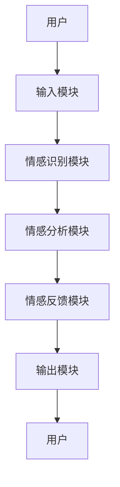
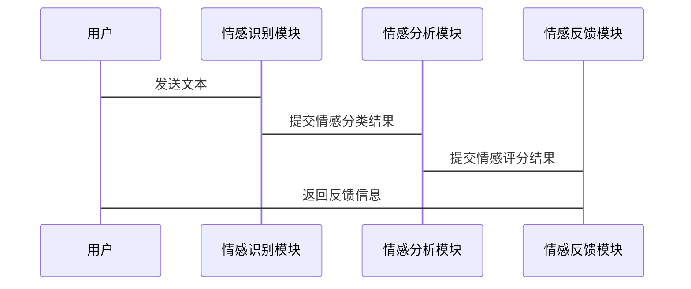

                 


# 情感计算在AI Agent中的应用：增强LLM的EQ

---

> **关键词**: 情感计算, AI Agent, LLM, EQ, 情感分析, 深度学习, 自然语言处理

---

> **摘要**: 本文探讨了情感计算在AI Agent中的应用，特别是如何通过情感计算增强大型语言模型（LLM）的情感商数（EQ）。文章从情感计算的基本概念出发，分析其在AI Agent中的作用，详细讲解情感计算的算法原理、数学模型以及在实际系统中的应用设计。最后，通过项目实战案例，展示了如何将情感计算技术落地到实际应用中，帮助LLM更好地理解和处理人类情感。

---

# 第1章 情感计算与AI Agent概述

## 1.1 情感计算的定义与背景

### 1.1.1 情感计算的定义

情感计算（Emotion Computing），也被称为情感智能（Emotional Intelligence，EQ），是一种通过计算机技术来识别、理解和处理人类情感信息的新兴领域。情感计算的核心目标是让计算机能够像人类一样感知、分析和回应情感信息。

> 情感计算不仅仅是分析文本中的情感倾向，更重要的是通过情感信息的分析，理解人类的情感状态，并在与人类交互的过程中动态调整行为策略。

### 1.1.2 情感计算的发展历程

情感计算的发展可以追溯到20世纪60年代，随着自然语言处理（NLP）和人工智能（AI）技术的进步，情感计算逐渐从理论研究走向实际应用。近年来，随着深度学习技术的兴起，情感计算在AI Agent中的应用取得了显著进展。

### 1.1.3 情感计算在AI Agent中的重要性

AI Agent（智能代理）是一种能够感知环境、自主决策并执行任务的智能系统。在传统的AI Agent设计中，主要关注的是逻辑推理和任务执行能力，而情感计算的引入为AI Agent赋予了理解和处理人类情感的能力，使其在与人类交互时更加自然和人性化。

---

## 1.2 AI Agent的基本概念

### 1.2.1 AI Agent的定义

AI Agent是一种能够感知环境、执行任务并做出决策的智能实体。它可以是一个软件程序、一个机器人，甚至是嵌入在智能设备中的算法。AI Agent的核心特征包括：

1. **自主性**：能够自主决策和行动。
2. **反应性**：能够感知环境并实时调整行为。
3. **社会性**：能够与其他Agent或人类进行交互。
4. **学习能力**：能够通过经验改进自身的性能。

### 1.2.2 AI Agent的核心特征

1. **感知能力**：通过传感器或数据输入感知环境。
2. **推理能力**：基于感知信息进行逻辑推理。
3. **决策能力**：根据推理结果做出决策。
4. **执行能力**：通过执行器或输出模块完成任务。

### 1.2.3 AI Agent的应用场景

AI Agent广泛应用于多个领域，包括：

1. **智能助手**：如Siri、Alexa等。
2. **推荐系统**：基于用户行为推荐个性化内容。
3. **智能客服**：通过自然语言处理技术为用户提供服务。
4. **自动驾驶**：通过环境感知和决策算法实现自动驾驶。

---

## 1.3 情感计算与AI Agent的结合

### 1.3.1 情感计算在AI Agent中的作用

情感计算为AI Agent提供了以下功能：

1. **情感识别**：识别用户的情感倾向（如正面、负面、中性）。
2. **情感分析**：分析用户的情感状态并理解其背后的情感含义。
3. **情感反馈**：根据用户情感状态调整交互策略。

### 1.3.2 情感计算与传统AI Agent的区别

传统AI Agent主要关注逻辑推理和任务执行，而情感计算赋予AI Agent以下能力：

1. **情感感知能力**：能够识别和理解人类情感。
2. **情感驱动的交互**：根据用户情感动态调整交互方式。
3. **情感记忆能力**：能够记录和记忆用户的情感状态。

### 1.3.3 情感计算在AI Agent中的应用前景

随着情感计算技术的不断发展，AI Agent在以下领域具有广阔的应用前景：

1. **人机交互**：通过情感计算实现更自然的对话交互。
2. **情感支持**：为用户提供情感支持和心理疏导。
3. **个性化服务**：根据用户情感状态提供个性化的服务。

---

## 1.4 本章小结

本章从情感计算的基本概念出发，介绍了AI Agent的核心特征和应用场景，重点分析了情感计算在AI Agent中的作用及其与传统AI Agent的区别。通过本章的学习，读者可以理解情感计算在AI Agent中的重要性及其应用潜力。

---

# 第2章 情感计算的核心概念与原理

## 2.1 情感计算的核心概念

### 2.1.1 情感分析的基本原理

情感分析是情感计算的核心任务之一，其基本原理包括以下步骤：

1. **数据预处理**：对文本数据进行清洗和特征提取。
2. **特征提取**：提取文本中的情感相关特征，如关键词、语调、语气等。
3. **情感分类**：基于提取的特征对文本进行情感分类，如正面、负面、中性。

> 情感分析的目的是通过计算机技术自动识别文本中的情感倾向，帮助AI Agent更好地理解用户的情感状态。

### 2.1.2 情感计算的特征提取

特征提取是情感分析的关键步骤，常用的特征提取方法包括：

1. **关键词提取**：提取与情感相关的关键词。
2. **情感词典**：基于情感词典对文本进行情感评分。
3. **语调分析**：分析文本的语调和语气。

### 2.1.3 情感计算的分类与评估

情感计算的分类方法包括：

1. **基于规则的方法**：基于预定义的规则进行情感分类。
2. **基于统计的方法**：基于统计学方法进行情感分类。
3. **基于深度学习的方法**：基于神经网络模型进行情感分类。

---

## 2.2 情感计算与AI Agent的关系

### 2.2.1 情感计算在AI Agent中的功能模块

情感计算在AI Agent中主要包含以下功能模块：

1. **情感识别模块**：识别用户的情感倾向。
2. **情感分析模块**：分析用户情感状态。
3. **情感反馈模块**：根据用户情感状态调整交互策略。

### 2.2.2 情感计算与自然语言处理的结合

情感计算与自然语言处理（NLP）密切相关，情感计算依赖于NLP技术来提取文本中的情感特征。通过结合NLP技术，情感计算能够更准确地理解用户的意图和情感状态。

### 2.2.3 情感计算与用户行为分析的结合

情感计算不仅关注用户的情感状态，还关注用户的行为模式。通过结合用户行为分析，情感计算可以更全面地理解用户的整体情感状态。

---

## 2.3 情感计算的核心原理

### 2.3.1 情感计算的数学模型

情感计算的数学模型包括以下内容：

1. **概率模型**：基于概率论的情感分类模型。
2. **情感评分模型**：基于情感词典的情感评分模型。
3. **情感分类模型**：基于机器学习的情感分类模型。

### 2.3.2 情感计算的特征提取方法

特征提取方法包括：

1. **基于词袋模型的特征提取**：将文本表示为词袋形式。
2. **基于词嵌入的特征提取**：使用词嵌入模型（如Word2Vec）提取词向量。
3. **基于深度学习的特征提取**：使用神经网络模型提取深层特征。

### 2.3.3 情感计算的分类算法

常用的分类算法包括：

1. **朴素贝叶斯**：基于概率论的分类算法。
2. **支持向量机**：基于几何的分类算法。
3. **深度学习模型**：如LSTM、Transformer等。

---

## 2.4 本章小结

本章详细介绍了情感计算的核心概念和原理，包括情感分析的基本原理、特征提取方法和分类算法。通过本章的学习，读者可以理解情感计算在AI Agent中的技术实现。

---

# 第3章 情感计算算法原理与实现

## 3.1 情感计算的算法原理

### 3.1.1 基于规则的情感分析

基于规则的情感分析方法通过预定义的情感规则对文本进行情感分类。例如，可以使用情感词典来匹配文本中的关键词并赋予相应的情感评分。

> 基于规则的情感分析方法简单易实现，但其准确性和鲁棒性较弱。

### 3.1.2 基于统计的情感分析

基于统计的情感分析方法通过统计学方法对文本进行情感分类。例如，可以使用支持向量机（SVM）或朴素贝叶斯（NB）算法进行情感分类。

### 3.1.3 基于深度学习的情感分析

基于深度学习的情感分析方法通过神经网络模型（如LSTM、Transformer）对文本进行情感分类。这种方法能够捕捉文本的深层语义信息，具有较高的准确性和鲁棒性。

---

## 3.2 情感计算的实现步骤

### 3.2.1 数据预处理

数据预处理是情感计算的第一步，主要包括：

1. **文本清洗**：去除停用词、标点符号等无用信息。
2. **分词**：将文本分割成词语或短语。
3. **特征提取**：提取文本中的情感相关特征。

### 3.2.2 特征提取

特征提取是情感计算的关键步骤，常用的特征提取方法包括：

1. **基于词袋模型的特征提取**。
2. **基于词嵌入的特征提取**。
3. **基于深度学习的特征提取**。

### 3.2.3 情感分类

情感分类是情感计算的最后一步，常用的分类算法包括：

1. **朴素贝叶斯**。
2. **支持向量机**。
3. **深度学习模型**。

---

## 3.3 情感计算的算法实现

### 3.3.1 基于Python的情感计算实现

以下是一个基于Python的情感计算实现示例：

```python
import nltk
from nltk.sentiment import SentimentIntensityAnalyzer

sia = SentimentIntensityAnalyzer()
text = "I love this product!"
sentiment = sia.polarity_scores(text)
print(sentiment)
```

> 代码解释：使用NLTK库中的`SentimentIntensityAnalyzer`对文本进行情感分析，返回情感评分结果。

### 3.3.2 使用深度学习模型的情感计算实现

以下是一个基于深度学习模型的情感计算实现示例：

```python
import torch
import torch.nn as nn

class SentimentClassifier(nn.Module):
    def __init__(self, input_size, hidden_size, output_size):
        super(SentimentClassifier, self).__init__()
        self.fc = nn.Sequential(
            nn.Linear(input_size, hidden_size),
            nn.ReLU(),
            nn.Linear(hidden_size, output_size)
        )

    def forward(self, x):
        return self.fc(x)

# 初始化模型
input_size = 100
hidden_size = 50
output_size = 2
model = SentimentClassifier(input_size, hidden_size, output_size)
```

> 代码解释：定义一个简单的深度学习模型，用于情感分类。

### 3.3.3 情感计算的优化与调优

情感计算的优化与调优包括：

1. **数据增强**：通过数据增强技术提高模型的泛化能力。
2. **超参数调整**：通过调整模型的超参数（如学习率、批次大小等）优化模型性能。
3. **模型融合**：通过融合多个模型的结果提高情感分类的准确率。

---

## 3.4 本章小结

本章详细讲解了情感计算的算法原理与实现，包括基于规则的情感分析、基于统计的情感分析和基于深度学习的情感分析。通过本章的学习，读者可以掌握情感计算的实现方法和优化技巧。

---

# 第4章 情感计算的数学模型与公式

## 4.1 情感计算的数学模型

### 4.1.1 情感计算的概率模型

概率模型是情感计算中常用的数学模型之一。例如，朴素贝叶斯分类器基于概率论进行情感分类。

> 情感计算的概率模型可以通过以下公式表示：

$$P(positive) = \frac{\text{count of positive words}}{\text{total words}}$$

### 4.1.2 情感计算的情感评分模型

情感评分模型是基于情感词典的情感计算模型。例如，可以使用AFIN-lex词典对文本进行情感评分。

> 情感评分模型可以通过以下公式表示：

$$\text{情感评分} = \sum (\text{关键词的情感值} \times \text{关键词权重})$$

### 4.1.3 情感计算的分类模型

分类模型是基于机器学习的情感计算模型。例如，可以使用支持向量机（SVM）或深度学习模型进行情感分类。

---

## 4.2 情感计算的公式与实现

### 4.2.1 情感计算的情感分类公式

情感分类可以通过以下公式表示：

$$y = \text{sign}(\sum_{i=1}^{n} w_i x_i + b)$$

其中，$y$是情感分类结果，$w_i$是特征权重，$x_i$是特征值，$b$是偏置项。

### 4.2.2 情感计算的情感评分公式

情感评分可以通过以下公式表示：

$$\text{情感评分} = \sum_{i=1}^{m} (\text{情感词典中关键词的情感值} \times \text{关键词权重})$$

其中，$m$是情感词典中关键词的数量。

---

## 4.3 本章小结

本章详细讲解了情感计算的数学模型与公式，包括概率模型、情感评分模型和分类模型。通过本章的学习，读者可以理解情感计算的数学原理。

---

# 第5章 情感计算在AI Agent中的系统设计

## 5.1 问题场景介绍

在本章中，我们将以一个智能客服系统为例，介绍情感计算在AI Agent中的系统设计。智能客服系统需要通过情感计算技术，实时分析用户的情感状态，并根据情感状态动态调整交互策略。

---

## 5.2 系统功能设计

智能客服系统的功能设计包括：

1. **情感识别模块**：识别用户的情感倾向。
2. **情感分析模块**：分析用户情感状态。
3. **情感反馈模块**：根据用户情感状态调整交互策略。

### 5.2.1 情感识别模块

情感识别模块需要实现以下功能：

1. **文本输入**：接收用户的输入文本。
2. **情感分类**：对文本进行情感分类。
3. **情感评分**：计算文本的情感评分。

### 5.2.2 情感分析模块

情感分析模块需要实现以下功能：

1. **情感状态分析**：分析用户的情感状态。
2. **情感记忆**：记录用户的情感状态。
3. **情感反馈**：根据情感状态生成相应的反馈信息。

---

## 5.3 系统架构设计

### 5.3.1 系统架构图

以下是智能客服系统的架构图：



### 5.3.2 系统接口设计

系统接口设计包括：

1. **输入接口**：接收用户的输入文本。
2. **输出接口**：输出情感计算结果。
3. **数据库接口**：与用户数据库进行交互。

---

## 5.4 系统交互设计

### 5.4.1 系统交互流程

以下是系统交互流程图：



---

## 5.5 本章小结

本章详细介绍了情感计算在AI Agent中的系统设计，包括问题场景介绍、系统功能设计、系统架构设计和系统交互设计。通过本章的学习，读者可以理解情感计算在实际系统中的应用。

---

# 第6章 情感计算在AI Agent中的项目实战

## 6.1 项目背景与目标

本项目的目标是开发一个基于情感计算的智能客服系统，通过情感计算技术实时分析用户情感状态，并根据情感状态动态调整交互策略。

---

## 6.2 项目环境与工具

### 6.2.1 项目环境

- **操作系统**：Linux/MacOS/Windows
- **编程语言**：Python
- **深度学习框架**：TensorFlow/PyTorch
- **自然语言处理库**：NLTK/spaCy
- **情感分析库**：TextBlob/SentimentIntensityAnalyzer

---

## 6.3 项目核心代码实现

### 6.3.1 情感识别模块代码

以下是情感识别模块的实现代码：

```python
from textblob import TextBlob

def get_sentiment(text):
    blob = TextBlob(text)
    sentiment = blob.sentiment.polarity
    return sentiment
```

### 6.3.2 情感分析模块代码

以下是情感分析模块的实现代码：

```python
from textblob import TextBlob

def analyze_sentiment(text):
    blob = TextBlob(text)
    sentiment = blob.sentiment.polarity
    if sentiment > 0:
        return "positive"
    elif sentiment < 0:
        return "negative"
    else:
        return "neutral"
```

### 6.3.3 情感反馈模块代码

以下是情感反馈模块的实现代码：

```python
def generate_feedback(sentiment):
    if sentiment == "positive":
        return "感谢您的支持！有什么我可以帮您的吗？"
    elif sentiment == "negative":
        return "非常抱歉给您带来不好的体验。我们一定会改进的！"
    else:
        return "您的反馈对我们非常重要。请问有什么可以帮您的吗？"
```

---

## 6.4 项目案例分析

### 6.4.1 案例背景

假设用户输入以下文本：

```
"我对这个产品非常不满意！"
```

### 6.4.2 情感识别与分析

情感识别模块将识别出文本的情感倾向为负面，情感分析模块将返回“negative”。

### 6.4.3 情感反馈生成

情感反馈模块将根据情感分析结果生成以下反馈信息：

```
"非常抱歉给您带来不好的体验。我们一定会改进的！"
```

---

## 6.5 项目总结

通过本章的项目实战，读者可以掌握情感计算在AI Agent中的实际应用。通过实现情感识别、情感分析和情感反馈模块，读者可以理解情感计算在智能客服系统中的具体应用。

---

# 第7章 情感计算在AI Agent中的总结与展望

## 7.1 本章总结

本文详细探讨了情感计算在AI Agent中的应用，特别是如何通过情感计算增强大型语言模型（LLM）的情感商数（EQ）。文章从情感计算的基本概念出发，分析了其在AI Agent中的作用，详细讲解了情感计算的算法原理、数学模型以及在实际系统中的应用设计。最后，通过项目实战案例，展示了如何将情感计算技术落地到实际应用中。

---

## 7.2 情感计算的未来展望

随着人工智能技术的不断发展，情感计算在AI Agent中的应用前景广阔。未来，情感计算将更加智能化和个性化，能够更好地理解和处理人类情感。同时，随着深度学习技术的不断进步，情感计算的准确性和鲁棒性将不断提高，为AI Agent的发展提供强有力的支持。

---

## 7.3 最佳实践与注意事项

1. **数据质量**：情感计算的准确性依赖于高质量的数据，因此在项目实施中需要注意数据的多样性和代表性。
2. **模型调优**：情感计算模型的性能需要通过大量的数据和实验进行调优。
3. **用户隐私**：在实际应用中，需要注意用户隐私保护，避免数据泄露和滥用。

---

## 7.4 拓展阅读

1. **《Deep Learning for NLP》**：深入探讨深度学习在自然语言处理中的应用。
2. **《Emotion Intelligence》**：详细讲解情感智能的基本概念和实现方法。
3. **《AI Agent Design》**：介绍AI Agent的设计原理和实现方法。

---

# 作者

**作者：AI天才研究院/AI Genius Institute & 禅与计算机程序设计艺术 /Zen And The Art of Computer Programming**

---

**本文为原创作品，转载请注明出处。**

