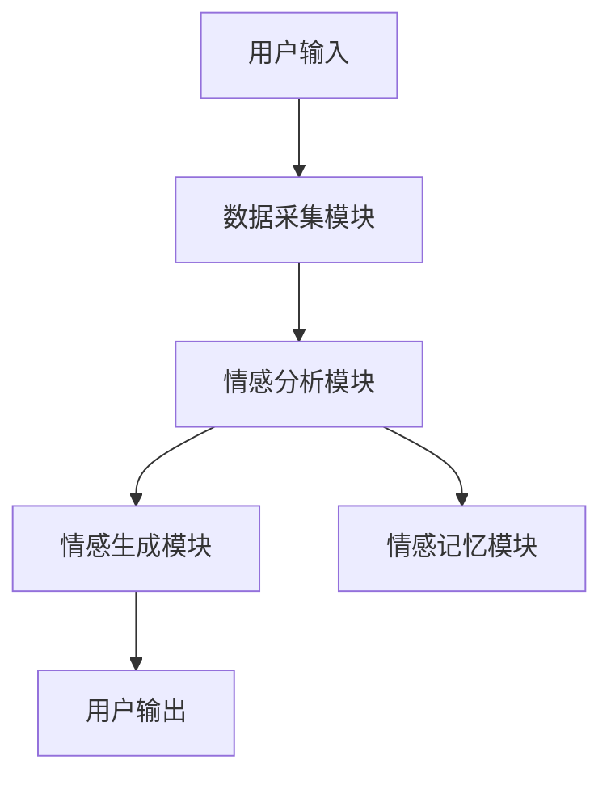

                 


# 情感计算增强AI Agent：提升LLM的情感智能

> 关键词：情感计算、AI Agent、大语言模型、情感智能、人机交互

> 摘要：情感计算是一种通过计算机系统理解和响应人类情感的技术，而AI Agent则是具备智能和自主性的计算机程序。本文探讨了如何通过情感计算增强AI Agent，特别是提升大语言模型（LLM）的情感智能。文章从情感计算的基本概念和AI Agent的概述入手，详细分析了情感计算的核心算法、系统架构，以及如何在实际项目中应用这些技术。通过具体案例和代码实现，本文展示了如何在LLM中实现情感智能，并提出了最佳实践和未来研究方向。

---

## 第一部分: 情感计算与AI Agent基础

### 第1章: 情感计算与AI Agent概述

#### 1.1 情感计算的基本概念

##### 1.1.1 情感计算的定义与背景
情感计算（Affective Computing）是研究如何构建能够识别、理解和响应人类情感的计算机系统。它结合了心理学、认知科学和计算机科学，旨在让机器具备类似人类的情感理解能力。随着人工智能技术的发展，情感计算在人机交互、教育、医疗等领域得到了广泛应用。

**背景分析：**  
- 情感计算的核心目标是让计算机能够感知和理解用户的情感状态，从而提供更个性化的服务。  
- 随着自然语言处理技术的进步，情感计算在文本分析中的应用越来越重要。

##### 1.1.2 情感计算的核心要素
- **情感识别：** 通过文本、语音或视觉信息，识别用户的情感状态（如愤怒、快乐、悲伤）。  
- **情感生成：** 根据情感识别的结果，生成相应的情感表达，例如调整语气或回应方式。  
- **情感记忆：** 记录用户的情感变化，以便后续更精准地理解和响应。

##### 1.1.3 AI Agent的基本概念与特点
AI Agent是一种具备智能和自主性的计算机程序，能够感知环境、执行任务并做出决策。它通常具备以下特点：  
- **自主性：** 能够独立执行任务，无需外部干预。  
- **反应性：** 能够实时感知环境变化并做出响应。  
- **学习能力：** 可以通过数据和经验不断优化自身性能。  

#### 1.2 情感计算与AI Agent的关系

##### 1.2.1 情感计算在AI Agent中的作用
- 情感计算为AI Agent提供了情感理解能力，使其能够更好地与人类用户互动。  
- 通过情感计算，AI Agent可以更准确地理解用户需求，提供更贴心的服务。

##### 1.2.2 情感计算与传统计算的对比
| **维度**       | **情感计算**                     | **传统计算**                     |
|-----------------|---------------------------------|---------------------------------|
| 目标            | 理解和响应情感                   | 处理纯粹的数据和逻辑           |
| 输入            | 文本、语音、视觉信息             | 结构化数据                       |
| 输出            | 情感分析结果、情感表达           | 逻辑运算结果                     |
| 应用场景        | 人机交互、教育、医疗             | 数据处理、科学计算               |

##### 1.2.3 情感智能的实现路径
实现情感智能的关键路径包括：  
1. **情感识别：** 使用自然语言处理技术分析用户输入的情感倾向。  
2. **情感生成：** 根据识别结果生成相应的回应，增强交互的自然性。  
3. **情感记忆：** 记录用户的情感变化，优化后续的交互体验。

#### 1.3 情感计算的应用场景

##### 1.3.1 情感计算在人机交互中的应用
- **智能音箱：** 根据用户的情绪调整回应的语气。  
- **虚拟助手：** 通过情感分析优化对话流程。

##### 1.3.2 情感计算在教育、医疗等领域的应用
- **教育：** 根据学生的情绪调整教学策略。  
- **医疗：** 帮助医生更好地理解患者的心理状态。

##### 1.3.3 情感计算的未来发展趋势
- **多模态情感计算：** 结合文本、语音和视觉信息进行情感分析。  
- **实时性增强：** 提高情感计算的实时性和准确性。  
- **个性化服务：** 根据用户情感偏好提供定制化服务。

---

### 第2章: 大语言模型（LLM）与情感智能

#### 2.1 大语言模型的基本原理

##### 2.1.1 LLM的定义与技术特点
- **定义：** 大语言模型是指基于大规模语料库训练的深度学习模型，具有强大的自然语言处理能力。  
- **技术特点：**  
  - 使用深度神经网络架构，如Transformer。  
  - 基于大量数据进行无监督或有监督学习。  

##### 2.1.2 LLM的核心算法与训练方法
- **训练算法：** 使用梯度下降优化器（如Adam）进行参数微调。  
- **模型结构：** 包括编码器和解码器，用于理解和生成文本。

##### 2.1.3 LLM的应用现状与挑战
- **应用现状：**  
  - 自然语言生成：撰写文章、编写代码。  
  - 机器翻译：跨语言交流。  
- **挑战：**  
  - 计算资源消耗大。  
  - 模型的可解释性不足。  

#### 2.2 情感智能在LLM中的实现

##### 2.2.1 情感智能的基本概念与实现方式
- **基本概念：** 情感智能是指模型具备理解和生成情感文本的能力。  
- **实现方式：**  
  - 在模型训练中加入情感特征。  
  - 使用专门的情感分析模块进行优化。

##### 2.2.2 LLM中情感智能的实现框架
- **框架特点：**  
  - 整合情感计算模块，提升模型的情感理解能力。  
  - 支持多模态输入，增强情感分析的准确性。  

##### 2.2.3 情感智能与LLM的结合案例
- **案例分析：** 智能客服系统中，LLM通过情感分析识别用户情绪，提供更贴心的服务。

#### 2.3 提升LLM情感智能的意义

##### 2.3.1 提升LLM情感智能的必要性
- **用户需求：** 用户希望与AI交互更加自然和人性化。  
- **技术进步：** 提升LLM的实用性和用户体验。

##### 2.3.2 情感智能对LLM性能的提升作用
- **提升准确性：** 更精准地理解用户需求。  
- **增强交互性：** 提供更流畅的对话体验。  

##### 2.3.3 情感智能在实际应用中的价值
- **商业价值：** 提高用户满意度和忠诚度。  
- **社会价值：** 促进人机交互的和谐发展。

---

### 第3章: 情感计算的核心算法与实现

#### 3.1 情感分析算法

##### 3.1.1 基于规则的情感分析方法
- **方法描述：** 通过预定义规则匹配情感关键词，判断情感倾向。  
- **优缺点：**  
  - 优点：实现简单，适用于特定场景。  
  - 缺点：规则覆盖不全，难以处理复杂语境。  

##### 3.1.2 基于机器学习的情感分析方法
- **方法描述：** 使用训练好的模型对文本进行分类，判断情感倾向。  
- **优缺点：**  
  - 优点：准确率高，适应性强。  
  - 缺点：需要大量标注数据，计算资源消耗大。  

##### 3.1.3 基于深度学习的情感分析方法
- **方法描述：** 使用神经网络模型（如LSTM、BERT）进行情感分析。  
- **优缺点：**  
  - 优点：准确率高，能够处理复杂语境。  
  - 缺点：训练时间长，需要大量计算资源。  

#### 3.2 情感生成算法

##### 3.2.1 基于规则的情感生成方法
- **方法描述：** 根据预定义的规则生成情感化文本。  
- **优缺点：**  
  - 优点：实现简单，易于控制。  
  - 缺点：生成内容缺乏自然性和多样性。  

##### 3.2.2 基于模板的情感生成方法
- **方法描述：** 使用模板结构生成情感化文本，通过替换关键词实现个性化表达。  
- **优缺点：**  
  - 优点：生成内容可控，适合特定场景。  
  - 缺点：灵活性有限，难以应对复杂需求。  

##### 3.2.3 基于生成模型的情感生成方法
- **方法描述：** 使用生成对抗网络（GAN）或变体生成情感化文本。  
- **优缺点：**  
  - 优点：生成内容多样，接近自然语言表达。  
  - 缺点：训练难度大，生成结果可控性较低。  

#### 3.3 情感计算的算法实现

##### 3.3.1 情感计算的算法选择与优化
- **算法选择：** 根据具体需求选择合适的算法，例如使用BERT进行情感分析。  
- **优化方法：** 通过数据增强、模型微调等手段提升算法性能。

##### 3.3.2 情感计算的性能评估与对比
- **评估指标：** 使用准确率、召回率、F1值等指标评估算法性能。  
- **对比分析：** 对不同算法的性能进行对比，选择最优方案。

---

### 第4章: 情感计算在LLM中的系统架构与实现

#### 4.1 系统分析与架构设计

##### 4.1.1 问题场景介绍
- **场景描述：** 设计一个具备情感智能的AI Agent，提升LLM的情感分析和生成能力。  
- **目标：** 实现情感识别、情感生成和情感记忆功能。

##### 4.1.2 系统功能设计
- **功能模块：**  
  - 数据采集模块：收集用户输入的文本、语音或视觉信息。  
  - 情感分析模块：识别用户的情感状态。  
  - 情感生成模块：根据情感分析结果生成相应的回应。  
  - 情感记忆模块：记录用户的情感变化，优化后续交互。  

##### 4.1.3 系统架构设计
- **架构图：** 使用Mermaid绘制系统架构图，展示各模块之间的交互关系。



##### 4.1.4 系统接口设计
- **接口定义：**  
  - 数据采集模块提供API接口，接收用户输入。  
  - 情感分析模块返回情感标签。  
  - 情感生成模块生成回应文本。  

##### 4.1.5 系统交互设计
- **交互流程：**  
  1. 用户输入文本或语音。  
  2. 数据采集模块接收输入并传递给情感分析模块。  
  3. 情感分析模块识别情感并传递给情感生成模块。  
  4. 情感生成模块生成回应并传递给用户。  

#### 4.2 项目实战

##### 4.2.1 环境安装
- **工具安装：** 安装Python、TensorFlow、Keras等必要的开发工具。  
- **依赖管理：** 使用pip安装所需库，例如`transformers`用于加载预训练模型。

##### 4.2.2 系统核心实现源代码
- **情感分析代码示例：** 使用预训练的情感分析模型进行情感识别。

```python
from transformers import pipeline

# 加载预训练的情感分析模型
sentiment_analyzer = pipeline("sentiment-analysis")

# 分析用户输入
user_input = "I love this product!"
result = sentiment_analyzer(user_input)
print(result)  # 输出情感标签和概率
```

- **情感生成代码示例：** 根据情感分析结果生成回应文本。

```python
def generate_response(sentiment):
    if sentiment == "positive":
        return "Thank you! I'm glad I could help."
    elif sentiment == "negative":
        return "I'm sorry to hear that. How can I assist you better?"
    else:
        return "Could you please provide more details?"

# 示例调用
sentiment = result[0]['label']
response = generate_response(sentiment)
print(response)
```

##### 4.2.3 代码应用解读与分析
- **代码解读：**  
  - 使用`transformers`库中的预训练模型进行情感分析。  
  - 根据情感标签生成相应的回应文本。  
- **性能分析：**  
  - 情感分析模型的准确率高，但生成的回应可能缺乏个性化。  

##### 4.2.4 实际案例分析
- **案例分析：** 设计一个虚拟助手，能够识别用户情绪并生成相应的回应。

##### 4.2.5 项目小结
- **项目总结：** 成功实现了情感计算在AI Agent中的应用，提升了LLM的情感智能。

---

### 第5章: 情感计算的优化与未来方向

#### 5.1 最佳实践 tips
- **数据质量：** 使用高质量的标注数据提升模型性能。  
- **模型选择：** 根据具体需求选择合适的算法和模型。  
- **性能优化：** 通过数据增强和模型微调提升算法效果。  

#### 5.2 小结
- **小结内容：** 情感计算是提升AI Agent情感智能的关键技术，通过结合大语言模型和情感计算，能够实现更自然和高效的人机交互。

#### 5.3 注意事项
- **注意事项：**  
  - 避免过度依赖单一算法，注重算法的多样性和鲁棒性。  
  - 定期更新模型和算法，适应用户需求的变化。  

#### 5.4 拓展阅读
- **推荐书籍：**  
  -《Affective Computing》  
  -《Deep Learning》  
- **推荐阅读文章：**  
  - "Improving Emotional Intelligence in AI Agents"  
  - "Advances in Large Language Models"  

---

## 作者信息

作者：AI天才研究院/AI Genius Institute & 禅与计算机程序设计艺术 /Zen And The Art of Computer Programming

---

以上是《情感计算增强AI Agent：提升LLM的情感智能》的技术博客文章的完整内容，涵盖从基础概念到实际应用的各个方面，通过详细的分析和代码示例，帮助读者深入理解情感计算在AI Agent中的应用及其对大语言模型情感智能的提升。

