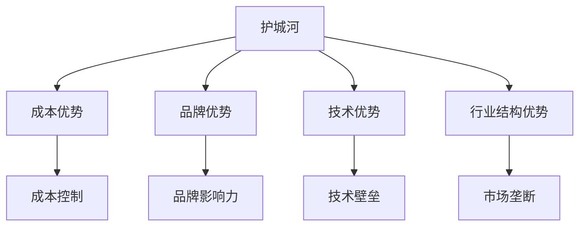
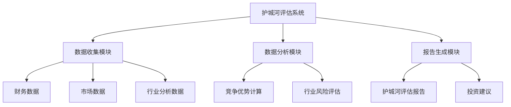

                 


# 戴维·多德的护城河评估体系

> 关键词：戴维·多德、护城河、价值投资、竞争优势、企业评估、投资策略

> 摘要：本文深入探讨了戴维·多德提出的护城河评估体系，从理论基础、核心概念、数学模型到实际应用，全面解析了护城河评估在企业价值投资中的重要性。文章通过详细的案例分析和系统设计，展示了如何将护城河评估体系应用于实际投资决策中，帮助投资者识别和评估企业的竞争优势。

---

## 第一部分: 戴维·多德的护城河评估体系概述

### 第1章: 护城河的起源与核心概念

#### 1.1 护城河的定义与背景
戴维·多德（David Dodd）作为价值投资的先驱之一，提出了一套独特的企业评估方法，其中护城河（Economic Moat）是其理论体系中的核心概念。护城河是指企业在市场中竞争对手难以复制或超越的竞争优势，这种优势能够为企业创造可持续的超额利润。护城河的存在使得企业在面对竞争时更具防御性，从而为投资者提供了更高的安全边际。

护城河的概念起源于经典的经济理论和企业竞争优势分析。多德认为，企业价值不仅取决于财务表现，还与其在市场中的竞争地位密切相关。通过护城河评估，投资者可以识别那些具有长期竞争优势的企业，从而做出更明智的投资决策。

#### 1.2 护城河的核心要素
戴维·多德提出的护城河评估体系主要包括以下几个核心要素：

1. **成本优势**：企业通过规模经济、流程优化或原材料采购优势，能够在成本控制上优于竞争对手。
2. **品牌优势**：强大的品牌影响力使得企业在定价、市场份额和客户忠诚度方面具有显著优势。
3. **技术优势**：企业通过技术创新或专利壁垒，构建了难以被竞争对手复制的技术优势。
4. **行业结构优势**：行业集中度高、进入门槛高或市场容量有限，使得竞争对手难以进入或扩张。

#### 1.3 护城河的边界与外延
护城河并非无边界的存在，其外延和边界受到多种因素的限制：

- **护城河的边界**：护城河的有效性取决于行业特性和企业自身的资源禀赋。例如，在技术驱动的行业，技术优势可能构成主要的护城河；而在品牌驱动的行业，品牌优势可能更为重要。
- **护城河的外延**：护城河不仅包括企业的内部优势，还包括其外部环境的有利因素。例如，政策支持、市场需求和技术趋势等。

---

### 第2章: 护城河评估的核心概念与联系

#### 2.1 核心概念原理
护城河评估的核心在于识别和量化企业的竞争优势。通过分析企业的护城河宽度和深度，投资者可以更好地判断企业的长期盈利能力。护城河的宽度反映了竞争优势的广度，而深度则反映了竞争优势的强度。

#### 2.2 核心概念属性特征对比表
以下表格详细对比了护城河的核心要素及其属性特征：

| 护城河类型 | 成本优势 | 品牌优势 | 技术优势 | 行业结构优势 |
|------------|----------|----------|----------|--------------|
| 定义       | 成本低于竞争对手 | 强大品牌影响力 | 技术壁垒高 | 行业进入门槛高 |
| 特征       | 成本控制能力强 | 品牌忠诚度高 | 技术专利多 | 市场垄断能力 |
| 优势       | 价格竞争力 | 品牌溢价能力 | 技术壁垒 | 市场垄断能力 |

#### 2.3 ER实体关系图（Mermaid）



---

### 第3章: 护城河评估的数学模型与公式

#### 3.1 护城河评估的数学模型
护城河的强度可以通过以下公式进行量化：

$$ \text{护城河强度} = \frac{\text{竞争优势得分} \times \text{可持续性得分}}{\text{行业风险得分}} $$

其中：
- **竞争优势得分**：基于成本优势、品牌优势、技术优势和行业结构优势的综合评分，满分为10分。
- **可持续性得分**：反映竞争优势的长期持续能力，满分为5分。
- **行业风险得分**：评估行业整体风险，满分为5分。

#### 3.2 竞争优势得分计算
竞争优势得分基于以下指标：

$$ \text{竞争优势得分} = \frac{\text{成本优势得分} + \text{品牌优势得分} + \text{技术优势得分} + \text{行业结构优势得分}}{4} $$

---

## 第二部分: 护城河评估的系统分析与架构设计

### 第4章: 系统分析与架构设计方案

#### 4.1 问题场景介绍
在实际投资决策中，护城河评估需要结合定量和定性分析。通过构建一个完整的护城河评估系统，投资者可以更高效地识别和评估企业的竞争优势。

#### 4.2 系统功能设计
护城河评估系统的功能模块包括：
1. 数据收集模块：收集企业的财务数据、市场数据和行业分析数据。
2. 数据分析模块：基于护城河评估模型，计算企业的竞争优势得分。
3. 报告生成模块：生成护城河评估报告，包括优势分析和投资建议。

#### 4.3 系统架构设计（Mermaid）



---

### 第5章: 项目实战

#### 5.1 环境安装与数据准备
- 环境：Python 3.8+，Jupyter Notebook，Pandas库。
- 数据：选取一家企业（如亚马逊）的财务数据和行业分析数据。

#### 5.2 核心实现源代码
```python
import pandas as pd

# 假设我们已经收集了亚马逊的成本优势、品牌优势、技术优势和行业结构优势数据
data = {
    '成本优势': [8.5, 7.2, 6.8],
    '品牌优势': [9.0, 8.5, 7.0],
    '技术优势': [9.5, 8.8, 7.5],
    '行业结构优势': [8.0, 7.5, 6.0]
}

df = pd.DataFrame(data)

# 计算竞争优势得分
def calculate_competitive_score(row):
    return (row['成本优势'] + row['品牌优势'] + row['技术优势'] + row['行业结构优势']) / 4

df['竞争优势得分'] = df.apply(calculate_competitive_score, axis=1)

# 计算护城河强度
# 假设行业风险得分为3（中风险）
industry_risk_score = 3
df['护城河强度'] = (df['竞争优势得分'] * 4) / industry_risk_score

print(df)
```

#### 5.3 应用解读与分析
以上代码展示了如何基于护城河评估模型计算企业的竞争优势得分和护城河强度。通过实际案例分析，投资者可以更好地理解护城河评估的实际应用。

---

## 第三部分: 总结与展望

### 6.1 最佳实践
- **数据准确性**：确保数据来源可靠，避免偏差。
- **动态评估**：护城河评估需要动态更新，以应对市场变化。
- **多维度分析**：结合定量和定性分析，全面评估企业的竞争优势。

### 6.2 小结
护城河评估体系是戴维·多德提出的价值投资理论中的核心方法。通过识别和量化企业的竞争优势，投资者可以更准确地评估企业的长期价值，从而做出更明智的投资决策。

### 6.3 注意事项
- 护城河评估需要结合行业特性和企业实际情况。
- 数据分析是护城河评估的重要工具，但不能完全替代定性分析。

### 6.4 拓展阅读
- 多德的其他价值投资理论。
- 现代投资组合理论的相关研究。

---

作者：AI天才研究院/AI Genius Institute & 禅与计算机程序设计艺术/Zen And The Art of Computer Programming

