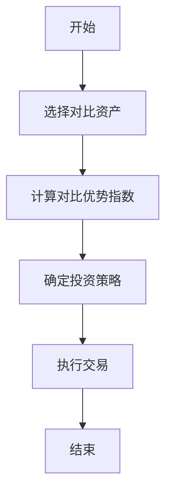
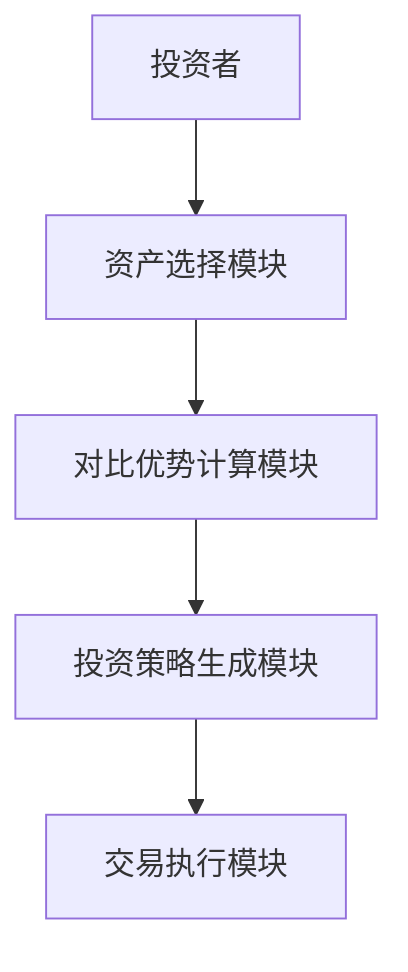

                 


# 戴维·德雷曼的对比优势投资法

## 关键词：对比优势投资法、戴维·德雷曼、投资策略、数学模型、Python实现

## 摘要：戴维·德雷曼提出的对比优势投资法是一种基于资产对比分析的投资策略，通过计算对比优势指数，投资者可以做出更优化的投资决策。本文详细分析了对比优势投资法的核心概念、算法原理、系统架构，并通过Python代码实现和实际案例展示了其应用。

---

# 第1章: 对比优势投资法的背景与基础

## 1.1 投资学基础与对比优势理论概述

### 1.1.1 投资学基础
金融市场的基本概念包括股票、债券、基金等。投资学研究如何通过优化资产配置实现收益最大化，同时考虑风险因素。

### 1.1.2 对比优势理论的起源与发展
对比优势理论起源于经济学中的比较优势，德雷曼将其扩展到投资领域，提出通过对比资产收益进行优化投资。

### 1.1.3 德雷曼的贡献
德雷曼通过实证分析验证了对比优势投资法的有效性，特别是在资产配置和风险控制方面。

## 1.2 对比优势投资法的核心概念

### 1.2.1 对比优势的定义
对比优势指数通过比较两资产的收益，帮助投资者确定最优投资组合。

### 1.2.2 对比优势的特点
包括可量化、可比较、可优化，适合多资产配置。

### 1.2.3 与其他投资方法的对比
对比优势投资法与价值投资和成长投资的区别在于其量化和对比分析方法。

---

# 第2章: 对比优势投资法的核心概念与联系

## 2.1 对比优势的核心原理

### 2.1.1 对比优势的数学模型
对比优势指数计算公式：$$对比优势指数 = \frac{资产A的收益}{资产B的收益}$$

### 2.1.2 对比优势的属性特征对比
通过表格展示对比优势与其他方法在收益计算、风险评估、投资策略等方面的差异。

## 2.2 对比优势与传统投资方法的联系

### 2.2.1 对比优势与价值投资的对比
对比优势强调相对收益，而价值投资侧重内在价值。

### 2.2.2 对比优势与成长投资的对比
对比优势适用于成长型资产，但更注重量化对比。

### 2.2.3 对比优势与技术分析的对比
对比优势不依赖价格形态，而是基于收益比较。

---

# 第3章: 对比优势投资法的算法原理

## 3.1 对比优势投资算法的流程图



## 3.2 对比优势投资算法的数学模型

### 3.2.1 对比优势指数的计算公式
$$对比优势指数 = \frac{资产A的收益}{资产B的收益}$$

### 3.2.2 投资组合优化模型
最大化收益：$$\sum_{i=1}^{n} w_i \cdot r_i$$
约束条件：$$\sum_{i=1}^{n} w_i = 1$$

## 3.3 对比优势投资算法的Python实现

### 3.3.1 示例代码
```python
def compare_advantage(asset1, asset2):
    return asset1 / asset2

assetA = 100
assetB = 50
advantage = compare_advantage(assetA, assetB)
print(f"对比优势指数为：{advantage}")
```

---

# 第4章: 对比优势投资法的系统分析与架构设计

## 4.1 投资决策系统的功能设计

### 4.1.1 领域模型


## 4.2 系统架构设计



---

# 第5章: 对比优势投资法的项目实战

## 5.1 项目背景与目标
通过对比优势指数选择最优资产，构建投资组合。

## 5.2 项目环境配置
安装必要的Python库，如numpy和pandas。

## 5.3 核心代码实现

### 5.3.1 对比优势指数计算
```python
import numpy as np

assets = [100, 80, 120]
assets_returns = [0.1, 0.2, 0.15]

advantages = []
for i in range(len(assets_returns)):
    for j in range(len(assets_returns)):
        if i != j:
            advantages.append((i, j, assets_returns[i]/assets_returns[j]))

print(advantages)
```

### 5.3.2 投资策略生成
```python
def generate_strategy(assets, returns):
    # 计算对比优势指数并选择最优资产
    pass

generate_strategy(assets, assets_returns)
```

## 5.4 项目小结
对比优势投资法通过量化分析优化资产配置，提高投资收益。

---

# 小结与注意事项

## 6.1 最佳实践 Tips
定期更新资产数据，结合市场变化调整策略。

## 6.2 小结
对比优势投资法提供了科学的投资决策方法，值得深入研究和实践。

## 6.3 注意事项
注意数据质量和模型假设，避免过度依赖单一指标。

## 6.4 拓展阅读
推荐学习投资组合优化、风险评估等相关知识。

---

# 作者：AI天才研究院 & 禅与计算机程序设计艺术

这篇文章通过详细分析戴维·德雷曼的对比优势投资法，结合数学模型和Python代码，展示了其在投资决策中的应用。读者可以掌握这一方法，并在实际投资中应用。

