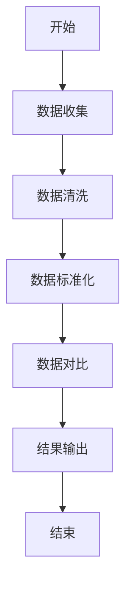
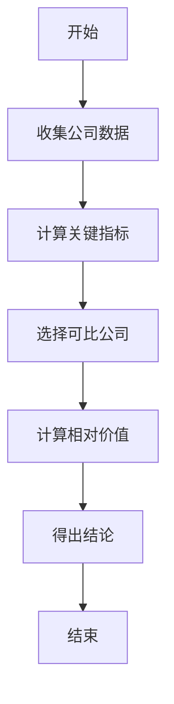
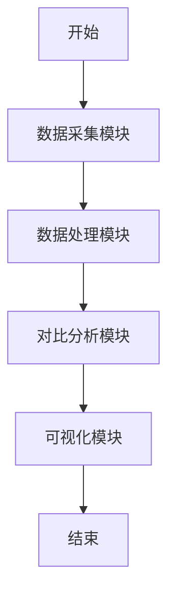

                 


# 戴维·德雷曼的对比资产价值投资策略

## 关键词：
- 价值投资
- 对比分析
- 资产评估
- 投资策略
- 股票分析

## 摘要：
戴维·德雷曼的对比资产价值投资策略是一种通过对比分析法评估资产内在价值的方法。本文将从投资的基本概念、对比分析法的原理、数学模型的实现、系统架构设计以及项目实战等方面，详细阐述这一策略的核心思想和实际应用。

---

## 第一部分: 对比资产价值投资策略概述

### 第1章: 投资的基本概念与背景

#### 1.1 投资的基本概念
- **资产与投资的定义**  
  资产是指能够产生收益的资源，包括股票、债券、房地产等。投资是将资金投入到这些资产中，以实现保值或增值的过程。  
- **投资的基本原理**  
  投资的核心在于通过分析资产的内在价值，找到市场价格低于内在价值的资产进行投资。  
- **投资的目标与风险**  
  投资的目标是实现财富增长，但同时也伴随着市场风险、流动性风险等不确定性。

#### 1.2 传统投资方法的局限性
- **市场有效性的探讨**  
  传统投资方法假设市场是有效的，即价格已经反映了所有信息。但现实中，市场可能存在短期波动和非理性行为。  
- **理性与非理性投资者的行为**  
  理性投资者基于基本面分析做出决策，而非理性投资者则可能受到情绪影响。  
- **传统投资策略的优缺点**  
  传统策略如技术分析和短期交易难以长期稳定盈利，且忽略了资产的内在价值。

#### 1.3 对比资产价值投资的提出
- **价值投资的起源与发展**  
  价值投资由本杰明·格雷厄姆提出，强调寻找市场价格低于内在价值的资产。  
- **对比分析法在投资中的应用**  
  对比分析法通过比较同类资产的估值指标，帮助投资者发现被低估的资产。  
- **德雷曼策略的核心思想**  
  德雷曼结合对比分析法，提出了一种系统化的资产价值评估方法，强调通过横向对比和纵向分析发现投资机会。

---

## 第二部分: 对比资产价值投资的核心概念

### 第2章: 对比分析法与资产价值评估

#### 2.1 对比分析法的原理
- **对比分析法的定义**  
  对比分析法是指通过比较两个或多个对象的相似性和差异性，以获取更深入的理解和洞察。  
- **对比分析法的基本步骤**  
  1. 确定对比对象和指标；  
  2. 收集数据并进行标准化处理；  
  3. 进行对比分析并得出结论。  
- **对比分析法的数学模型**  
  对比分析的核心在于计算相对值，例如：  
  $$
  \text{相对值} = \frac{\text{目标值}}{\text{基准值}}
  $$  

#### 2.2 资产价值评估的关键指标
- **市盈率（P/E）**  
  $$\text{市盈率} = \frac{\text{股价}}{\text{每股收益}}$$  
- **市净率（P/B）**  
  $$\text{市净率} = \frac{\text{股价}}{\text{每股净资产}}$$  
- **股息率（Dividend Yield）**  
  $$\text{股息率} = \frac{\text{每股股息}}{\text{股价}} \times 100\%$$  
- **其他相关指标**  
  如ROE（净资产收益率）、ROA（资产回报率）等。

#### 2.3 对比分析法在价值评估中的应用
- **行业间对比**  
  通过对比不同行业的估值指标，找到具有相对优势的行业。  
- **同业公司对比**  
  在同一行业中，比较竞争对手的估值指标，寻找被低估的公司。  
- **历史与当前对比**  
  比较公司历史估值与当前估值，判断是否存在低估或高估。

---

### 第3章: 对比分析法的算法实现

#### 3.1 对比分析法的算法流程
- **数据收集与清洗**  
  收集目标公司和可比公司的财务数据，并进行清洗处理。  
- **数据标准化与归一化**  
  对数据进行标准化处理，消除量纲影响。  
- **数据对比与分析**  
  计算相对值并进行排序，找出显著差异。  
- **结果输出与可视化**  
  通过图表展示对比结果，帮助投资者直观理解。

#### 3.2 对比分析法的数学模型
- **数据对比的数学表达式**  
  $$
  \text{对比值} = \frac{\text{目标值}}{\text{基准值}}
  $$  
- **数据权重的计算**  
  $$
  \text{权重} = \frac{\text{对比值} \times \text{重要性}}{\sum (\text{对比值} \times \text{重要性})}
  $$  

#### 3.3 对比分析法的mermaid流程图


---

### 第4章: 资产价值评估的数学模型

#### 4.1 资产价值的基本公式
- **内在价值公式**  
  $$
  \text{内在价值} = \frac{\text{未来现金流}}{\text{折现率}}
  $$  

#### 4.2 对比分析法在价值评估中的应用
- **相对价值公式**  
  $$
  \text{相对价值} = \frac{\text{目标公司估值}}{\text{可比公司估值}}
  $$  

#### 4.3 资产价值评估的mermaid流程图


---

## 第五部分: 对比资产价值投资的系统分析与架构设计

### 第5章: 投资决策系统的功能设计

#### 5.1 系统功能需求
- **数据采集模块**  
  收集目标公司和可比公司的财务数据。  
- **数据处理模块**  
  对数据进行清洗、标准化和归一化处理。  
- **对比分析模块**  
  计算相对值并生成对比报告。  
- **可视化模块**  
  以图表形式展示对比结果。

#### 5.2 系统架构设计


---

## 第六部分: 项目实战

### 第6章: 系统核心实现源代码

#### 6.1 环境安装
```bash
pip install pandas numpy matplotlib
```

#### 6.2 核心实现代码
```python
import pandas as pd
import numpy as np
import matplotlib.pyplot as plt

# 数据采集
data = pd.DataFrame({
    '公司': ['A', 'B', 'C'],
    'P/E': [15, 20, 25],
    'P/B': [2, 3, 4],
    'ROE': [10, 15, 20]
})

# 数据处理
data['对比值_P/E'] = data['P/E'] / data['P/E'].mean()
data['对比值_P/B'] = data['P/B'] / data['P/B'].mean()
data['对比值_ROE'] = data['ROE'] / data['ROE'].mean()

# 可视化
plt.figure(figsize=(10, 6))
data.plot.barh(figsize=(10, 6))
plt.title('对比分析图')
plt.xlabel('对比值')
plt.ylabel('公司')
plt.show()
```

---

## 结语

戴维·德雷曼的对比资产价值投资策略通过系统化的对比分析，帮助投资者发现被低估的资产。本文从理论到实践，详细介绍了这一策略的核心思想和实现方法，为投资者提供了实用的指导。

---

## 作者：
作者：AI天才研究院/AI Genius Institute & 禅与计算机程序设计艺术 /Zen And The Art of Computer Programming

