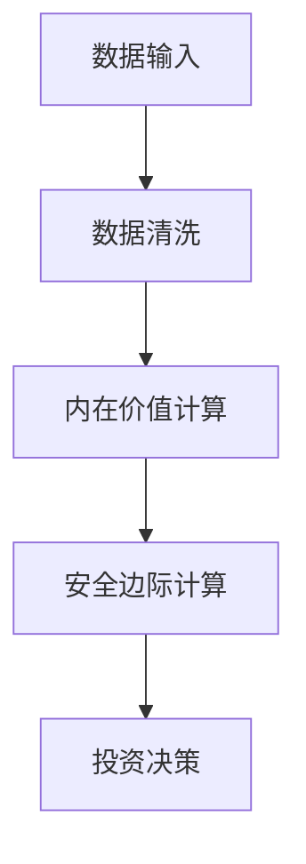

                 


# 戴维·道德的避险价值投资：在动荡市场中保持稳定

---

## 关键词：
- 戴维·道德
- 避险价值投资
- 安全边际
- 内在价值
- 市场低估
- 投资策略
- 投资稳定性

---

## 摘要：
本文深入探讨戴维·道德的避险价值投资策略，分析其核心概念、算法原理和数学模型，结合系统架构设计和项目实战，最终提供最佳实践和投资建议。文章通过详细解读安全边际、内在价值和市场低估等核心要素，帮助投资者在动荡的市场中保持稳定收益。

---

# 第一部分：避险价值投资的背景与核心理念

## 第1章：避险价值投资的背景与核心概念

### 1.1 避险价值投资的定义与特点
#### 1.1.1 什么是避险价值投资
避险价值投资是一种以安全边际为核心的投资策略，旨在通过寻找市场低估的投资机会，实现长期稳定的收益。与传统投资注重短期收益不同，避险价值投资强调本金安全和超额收益的结合。

#### 1.1.2 避险价值投资的核心理念
避险价值投资的核心理念包括：
- **安全边际**：通过比较市场价格与内在价值，确保投资的安全性。
- **内在价值**：企业未来现金流的现值，反映其真实价值。
- **市场低估**：寻找市场价格低于内在价值的投资机会。

#### 1.1.3 避险价值投资与传统投资的区别
| 投资策略 | 传统投资 | 避险价值投资 |
|----------|----------|---------------|
| 投资目标 | 短期收益 | 长期稳定收益 |
| 投资方法 | 市场趋势 | 安全边际、内在价值 |
| 风险管理 | 高风险承受 | 强调风险管理 |

### 1.2 戴维·道德的投资理念与方法
#### 1.2.1 戴维·道德的背景与投资风格
戴维·道德是一位世界级的投资大师，以其长期视角和逆向思维闻名。他的投资策略强调安全边际和内在价值，注重在市场波动中寻找低估的投资机会。

#### 1.2.2 道德投资的三要素
- **安全边际**：通过比较市场价格与内在价值，确保投资的安全性。
- **内在价值**：企业未来现金流的现值，反映其真实价值。
- **市场低估**：寻找市场价格低于内在价值的投资机会。

#### 1.2.3 道德投资的长期视角与逆向思维
戴维·道德的投资策略强调长期视角和逆向思维，即在市场低迷时寻找低估机会，在市场高涨时保持谨慎。

### 1.3 避险价值投资的核心要素
#### 1.3.1 安全边际的定义与计算
安全边际是市场价格与内在价值之间的差距，计算公式为：
$$ Margin \, of \, Safety = \frac{V - P}{P} \times 100\% $$
其中，V为内在价值，P为市场价格。

#### 1.3.2 内在价值的评估方法
内在价值是企业未来现金流的现值，计算公式为：
$$ V = \sum_{t=1}^{n} \frac{CF_t}{(1 + r)^t} $$
其中，CF_t为第t年的现金流，r为折现率，n为预测年数。

#### 1.3.3 市场波动与投资机会的识别
市场波动为避险价值投资者提供了寻找低估机会的契机，通过分析市场波动，投资者可以更好地识别安全边际较高的标的。

---

## 第2章：避险价值投资的数学模型与算法原理

### 2.1 避险价值投资的数学模型
#### 2.1.1 内在价值计算公式
$$ V = \sum_{t=1}^{n} \frac{CF_t}{(1 + r)^t} $$
其中，CF_t为第t年的现金流，r为折现率，n为预测年数。

#### 2.1.2 安全边际计算公式
$$ Margin \, of \, Safety = \frac{V - P}{P} \times 100\% $$
其中，V为内在价值，P为市场价格。

#### 2.1.3 市场波动与投资组合优化的数学模型
通过马科维茨的有效投资组合理论，结合避险价值投资的安全边际和内在价值，构建最优投资组合。

### 2.2 避险价值投资的算法实现
#### 2.2.1 基于Python的内在价值计算代码
```python
def calculate_intrinsic_value(cash_flows, discount_rate, years):
    return sum(cf / (1 + discount_rate) ** year for year, cf in zip(years, cash_flows))
```

#### 2.2.2 安全边际计算的Python实现
```python
def calculate_margin_of_safety(intrinsic_value, market_price):
    return (intrinsic_value - market_price) / market_price * 100
```

---

## 第3章：系统分析与架构设计

### 3.1 问题场景介绍
在动荡的市场中，投资者需要一种稳健的投资策略，以确保本金安全和长期收益。

### 3.2 系统功能设计
- **数据收集模块**：收集企业财务数据和市场数据。
- **评估模块**：计算内在价值和安全边际。
- **决策模块**：根据计算结果，推荐投资标的。

### 3.3 系统架构设计


---

## 第4章：项目实战

### 4.1 环境安装
安装Python和必要的库（如Pandas、NumPy）。

### 4.2 核心代码实现
```python
import pandas as pd

def calculate_intrinsic_value(cash_flows, discount_rate, years):
    return sum(cf / (1 + discount_rate) ** year for year, cf in zip(years, cash_flows))

def calculate_margin_of_safety(intrinsic_value, market_price):
    return (intrinsic_value - market_price) / market_price * 100

# 示例数据
cash_flows = [100, 120, 150]
discount_rate = 0.08
years = [1, 2, 3]

iv = calculate_intrinsic_value(cash_flows, discount_rate, years)
print(f"内在价值：{iv}")

market_price = 100
mos = calculate_margin_of_safety(iv, market_price)
print(f"安全边际：{mos}%")
```

### 4.3 案例分析
选择一家公司，分析其财务数据，计算内在价值和安全边际，判断是否低估。

---

## 第5章：最佳实践与总结

### 5.1 最佳实践
- 长期投资：避免频繁交易，降低交易成本。
- 风险管理：分散投资，控制单一标的的风险。

### 5.2 小结与注意事项
- 避险价值投资强调安全边际和内在价值，帮助投资者在动荡市场中保持稳定收益。
- 投资者需要持续学习和适应市场变化，定期评估投资组合。

### 5.3 拓展阅读
推荐相关书籍和资源，供有兴趣的读者深入学习。

---

## 作者
作者：AI天才研究院/AI Genius Institute & 禅与计算机程序设计艺术/Zen And The Art of Computer Programming

---

希望这篇文章能够为读者提供清晰的思路和实用的指导，帮助他们在动荡的市场中实现稳健投资。

