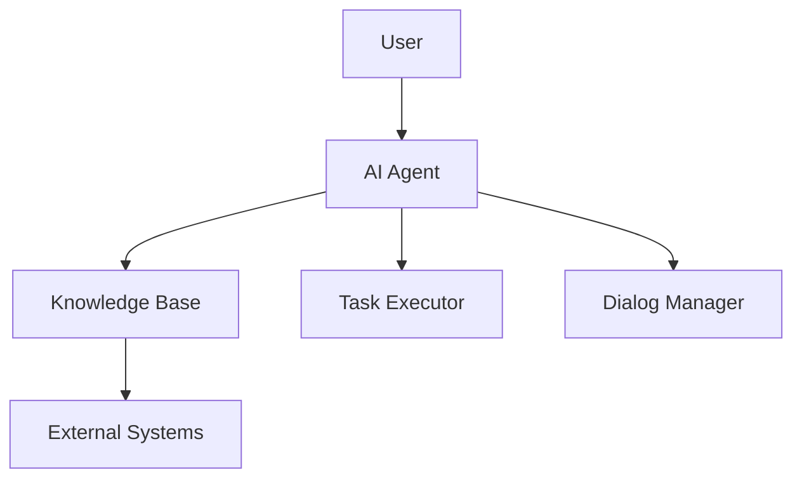
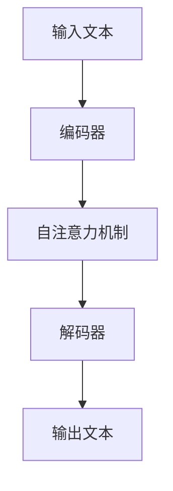
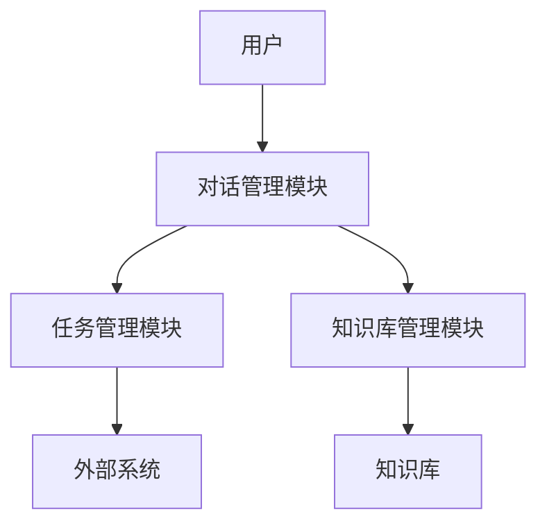

                 


# 打造个人助理 AI Agent：GPT 模型应用实战

> 关键词：AI Agent，GPT 模型，自然语言处理，人工智能，对话系统

> 摘要：本文深入探讨了如何利用GPT模型打造个人助理AI Agent，从基本概念到系统架构设计，再到项目实战，详细讲解了实现过程中的关键技术和注意事项。文章内容涵盖GPT模型的算法原理、AI Agent的核心功能模块、系统架构设计、项目实现步骤等，旨在为读者提供全面的技术指导。

---

# 第一部分：打造个人助理 AI Agent 的背景与基础

## 第1章：AI Agent 的概念与背景

### 1.1 AI Agent 的定义与核心概念

AI Agent（人工智能代理）是一种能够感知环境、执行任务并提供服务的智能系统。它通过自然语言处理（NLP）、机器学习（ML）等技术，与用户进行交互，帮助用户完成各种任务。

#### 1.1.1 什么是 AI Agent

AI Agent 是一种智能实体，能够理解用户的意图、执行任务并提供反馈。它类似于虚拟助手，如Siri、Alexa等，但功能更强大，能够处理复杂任务。

#### 1.1.2 AI Agent 的核心要素

- **感知能力**：通过自然语言处理技术，理解用户的需求。
- **决策能力**：根据用户需求，生成相应的操作指令。
- **执行能力**：通过调用外部服务或工具，完成用户指定的任务。
- **学习能力**：通过机器学习算法，不断优化自身的性能。

#### 1.1.3 AI Agent 的应用场景

- **个人助手**：帮助用户管理日程、处理邮件、安排会议等。
- **客服系统**：提供24/7的客户支持服务。
- **教育辅助**：为学生提供学习建议和辅导。

---

### 1.2 GPT 模型与 AI Agent 的关系

GPT（Generative Pre-trained Transformer）是一种基于Transformer架构的大型语言模型，具有强大的文本生成和理解能力，是实现AI Agent的核心技术之一。

#### 1.2.1 GPT 模型的基本原理

GPT 模型通过预训练的方式，学习大量的文本数据，掌握语言的规律和语义信息。它采用自注意力机制，能够捕捉文本中的长距离依赖关系，生成连贯且合理的文本。

#### 1.2.2 GPT 模型在 AI Agent 中的应用

- **对话生成**：通过GPT模型生成自然的对话回复。
- **任务理解**：利用GPT模型理解用户的意图。
- **知识库查询**：通过GPT模型对知识库进行检索和推理。

#### 1.2.3 GPT 模型的优缺点

- **优点**：
  - 强大的文本生成能力。
  - 能够处理复杂的语言任务。
  - 可以通过微调适应特定领域的需求。
- **缺点**：
  - 对计算资源要求高。
  - 需要大量数据进行训练。
  - 可能存在幻觉问题（生成不准确的信息）。

---

### 1.3 AI Agent 的发展现状

AI Agent 的发展离不开GPT模型的进步。从最初的GPT到现在的GPT-4，模型的性能和能力不断提高，为AI Agent的应用提供了更强大的技术支持。

#### 1.3.1 当前 AI Agent 的主要类型

- **工具型 AI Agent**：专注于执行具体任务，如计算器、天气查询等。
- **任务型 AI Agent**：能够处理复杂任务，如行程安排、信息检索等。
- **社交型 AI Agent**：能够进行自然对话，模拟人类的交流方式。

#### 1.3.2 GPT 模型在 AI Agent 中的最新进展

- GPT-4的多模态能力，可以处理图像、文本等多种数据类型。
- 提供更准确的意图识别和上下文理解能力。
- 支持更复杂的任务处理，如代码生成、数据分析等。

#### 1.3.3 AI Agent 的未来趋势

- 更强的通用性：能够处理更多类型的任务。
- 更高的智能性：具备自主学习和推理能力。
- 更好的人机交互：实现更自然的对话和互动。

---

## 第2章：AI Agent 的核心概念与联系

### 2.1 AI Agent 的核心概念

AI Agent 的核心概念包括任务管理、对话管理和知识管理。

#### 2.1.1 AI Agent 的类型与特点

| 类型          | 特点                         |
|---------------|------------------------------|
| 工具型 Agent  | 专注于执行单一任务           |
| 任务型 Agent  | 能够处理复杂任务             |
| 社交型 Agent  | 模拟人类对话，提供情感支持     |

#### 2.1.2 AI Agent 的功能模块

- **对话管理模块**：处理用户输入，生成回复。
- **任务管理模块**：执行用户指定的任务。
- **知识库管理模块**：存储和管理相关知识。

#### 2.1.3 AI Agent 的核心要素

- 用户需求：用户的意图和期望。
- 系统能力：AI Agent的功能和性能。
- 环境交互：AI Agent与外部系统和数据源的接口。

---

### 2.2 AI Agent 的实体关系图

以下是AI Agent的实体关系图（使用Mermaid）：



---

## 第3章：GPT 模型的算法原理

### 3.1 GPT 模型的训练过程

GPT模型的训练过程包括预训练和微调两个阶段。

#### 3.1.1 预训练过程

预训练的目标是学习语言的规律和语义信息。通常使用大规模的文本数据进行训练，采用自监督学习方法。

#### 3.1.2 微调过程

微调阶段是对GPT模型进行针对性训练，使其适应特定的任务和领域。例如，可以使用任务相关的数据对模型进行微调。

#### 3.1.3 GPT 模型的训练目标

GPT模型的训练目标是通过最大化条件概率，生成合理的文本序列。具体公式如下：

$$
\text{Loss} = -\sum_{i=1}^{n} \log P(w_i | w_{i-1}, ..., w_1)
$$

---

### 3.2 GPT 模型的数学模型

GPT模型基于Transformer架构，由编码器和解码器组成。

#### 3.2.1 概率分布模型

GPT模型通过自注意力机制，计算输入序列中每个词与其他词的相关性，生成概率分布。

$$
\text{Attention}(Q, K, V) = \text{softmax}\left(\frac{QK^T}{\sqrt{d_k}}\right)V
$$

#### 3.2.2 交叉熵损失函数

交叉熵损失函数用于衡量模型预测值与真实值之间的差异。

$$
\text{Loss} = -\sum_{i=1}^{n} y_i \log p_i
$$

其中，$y_i$ 是真实标签，$p_i$ 是模型预测的概率。

#### 3.2.3 GPT 模型的数学公式

GPT模型的数学公式可以表示为：

$$
p(x_{\text{cond}}) = \text{softmax}(Wx_{\text{cond}})
$$

其中，$x_{\text{cond}}$ 是输入条件，$W$ 是模型的权重矩阵。

---

### 3.3 GPT 模型的算法流程图

以下是GPT模型的算法流程图（使用Mermaid）：



---

## 第4章：AI Agent 的系统架构设计

### 4.1 AI Agent 的功能模块设计

AI Agent 的功能模块包括对话管理、任务管理和知识库管理。

#### 4.1.1 对话管理模块

对话管理模块负责处理用户的输入，生成回复。

#### 4.1.2 任务管理模块

任务管理模块负责执行用户指定的任务，如查询天气、安排会议等。

#### 4.1.3 知识库管理模块

知识库管理模块负责存储和管理相关知识，如用户的个人信息、常用任务等。

---

### 4.2 AI Agent 的系统架构设计

以下是AI Agent的系统架构设计（使用Mermaid）：



---

## 第5章：AI Agent 的项目实战

### 5.1 项目环境安装

#### 5.1.1 安装 Python 和必要的库

```bash
python -m pip install --upgrade pip
pip install torch transformers
```

---

### 5.2 系统核心实现源代码

以下是对话管理模块的代码示例：

```python
class DialogManager:
    def __init__(self, model):
        self.model = model
        self.current_dialogue = []

    def process_input(self, input_text):
        # 调用GPT模型生成回复
        response = self.model.generate(input_text)
        self.current_dialogue.append((input_text, response))
        return response
```

---

## 第6章：AI Agent 的最佳实践

### 6.1 小结

本文详细讲解了如何利用GPT模型打造个人助理AI Agent，从基本概念到系统架构设计，再到项目实战，为读者提供了全面的技术指导。

### 6.2 注意事项

- 确保系统的安全性，防止数据泄露。
- 定期更新模型，保持系统的性能和准确性。
- 提供良好的用户体验，优化对话流程。

---

## 附录：AI Agent 的扩展阅读

- GPT模型的论文：[link](https://arxiv.org/abs/1806.02630)
- AI Agent 的相关研究：[link](https://www.researchgate.net/publication/...)

---

# 作者：AI天才研究院 & 禅与计算机程序设计艺术

---

通过以上结构和内容，我们可以清晰地看到打造个人助理AI Agent的完整过程。从理论到实践，从基础到高级，本文为读者提供了详尽的技术指导和实用的代码示例。希望本文能帮助读者更好地理解和实现自己的AI Agent系统。

