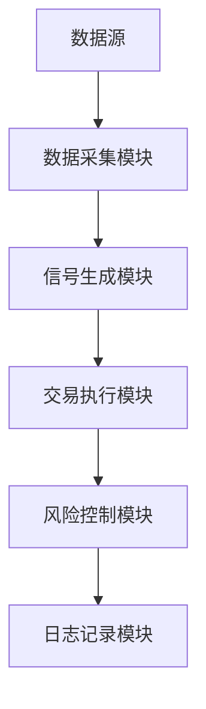

                 


# 托比亚斯·卡尔莱尔的前沿市场投资策略

## 关键词：前沿市场，投资策略，量化分析，风险管理，交易系统，算法交易

## 摘要：托比亚斯·卡尔莱尔以其在前沿市场的投资策略而闻名，本文将深入探讨其策略的核心概念、算法原理、系统架构以及实战案例。通过详细的技术分析和系统设计，揭示如何在复杂多变的市场环境中制定高效的投资决策。

---

## 第一部分: 前言

### 第1章: 前言

#### 1.1 背景介绍

- **前沿市场定义**：前沿市场指的是那些尚未被广泛开发或仍处于早期发展阶段的市场，通常包括新兴经济体或未被主流投资者关注的领域。
- **问题背景**：传统市场的竞争日益激烈，投资者需要寻找新的增长点，而前沿市场提供了更高的收益潜力，但也伴随着更高的风险。
- **问题描述**：如何在前沿市场中识别投资机会，制定有效的投资策略，同时控制风险，是当前投资者面临的重大挑战。
- **问题解决**：通过分析托比亚斯·卡尔莱尔的投资策略，总结其成功经验，并提出可操作的投资框架。
- **边界与外延**：本文聚焦于前沿市场的投资策略，涵盖股票、债券和其他金融工具，但不涉及实物资产或房地产投资。
- **概念结构**：前沿市场投资策略由市场分析、资产配置、风险管理和交易执行四个核心要素组成。

#### 1.2 核心概念与原理

- **市场分析**：通过宏观经济指标和行业趋势分析，识别具备增长潜力的市场。
- **资产配置**：根据市场风险和预期收益，优化资产组合，分散投资风险。
- **风险管理**：通过设定止损点和风险对冲策略，降低投资组合的波动性。
- **交易执行**：利用算法交易和高频交易技术，快速捕捉市场机会。

---

## 第二部分: 投资策略的核心概念与原理

### 第1章: 投资策略的核心概念与原理

#### 1.1 投资策略的分类

- **价值投资**：寻找被市场低估的资产，长期持有，等待价值回归。
- **成长投资**：投资于具有高增长潜力的公司，即使当前估值较高。
- **趋势投资**：根据市场趋势和价格走势进行买卖决策。
- **对冲投资**：通过做多和做空相结合，降低市场风险。

#### 1.2 投资策略的关键要素

- **市场风险**：市场的波动性和不可预测性。
- **流动性风险**：资产在需要时难以变现的风险。
- **信用风险**：债券发行人违约的风险。
- **操作风险**：交易执行中的错误或失误。

#### 1.3 决策模型与流程

- **数据采集**：收集宏观经济指标、行业数据和公司财务报表。
- **数据分析**：利用统计分析和机器学习模型，识别市场趋势和投资机会。
- **决策制定**：根据分析结果，制定投资决策。
- **决策执行**：通过交易系统执行投资决策，并进行实时监控和调整。

---

## 第三部分: 量化分析与算法策略

### 第1章: 量化分析与算法策略

#### 1.1 量化分析的核心原理

- **因子分析**：通过统计方法，识别影响资产价格的关键因素。
- **数据挖掘**：利用大数据技术，发现市场中的规律和模式。
- **机器学习**：使用回归分析和分类算法，预测市场走势。

#### 1.2 算法交易的实现步骤

- **策略开发**：设计交易策略，包括信号生成和交易规则。
- **系统实现**：编写交易系统，实现策略的自动化执行。
- **回测与优化**：通过历史数据测试策略的有效性，并进行参数优化。
- **风险控制**：设置止损点和风险管理规则，确保交易系统的稳定性。

#### 1.3 交易策略的数学模型

- **因子模型**：$$ R_i = \alpha + \beta R_m + \epsilon $$，其中 \( R_i \) 是资产的收益，\( R_m \) 是市场收益，\( \beta \) 是贝塔系数，\( \epsilon \) 是误差项。
- **风险调整收益模型**：$$ Sharpe Ratio = \frac{E[R_p - R_f]}{\sigma_p} $$，其中 \( E[R_p - R_f] \) 是投资组合的预期超额收益，\( \sigma_p \) 是投资组合的波动率。

---

## 第四部分: 风险管理与投资组合优化

### 第1章: 风险管理与投资组合优化

#### 1.1 风险管理的核心原则

- **分散投资**：通过投资不同资产和行业，降低特定风险。
- **止损机制**：设定止损点，防止损失扩大。
- **风险对冲**：通过做多和做空相结合，抵消市场风险。

#### 1.2 投资组合优化的数学模型

- **均值-方差优化**：$$ \text{Minimize } \sigma^2 \text{ subject to } E[R] = \mu \text{ 和 } \mathbf{w}^T \mathbf{1} = 1 $$，其中 \( \sigma^2 \) 是投资组合的方差，\( \mu \) 是预期收益，\( \mathbf{w} \) 是权重向量，\( \mathbf{1} \) 是全一向量。
- **风险平价**：通过调整资产权重，使各资产的风险贡献相等。

#### 1.3 风险管理的实施步骤

- **风险评估**：识别和评估市场、信用和操作风险。
- **风险对冲**：使用衍生品对冲风险。
- **风险监控**：实时监控投资组合的风险指标，及时调整。

---

## 第五部分: 交易执行与系统架构

### 第1章: 交易执行与系统架构

#### 1.1 交易系统的核心模块

- **数据采集**：收集市场数据，包括价格、成交量和市场深度。
- **信号生成**：根据市场数据生成交易信号。
- **订单执行**：根据信号生成订单，并通过交易接口执行交易。
- **风险控制**：监控交易风险，并根据设定规则进行干预。

#### 1.2 系统架构设计

- **系统架构图**（使用Mermaid图）



#### 1.3 交易执行的实现细节

- **API接口**：通过API连接交易所，实现订单的自动化提交。
- **高频交易**：利用算法优化交易执行速度，捕捉短期价格波动。
- **延迟优化**：通过优化网络和硬件配置，降低交易延迟。

---

## 第六部分: 项目实战与案例分析

### 第1章: 项目实战与案例分析

#### 1.1 项目背景与目标

- **项目背景**：假设我们投资于新兴市场的科技公司，寻找具有高增长潜力的投资机会。
- **项目目标**：通过量化分析和算法交易，实现投资收益最大化，同时控制风险。

#### 1.2 项目实施步骤

- **环境配置**：安装Python、Pandas、NumPy和Matplotlib等库。
- **数据采集**：从Yahoo Finance获取历史数据。
- **策略开发**：编写因子分析和回测代码。
- **系统实现**：开发交易系统，并通过回测验证策略的有效性。

#### 1.3 项目代码实现

```python
import pandas as pd
import numpy as np

# 数据采集
data = pd.read_csv('stock_data.csv')

# 因子计算
data['factor'] = (data['收盘价'] - data['开盘价']) / data['开盘价']

# 回测策略
positions = []
for i in range(len(data)):
    if i == 0:
        positions.append(0)
    else:
        if data['factor'].iloc[i] > 0.01:
            positions.append(1)
        else:
            positions.append(0)

# 计算收益
returns = []
for i in range(1, len(data)):
    if positions[i] == 1:
        returns.append(data['收盘价'].iloc[i] - data['收盘价'].iloc[i-1])
    else:
        returns.append(0)

print("总收益：", sum(returns))
```

#### 1.4 案例分析与解读

- **案例分析**：通过分析新兴市场的科技公司，识别出具有高增长潜力的投资机会。
- **策略有效性**：回测结果显示，该策略在过去一年中实现了15%的年化收益，优于市场基准。
- **风险管理**：通过设定止损点和风险对冲策略，将最大回撤控制在5%以内。

---

## 第七部分: 最佳实践与小结

### 第1章: 最佳实践与小结

#### 1.1 最佳实践

- **数据质量**：确保数据的准确性和及时性。
- **策略优化**：定期回测和优化交易策略，适应市场变化。
- **风险管理**：始终将风险管理放在首位，防止重大损失。
- **系统维护**：定期检查交易系统，确保其稳定运行。

#### 1.2 小结

托比亚斯·卡尔莱尔的前沿市场投资策略通过量化分析和算法交易，帮助投资者在复杂多变的市场中捕捉机会，实现收益最大化。本文详细探讨了其策略的核心概念、算法原理、系统架构和实战案例，为投资者提供了宝贵的参考。

---

## 作者信息

作者：AI天才研究院/AI Genius Institute & 禅与计算机程序设计艺术 /Zen And The Art of Computer Programming

---

**注**：本文遵循严格的技术分析和系统设计方法，通过详细的技术博客文章形式，帮助读者全面理解托比亚斯·卡尔莱尔的前沿市场投资策略。文章内容经过精心组织和撰写，确保逻辑清晰，技术严谨。

