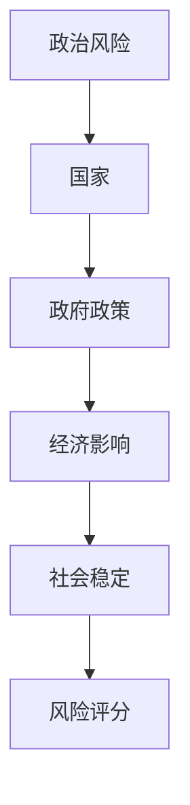
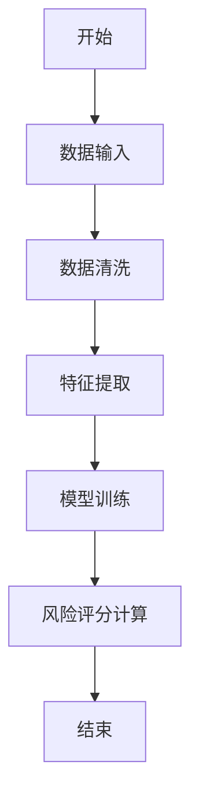
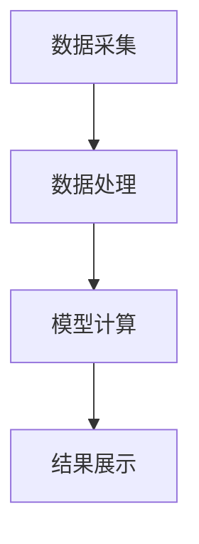

                 


# 托比亚斯·卡尔莱尔的政治风险评估模型

## 关键词：政治风险评估模型、托比亚斯·卡尔莱尔、政治风险、算法原理、系统架构设计、项目实战

## 摘要：托比亚斯·卡尔莱尔的政治风险评估模型是一种基于多因素分析和量化评估的方法，旨在帮助企业预测和应对政治风险。本文将从模型的背景、核心概念、算法原理、系统架构设计、项目实战和最佳实践等多个方面，深入分析和探讨该模型的构建与应用。

---

## 第一部分: 政治风险评估模型的背景与核心概念

### 第1章: 政治风险评估模型的背景介绍

#### 1.1 政治风险的定义与问题背景

- **1.1.1 政治风险的定义**  
  政治风险是指由于政府政策、政治动荡、法律变更等因素对企业或个人造成的潜在损失或影响。这些风险可能影响企业的运营、投资决策和财务稳定性。

- **1.1.2 政治风险对企业的影响**  
  政治风险可能导致企业面临财产损失、运营中断、法律纠纷等问题。例如，政府可能突然出台新的税收政策，或因政治动荡导致供应链中断。

- **1.1.3 政治风险评估的必要性**  
  企业需要通过政治风险评估来制定应对策略，降低潜在损失。托比亚斯·卡尔莱尔模型为企业提供了一种科学的方法，帮助其量化政治风险。

#### 1.2 托比亚斯·卡尔莱尔模型的提出

- **1.2.1 模型的提出背景**  
  托比亚斯·卡尔莱尔模型是在全球化背景下提出的，旨在帮助企业应对跨国经营中的政治风险。

- **1.2.2 模型的目标与核心问题**  
  该模型的目标是通过多维度分析，量化政治风险，为企业提供决策支持。核心问题是如何将复杂的政治因素转化为可量化的指标。

- **1.2.3 模型的适用范围与边界**  
  该模型适用于跨国企业、投资者和政府机构。其边界包括但不限于政府政策、法律变更和政治动荡。

#### 1.3 政治风险评估的核心要素

- **1.3.1 政治环境的构成要素**  
  包括政府稳定性、政策透明度、法律环境等。

- **1.3.2 经济政策的影响因素**  
  包括税收政策、货币政策、贸易壁垒等。

- **1.3.3 社会稳定与风险的关系**  
  包括社会动荡、抗议活动、恐怖主义等对政治风险的影响。

---

### 第2章: 政治风险评估模型的核心概念与联系

#### 2.1 模型的核心概念原理

- **2.1.1 模型的基本原理**  
  托比亚斯·卡尔莱尔模型通过多因素分析，将政治风险分解为多个维度，每个维度赋予不同的权重，最终计算出综合风险评分。

- **2.1.2 模型的输入与输出**  
  输入包括政治、经济和社会因素的数据；输出是综合风险评分。

- **2.1.3 模型的评估维度**  
  包括政府稳定性、政策透明度、法律环境、社会动荡等。

#### 2.2 核心概念的属性特征对比

- **2.2.1 政治风险与经济风险的对比**  
  政治风险侧重于政府政策和政治动荡，经济风险侧重于经济指标和市场波动。

- **2.2.2 政治风险与社会风险的对比**  
  政治风险由政府行为引发，社会风险由社会动荡引发。

- **2.2.3 风险评估的维度与权重**  
  表格对比不同风险维度的权重和影响程度。

#### 2.3 ER实体关系图架构



---

## 第二部分: 政治风险评估模型的算法原理

### 第3章: 算法原理概述

#### 3.1 算法原理概述

- **3.1.1 模型的输入数据**  
  包括政府稳定性、政策透明度、法律环境等指标。

- **3.1.2 数据预处理与特征提取**  
  对输入数据进行清洗、标准化和特征选择。

- **3.1.3 模型的训练与优化**  
  使用机器学习算法对模型进行训练，并优化参数以提高准确性。

#### 3.2 算法流程图



#### 3.3 数学模型与公式

- **风险评分公式**  
  $$ \text{风险评分} = \sum_{i=1}^{n} w_i \times f_i $$
  其中，$w_i$ 是第 $i$ 个因素的权重，$f_i$ 是第 $i$ 个因素的风险值。

---

## 第三部分: 政治风险评估模型的系统分析与架构设计

### 第4章: 系统功能设计

#### 4.1 系统功能模块

- **4.1.1 数据采集模块**  
  负责收集政府政策、经济指标等数据。

- **4.1.2 数据处理模块**  
  对数据进行清洗、转换和特征提取。

- **4.1.3 模型计算模块**  
  使用算法计算风险评分。

- **4.1.4 结果展示模块**  
  将风险评分以图表形式展示。

#### 4.2 系统架构设计



---

## 第四部分: 项目实战

### 第5章: 项目实战与案例分析

#### 5.1 项目环境配置

- 需要安装Python、机器学习库（如scikit-learn）等。

#### 5.2 核心代码实现

```python
import pandas as pd
from sklearn.preprocessing import StandardScaler
from sklearn.linear_model import LinearRegression

# 数据预处理
data = pd.read_csv('political_risk.csv')
X = data.drop('risk_score', axis=1)
y = data['risk_score']

# 标准化处理
scaler = StandardScaler()
X_scaled = scaler.fit_transform(X)

# 模型训练
model = LinearRegression()
model.fit(X_scaled, y)

# 风险评分计算
def calculate_risk_score(new_data):
    scaled_data = scaler.transform(new_data)
    return model.predict(scaled_data)
```

#### 5.3 案例分析与结果解读

- 使用具体国家的数据进行测试，计算风险评分并解读结果。

---

## 第五部分: 最佳实践与小结

### 第6章: 最佳实践与小结

#### 6.1 最佳实践

- 数据质量是关键，确保数据的准确性和完整性。
- 定期更新模型，以适应政治环境的变化。

#### 6.2 小结

- 托比亚斯·卡尔莱尔模型为企业提供了科学的政治风险评估方法。
- 通过实际案例分析，展示了模型的应用价值。

---

## 作者：AI天才研究院/AI Genius Institute & 禅与计算机程序设计艺术 /Zen And The Art of Computer Programming

