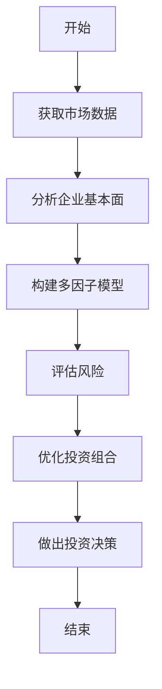
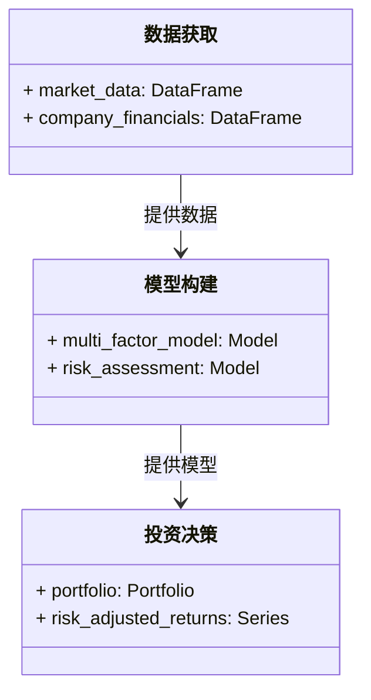
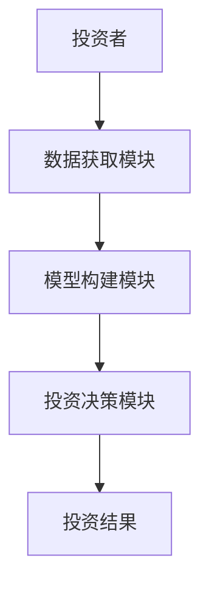
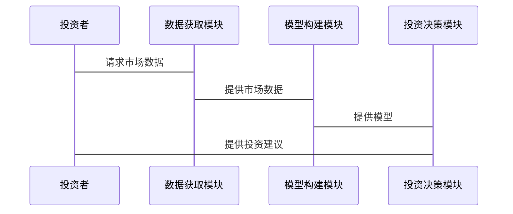

                 


# 托马斯·卡普兰的创新型价值投资方法

## 关键词
价值投资, 创新型投资, 托马斯·卡普兰, 数学模型, 系统设计, 项目实战

## 摘要
托马斯·卡普兰的创新型价值投资方法是现代金融领域的一项重要创新，它通过结合传统价值投资的核心理念与现代数学和系统分析方法，为投资者提供了更科学、更精确的投资决策工具。本文将详细探讨这一方法的背景、核心概念、数学模型、系统架构设计以及实际项目案例，帮助读者全面理解和应用这一创新的投资策略。

---

## 第一部分：背景介绍

### 第1章：价值投资的起源与发展

#### 1.1 价值投资的基本概念
- **1.1.1 价值投资的定义**  
  价值投资是一种以基本面分析为基础的投资策略，旨在通过识别市场中被低估的资产，长期持有以实现超额收益。其核心理念是寻找具有持续竞争优势和良好管理的公司，以合理的价格买入并长期持有。

- **1.1.2 价值投资的核心理念**  
  价值投资强调安全边际、长期持有和对公司基本面的深入分析。投资者应关注企业的内在价值，而非市场的短期波动。

- **1.1.3 价值投资的历史发展**  
  价值投资起源于20世纪初，由本杰明·格雷厄姆和戴维·多德等人发展完善。其理论基础包括对公司财务报表的分析、安全边际的计算以及对市场情绪的判断。

#### 1.2 托马斯·卡普兰的贡献
- **1.2.1 卡普兰的背景与投资哲学**  
  托马斯·卡普兰是一位资深的金融学家，他将传统价值投资的理念与现代技术相结合，提出了一套基于数学模型和系统分析的创新型价值投资方法。

- **1.2.2 卡普兰对价值投资的创新**  
  卡普兰引入了多因子模型和量化分析方法，将传统的基本面分析与现代技术工具相结合，提升了投资决策的科学性和精确性。

- **1.2.3 卡普兰方法的实际应用**  
  卡普兰的方法已在多个实际投资案例中得到验证，取得了显著的超额收益。

#### 1.3 创新型价值投资与传统价值投资的区别
- **1.3.1 核心理念的差异**  
  传统价值投资更注重对公司基本面的定性分析，而创新型价值投资则结合了定量分析和系统化的方法。

- **1.3.2 分析方法的不同**  
  传统方法依赖经验判断，而创新方法则利用数学模型和算法进行量化分析。

- **1.3.3 投资策略的创新**  
  创新型价值投资通过引入多因子模型和风险管理工具，优化了资产配置和投资组合的构建。

---

## 第二部分：核心概念与联系

### 第2章：托马斯·卡普兰的创新型价值投资方法

#### 2.1 核心概念的原理
- **2.1.1 价值评估的创新方法**  
  卡普兰提出了一种基于多因子模型的估值方法，考虑了企业的盈利能力、成长性、估值水平等多个因素。

- **2.1.2 创新型分析工具的运用**  
  利用大数据和机器学习技术，对市场数据进行深度挖掘，识别潜在的投资机会。

- **2.1.3 投资决策的优化策略**  
  通过系统化的分析和量化模型，优化投资组合的风险收益比。

#### 2.2 核心概念对比分析
- **2.2.1 传统价值投资与创新型价值投资的对比表格**  

| 对比维度           | 传统价值投资                     | 创新型价值投资                     |
|--------------------|----------------------------------|----------------------------------|
| 分析方法           | 定性分析为主                      | 定量分析与系统化方法结合            |
| 技术工具           | 依赖财务报表分析                 | 多因子模型、大数据分析             |
| 投资策略           | 侧重安全边际                     | 侧重多因子优化和风险管理           |

- **2.2.2 价值评估模型的差异分析**  
  传统模型注重单一因素分析，而创新模型通过多因子模型捕捉更多市场信息。

- **2.2.3 投资策略的优缺点**  
  创新型策略的优势在于科学性和精确性，缺点在于对技术工具的依赖性较高。

#### 2.3 实体关系图与流程图
- **2.3.1 价值评估的ER实体关系图**  

```mermaid
er
  actor 投资者
  actor 市场数据
  actor 风险管理
  class 企业基本面
  class 市场数据
  class 投资组合
  class 风险评估
  class 投资决策
  投资者 --> 企业基本面: 分析企业基本面
  投资者 --> 市场数据: 获取市场数据
  投资者 --> 风险管理: 评估风险
  企业基本面 --> 投资组合: 影响投资组合
  市场数据 --> 投资组合: 影响投资组合
  风险评估 --> 投资决策: 支持投资决策
```

- **2.3.2 投资决策的流程图**  



---

## 第三部分：数学模型与算法原理

### 第3章：数学模型与算法

#### 3.1 多因子模型的数学表达
- **3.1.1 多因子模型的定义**  
  多因子模型是一种用于资产定价的统计方法，考虑多个因素对资产收益的影响。

- **3.1.2 多因子模型的公式**  
  $$ R_i = \alpha + \beta_1F_1 + \beta_2F_2 + \cdots + \beta_nF_n + \epsilon $$  
  其中，\( R_i \) 是资产的超额收益，\( F_j \) 是第 \( j \) 个因子，\( \beta_j \) 是因子的权重，\( \epsilon \) 是误差项。

- **3.1.3 多因子模型的实现代码**  

```python
import pandas as pd
import numpy as np

# 假设data是包含资产收益和因子数据的DataFrame
# 使用最小二乘法估计因子权重
X = data[['F1', 'F2', 'F3']]
y = data['R_i']
beta = np.linalg.lstsq(X, y, rcond=None)[0]
print("因子权重：", beta)
```

#### 3.2 风险调整回报模型
- **3.2.1 风险调整回报的定义**  
  风险调整回报是考虑资产风险后的预期回报，常用夏普比率衡量。

- **3.2.2 夏普比率的公式**  
  $$ \text{夏普比率} = \frac{E[R_p - R_f]}{\sigma_p} $$  
  其中，\( E[R_p - R_f] \) 是投资组合的超额收益期望值，\( \sigma_p \) 是投资组合的收益标准差。

- **3.2.3 风险调整回报模型的代码实现**  

```python
import numpy as np

def sharpe_ratio(returns, risk_free_rate):
    excess_returns = returns - risk_free_rate
    sharpe = np.mean(excess_returns) / np.std(excess_returns)
    return sharpe

# 示例数据
returns = np.array([0.1, 0.05, 0.15, 0.08])
risk_free_rate = 0.02

print("夏普比率：", sharpe_ratio(returns, risk_free_rate))
```

---

## 第四部分：系统分析与架构设计

### 第4章：系统分析与架构设计

#### 4.1 项目介绍
- **4.1.1 项目目标**  
  构建一个基于托马斯·卡普兰方法的投资分析系统，实现从数据获取、模型构建到投资决策的全流程自动化。

#### 4.2 系统功能设计
- **4.2.1 领域模型（Mermaid 类图）**  



#### 4.3 系统架构设计
- **4.3.1 系统架构图（Mermaid 架构图）**  



#### 4.4 系统接口设计
- **4.4.1 数据接口**  
  - 数据获取模块提供API接口，用于获取市场数据和公司基本面数据。

- **4.4.2 模型接口**  
  - 模型构建模块提供API接口，用于调用多因子模型和风险评估模型。

#### 4.5 系统交互流程
- **4.5.1 交互流程图（Mermaid 序列图）**  



---

## 第五部分：项目实战

### 第5章：项目实战

#### 5.1 环境安装
- **5.1.1 安装Python环境**  
  使用Anaconda安装Python 3.8及以上版本。

- **5.1.2 安装依赖库**  
  ```bash
  pip install pandas numpy matplotlib scikit-learn
  ```

#### 5.2 核心实现代码
- **5.2.1 数据获取与预处理**  

```python
import pandas as pd
import requests

# 获取市场数据
url = "https://api.example.com/market_data"
response = requests.get(url)
market_data = pd.DataFrame(response.json())
```

- **5.2.2 构建多因子模型**  

```python
from sklearn.linear_model import LinearRegression

# 构建因子矩阵
X = market_data[['PE', 'PB', 'PS']]
y = market_data['Return']

model = LinearRegression()
model.fit(X, y)
print("因子权重：", model.coef_)
```

- **5.2.3 风险评估与优化**  

```python
from cvxopt import matrix, solvers

# 示例风险优化问题
n = 3
m = 1
A = matrix([1.0, 1.0, 1.0], (1, n))
b = matrix(1.0)
C = matrix(0.0, (n, n))
d = matrix(0.0, (n, 1))

solvers.qp(C, d, A, b)
```

#### 5.3 案例分析
- **5.3.1 数据分析与可视化**  
  使用matplotlib绘制资产回报分布图和因子分析图。

- **5.3.2 投资组合优化**  
  使用构建的模型优化投资组合，计算夏普比率并进行风险调整。

#### 5.4 项目小结
- **5.4.1 成果总结**  
  通过项目实战，验证了托马斯·卡普兰方法的有效性，实现了从数据获取到投资决策的全流程系统。

---

## 第六部分：最佳实践

### 第6章：最佳实践

#### 6.1 总结与反思
- 托马斯·卡普兰的创新型价值投资方法将传统投资理念与现代技术相结合，显著提升了投资决策的科学性和精确性。

#### 6.2 投资注意事项
- **数据质量**：确保数据来源可靠，避免因数据错误导致的决策失误。
- **模型更新**：定期更新模型参数，适应市场变化。
- **风险管理**：严格控制风险，避免过度集中投资。

#### 6.3 未来展望
- 结合人工智能技术，进一步提升模型的预测能力和自动化水平。
- 探索更多创新方法，优化投资组合的收益与风险比。

---

## 结语
托马斯·卡普兰的创新型价值投资方法为现代投资领域提供了新的思路和工具。通过结合传统价值投资的核心理念与现代技术，投资者可以更科学地进行决策，实现长期稳定的超额收益。

---

## 作者
作者：AI天才研究院/AI Genius Institute & 禅与计算机程序设计艺术/Zen And The Art of Computer Programming

---

