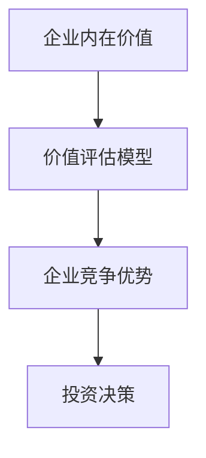
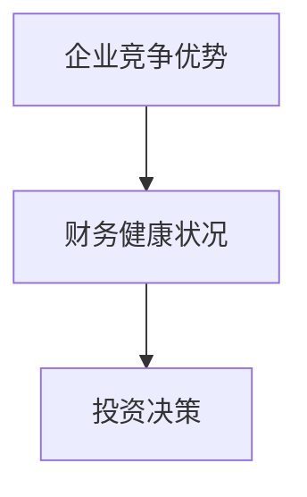
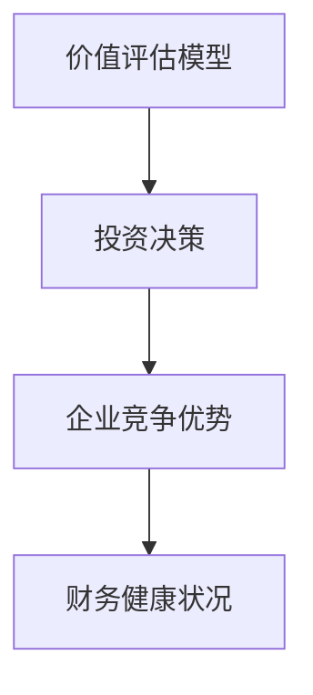
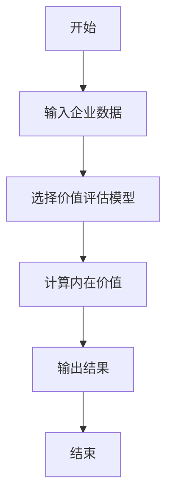
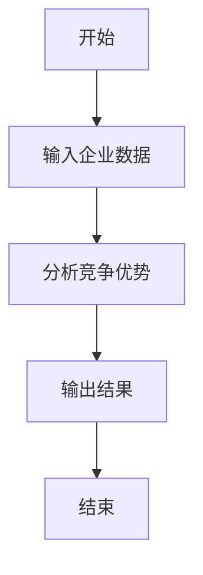
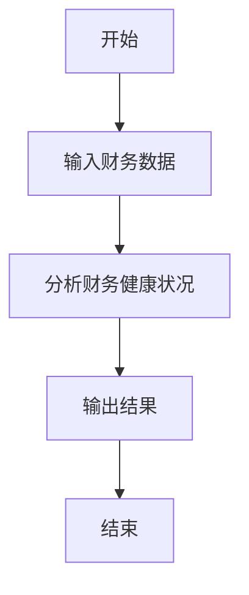
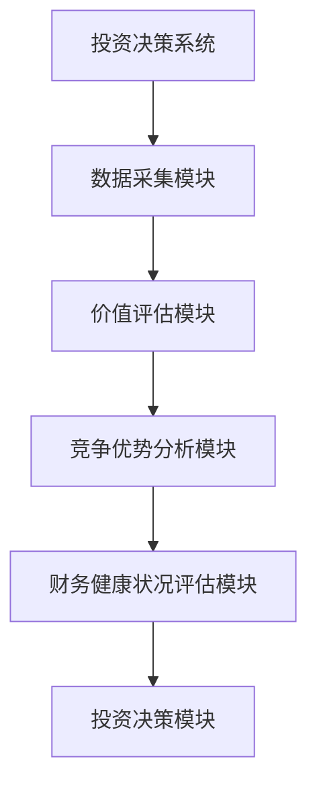
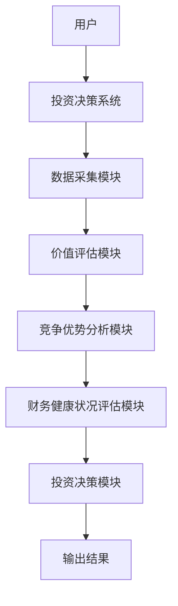

                 


# 托马斯·盖伊的高质量价值投资：寻找优质且低估的公司

---

## 关键词：高质量价值投资、托马斯·盖伊、低估公司、企业基本面、估值模型、竞争优势、长期投资

---

## 摘要

本文深入探讨托马斯·盖伊的高质量价值投资方法，通过系统化的分析框架和数学模型，帮助投资者识别优质且低估的公司。文章从投资的基本概念出发，详细讲解了高质量价值投资的核心概念、算法原理、系统架构设计以及实际项目案例，最后总结了最佳实践和注意事项。通过本文，读者可以掌握如何从基本面分析、估值模型和竞争优势等多维度寻找优质投资标的，并通过长期投资策略实现稳健收益。

---

# 第一部分: 高质量价值投资的背景与核心概念

---

## 第1章: 高质量价值投资的背景与意义

### 1.1 投资的基本概念与分类

#### 1.1.1 投资的定义与分类

- **投资定义**: 投资是将资金投入到资产中，以期获得未来收益的行为。
- **分类**: 
  - **短期投资**: 以获取短期收益为目的，通常风险较高。
  - **长期投资**: 以获取长期稳定的收益为目的，通常风险较低。
  - **价值投资**: 以寻找市场价格低于内在价值的资产为核心策略。

#### 1.1.2 价值投资的起源与发展

- **起源**: 价值投资起源于20世纪初，由本杰明·格雷厄姆和戴维·多德提出。
- **发展**: 托马斯·盖伊继承并优化了这一理念，强调寻找优质且低估的公司。

#### 1.1.3 高质量价值投资的定义与特点

- **定义**: 高质量价值投资是一种以企业基本面分析为核心，通过寻找市场价格低于内在价值的优质公司进行投资的策略。
- **特点**:
  - **长期视角**: 强调长期持有优质资产。
  - **安全边际**: 在买入价格上留有足够安全空间。
  - **竞争优势**: 重点关注具有强大竞争优势的企业。

---

### 1.2 高质量价值投资的核心要素

#### 1.2.1 企业基本面分析的核心要素

- **收入与利润**: 企业的收入和利润是衡量其盈利能力的核心指标。
- **资产负债表**: 企业的资产、负债和所有者权益是评估其财务健康的重要依据。
- **现金流**: 企业的现金流状况是评估其经营能力和抗风险能力的关键指标。

#### 1.2.2 估值方法与安全边际

- **估值方法**: 常用的估值方法包括DCF模型、市盈率（P/E）和市净率（P/B）等。
- **安全边际**: 托马斯·盖伊强调在买入价格上留有至少30%的安全边际，以降低投资风险。

#### 1.2.3 长期投资与复利效应

- **长期投资**: 通过长期持有优质资产，享受企业成长的复利效应。
- **复利效应**: 资产的长期增值是时间与收益的复利作用的结果。

---

### 1.3 高质量价值投资的背景与意义

#### 1.3.1 当前投资环境的挑战与机遇

- **挑战**: 当前市场波动较大，传统投资方法难以应对复杂的市场环境。
- **机遇**: 优质企业通过长期持有可以获得稳定的超额收益。

#### 1.3.2 高质量价值投资在当前市场中的优势

- **优势**: 通过基本面分析和估值模型，能够在市场波动中找到低估的优质企业。

#### 1.3.3 高质量价值投资的长期有效性与风险控制

- **长期有效性**: 通过长期持有优质资产，能够抵御短期市场波动的风险。
- **风险控制**: 安全边际和竞争优势分析是降低投资风险的关键。

---

## 第2章: 高质量价值投资的核心概念与联系

---

### 2.1 高质量价值投资的核心概念

#### 2.1.1 价值评估模型的核心要素

- **DCF模型**: 通过折现现金流计算企业的内在价值。
- **P/E模型**: 通过市盈率评估企业的估值合理性。
- **P/B模型**: 通过市净率评估企业的估值合理性。

#### 2.1.2 企业竞争优势的分析框架

- **竞争优势类型**: 包括成本优势、品牌优势和护城河等。
- **竞争优势分析**: 通过企业财务指标和行业地位评估竞争优势的强弱。

#### 2.1.3 企业财务健康状况的评估标准

- **财务健康状况**: 通过资产负债表、利润表和现金流分析评估企业的财务健康状况。

---

### 2.2 高质量价值投资的核心概念对比

#### 2.2.1 不同价值评估模型的优缺点对比

| 模型名称 | 优点 | 缺点 |
|----------|------|------|
| DCF模型 | 精确计算企业内在价值 | 计算复杂，依赖假设 |
| P/E模型 | 简单易用 | 受行业影响较大 |
| P/B模型 | 简单易用 | 受行业影响较大 |

#### 2.2.2 企业竞争优势的类型与特征对比

| 竞争优势类型 | 特征 |
|----------------|------|
| 成本优势 | 低成本生产模式 |
| 品牌优势 | 强大品牌影响力 |
| 技术优势 | 领先技术 |

#### 2.2.3 财务健康状况的关键指标对比

| 财务指标 | 特征 |
|-----------|------|
| 净利润 | 利润能力的核心指标 |
| 负债率 | 财务杠杆的关键指标 |
| 现金流 | 经营能力的关键指标 |

---

### 2.3 高质量价值投资的核心概念关系图

#### 2.3.1 价值评估模型与企业竞争优势的关系



#### 2.3.2 企业竞争优势与财务健康状况的关系



#### 2.3.3 价值评估与投资决策的关系



---

### 2.4 本章小结

本章从核心概念入手，详细讲解了高质量价值投资的背景、核心要素以及核心概念之间的关系，为后续的算法原理和系统设计奠定了基础。

---

# 第二部分: 高质量价值投资的算法原理与数学模型

---

## 第3章: 高质量价值投资的算法原理与数学模型

### 3.1 高质量价值投资的核心算法原理

#### 3.1.1 价值评估模型的算法原理

- **DCF模型**: 通过折现现金流计算企业内在价值。
- **P/E模型**: 通过市盈率评估企业估值。
- **P/B模型**: 通过市净率评估企业估值。

#### 3.1.2 企业竞争优势的分析算法

- **竞争优势分析**: 通过企业财务指标和行业地位评估竞争优势。

#### 3.1.3 财务健康状况的评估算法

- **财务健康状况**: 通过资产负债表、利润表和现金流分析评估企业的财务健康状况。

---

### 3.2 高质量价值投资的数学模型

#### 3.2.1 贴现现金流模型（DCF）

$$ \text{内在价值} = \sum_{t=1}^{n} \frac{\text{现金流}}{(1+r)^t} + \frac{\text{终值}}{(1+r)^n} $$

#### 3.2.2 市盈率与市净率模型

- **市盈率**: $$ \text{市盈率} = \frac{\text{股价}}{\text{每股收益}} $$
- **市净率**: $$ \text{市净率} = \frac{\text{股价}}{\text{每股净资产}} $$

#### 3.2.3 企业价值倍数模型（EV/EBITDA）

$$ \text{EV} = \text{企业价值} = \text{市值} + \text{债务} - \text{现金} $$
$$ \text{EBITDA} = \text{息税折旧及摊销前利润} $$

---

### 3.3 高质量价值投资的数学公式与详细讲解

#### 3.3.1 贴现现金流模型的公式与计算步骤

- **步骤**:
  1. 确定企业的自由现金流。
  2. 确定折现率。
  3. 计算未来现金流的现值。
  4. 计算终值的现值。
  5. 求和得到企业内在价值。

#### 3.3.2 市盈率与市净率模型的公式与计算步骤

- **市盈率计算步骤**:
  1. 获取企业的每股收益。
  2. 获取企业的股价。
  3. 计算市盈率。
- **市净率计算步骤**:
  1. 获取企业的每股净资产。
  2. 获取企业的股价。
  3. 计算市净率。

#### 3.3.3 企业价值倍数模型的公式与计算步骤

- **步骤**:
  1. 获取企业的市值和债务、现金数据。
  2. 计算企业价值。
  3. 获取企业的EBITDA。
  4. 计算EV/EBITDA倍数。

---

### 3.4 高质量价值投资算法的流程图

#### 3.4.1 价值评估模型的流程图



#### 3.4.2 企业竞争优势的分析流程图



#### 3.4.3 财务健康状况的评估流程图



---

### 3.5 本章小结

本章详细讲解了高质量价值投资的算法原理与数学模型，包括DCF模型、市盈率、市净率和企业价值倍数模型，并通过流程图展示了算法的实现步骤。

---

# 第三部分: 高质量价值投资的系统分析与架构设计

---

## 第4章: 高质量价值投资的系统分析与架构设计

### 4.1 高质量价值投资的系统分析

#### 4.1.1 投资决策系统的功能模块划分

- **功能模块**:
  1. 数据采集模块。
  2. 价值评估模块。
  3. 竞争优势分析模块。
  4. 财务健康状况评估模块。
  5. 投资决策模块。

#### 4.1.2 系统功能设计

- **领域模型**:
  ```mermaid
  classDiagram
      class 企业数据 {
          股价
          每股收益
          每股净资产
          自由现金流
          EBITDA
          负债
          现金
      }
      class 价值评估模型 {
          DCF模型
          P/E模型
          P/B模型
      }
      class 竞争优势分析 {
          成本优势
          品牌优势
         抽 技术优势
      }
      class 财务健康状况评估 {
          净利润
          负债率
          现金流
      }
      class 投资决策 {
          内在价值
          安全边际
          竞争优势
          财务健康状况
      }
  ```

#### 4.1.3 系统架构设计



---

### 4.2 高质量价值投资的系统架构设计

#### 4.2.1 系统接口设计

- **接口设计**:
  1. 数据接口: 从数据库获取企业数据。
  2. 价值评估接口: 调用价值评估模型。
  3. 竞争优势分析接口: 调用竞争优势分析模块。
  4. 财务健康状况评估接口: 调用财务健康状况评估模块。

#### 4.2.2 系统交互设计



---

## 第5章: 高质量价值投资的项目实战

### 5.1 项目实战: 托马斯·盖伊投资策略的应用

#### 5.1.1 项目背景

- **案例公司**: 苹果公司（Apple）。
- **目标**: 应用托马斯·盖伊的投资策略进行估值和分析。

#### 5.1.2 项目核心实现

- **代码实现**:
  ```python
  def calculate_intrinsic_value(revenue, profit_margin, growth_rate, discount_rate):
      cash_flow = revenue * profit_margin
      terminal_value = cash_flow * (1 + growth_rate) / (discount_rate - growth_rate)
      return (cash_flow * (1 - (1 + discount_rate) ** -10)) + terminal_value
  ```

#### 5.1.3 代码应用解读与分析

- **代码解读**:
  1. `calculate_intrinsic_value`函数计算企业的内在价值。
  2. `cash_flow`表示企业的自由现金流。
  3. `terminal_value`表示企业的终值。
  4. 函数返回企业的内在价值。

#### 5.1.4 实际案例分析

- **案例分析**:
  - 苹果公司的收入和利润 margin 数据。
  - 计算苹果公司的内在价值。
  - 比较苹果公司的股价与内在价值，判断是否低估。

---

## 第6章: 高质量价值投资的最佳实践

### 6.1 投资的关键点与注意事项

- **关键点**:
  1. 长期视角。
  2. 安全边际。
  3. 竞争优势。
- **注意事项**:
  1. 避免过度杠杆。
  2. 保持分散投资。
  3. 持续学习。

### 6.2 风险控制与投资组合管理

- **风险控制**:
  1. 安全边际。
  2. 竞争优势。
  3. 财务健康状况。
- **投资组合管理**:
  1. 分散投资。
  2. 定期调整。
  3. 保持耐心。

### 6.3 高质量价值投资的拓展阅读

- **推荐书籍**:
  - 《The Intelligent Investor》——本杰明·格雷厄姆
  - 《The Warren Buffett Way》——查理·芒格

---

# 第四部分: 高质量价值投资的总结与展望

---

## 第7章: 高质量价值投资的总结与展望

### 7.1 本章总结

- **总结**:
  1. 高质量价值投资的核心是寻找优质且低估的公司。
  2. 通过基本面分析、估值模型和竞争优势分析实现投资目标。
  3. 长期投资和分散投资是降低风险的关键。

### 7.2 未来展望

- **未来展望**:
  1. 数字化工具的应用。
  2. 人工智能在投资分析中的应用。
  3. 高质量价值投资的全球化发展。

---

## 作者：AI天才研究院/AI Genius Institute & 禅与计算机程序设计艺术 /Zen And The Art of Computer Programming

---

通过本文，读者可以系统地了解托马斯·盖伊的高质量价值投资方法，并通过实际案例和系统设计掌握如何在投资中寻找优质且低估的公司。

